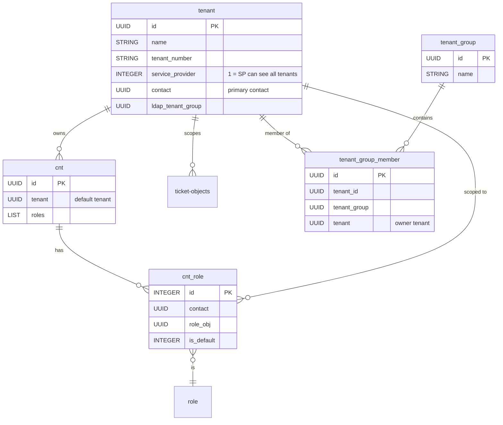
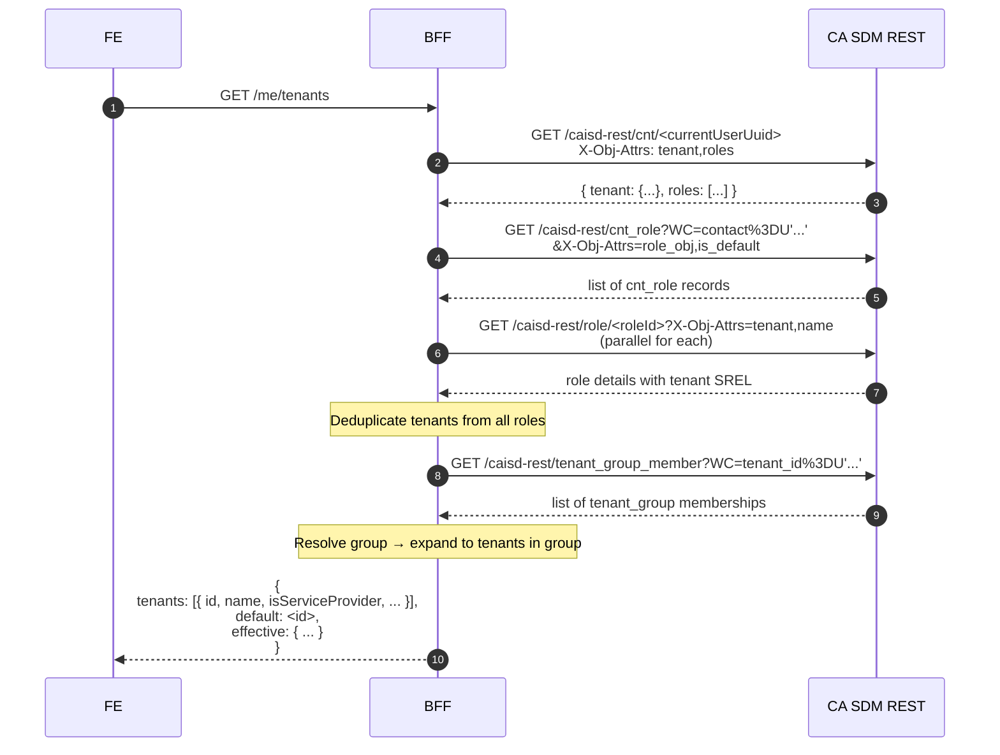

# CA SDM 17.4 — Multi-tenancy v API

> Cieľ: popísať, ako CA SDM 17.4 reprezentuje multi-tenancy v dátovom modeli
> a v REST volaniach, a aké endpointy potrebuje nový FE pre tenant switcher.
>
> Zdroj: PDF `Tenant`, `tenant_group`, `tenant_group_member` objekty
> (s. 3975–3977), tabuľka tenancy-related objektov (s. 3582–3592), rozsiahle
> popisy v Web Services Best Practices (s. 1–18 PDF s. 3766+).

## 1. Dátový model tenancy

### 1.1 Hlavné objekty



### 1.2 Špecialne tenanty

Z PDF s. 1 vyplýva existencia **viacerých tenant rolí**:

| Tenant typ | Vlastnosť | Popis |
|---|---|---|
| **PUBLIC** | Implicit | Záznamy bez tenant atribútu sú "public" — viditeľné všetkým. |
| **Service Provider tenant** | `tenant.service_provider=1` | Tento tenant môže vidieť/editovať dáta všetkých "managed" tenantov. |
| **Standard tenant** | `tenant.service_provider=0` | Vidí len svoje dáta. |
| **Tenant group** | `tenant_group` | Logické zoskupenie viacerých tenantov (napr. holding company so subsidiárami). User v tenant_group vidí dáta celej skupiny. |
| **All Tenants role** | special function-access flag | Niektoré roly vidia all-tenants nezávisle od priradenia. (PDF s. 18 — viď tabuľku CI access.) |

### 1.3 Tenant attribute na objektoch

Skoro každý transakčný objekt v CA SDM má **tenant SREL** (na `ca_tenant`).
Z PDF s. 3582–3592 (tabuľka `Object | Rel_Attr | Description | Tenancy`)
vyberáme kľúčové:

| Object | Tenancy | Význam |
|---|---|---|
| `agt`, `cst`, `cnt` | Required | Každý kontakt má svoj tenant. |
| `chg`, `cr`, `in`, `pr`, `iss` | Required (cez `Call_Req`) | Tickety patria do tenanta. |
| `chgalg`, `alg`, `pralg`, `issalg` | Required | Activity logy dedia tenant z parent ticketu. |
| `attmnt`, `attmnt_folder` | Optional | Attachment môže byť aj public. |
| `KCAT`, KD (`SKELETONS`) | Optional + read groups | KB články sú často public, ale môžu byť tenant-scoped. |
| `nr` (CI), `bmhier` (services) | Optional + read groups | CMDB položky majú špeciálne pravidlá (PDF s. 1–18). |
| `pcat`, `chgcat`, `isscat` | Optional | Categórie môžu byť shared aj per-tenant. |
| `chg_tpl`, `cr_template` | Required | Templaty patria tenantu. |
| `audlog` | Required | Audit logy sú tenant-scoped. |
| `tenant`, `tenant_group`, `tenant_group_member` | Required (sami sebe) | Self-ref. |

## 2. Tenant kontext v REST volaniach

### 2.1 Implicitné scopovanie

CA SDM sa **automaticky scopuje per-tenant** na základe identity volajúceho
používateľa. Žiadny header typu `X-Tenant-ID` v PDF nie je dokumentovaný —
tenancy sa odvodí z roli, ktorú vybral klient (cez `X-Role` alebo default).

| Mechanizmus | Popis |
|---|---|
| Default role | Používateľ má v Access Type field "REST Web Service API Role". Tá určuje default tenant. |
| `X-Role: <roleId>` header | Per-request override role; tenant sa zmení podľa role. |
| Service Provider behavior | Ak má aktívna role flag "service_provider", všetky volania vrátia data zo všetkých managed tenantov. |
| Filter explicitne tenantom | Klient môže zúžiť výsledky ďalším WC filtrom: `WC=tenant%3DU'...'`. |

### 2.2 Príklad — list incidents per tenant

```http
GET /caisd-rest/in?WC=tenant%3DU'2A3F...'%20AND%20active%3D1 HTTP/1.1
X-AccessKey: 770921656
X-Role: 10002
```

Ak má používateľ s role `10002` priradený tenant `2A3F...`, dostane
prienik (jeho oprávnenia ∩ filter). Ak filter zúži na cudzí tenant, vráti
prázdny výsledok.

### 2.3 Multi-tenant request od Service Providera

Service Provider tenant agent vidí všetky managed tenanty. Vie spraviť:

```http
GET /caisd-rest/in?WC=active%3D1 HTTP/1.1
X-AccessKey: <sp-key>
X-Role: <sp-role-with-all-tenants>
```

→ Vráti incidenty zo všetkých tenantov. UI musí zobraziť tenant column.

## 3. Endpointy pre tenant switcher

GOAL.md §11 vyžaduje: *"Každý riešiteľ vidí len tenantov, v ktorých má
definovanú rolu, a môže sa medzi nimi prepínať."*

CA SDM **neposkytuje dedikovaný endpoint "moje tenanty"**. FE (cez BFF)
musí agregovať z viacerých zdrojov:

### 3.1 Krok-za-krokom flow



### 3.2 BFF response schema (návrh)

```ts
interface MyTenantsResponse {
  /** Tenanty, ktoré user vidí. */
  tenants: TenantInfo[];
  /** Default tenant (z cnt.tenant). */
  defaultTenantId: string;
  /** Aktuálne aktívny tenant. */
  activeTenantId: string;
}

interface TenantInfo {
  id: string;          // UUID
  name: string;
  tenantNumber?: string;
  /** Ako user získal prístup. */
  source: "direct-role" | "tenant-group" | "service-provider";
  /** Ak je SP, vidí všetky managed tenants. */
  isServiceProvider: boolean;
  /** Roly, ktoré user v tomto tenantovi má. */
  roles: { id: string; name: string }[];
}
```

### 3.3 Tenant switch operácia

Switch tenanta v UI je **logický prepínač** v BFF. Žiadny CA SDM REST
endpoint nemení tenant kontext — namiesto toho:

1. FE pošle `POST /me/active-tenant { tenantId }` na BFF.
2. BFF si v session uloží `activeTenantId`.
3. Pre nasledujúce volania BFF pridáva:
   - `X-Role: <roleIdScopedToTenant>` (vyberie sa z `cnt_role` matching tenant)
   - WC filter `tenant%3DU'<id>'` (defenzívne)

> ℹ️ Bez explicitného filtra by Service Provider videl všetky tenanty —
> defenzívny WC filter je preventívny.

## 4. Tenant kontext v jednotlivých moduloch

| Modul | Tenant scoping behavior |
|---|---|
| Incident, Request, Problem | Hard-required tenant. Tickety nikdy nie sú "public". |
| Change | Tenant required. Workflow tasks dedia tenant. |
| Knowledge | KCAT/SKELETONS môžu byť public (`tenant=NULL`) alebo per-tenant. Read groups (`READ_PGROUP`) ďalej restriktujú. |
| CMDB (`nr`) | CI môžu byť public ("All Tenants"), per-tenant, alebo tenant-group scoped. Update CI cross-tenant len pre Service Provider. |
| Service Catalog (BUI) | Offerings sú per-tenant cez `domain` field (tenant domain string). |
| Attachments | Attachment dedi tenant z parent objektu (alebo môže byť public). |

## 5. Performance considerations

- BFF endpoint `/me/tenants` zahŕňa **3–4 SDM volania** pri prvom prihlásení.
  Caching strategy: TTL 5 min, invalidate na role change.
- Pre Service Providera so 100+ tenantmi: tenant list paginácia v UI.
- Tenant switch nevyžaduje nový login — len aktualizuje BFF session.

## 6. Bezpečnostné dôsledky

- **Privilege escalation risk**: Ak BFF nepridá WC tenant filter, klient by
  mohol cez X-Role obísť tenant scope. Konzervatívne pridať vždy aj WC.
- **Audit trail**: Každá tenant-switch akcia musí byť logovaná v BFF audit
  trace (kto, kedy, na ktorý tenant).
- **Service Provider impersonation**: Mimo MVP scope. Ak sa otvorí, vyžaduje
  Security agent design.

## Otvorené závislosti

| # | Flag | Smer | Popis |
|---|---|---|---|
| 1 | `tenant-list-aggregation` | → 04-architecture | BFF endpoint `/me/tenants` agregáciu z 3+ SDM volaní. Cache stratégia (TTL, invalidation triggers) je úloha Architecture. |
| 2 | `tenant-switch-mechanism` | → 04-architecture, 05-security | Vol-implicit (X-Role) vs. explicit (WC filter) vs. obe. Bezpečné default-deny — nech rozhodnú spoločne. |
| 3 | `service-provider-ui` | → 02-ux-persona, 04-architecture | UI flow pre SP s prístupom ku 100+ tenantom — ako vyzerá tenant switcher? Search? Pinned? |
| 4 | `audit-trail-tenant-actions` | → 05-security | Audit log obsahu tenant-switch udalostí — či ich logujeme len v BFF, alebo aj posielame do CA SDM `audlog`. |
| 5 | `cnt-role-tenant-derivation` | → 03-domain-modeller | `cnt_role` má `role_obj` SREL na `role`, kde tenant je atribút role-y. Treba potvrdiť, či `role` exposuje tenant atribút v REST (PDF nehovorí explicitne). **Overiť na inštancii.** |
