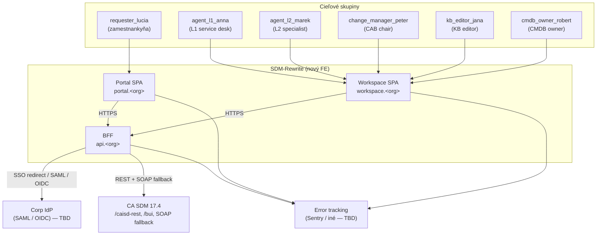
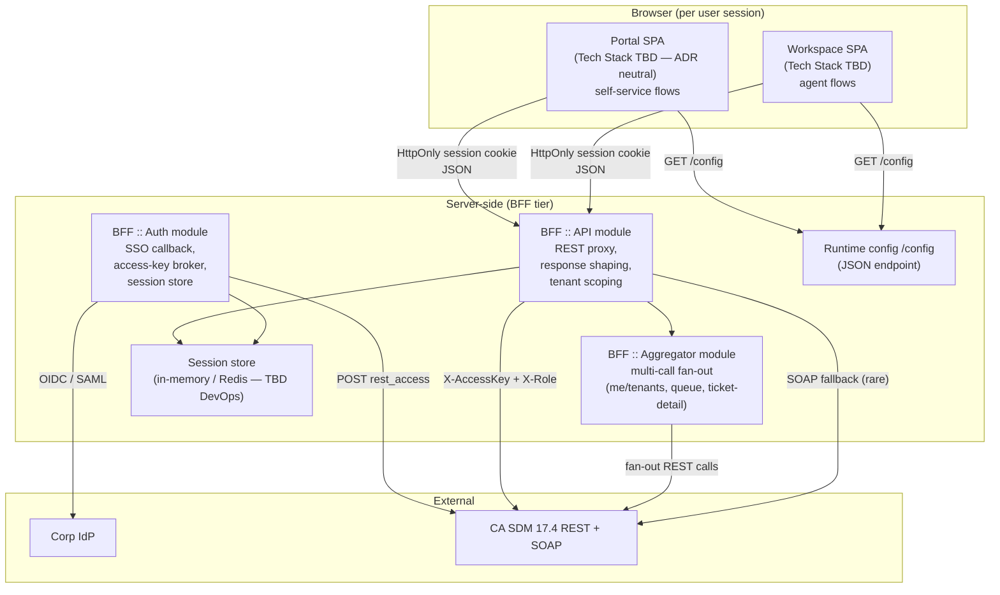

# SDM-Rewrite — High-level architektúra

> Round 1 (fresh). Konsolidácia vstupov z 01 API Analyst, 02 UX/Persona Analyst,
> 03 Domain Modeller a GOAL.md. Tento dokument popisuje cieľovú architektúru
> **frontend-only** projektu, ktorý sa pripája na existujúce CA SDM 17.4
> REST/SOAP rozhrania. Backend nemodifikujeme.
>
> Diagramy sledujú **C4 model** — Level 1 (Context) a Level 2 (Container)
> sú nižšie. Level 3 (Component) per kľúčový container je v adresári
> `components/`.

## 1. Architektonické princípy

| # | Princíp | Vysvetlenie |
|---|---|---|
| P1 | **Backend ako daný** | CA SDM 17.4 sa nemení. Všetky integrácie cez `/caisd-rest`, `/bui`, prípadne `/axis/services/USD_R11` (SOAP fallback). |
| P2 | **Dve aplikácie, jeden monorepo** | `portal` (self-service) a `workspace` (agent) majú odlišné UX patterny a security profil. Spoločný kód žije v `packages/`. (GOAL §4) |
| P3 | **BFF ako broker secretov** | Access Key / Access Token sa nikdy nedostane do prehliadača. BFF drží session state + tenant kontext + cache. Detail: ADR-01. |
| P4 | **Tenant-first** | Multi-tenancy nie je dodatočná vrstva — je prvotriedny koncept v každom volaní, route, audit logu. Detail: ADR-11. |
| P5 | **Runtime config** | API endpoint, tenant defaults, feature flags sú externé voči build artefaktu. Detail: ADR-12. |
| P6 | **Server-state vs. client-state separation** | Server-state ovláda jedna knižnica (TanStack Query, ADR-03). Client-state je lokálny v komponentoch. Žiadny globálny "Redux all the things" store. |
| P7 | **Hranice packages explicitné** | Žiadne cyklické závislosti, žiadne implicitné re-exporty. `boundaries.md` má tabuľku. |
| P8 | **Simplicita > flexibilita** | Žiadne abstrakcie "pre prípad, že" (YAGNI). Žiadna virtualizácia, žiadne enterprise-grade tabulky, žiaden plugin system v MVP. |
| P9 | **Performance budget na portáli** | TTI < 2 s. Workspace má voľnejší budget (long-running session), ale prvý paint pod 3 s. |
| P10 | **Observability v BFF** | Štruktúrované JSON logy, request correlation ID, error tracking (Sentry alebo ekvivalent — ADR-09). FE posiela len `console.error` + UI eventy do BFF. |

## 2. C4 Level 1 — Systémový kontext

**Externé systémy** (mimo nášho scope):
- **CA SDM 17.4** — existujúci produkt, REST + SOAP rozhranie. Verzia
  zafixovaná v `api-analyst/versions.md`.
- **Corp IdP** — SAML alebo OIDC. Konkrétny produkt (Keycloak / Azure AD / iný)
  rozhodne Security agent (05). BFF integruje cez OIDC discovery / SAML metadata.
- **Sentry** alebo ekvivalent — error tracking. DevOps + Security spoluvyberú.

## 3. C4 Level 2 — Containers

### 3.1 Container inventory

| Container | Typ | Účel | Klúčové rozhodnutia |
|---|---|---|---|
| **Portal SPA** | Browser SPA | Self-service flows pre `requester_lucia`. Low information density, mobile-friendly, TTI < 2 s. | Tech stack v ADR-06 (Tech Stack agent). Routing client-side, single index.html. |
| **Workspace SPA** | Browser SPA | Agent / specialist flows pre 5 person. High density, hot-keys, multi-pane. | Rovnaký stack ako Portal, samostatný bundle, samostatné nasadenie. |
| **BFF :: Auth** | Server module | SSO redirect, session lifecycle, brokerage CA SDM Access Key, logout. | ADR-01 (BFF), ADR-11 (multi-tenancy), Security agent vlastní auth flow detail. |
| **BFF :: API** | Server module | Proxy CA SDM REST volaní s tenant scopingom a payload shapingom (XML→JSON, camelCase). | ADR-01. Vlastní per-endpoint route mapping; žiadny generický passthrough. |
| **BFF :: Aggregator** | Server module | Multi-call agregáty (`/me/tenants`, ticket-detail, queue), bez ktorých by FE musel orchestrovať fan-out v prehliadači. | ADR-01 + UI views z 03 (`UiQueueItem`, `UiTicketDetail`). |
| **Session store** | In-memory / Redis | Per-session uložisko: Access Key, expirácia, activeTenantId, user profile cache. | DevOps agent vyberie konkrétny store. MVP: in-memory single-instance OK, v1 Redis pre HA. |
| **Runtime config endpoint** | Server module | `GET /config` vracia `apiBaseUrl`, `features`, `i18nDefaults`. SPA si ho ťahá na bootstrape pred prvým API volaním. | ADR-12. |
| **CA SDM 17.4** | Externý | Backend. Read-only z nášho pohľadu — nemeníme schémy, len volania. | — |
| **Corp IdP** | Externý | SAML / OIDC. | Security agent. |

### 3.2 Logické packages (zhrnutie — detail v `monorepo-layout.md`)

| Package | Účel | Konzumenti |
|---|---|---|
| `@sdm/api-client` | Typovaný klient nad CA SDM REST + BFF endpointy. Generovaný/odvodený z `api-analyst/schemas/`. | BFF, oba SPA (cez BFF). |
| `@sdm/api-types` | TypeScript typy (`Incident`, `Request`, `Problem`, ...) odvodené z `domain/model.ts`. | `api-client`, `domain`, oba SPA, BFF. |
| `@sdm/domain` | Pravidlá doménového modelu — state machines, validátory, permission mapping (RoleCode → Permission[]). Pure functions, žiadny side-effect. | Oba SPA (a prípadne BFF pre validáciu). |
| `@sdm/design-system` | Tokens, primitives, app-level components. | Oba SPA. |
| `@sdm/auth` | Auth helpery pre SPA (session refresh hook, login redirect, role-based component guards). | Oba SPA. |
| `@sdm/i18n` | i18n catalog (SK + EN), formatters (date/number/currency podľa locale + tenant). | Oba SPA, BFF (pre error message lokalizáciu). |
| `@sdm/utils` | Pure utility — date math, formatting, type guards. | Všetci. |

Žiadne ďalšie packages "pre prípad". Ak vznikne nová potreba, addne sa explicitne (YAGNI, P8).

## 4. Klúčové architektonické rozhodnutia (zhrnutie)

Plný text v `decision-records/`. Zhrnutie:

| ADR | Téma | Rozhodnutie |
|---|---|---|
| 01 | BFF | **Áno**, BFF je v MVP. Dôvody: broker pre Access Key, agregácia (`/me/tenants`, ticket-detail), tenant defenzívny filter, KB suggested solutions cez BUI vrstvu, error shape unifikácia. |
| 02 | Monorepo tool | **pnpm workspaces + Turborepo** (orchestrátor build cache). Jednoduché, štandard, žiadny vendor lock-in. Nx zamietnuté pre overhead. |
| 03 | Data fetching layer | **TanStack Query** v SPA. Server-state cache, invalidation, refetch, optimistic updates. RTK Query zamietnutý (Redux overhead nepotrebný). |
| 04 | State management filozofia | **Server-state v TanStack Query**, **client-state lokálne** (useState / useReducer). Žiadny globálny store (žiaden Redux/Zustand) okrem `activeTenantId` (kontext) a `userProfile` (kontext). |
| 05 | Routing | **Tech-stack-agnostické client-side routing s konfiguráciou** (React Router / Vue Router / TanStack Router — konkrétny výber 06 Tech Stack). Žiadny SSR. Route-level code-splitting povinný. |
| 06 | Dynamic forms (Service Catalog) | **JSON-schema-driven renderer** s field-type catalog (text, number, date, select, file, user-picker, ci-picker). BFF normalizuje CA SDM Service Catalog template do tohto JSON-schema. |
| 07 | i18n | **`@sdm/i18n` s ICU MessageFormat catalog** + fallback na BE-provided label pre dynamické hodnoty (status labels, kategórie). Default SK, switch EN. |
| 08 | Error boundary a globálne error handling | **Per-app error boundary** s typovanou `AppError`, fallback UI v Design System, BFF sa error shape kategorizuje (`AUTH`, `TENANT`, `VALIDATION`, `BACKEND`, `NETWORK`). |
| 09 | Observability vo FE | **Sentry** (alebo open-source ekv. — finálne 05+08). BFF posiela štruktúrované JSON logy s `requestId`, `userId`, `tenantId`, `correlationId`. |
| 10 | Build pipeline | **Vite** ako preferovaná voľba pre obe SPA (DX, ESM, fast HMR). Tech Stack agent potvrdí. |
| 11 | Multi-tenancy stratégia | **Server-side aktívny tenant v BFF session** + **HTTP header `X-Tenant` v API volaniach** (nie URL prefix, nie subdoména). Tenant switcher je prvotriedny element top barov, switch flush-uje cache. |
| 12 | Runtime config | **`/config` endpoint na BFF** + fallback `window.__SDM_CONFIG__` (inline-injected) pre offline dev. **Žiadne build-time hardcoding API endpointu** (GOAL §5 + §11). |

## 5. Hraničné prípady a NFR mapping

| NFR (GOAL §5) | Realizácia |
|---|---|
| Auth: SSO-ready, žiadne creds v browseri, short-lived tokeny, audit log | BFF (ADR-01), Security agent vlastní detail. Audit v BFF JSON logoch (ADR-09). |
| Multi-tenancy: per-tenant izolácia, tenant switcher, default tenant z profilu | ADR-11. Tenant flush flow popísaný v `data-flows.md` § Tenant switch. |
| API endpoint konfigurovateľný | ADR-12 (`/config` endpoint). |
| i18n SK + EN | ADR-07. |
| a11y WCAG 2.1 AA | Design System agent (07) vlastní. Architecture zaisťuje, že každá SPA má `<html lang>` switcheable a focus management na route-level. |
| Performance: TTI portál < 2 s | Route-level code-splitting (ADR-05), Vite (ADR-10), `@sdm/design-system` má tree-shakeable exports. Žiadne heavy charting libs v portál bundle. |
| Browsery: posledné 2 verzie evergreens | Žiaden IE/legacy polyfilling. Build target `ES2020`. |
| Observability: štruktúrované logy, error tracking, RUM nice-to-have | ADR-09. |
| GDPR-aware | BFF audit log obsahuje len pseudonymizované user/tenant ID; PII (mená, emaily) sa nevypisuje. CA SDM rieši PII v audit-trail natívne. |

## Otvorené závislosti

| # | Flag | Smer | Popis |
|---|---|---|---|
| 1 | `bff-tech-stack` | → 06-tech-stack-selector | BFF rozhodnutie (ADR-01) je technologicky neutrálne. Konkrétna voľba (Node.js + Fastify vs. Hono vs. NestJS vs. iné) je úloha 06. |
| 2 | `session-store-choice` | → 08-devex-devops | MVP single-instance in-memory OK. Pre v1 HA potrebujeme Redis / iný external store. DevOps agent rozhodne. |
| 3 | `idp-product` | → 05-security | SAML vs. OIDC, konkrétny IdP (Keycloak / Azure AD / Okta) a integráciu vlastní Security agent. Architecture poskytuje BFF auth boundary. |
| 4 | `error-tracking-product` | → 05-security, 08-devex-devops | Sentry vs. open-source ekv. (GlitchTip / self-hosted). Vplyv na NFR observability. |
| 5 | `service-catalog-form-source` | → 03-domain-modeller, 01-api-analyst | ADR-06 predpokladá, že BFF normalizuje Service Catalog template do JSON schema. Či sa template získa cez `/getOfferings` (BUI) alebo cez Service Catalog REST mimo CA SDM, je gap #3 v api-analyst. |
| 6 | `cross-tenant-policy` | → 05-security | Cross-tenant viewer rola (R-002, R-003, GAP-2, GAP-3 z UX/API) — Security musí potvrdiť, či ju MVP podporuje a aký je audit požiadavok. |
| 7 | `kb-analytics-scope` | → 04-architecture (post-MVP) | KB analytics (R-004, GAP-4) — buď BFF má vlastný telemetry store, alebo odložené do v1. Toto rozhodne PO + 04 v ďalšom kole. |
| 8 | `real-time-strategy` | → 04-architecture, 01-api-analyst | Polling vs. SSE vs. WebSocket pre `UiTicketDetail` freshness (R-012). CA SDM nemá natívne webhooky. MVP: polling. v1: re-evaluate. |
