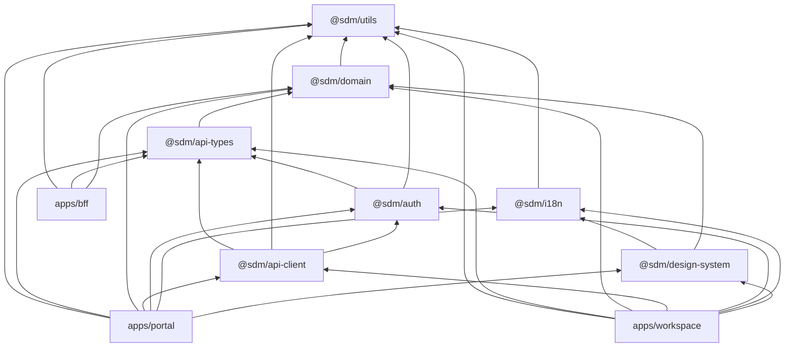

# Boundaries — hranice medzi packages a apps

> Kto čo exportuje, kto čo importuje. Vynútené v MVP cez `tools/boundaries-check/`
> CI script (jednoduchý regex grep + dependency graph check), v post-MVP cez
> dedikovaný ESLint plugin.

## 1. Architektonické pravidlá

1. **Apps importujú packages, nikdy nie naopak.** Žiadne `from '../../apps/portal/...'`
   v `packages/*`.
2. **Apps neimportujú navzájom.** `apps/workspace/` nepristupuje k `apps/portal/`
   ani k `apps/bff/` ako k zdroju kódu. Komunikácia cez HTTP (BFF), zdieľanie
   kódu cez packages.
3. **Acyklické package dependencies.** `@sdm/domain` nezávisí na ničom okrem
   `@sdm/utils`. `@sdm/api-types` re-exportuje z `@sdm/domain`. `@sdm/api-client`
   závisí na `@sdm/api-types`.
4. **Jeden public entry per package** — `src/index.ts`. Konzumenti nepoužívajú
   `@sdm/design-system/primitives/button.tsx` priamo; používajú `@sdm/design-system`
   barrel.
5. **BFF a SPA zdieľajú typy, nie runtime kód.** `apps/bff/` smie importovať
   `@sdm/domain` (model + validators — pure functions), `@sdm/api-types`,
   `@sdm/utils`. **NIKDY** `@sdm/design-system` (UI runtime), `@sdm/auth`
   (browser-only), `@sdm/i18n` (browser-only).
6. **TS strict mode pre všetky packages a apps.** Žiadne `any`. Žiadne
   `// @ts-ignore` bez komentára prečo.

## 2. Tabuľka — package exports a importovatelia

| Package | Public API | Závisí na | Importuje (z packages) | Konzumenti |
|---|---|---|---|---|
| `@sdm/utils` | pure utility (date, string, object, result) | – | – | všetci |
| `@sdm/api-types` | TS typy z domain re-export | `@sdm/domain` | `@sdm/domain` | `@sdm/api-client`, `apps/bff`, `apps/portal`, `apps/workspace` |
| `@sdm/domain` | model, lifecycles, validators, permissions, forms schema, computed | `@sdm/utils` | `@sdm/utils` | `@sdm/api-client`, `apps/bff`, `apps/portal`, `apps/workspace` |
| `@sdm/api-client` | typed HTTP client okolo BFF endpointov | `@sdm/api-types`, `@sdm/utils`, `@sdm/auth` (X-Correlation-ID hook) | `@sdm/api-types`, `@sdm/utils`, `@sdm/auth` | `apps/portal`, `apps/workspace` |
| `@sdm/auth` | session hook, role guard, login redirect, prefs | `@sdm/api-types`, `@sdm/utils` | `@sdm/api-types`, `@sdm/utils` | `apps/portal`, `apps/workspace` |
| `@sdm/i18n` | provider, hook, formatters, dynamic adapter | `@sdm/utils` | `@sdm/utils` | `apps/portal`, `apps/workspace` |
| `@sdm/design-system` | tokens, primitives, composites, form renderer | `@sdm/i18n` (Trans components), `@sdm/domain` (DynamicFormSchema types) | `@sdm/i18n`, `@sdm/domain` | `apps/portal`, `apps/workspace` |

## 3. Tabuľka — app dependencies

| App | Smie importovať | Nesmie importovať |
|---|---|---|
| `apps/portal` | `@sdm/utils`, `@sdm/api-types`, `@sdm/domain`, `@sdm/api-client`, `@sdm/auth`, `@sdm/i18n`, `@sdm/design-system` | `apps/workspace/*`, `apps/bff/*`, čokoľvek z `tools/` runtime kódu |
| `apps/workspace` | rovnako ako portal | `apps/portal/*`, `apps/bff/*` |
| `apps/bff` | `@sdm/utils`, `@sdm/api-types`, `@sdm/domain` | `@sdm/design-system`, `@sdm/auth` (FE), `@sdm/i18n` (FE), `@sdm/api-client` (FE), `apps/*` |

## 4. Závislostný graf



**Žiadne cykly.** `tools/boundaries-check/` validuje graf (post-MVP).

## 5. Granulárne pravidlá per package

### `@sdm/utils`
- **Žiadne side effects.** Pure functions only.
- **Žiadne external deps** okrem ECMAScript native (Intl, Promise, fetch v
  browser/runtime).
- Test coverage > 90 % (jednoduché unit testy).

### `@sdm/domain`
- **Pure**, žiadny network call, žiadne `localStorage`.
- State machines vyjadrené ako pure `transition(state, event) → newState`.
- Validators majú signature `(value, ctx) → Result<T, ValidationError>`.
- **Nikdy** nezahŕňa UI primitivy — žiadne React/JSX.

### `@sdm/api-types`
- **Iba** `export type { ... } from '@sdm/domain'` re-export. Žiadny runtime
  kód.
- Existuje samostatne (nie len ako `@sdm/domain/types`), aby BFF mohol pull
  bez ostatnej domain logiky ak by sa raz `@sdm/domain` rozdelila na typy
  + impl.

### `@sdm/api-client`
- Vlastní HTTP wrap (`fetch` + AbortController + retry + error mapping).
- Nikdy nedrží stav — žiadny in-process cache. Cache vlastní TanStack Query
  v consumer SPA.
- Exportuje typed funkcie per resource:
  ```ts
  export const incidents = {
    list(filters): Promise<UiQueueItem[]>,
    get(id): Promise<UiTicketDetail<Incident>>,
    create(input): Promise<Incident>,
    update(id, patch): Promise<Incident>,
    appendActivity(id, log): Promise<ActivityLog>,
  };
  ```
- **Žiadny CA SDM raw payload v interface** — len shapes z `@sdm/api-types`.

### `@sdm/auth`
- React-bound (alebo framework-equivalent — 06 Tech Stack zvolí).
- Hookmi: `useSession()`, `useLogout()`, `usePreferences()`.
- Komponentmi: `<Can permission="...">`, `<RouteGuard>`.
- localStorage wrap typed: `preferences.get<T>(key, schema): T | null`.

### `@sdm/i18n`
- Provider per app (mount v top-level).
- Hook `useTranslation()` returns `{ t, formatDate, ... }`.
- `<Trans>` komponent pre kľúče s vars/children.
- Adapter `dynamic(value: string | { sk, en })` rieši CA SDM raw labels.

### `@sdm/design-system`
- **Sole owner of styling**. Apps nepíšu CSS okrem global reset.
- Tokens v `:root` CSS vars (light + dark, prefers-color-scheme respect).
- Primitives: Button, Input, Select, Textarea, Modal, Dropdown, Toast,
  Spinner, Skeleton.
- Composites: DataTable, TenantSwitcher (z `UiTenantSwitcher`), KbCard,
  TicketRow, ActivityFeed, AttachmentList.
- Forms: `JsonSchemaForm` (ADR-06), `useForm` re-export from
  `react-hook-form` (alebo ekv. — 06 Tech Stack).

## 6. CI enforcement

`tools/boundaries-check/index.ts` (sketch):

```ts
// Iteruje packages + apps, parsuje package.json deps,
// porovnáva s allowed-imports map definovanou v tools/boundaries-check/config.ts.
// Fail-CI ak:
//   - importuje neexistujúci alebo nedeklarovaný @sdm/* package
//   - cyklus v dep grafe
//   - apps/bff importuje @sdm/design-system / @sdm/auth / @sdm/i18n / @sdm/api-client
//   - apps importujú navzájom
```

Default scope: validuje `import` statements v `.ts/.tsx` súboroch + `package.json`
dependencies. Runs ako `pnpm boundaries:check` na CI.

## 7. Verziovanie packages

V MVP **bez verzionovania** (workspace protocol `workspace:*`). Všetky
packages sú internal, žiadny npm publish. v1: ak by sme publish niektorý
package (napr. `@sdm/api-types` ako sdk pre customer integráciu), zaviedeme
Changesets.

## Otvorené závislosti

| # | Flag | Smer | Popis |
|---|---|---|---|
| 1 | `boundaries-rule-engine` | → 08-devex-devops | Vlastný script vs. ESLint plugin (eslint-plugin-boundaries / `@nx/enforce-module-boundaries`). |
| 2 | `framework-runtime-package` | → 06-tech-stack-selector | Auth + Design System + i18n sú framework-bound; ak zvolí non-React, packages musia mať `index.tsx` ekv. |
| 3 | `package-publish-policy` | → 08-devex-devops | Či a kedy npm publish (`@sdm/api-types` pre 3rd party integráciu). |
