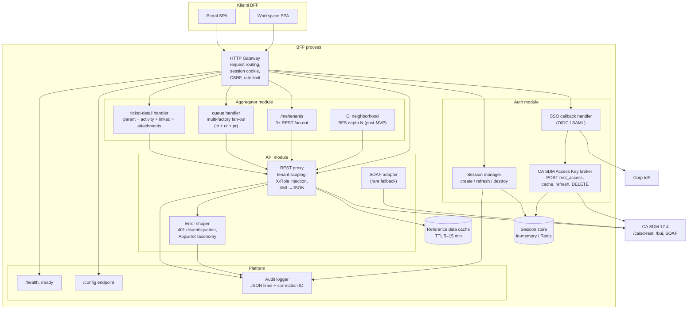

# Komponenty — BFF (Backend for Frontend)

> C4 Level 3 dekompozícia BFF tieru. BFF je samostatný server proces na
> **Node.js 22 LTS + Hono 4 + TypeScript 5.7 strict** (rozhodnutie v r2 — ADR-01).
> Sedí medzi prehliadačmi dvoch SPA a CA SDM 17.4. Plný dôvod existencie BFF
> je v `decision-records/01-bff.md`.

## Changelog (round 2)

- Doplnená sekcia §2.0 **Runtime stack** s konkrétnymi dependency.
- §2.2 Session manager: **Redis 7 (production) / in-memory `Map` (dev)** —
  zhodne s rozhodnutím v ADR-01 a 05 `auth-flow.md` § Variant A.
- §2.5 Platform / Audit logger doplnený o **pino 9 JSON stdout** destinácia
  + odkaz na 05 `audit-and-compliance.md` taxonómiu (~40 eventov v 5
  kategóriách).
- §3 BFF route inventory: doplnená cache TTL pre `/me` (session).
- Pridaná sekcia §0 **Startup flow** (entry point, graceful shutdown).
- Otvorené závislosti uzavreté / aktualizované per peer výstupy.

## 0. Startup flow (Hono + Node 22)

```ts
// apps/bff/src/index.ts (informačné — Phase C scaffolding)
import { Hono } from "hono";
import { serve } from "@hono/node-server";
import { logger } from "hono/logger";
import { secureHeaders } from "hono/secure-headers";
import { cors } from "hono/cors";
import pino from "pino";
import { loadConfig } from "./config";
import { createSessionStore } from "./session/store";
import { registerAuthRoutes } from "./auth/routes";
import { registerApiRoutes } from "./api/routes";
import { registerAggregatorRoutes } from "./aggregator/routes";
import { registerPlatformRoutes } from "./platform/routes";
import { auditMiddleware } from "./audit/middleware";
import { csrfMiddleware } from "./security/csrf";

async function bootstrap() {
  const config = await loadConfig();                       // BFF-side config.json
  const log = pino({
    level: config.logLevel ?? "info",
    redact: ["req.headers.authorization", "req.headers.cookie", "*.password"],
  });
  const sessionStore = await createSessionStore(config);    // Redis or in-memory

  const app = new Hono();

  app.use("*", secureHeaders());
  app.use("*", logger());
  app.use("/api/*", csrfMiddleware());
  app.use("*", auditMiddleware(log));                      // emits structured events

  registerPlatformRoutes(app, { config, sessionStore, log });
  registerAuthRoutes(app, { config, sessionStore, log });
  registerApiRoutes(app, { config, sessionStore, log });
  registerAggregatorRoutes(app, { config, sessionStore, log });

  const server = serve({ fetch: app.fetch, port: config.port ?? 8080 });
  log.info({ port: config.port ?? 8080 }, "bff: started");

  // Graceful shutdown — drain in-flight requests + close session store
  for (const sig of ["SIGINT", "SIGTERM"]) {
    process.on(sig, async () => {
      log.info({ sig }, "bff: shutting down");
      server.close();
      await sessionStore.close();
      process.exit(0);
    });
  }
}

bootstrap().catch((err) => {
  console.error("bff: bootstrap failed", err);
  process.exit(1);
});
```

## 1. Component diagram



## 2. Komponenty — zodpovednosti

### 2.0 Runtime stack (r2 fix)

| Vrstva | Konkrétne |
|---|---|
| Runtime | **Node.js 22 LTS** (per 08 `pm-runtime.md`) |
| Jazyk | **TypeScript 5.7 strict** (per 08 `repo-bootstrap.md`) |
| HTTP framework | **Hono 4** (ADR-01 §3) |
| Logger | **pino 9** — JSON stdout, `redact` pre auth/secrets |
| Session store | **Redis 7** (production) / **in-memory `Map`** (dev) |
| Redis client | **ioredis 5** |
| Validation | **Zod 3** + **`@hono/zod-validator`** middleware |
| Dev runner | **tsx 4** watch mode |
| Prod runner | `node --enable-source-maps dist/index.js` po `tsc --build` |
| Test runner | **Vitest** + **MSW Node** (per 09 `test-strategy.md`) |
| Health probes | Hono `/health` + `/ready` routes |
| Multipart upload | `hono` body parser + Node streams; žiadny `busboy` wrapper v MVP |

Verzie alignované s 06 `libraries.md` (kde aplikovateľné — FE má ekvivalenty)
a 08 `repo-bootstrap.md` (Node 22 LTS, pnpm 9).

### 2.1 HTTP Gateway

**Účel**: vstupný bod pre obe SPA. Jediný "front door" BFF procesu.

**Zodpovednosti**:
- Request parsing, body parsing (JSON, multipart pre attachment upload).
- Cookie management (HttpOnly + Secure + SameSite=Lax session cookie).
- CSRF protection (double-submit token alebo synchronizer token — Security agent).
- Rate limit per session (defenzívne — chráni CA SDM pred runaway klientom).
- CORS — defaultne **disabled** (BFF beží na rovnakej origin ako SPA podľa
  vhost setupu); ak by vhostovanie vyžadovalo CORS, povoľuje len konkrétne
  origins z runtime configu.
- Forwarding na konkrétny modul (auth, api, aggregator).

**Nevlastní**: business logiku, tenant policy, error shape.

### 2.2 Auth module

#### SSO callback handler
- Vstup: redirect z IdP s SAML response alebo OIDC code.
- Validuje token podpisom + issuer + audience.
- Vytvorí novú BFF session, uloží user profile (userId, fullName, email).
- Triggeruje `KeyBroker` na získanie CA SDM Access Key.
- Detail flow: vlastní Security agent (05).

#### Session manager
- API: `createSession(userProfile, accessKey, expiresAt)`,
  `getSession(sessionId)`, `refreshIfNeeded(sessionId)`, `destroySession(sessionId)`.
- Session payload: `{ userId, accessKey, accessKeyExpiresAt, activeTenantId,
  userProfileCache, lastSeenAt }`.
- Idle timeout: 30 min (konfigurovateľné). Absolute timeout: 8 h.
- **Persistence (r2 fix)**:
  - **Production**: Redis 7 cez `ioredis`. Key pattern: `sdm:session:<sessionId>`,
    TTL = absolute timeout (8 h). Hash storage pre granulárny update
    (`HSET` na `lastSeenAt` bez prepisu celého payloadu).
  - **Dev**: in-memory `Map<sessionId, SessionPayload>` so `setTimeout`-based
    TTL cleanup. **Žiadny external dependency v dev** — `pnpm dev` beží
    bez Redis-u.
  - Storage adapter interface (`packages/bff-internal/session-store.ts`):
    ```ts
    interface SessionStore {
      create(id: string, payload: SessionPayload, ttlSec: number): Promise<void>;
      get(id: string): Promise<SessionPayload | null>;
      touch(id: string, lastSeenAt: number): Promise<void>;
      destroy(id: string): Promise<void>;
      close(): Promise<void>;
    }
    ```
  - `createSessionStore(config)` factory zvolí Redis vs. in-memory podľa
    `config.session.driver` (`"redis"` / `"memory"`).

#### CA SDM Access Key broker
- `POST /caisd-rest/rest_access` s Basic Auth (z IdP-mapped credentials) alebo
  BOPSID flow ak Security zvolí SSO bridge.
- Cachuje Access Key v session.
- Pred každým CA SDM volaním v API module overí `expiresAt - now < threshold`
  → ak áno, **silent refresh** (nový rest_access POST).
- `DELETE /caisd-rest/rest_access/{id}` pri logoute.

### 2.3 API module

#### REST proxy
- Route mapping: `POST /api/incidents` → `POST /caisd-rest/in` (s remapom payload).
- Injektuje `X-AccessKey` (zo session) a `X-Role` (vybraná podľa
  `activeTenantId` z user roles).
- Pre defenzívnu tenant izoláciu (ADR-11): **ak query/WC filter neobsahuje
  tenant constraint, BFF ho pridá** — `WC=tenant%3DU'<activeTenantId>'`.
- XML→JSON konverzia (CA SDM defaults XML, ak Accept negotiation by zlyhala);
  camelCase rename podľa `@sdm/api-types`.
- Reference data (priorities, severities, statuses) cachuje v `Cache` (TTL 5–15
  min, invalidate na config endpoint reload alebo TTL expiry). Ostatné volania
  passthrough bez cache (server-state cache je v TanStack Query na FE).

#### SOAP adapter
- Pre operácie, ktoré REST nepokrýva (api-analyst/`gaps.md`):
  bulk close, advanced KB search, impersonation (post-MVP).
- Wrapped SOAP envelope cez `axios-soap` alebo dedikovaný klient.
- **Žiadny generický SOAP passthrough** — len whitelisted operations.

#### Error shaper
- Mapuje CA SDM error responses (401 / 400 / 500 / 404 / 409) na unified
  `AppError`:
  ```ts
  type AppError = {
    code: "AUTH_EXPIRED" | "AUTH_FORBIDDEN" | "TENANT_FORBIDDEN" | "VALIDATION"
        | "NOT_FOUND" | "CONFLICT" | "BACKEND_UNAVAILABLE" | "NETWORK" | "UNKNOWN";
    message: string;           // human-friendly (i18n key na FE)
    details?: unknown;         // raw shape len v dev mode
    correlationId: string;
  };
  ```
- CA SDM má **flat 401** pre permission failures (api-analyst/`auth.md` §5) —
  BFF rozlíši `AUTH_EXPIRED` (key vypršal) vs. `AUTH_FORBIDDEN` (rola nemá
  oprávnenie) cez timestamp a optional retry policy.

### 2.4 Aggregator module

**Účel**: niektoré UI views potrebujú agregát z 3+ CA SDM volaní (viď
03/`ui-views.md`). Robiť to v prehliadači = waterfall latencia +
duplicitná logika. BFF to robí na server-side fan-outom (parallel).

#### `/me/tenants` handler
- Implementuje flow z api-analyst/`multi-tenancy.md` §3.1.
- Cache: TTL 5 min, invalidate na admin role change (push z CA SDM SOAP
  `getNotifications` v post-MVP; v MVP je TTL stačí).

#### Queue handler
- Endpoint: `GET /api/queue?filters=...`.
- Fan-out: paralelne `GET /caisd-rest/in`, `/cr`, `/pr` s `X-Obj-Attrs`
  trimmed na potrebné polia pre `UiQueueItem`.
- Merge, sort (priority desc, lastActivityAt desc), pagination handling.
- Cache: TTL 30 s (alignment s `UiQueueItem` freshness contract).

#### Ticket detail handler
- Endpoint: `GET /api/tickets/:type/:id`.
- Fan-out: parent ticket, contacts (assignee, requester, affected), CI,
  linked problems/changes/KB, attachments meta, activity log (first page).
- Vracia kompletný `UiTicketDetail<T>`.
- Cache: TTL 60 s pre static parts, activity log nikdy (always fresh).

#### CI neighborhood handler (post-MVP)
- BFS z root CI cez `/caisd-rest/co/{id}/related?depth=N`. Ak REST nemá
  endpoint, BFF robí client-side BFS s limit-om počtu volaní.

### 2.5 Platform

#### `/config` endpoint
- Vracia JSON:
  ```json
  {
    "apiBaseUrl": "https://api.acme.example",
    "ssoLoginPath": "/auth/login",
    "features": { "kbAnalytics": false, "bulkOperations": false },
    "i18n": { "defaultLocale": "sk", "available": ["sk", "en"] },
    "branding": { "productName": "Service Desk" }
  }
  ```
- Načítava sa zo súboru `config.json` v runtime working dir.
- Žiadny restart pri zmene (file watcher alebo lazy re-read na request).
- Detail: ADR-12.

#### Health endpoints
- `GET /health` — liveness (process je hore).
- `GET /ready` — readiness (CA SDM dosiahnuteľný; synthetic ping cez
  `GET /caisd-rest/sevrty?size=1` per api-analyst/`gaps.md` #17).

#### Audit logger
- **Engine**: `pino` 9, JSON Lines on stdout. **Žiadny vlastný serializer.**
- **Destinácia (r2 fix)**: **stdout** → log shipper (filebeat / vector /
  promtail per 08) → **ELK alebo Loki** (08 voľba). **SIEM connector
  (Splunk / QRadar / Sentinel) je post-MVP** — kontrakt eventov je
  destination-agnostic.
- **Event taxonomia (autoritatívne — 05 `audit-and-compliance.md` § 2)**:
  ~40 eventov v 5 kategóriách:
  - `auth.*` (login, logout, session, MFA) — ~10 eventov
  - `authz.*` (permission decisions, RBAC denies) — ~7 eventov
  - `sensitive.*` (cross-tenant, admin, impersonation) — ~8 eventov
  - `security.*` (rate-limit, CSP violations, suspicious) — ~6 eventov
  - `data.*` (CRUD on regulated entities) — ~9 eventov

  Sampling per `audit-and-compliance.md` § 3.

- **Format** (per-request + auditEvent payload):
  ```json
  {
    "ts":"2026-05-15T10:33:21Z","level":"info",
    "requestId":"...","correlationId":"01J...",
    "userId":"u-..","tenantId":"t-..",
    "method":"GET","path":"/api/incidents","status":200,"latencyMs":127,
    "auditEvent":{"category":"data","name":"data.incident.read","sensitivity":"normal"}
  }
  ```
- Žiadne PII (mená, emaily); len pseudonymizované ID. `pino` `redact`
  config + business-layer scrubber pred emit.
- Retention per `security/audit-and-compliance.md` § 5 (1 rok min pre
  auth/authz/sensitive/security; 3 roky pre data; 90 dní reverse proxy
  access log).

## 3. BFF route inventory (high-level)

| Route | Účel | Owner module | Cache TTL |
|---|---|---|---|
| `GET /config` | Runtime config | Platform | none |
| `GET /health`, `/ready` | Health probes | Platform | none |
| `POST /auth/login` | SSO redirect start | Auth | none |
| `GET /auth/callback` | SSO callback | Auth | none |
| `POST /auth/logout` | Destroy session | Auth | none |
| `GET /me` | User profile + session info | Auth | session-lifetime (no HTTP cache, BFF reads from session store) |
| `GET /me/tenants` | User tenants | Aggregator | 5 min |
| `POST /me/active-tenant` | Switch active tenant | Auth | none |
| `GET /api/queue` | UI queue | Aggregator | 30 s |
| `GET /api/tickets/:type/:id` | Ticket detail | Aggregator | 60 s |
| `POST /api/tickets/:type` | Create ticket | API | none |
| `PUT /api/tickets/:type/:id` | Update ticket | API | none |
| `POST /api/tickets/:type/:id/activity` | Append activity | API | none |
| `GET /api/kb/search` | KB search | API (BUI fallback) | 30 s (per query) |
| `GET /api/kb/articles/:id` | KB article | API | 5 min |
| `GET /api/ci/:id` | CI detail | API | 5 min |
| `GET /api/ci/:id/related` | CI neighborhood | Aggregator | 5 min |
| `GET /api/reference/:type` | Priorities, statuses, severities, ... | API (cache) | 15 min |
| `POST /api/attachments` | Upload | API (multipart) | none |
| `GET /api/attachments/:id` | Download | API (stream) | none |

Plný kontrakt s payload schémami patrí 04 Architecture × 01 API Analyst
v refinement loope.

## Otvorené závislosti

| # | Flag | Smer | Popis | Status |
|---|---|---|---|---|
| 1 | `bff-technology` | (vlastné) | Hono 4 + Node 22 LTS + TS 5.7. | `[resolved-in-round-2]` |
| 2 | `csrf-strategy` | → 05-security | 05 v `owasp-mitigations.md` + `multi-tenancy-security.md` zaviedol Origin/Referer check + SameSite=Lax. Double-submit token sa nepoužije v MVP. | `[resolved-in-round-2]` (cross-ref na 05) |
| 3 | `rate-limit-policy` | → 05-security, 09-qa | Per-session limity, defenzívne per-tenant. | open (operatívne — 08 + 05 finalizuje threshold) |
| 4 | `soap-adapter-scope` | → 01-api-analyst | Katalóg SOAP operácií. | open (inherent API gap) |
| 5 | `attachment-streaming` | → 06-tech-stack | Hono `c.req.parseBody({ all: true })` + Node `stream/web` pre passthrough do CA SDM. Žiadny `multer`-class buffer-everything pattern. | `[resolved-in-round-2]` (Hono streams) |
| 6 | `aggregator-cache-store` | → 08-devex-devops | MVP: in-process `node-lru-cache` (TTL 5–15 min); v1: Redis cluster ak BFF skáluje horizontally. | `[resolved-in-round-2]` architecturally; v1 topology vlastní 08. |
