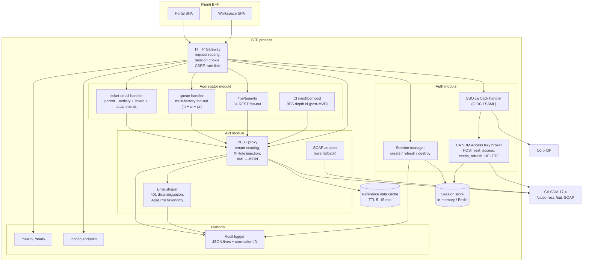

# Komponenty — BFF (Backend for Frontend)

> C4 Level 3 dekompozícia BFF tieru. BFF je samostatný server proces (Node.js
> alebo iný — finálnu voľbu robí 06 Tech Stack), ktorý sedí medzi prehliadačmi
> dvoch SPA a CA SDM 17.4. Plný dôvod existencie BFF je v `decision-records/01-bff.md`.

## 1. Component diagram



## 2. Komponenty — zodpovednosti

### 2.1 HTTP Gateway

**Účel**: vstupný bod pre obe SPA. Jediný "front door" BFF procesu.

**Zodpovednosti**:
- Request parsing, body parsing (JSON, multipart pre attachment upload).
- Cookie management (HttpOnly + Secure + SameSite=Lax session cookie).
- CSRF protection (double-submit token alebo synchronizer token — Security agent).
- Rate limit per session (defenzívne — chráni CA SDM pred runaway klientom).
- CORS — defaultne **disabled** (BFF beží na rovnakej origin ako SPA podľa
  vhost setupu); ak by vhostovanie vyžadovalo CORS, povoľuje len konkrétne
  origins z runtime configu.
- Forwarding na konkrétny modul (auth, api, aggregator).

**Nevlastní**: business logiku, tenant policy, error shape.

### 2.2 Auth module

#### SSO callback handler
- Vstup: redirect z IdP s SAML response alebo OIDC code.
- Validuje token podpisom + issuer + audience.
- Vytvorí novú BFF session, uloží user profile (userId, fullName, email).
- Triggeruje `KeyBroker` na získanie CA SDM Access Key.
- Detail flow: vlastní Security agent (05).

#### Session manager
- API: `createSession(userProfile, accessKey, expiresAt)`,
  `getSession(sessionId)`, `refreshIfNeeded(sessionId)`, `destroySession(sessionId)`.
- Session payload: `{ userId, accessKey, accessKeyExpiresAt, activeTenantId,
  userProfileCache, lastSeenAt }`.
- Idle timeout: 30 min (konfigurovateľné). Absolute timeout: 8 h.
- Persistence: cez `Session store` (in-memory / Redis — DevOps).

#### CA SDM Access Key broker
- `POST /caisd-rest/rest_access` s Basic Auth (z IdP-mapped credentials) alebo
  BOPSID flow ak Security zvolí SSO bridge.
- Cachuje Access Key v session.
- Pred každým CA SDM volaním v API module overí `expiresAt - now < threshold`
  → ak áno, **silent refresh** (nový rest_access POST).
- `DELETE /caisd-rest/rest_access/{id}` pri logoute.

### 2.3 API module

#### REST proxy
- Route mapping: `POST /api/incidents` → `POST /caisd-rest/in` (s remapom payload).
- Injektuje `X-AccessKey` (zo session) a `X-Role` (vybraná podľa
  `activeTenantId` z user roles).
- Pre defenzívnu tenant izoláciu (ADR-11): **ak query/WC filter neobsahuje
  tenant constraint, BFF ho pridá** — `WC=tenant%3DU'<activeTenantId>'`.
- XML→JSON konverzia (CA SDM defaults XML, ak Accept negotiation by zlyhala);
  camelCase rename podľa `@sdm/api-types`.
- Reference data (priorities, severities, statuses) cachuje v `Cache` (TTL 5–15
  min, invalidate na config endpoint reload alebo TTL expiry). Ostatné volania
  passthrough bez cache (server-state cache je v TanStack Query na FE).

#### SOAP adapter
- Pre operácie, ktoré REST nepokrýva (api-analyst/`gaps.md`):
  bulk close, advanced KB search, impersonation (post-MVP).
- Wrapped SOAP envelope cez `axios-soap` alebo dedikovaný klient.
- **Žiadny generický SOAP passthrough** — len whitelisted operations.

#### Error shaper
- Mapuje CA SDM error responses (401 / 400 / 500 / 404 / 409) na unified
  `AppError`:
  ```ts
  type AppError = {
    code: "AUTH_EXPIRED" | "AUTH_FORBIDDEN" | "TENANT_FORBIDDEN" | "VALIDATION"
        | "NOT_FOUND" | "CONFLICT" | "BACKEND_UNAVAILABLE" | "NETWORK" | "UNKNOWN";
    message: string;           // human-friendly (i18n key na FE)
    details?: unknown;         // raw shape len v dev mode
    correlationId: string;
  };
  ```
- CA SDM má **flat 401** pre permission failures (api-analyst/`auth.md` §5) —
  BFF rozlíši `AUTH_EXPIRED` (key vypršal) vs. `AUTH_FORBIDDEN` (rola nemá
  oprávnenie) cez timestamp a optional retry policy.

### 2.4 Aggregator module

**Účel**: niektoré UI views potrebujú agregát z 3+ CA SDM volaní (viď
03/`ui-views.md`). Robiť to v prehliadači = waterfall latencia +
duplicitná logika. BFF to robí na server-side fan-outom (parallel).

#### `/me/tenants` handler
- Implementuje flow z api-analyst/`multi-tenancy.md` §3.1.
- Cache: TTL 5 min, invalidate na admin role change (push z CA SDM SOAP
  `getNotifications` v post-MVP; v MVP je TTL stačí).

#### Queue handler
- Endpoint: `GET /api/queue?filters=...`.
- Fan-out: paralelne `GET /caisd-rest/in`, `/cr`, `/pr` s `X-Obj-Attrs`
  trimmed na potrebné polia pre `UiQueueItem`.
- Merge, sort (priority desc, lastActivityAt desc), pagination handling.
- Cache: TTL 30 s (alignment s `UiQueueItem` freshness contract).

#### Ticket detail handler
- Endpoint: `GET /api/tickets/:type/:id`.
- Fan-out: parent ticket, contacts (assignee, requester, affected), CI,
  linked problems/changes/KB, attachments meta, activity log (first page).
- Vracia kompletný `UiTicketDetail<T>`.
- Cache: TTL 60 s pre static parts, activity log nikdy (always fresh).

#### CI neighborhood handler (post-MVP)
- BFS z root CI cez `/caisd-rest/co/{id}/related?depth=N`. Ak REST nemá
  endpoint, BFF robí client-side BFS s limit-om počtu volaní.

### 2.5 Platform

#### `/config` endpoint
- Vracia JSON:
  ```json
  {
    "apiBaseUrl": "https://api.acme.example",
    "ssoLoginPath": "/auth/login",
    "features": { "kbAnalytics": false, "bulkOperations": false },
    "i18n": { "defaultLocale": "sk", "available": ["sk", "en"] },
    "branding": { "productName": "Service Desk" }
  }
  ```
- Načítava sa zo súboru `config.json` v runtime working dir.
- Žiadny restart pri zmene (file watcher alebo lazy re-read na request).
- Detail: ADR-12.

#### Health endpoints
- `GET /health` — liveness (process je hore).
- `GET /ready` — readiness (CA SDM dosiahnuteľný; synthetic ping cez
  `GET /caisd-rest/sevrty?size=1` per api-analyst/`gaps.md` #17).

#### Audit logger
- Format: JSON line per request:
  ```json
  {"ts":"2026-05-15T10:33:21Z","level":"info","requestId":"...",
   "correlationId":"...","userId":"u-..","tenantId":"t-..",
   "method":"GET","path":"/api/incidents","status":200,"latencyMs":127}
  ```
- Žiadne PII (mená, emaily); len pseudonymizované ID.
- Stdout — DevOps agent zoberie a forwardne do log collectora (ADR-09).

## 3. BFF route inventory (high-level)

| Route | Účel | Owner module | Cache TTL |
|---|---|---|---|
| `GET /config` | Runtime config | Platform | none |
| `GET /health`, `/ready` | Health probes | Platform | none |
| `POST /auth/login` | SSO redirect start | Auth | none |
| `GET /auth/callback` | SSO callback | Auth | none |
| `POST /auth/logout` | Destroy session | Auth | none |
| `GET /me` | User profile + session info | Auth | session |
| `GET /me/tenants` | User tenants | Aggregator | 5 min |
| `POST /me/active-tenant` | Switch active tenant | Auth | none |
| `GET /api/queue` | UI queue | Aggregator | 30 s |
| `GET /api/tickets/:type/:id` | Ticket detail | Aggregator | 60 s |
| `POST /api/tickets/:type` | Create ticket | API | none |
| `PUT /api/tickets/:type/:id` | Update ticket | API | none |
| `POST /api/tickets/:type/:id/activity` | Append activity | API | none |
| `GET /api/kb/search` | KB search | API (BUI fallback) | 30 s (per query) |
| `GET /api/kb/articles/:id` | KB article | API | 5 min |
| `GET /api/ci/:id` | CI detail | API | 5 min |
| `GET /api/ci/:id/related` | CI neighborhood | Aggregator | 5 min |
| `GET /api/reference/:type` | Priorities, statuses, severities, ... | API (cache) | 15 min |
| `POST /api/attachments` | Upload | API (multipart) | none |
| `GET /api/attachments/:id` | Download | API (stream) | none |

Plný kontrakt s payload schémami patrí 04 Architecture × 01 API Analyst
v refinement loope.

## Otvorené závislosti

| # | Flag | Smer | Popis |
|---|---|---|---|
| 1 | `bff-technology` | → 06-tech-stack-selector | Konkrétna voľba (Node.js + Fastify / Hono / NestJS / Bun / iné). Architecture poskytuje boundary; Tech Stack vyberie implementáciu. |
| 2 | `csrf-strategy` | → 05-security | Double-submit cookie vs. synchronizer token vs. SameSite=Strict + Origin check. Security agent rozhodne. |
| 3 | `rate-limit-policy` | → 05-security, 09-qa | Per-session limity (žiadne abuse), per-tenant limity (defenzívne pre CA SDM). MVP: konzervatívne defaults, Security finalizuje. |
| 4 | `soap-adapter-scope` | → 01-api-analyst, 06-tech-stack | Ktoré konkrétne SOAP operácie majú whitelist v MVP. api-analyst/`soap-fallback.md` má katalóg; vyžaduje finálne potvrdenie pre MVP scope. |
| 5 | `attachment-streaming` | → 06-tech-stack, 08-devex-devops | Upload streaming (mimo multer buffer-everything) — ak Node.js, treba HTTP/2 alebo streaming multipart parser. Tech Stack rozhodne. |
| 6 | `aggregator-cache-store` | → 08-devex-devops | `Reference data cache` je in-process v MVP, Redis v v1. DevOps potvrdí. |
