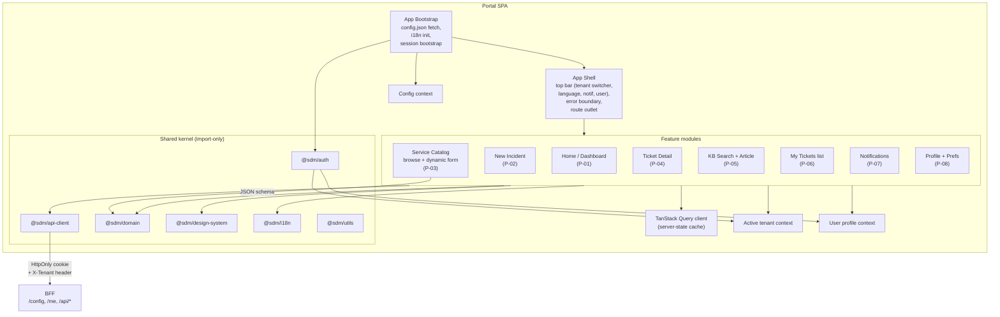

# Komponenty — Portal SPA

> C4 Level 3 dekompozícia `portal` aplikácie. Self-service SPA pre persona
> `requester_lucia`. Tech stack je framework-neutrálny v tomto dokumente —
> ADR-10 ponúka kandidátov, finálne 06 Tech Stack Selector.

## 1. Component diagram



## 2. Komponenty — zodpovednosti

### 2.1 App Bootstrap

**Sekvencia pri štarte**:
1. `GET /config` z BFF → naplnenie `ConfigContext` (`apiBaseUrl`, `features`,
   `i18n.defaultLocale`).
2. `@sdm/i18n` lazy-load default locale catalog.
3. `GET /me` z BFF — ak 401 → redirect na `POST /auth/login`. Ak 200 →
   naplnenie `UserContext` + `TenantContext` (active = `defaultTenantId`).
4. Mount `Shell`.

**Žiadny render obsahu predtým, než je config + session zistená** — vyhneme
sa flash unauthenticated state-u. Loading splash s logom.

### 2.2 App Shell

**Trvalý chrome** okolo route outletu:
- Top bar: logo, **tenant switcher** (so `UiTenantSwitcherEntry` zoznamom),
  jazyk toggle (SK/EN), notifications bell, user menu (profile, logout).
- Error boundary (per app) — fallback komponent s "skús refresh" akciou
  a Sentry breadcrumb capture.
- Route outlet — feature moduly sa lazy-loadujú per route.

**Tenant switch interakcia**:
1. User vyberie tenant → fire `POST /me/active-tenant`.
2. Po success: `QueryClient.invalidateQueries()` — flush všetkých server-state
   cache.
3. Ak je aktuálny route entity-scoped (ticket detail), navigovať na `home`
   (entita nepatrí novému tenantu).
4. Toast "Prepol si tenant na X".

Detail: `data-flows.md` § Tenant switch.

### 2.3 Feature modules

**Lazy-loaded chunky** (ADR-05). Každý feature modul vlastní:
- `routes/` — route definícia + route-level lazy import.
- `pages/` — page komponenty (`HomePage`, `NewIncidentPage`, ...).
- `components/` — feature-specific UI (nie reusable, tam patrí Design System).
- `hooks/` — feature hooks (napr. `useCreateIncident` ktorý wrap-uje
  TanStack Query mutation).
- `model/` — feature-specific computed types (nikdy core entity).

**Žiadne cyklické dep** medzi features. Spoločné UI ide do Design System
(`packages/design-system`).

### 2.4 Service Catalog dynamic form (P-03)

Najkomplexnejší komponent v `portal`. ADR-06 popisuje formát:
- BFF normalizuje CA SDM Service Catalog template → JSON schema podľa
  field type catalog (text, number, date, select, multi-select, file,
  user-picker, ci-picker).
- Renderer je v `@sdm/design-system/forms/json-schema-renderer.tsx` (po Tech
  Stack rozhodnutí).
- Validation client-side (`@sdm/domain/validators/service-request.ts`)
  podľa schema constraints.
- Submit → `POST /api/tickets/request` s payloadom `{ catalogItemId, formData }`.

### 2.5 Shared kernel imports

Portal importuje **iba** z whitelisted packages (boundaries):
- `@sdm/api-client` — HTTP klient (typed wrapper okolo `fetch`).
- `@sdm/api-types` — re-export z `@sdm/domain`.
- `@sdm/domain` — state machines, validátory, permission mapping.
- `@sdm/design-system` — UI primitives + composite components.
- `@sdm/auth` — login/logout helpers, role guards.
- `@sdm/i18n` — `<Trans>` komponent, `useTranslation()` hook.
- `@sdm/utils` — pure utility.

**Nikdy** neimportuje z `@sdm/workspace-*` alebo `@sdm/bff-*`. Boundaries
sú vynútené v `monorepo-layout.md` + ESLint rule (post-MVP nice-to-have).

### 2.6 Server-state vs. client-state

| Stav | Vlastník | Príklad |
|---|---|---|
| Server data (tickets, KB articles, config) | TanStack Query | `useTicketDetail(id)` |
| Form state | `react-hook-form` / framework-equivalent | Service Catalog form |
| UI ephemeral (modal open, dropdown selected) | `useState` / `useReducer` | Tenant switcher dropdown |
| Cross-feature ephemeral (active tenant, user) | React Context (4 contexts max) | `TenantContext`, `UserContext`, `ConfigContext`, `I18nContext` |
| Persisted preferences | localStorage cez `@sdm/auth` helper | Last-used tenant, language preference, queue filter (workspace) |

**Žiadny Redux/Zustand**. Ak by raz vznikla potreba, zaradíme to ako ADR
v ďalšom kole.

## 3. Routing — Portal

```
/                       → HomePage (P-01)
/login                  → SSO redirect (P-09)
/tenant-error           → Tenant unavailable error (P-10)
/onboarding             → Onboarding (P-11, post-MVP)
/new-incident           → NewIncidentPage (P-02)
/catalog                → CatalogBrowsePage (P-03)
/catalog/:itemId        → CatalogItemFormPage (P-03)
/tickets                → MyTicketsListPage (P-06)
/tickets/:id            → TicketDetailPage (P-04)
/kb                     → KbSearchPage (P-05)
/kb/article/:id         → KbArticlePage (P-05)
/notifications          → NotificationsPage (P-07)
/profile                → ProfilePage (P-08)
*                       → NotFoundPage
```

**Mobilný route** `/changes/:id/mobile-approve` (P-12) — viď `monorepo-layout.md`
poznámku o potenciálnom shared code-path medzi portal a workspace. MVP
rozhodnutie: routuje sa do **workspace** SPA (Peter má rolu Change Manager,
nie zamestnanec); mobile UX je iba responzívna varianta workspace W-03.

## 4. Performance budget

| Metrika | Cieľ | Mitigácia |
|---|---|---|
| Initial JS payload (gzipped) | < 200 kB | Route-level code-split, tree-shake Design System, žiadna heavy chart lib v initial bundle. |
| TTI na 3G | < 2 s (GOAL §5) | Preconnect na BFF v `<head>`; `/config` request parallel s app bundle. |
| First Contentful Paint | < 1.2 s | Skeleton render z Shell pred `/me` resolve. |
| Cumulative Layout Shift | < 0.1 | Reservedný priestor pre top bar, sidebar. |

## Otvorené závislosti

| # | Flag | Smer | Popis |
|---|---|---|---|
| 1 | `ui-framework` | → 06-tech-stack-selector | React / Vue / Angular / Solid — rozhodne 06. Tento dokument je framework-neutrálny. |
| 2 | `form-library` | → 06-tech-stack-selector, 07-design-system | `react-hook-form` ekv. pre dynamic forms — voľba ovplyvní renderer signature. |
| 3 | `service-catalog-form-source` | → 03-domain-modeller, 01-api-analyst | Formát Service Catalog form schema (gap #3 v api-analyst). |
| 4 | `mobile-emergency-approve-app` | → 04-architecture (potvrdenie) | P-12 sa routuje do workspace, nie portál. Potvrdenie pre UX. Detail v `monorepo-layout.md`. |
| 5 | `notifications-channel` | → 04-architecture, 01-api-analyst | P-07 závisí od CA SDM webhooks/polling — viď R-012 a `gaps.md` #7. MVP: polling + badge. |
