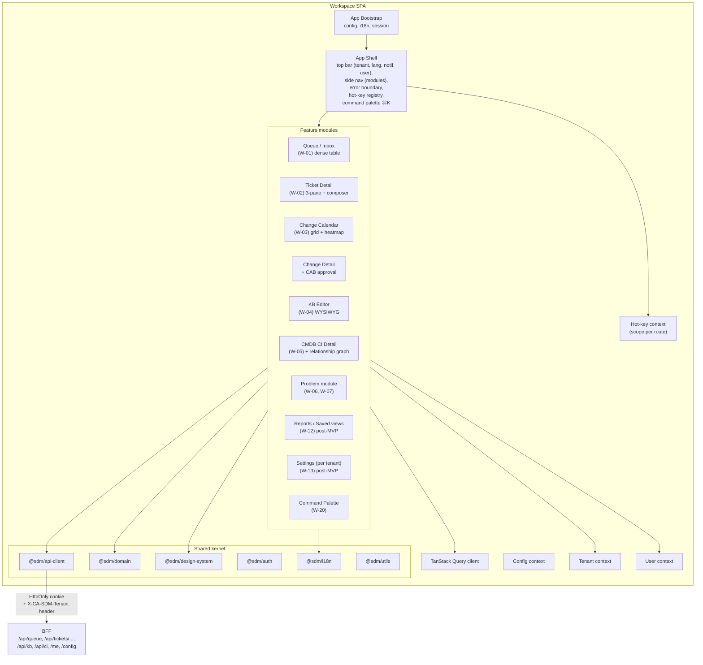

# Komponenty — Workspace SPA

> C4 Level 3 dekompozícia `workspace` aplikácie. Agent / specialist SPA pre
> 5 person (`agent_l1_anna`, `agent_l2_marek`, `change_manager_peter`,
> `kb_editor_jana`, `cmdb_owner_robert`). Vyššia information density,
> hot-keys, multi-pane. Stack finalizovaný v r2: **React 19 + Vite 5 +
> React Router v6 data router + TanStack Query v5 + React Hook Form + Zod
> + i18next + TipTap (KB editor) + FullCalendar (change calendar) +
> Cytoscape (CMDB graph) + Sentry React** (per 06 a ADRs).

## Changelog (round 2)

- Tenant header v diagrame zharmonizovaný na `X-CA-SDM-Tenant` (ADR-11 r2).
- Stack popis v úvode doplnený o konkrétne knižnice z 06.

## 1. Component diagram



## 2. Komponenty — zodpovednosti

### 2.1 App Bootstrap

Identický flow ako Portal (`portal.md` §2.1). Rozdiel: workspace má dodatočný
krok **registrácia hot-key handlerov** (`j/k/r/c/e/t`, `⌘K`, `?` overlay,
`g+i / g+r / g+p / g+c / g+k / g+m` pre navigáciu medzi modulmi).

### 2.2 App Shell

Trvalý chrome — širší ako Portal:
- Top bar: logo, tenant switcher (**farebne výrazný** — risks R-006/R-007),
  jazyk, notifications drawer trigger, user menu, `?` cheat-sheet trigger.
- Side nav: ikony pre moduly (Queue / Problems / Changes / KB / CMDB /
  Reports / Settings) s badge counter-mi (open na mojom mene, eskalované).
- Command Palette overlay (`⌘K`) — globálny search ticketov, KB článkov,
  CI, navigation actions.
- Error boundary — pri zlyhaní celej route ostáva Shell viditeľný (Shell má
  svoj vlastný error boundary nad route boundary).

**Hot-key context** je per-route scope:
- Globálne: `⌘K`, `?`, `g+i/r/p/c/k/m`, `Esc` (zatvor modal).
- V queue (W-01): `j/k` next/prev, `Enter` open, `space` select, `b` bulk action.
- V ticket detail (W-02): `r` reply, `c` close, `e` escalate, `t` take, `[ ]`
  prev/next ticket v queue.

### 2.3 Feature modules — kľúčové

#### Queue (W-01)
- Dense table (řiadky 28–32 px per UX risks R-008).
- Filter chips (status, priority, assignee, SLA state, ticket type).
- Saved views (uloženie filter combos v `UiUserProfile.preferences`).
- Bulk selection + bulk actions (post-MVP per UX R-018; MVP single-row only).
- Data: `useQuery(['queue', filters])` → BFF `/api/queue?...`.
- TTL 30 s + manual refresh button.

#### Ticket Detail Workspace (W-02)
- 3-pane layout:
  - Left: queue (compact, scrollable, sticky position) — pre `j/k` navigáciu.
  - Center: ticket data (sticky header, scrollable body s tabs: Details,
    Activity, Linked, Attachments).
  - Right: kontext panel (requester profile, CI, KB suggestions).
- Inline edit pre assignee, priority, status (s permission gating cez
  `@sdm/auth` `<Can>` komponentu).
- Composer (komment / internal note / KB link) na spodu.
- Data: `useTicketDetail(id)` → BFF `/api/tickets/:type/:id`.

#### Change Calendar (W-03)
- Calendar grid komponent — lazy-loaded (heavy chunk).
- Color-coded podľa risk a status.
- Multi-tenant overlay (read-only cross-tenant view ak má rola "cross-tenant
  viewer" — closes na `cross-tenant-policy` flag).
- Conflict detection: dva changes overlapping CI v rovnakom časovom okne
  → red badge. Logika v `@sdm/domain/change-conflict.ts`.

#### KB Editor (W-04)
- WYSIWYG editor (knižnica vyberá Tech Stack — TipTap / Lexical / ProseMirror
  podľa risk R-010).
- Toolbar: format, link, image (drag-drop upload cez BFF `/api/attachments`),
  code block.
- Lifecycle akcie (draft → review → publish → archive) cez state machine
  z `@sdm/domain`.
- "Create from ticket" action — pre-fill z ticket data ak prichádza z W-02
  Marek scenáru.

#### CMDB CI Detail (W-05)
- Sticky header (key attrs).
- Tabs: Attributes, Relationships, Open Tickets, Change History.
- Relationship view — lazy-loaded **graph komponent** (heavy chunk —
  Cytoscape canvas mode alebo iný, Tech Stack rozhoduje per risk R-011).
- Cross-tenant CI visualization (badge) — viď R-002, R-005.

### 2.4 Server-state vs. client-state

Rovnaké princípy ako Portal (`portal.md` §2.6). Rozdiel:
- Workspace persistuje **viac user preferences** v localStorage (queue
  filters, table column widths, panel sizes, hot-key custom bindings v v1+).
- Persistencia per (userId, tenantId) — kľúč v localStorage je
  `sdm.ws.${userId}.${tenantId}.${preferenceKey}`.

## 3. Routing — Workspace

```
/                            → redirect na /queue
/login, /tenant-error        → SSO redirect / error
/queue                       → QueuePage (W-01)
/tickets/:id                 → TicketDetailWorkspace (W-02; type derived from id prefix)
/problems                    → ProblemListPage (W-07)
/problems/:id                → ProblemDetailPage (W-06)
/changes                     → ChangeListPage (W-08)
/changes/calendar            → ChangeCalendarPage (W-03)
/changes/:id                 → ChangeDetailPage
/changes/:id/mobile-approve  → MobileApprovePage (P-12 in workspace)
/changes/cab/:date           → CABMeetingPage (W-18, post-MVP)
/kb                          → KbBrowsePage (W-09)
/kb/editor/:id?              → KbEditorPage (W-04)
/kb/analytics                → KbAnalyticsPage (W-10, post-MVP)
/cmdb                        → CmdbBrowsePage (W-11)
/cmdb/ci/:id                 → CmdbCiDetailPage (W-05)
/reports                     → ReportsPage (W-12, post-MVP)
/settings                    → SettingsPage (W-13, post-MVP)
/profile                     → ProfilePage (W-14)
*                            → NotFoundPage
```

## 4. Hot-key registry

Centrálny `HotKeyContext` v Shell s API:
```ts
registerHotKey({ key: "j", scope: "queue", handler, description });
```

Pri otvorení `?` overlay sa zobrazí všetkých skratiek aktuálneho scope.
Detail v Design System agent (07) — globálna mapa + i18n popisov skratiek.

Konflikt s prehliadačom (per R-008): testovať s VoiceOver/NVDA, dokumentovať
v Tech Stack ADR.

## 5. Performance budget

| Metrika | Cieľ | Mitigácia |
|---|---|---|
| Initial JS payload (gzipped) | < 350 kB | Lazy-load: calendar, graph viewer, WYSIWYG editor sú samostatné chunky. |
| First Contentful Paint | < 1.5 s | Shell + queue page rýchle; heavy moduly idú na route enter. |
| Queue render (100 rows) | < 500 ms | Žiadna virtualizácia (per GOAL §11), ale React keys + memo na rows. |
| Tenant switch flush + first refetch | < 800 ms | Optimistic clear + cache prefetch warm. |

## Otvorené závislosti

| # | Flag | Smer | Popis | Status |
|---|---|---|---|---|
| 1 | `ui-framework` | (vlastné) | React 19. | `[resolved-in-round-2]` |
| 2 | `wysiwyg-library` | (vlastné) | TipTap (06). | `[resolved-in-round-2]` |
| 3 | `graph-library` | (vlastné) | Cytoscape canvas mode (06). | `[resolved-in-round-2]` |
| 4 | `calendar-library` | (vlastné) | FullCalendar (06). Lazy-loaded chunk. | `[resolved-in-round-2]` |
| 5 | `cross-tenant-viewer-role` | → 05-security, 01-api-analyst | W-03 cross-tenant overlay (GAP-3). | open (inherent — A-111) |
| 6 | `cmd-palette-search-scope` | → 01-api-analyst | Global search aggregate endpoint (gap #5). | open (inherent API gap) |
| 7 | `hot-key-i18n` | → 07-design-system | Cheat-sheet `?` overlay i18n. | open (07 vlastní) |
