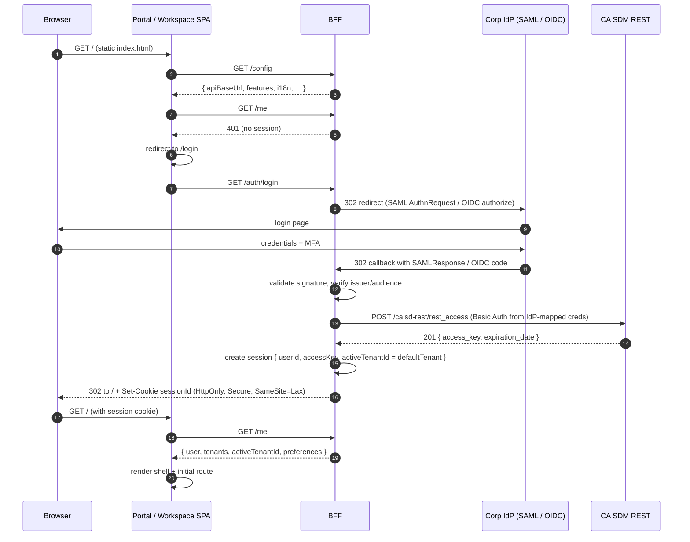
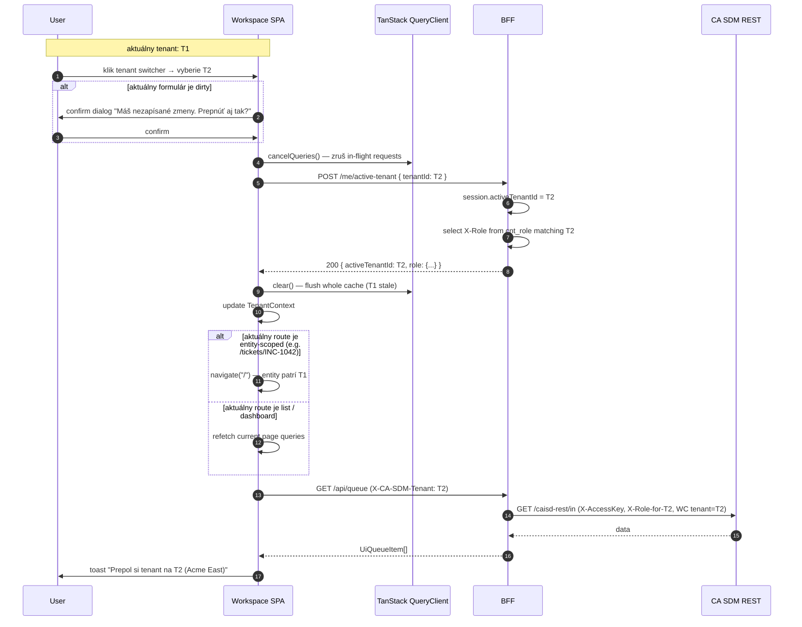
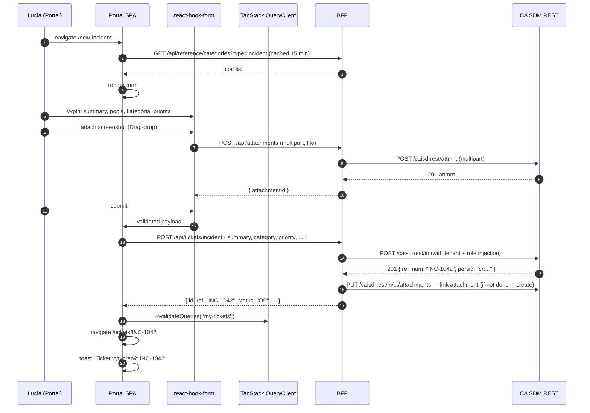
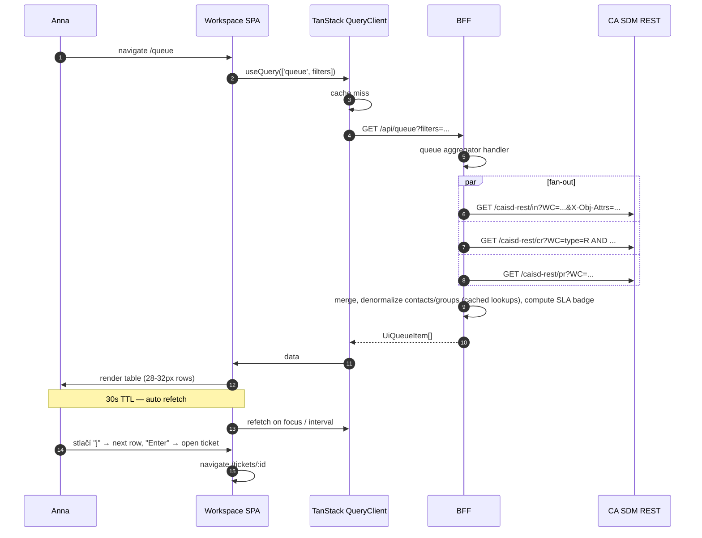
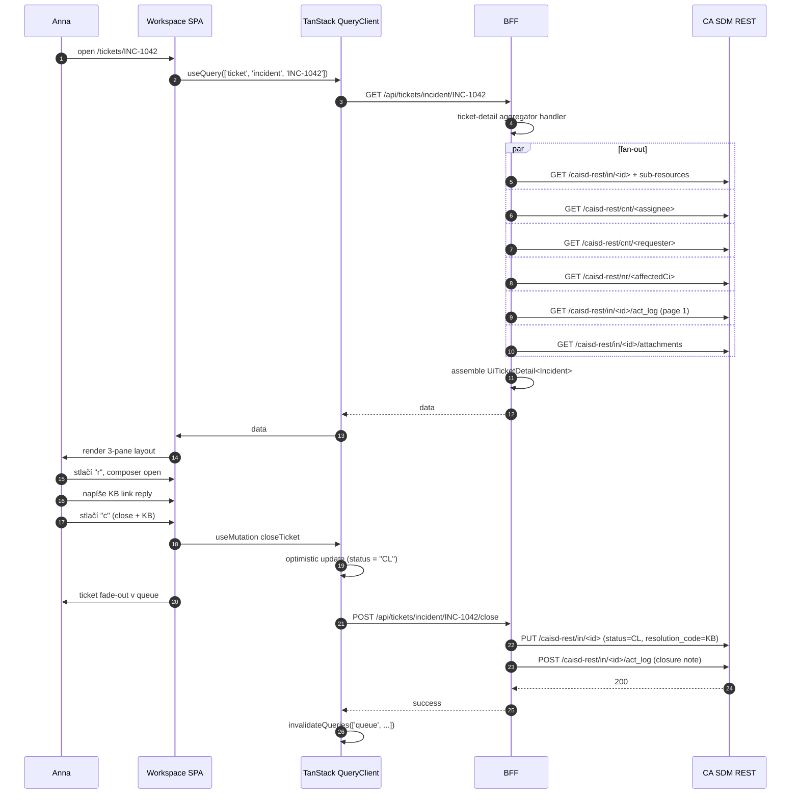
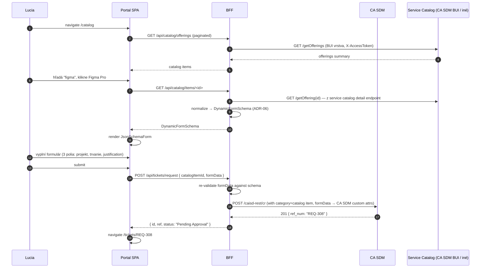
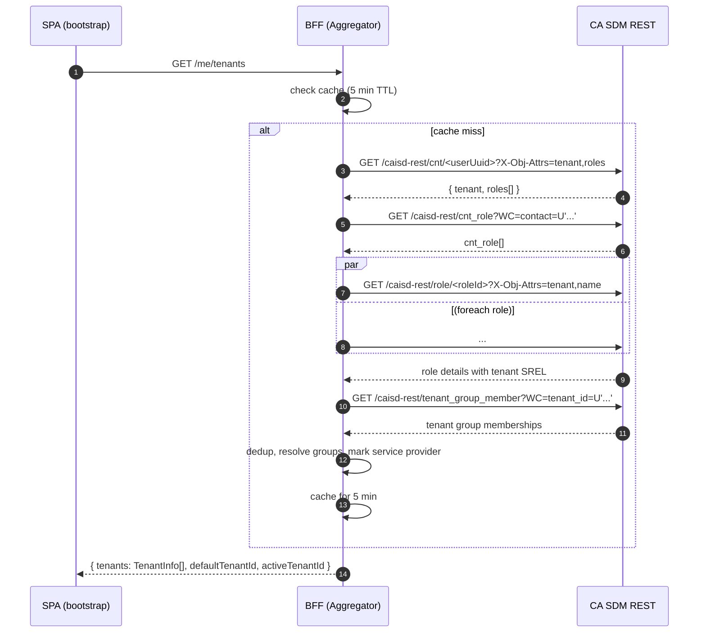
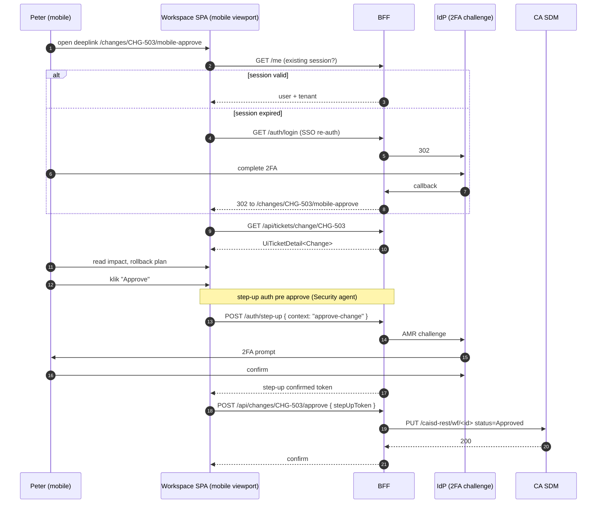

# Data flows — kľúčové scenáre

> Sekvenčné diagramy pre kritické end-to-end flows. Pomáha Security agentovi
> overiť threat model, QA agentovi naplánovať integračné testy a 10
> Documentation Author napísať per-module specs.

## Changelog (round 2)

- Tenant header v sequence diagrame § 2 (Tenant switch) zharmonizovaný na
  **`X-CA-SDM-Tenant`** (zhoda s ADR-11 r2 update + 08 `runtime-config.md`).
  Sémantika diagramov nezmenená.

## 1. Login flow (SSO)



**Edge cases**:
- **IdP login fail**: BFF dostane error v callback → redirect SPA do
  `/login?error=auth_failed` s human-friendly message.
- **CA SDM `rest_access` zlyhá**: BFF vráti 502 do FE, SPA ukáže
  "Backend nedostupný — skús neskôr".
- **No CA SDM role mapping**: user existuje v IdP, ale CA SDM ho nepozná →
  BFF mapuje na `AUTH_FORBIDDEN` s message "Tvoj účet nemá oprávnenie".

## 2. Tenant switch flow



**Two-tab race condition**:
- Tab A má T1, Tab B má T1. User v Tab A switchne na T2.
- Tab B robí ďalší request s `X-CA-SDM-Tenant: T1` v hlavičke, ale BFF session má T2.
- BFF detekuje mismatch → vráti `TENANT_FORBIDDEN` s `{ correctTenantId: T2 }`.
- `@sdm/api-client` zachytí, FE auto-refresh Tab B do T2 a toast "Tenant
  bol prepnutý v inom okne".

## 3. Ticket create — incident (Lucia portal)



**Edge cases**:
- **Attachment > 25 MB**: BFF vráti 413 → FE inline error "Maximum 25 MB"
  + zachová form state (no redirect).
- **Validation fail**: BFF vráti `VALIDATION` AppError s `fieldErrors`
  → react-hook-form set per-field errors.
- **CA SDM 401 (key expired)**: BFF silent refresh `rest_access`, retry once;
  ak znova fail → `AUTH_EXPIRED` → SPA redirect /login (zachová form draft
  v localStorage cez `@sdm/auth.preferences`).

## 4. Queue load (Anna workspace)



## 5. Ticket detail view (Anna workspace W-02)



## 6. Service Catalog request submit (Lucia portal)



## 7. Tenant resolution — `/me/tenants` aggregate



Detail flow je v api-analyst/`multi-tenancy.md` §3.1.

## 8. Logout

```mermaid
sequenceDiagram
    autonumber
    participant U as User
    participant SPA as SPA
    participant QC as QueryClient
    participant BFF as BFF
    participant SDM as CA SDM REST
    participant IdP as IdP

    U->>SPA: klik "Odhlásiť sa"
    SPA->>QC: clear() — flush cache
    SPA->>BFF: POST /auth/logout
    BFF->>SDM: DELETE /caisd-rest/rest_access/<id>
    SDM-->>BFF: 204
    BFF->>BFF: destroy session
    alt IdP single logout
        BFF->>IdP: SLO request (SAML / OIDC)
        IdP-->>BFF: 200
    end
    BFF-->>SPA: Set-Cookie sessionId=; Max-Age=0
    SPA->>SPA: navigate /login
```

## 9. Mobile emergency approve (Peter — W-03 mobile)



Detail step-up auth vlastní Security agent (05).

## Otvorené závislosti

| # | Flag | Smer | Popis | Status |
|---|---|---|---|---|
| 1 | `step-up-auth-flow` | → 05-security | Detail step-up flow pre approve / sensitive actions. | open (post-MVP — A-113) |
| 2 | `service-catalog-detail-endpoint` | → 01-api-analyst | gap #3. | open (inherent API gap) |
| 3 | `attachment-link-flow` | → 01-api-analyst | Pre-attach + link-after-create vs. kombinovaný multipart. | open (operatívne — BFF voľba per scenár) |
| 4 | `single-logout-spec` | → 05-security | SLO flow. | open (post-MVP) |
| 5 | `optimistic-update-list` | → 09-qa | Per-mutation policy. 09 v r1 doručil 18 acceptance criteria. | `[resolved-in-round-2]` (na úrovni stratégie); per-mutation matrix v 09 dev handbook. |
