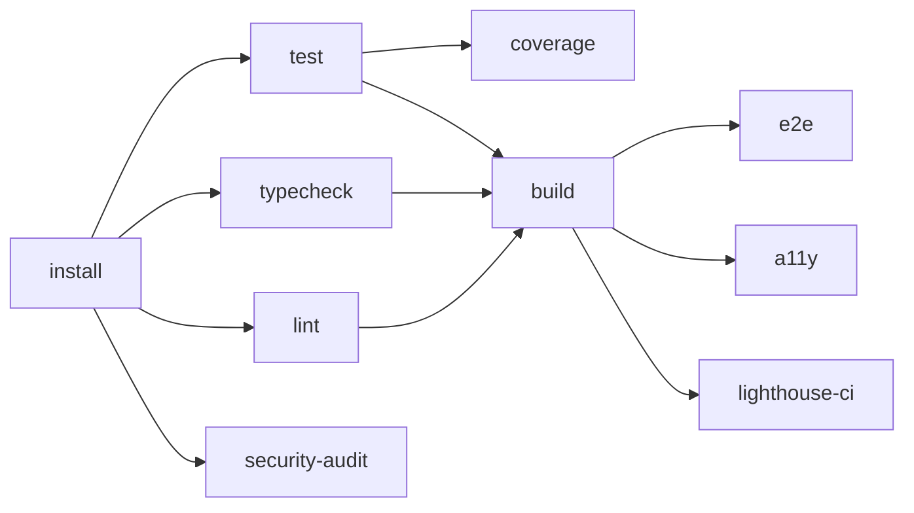

# CI/CD — GitHub Actions pipeline

## Changelog (round 2)

- Pridaný **`coverage` job** s per-package thresholdami z 09 `coverage-targets.md`
  (domain 90/85, api-client 80/70, design-system 75/65, auth 85/75, portal/workspace 60/50, pm 70/60, **bff 80/70**, **api-mocks 70/60**).
- Pridaný **`lighthouse-ci` job** s prahmi z 09 `performance.md` (per stránka:
  TTI, LCP, CLS, TBT, INP, score min) — 4–6 kritických stránok per PR, all 17 nightly.
- Pridaný **`axe-core` job** (Playwright `@axe-core/playwright` integration)
  per 09 `a11y-tests.md` — block merge na serious + critical violations.
- `test` job rozbalený do `unit + contract` (Vitest) a samostatný `coverage` job s upload do Codecov-style komentára.
- Job graf prepracovaný — `coverage`, `lighthouse-ci`, `axe-core` paralelne s `e2e` po `build`.
- `## Otvorené závislosti` aktualizované — uzavreté `[09-qa-test-strategy]` (coverage threshold + perf + a11y),
  `[06-tech-stack-selector]` (single-stack), `[04-architecture]` (BFF build job, deployable shape).

> Cieľový CI provider: **GitHub Actions** (default — repo je `Spigotek/SDM-Rewrite`
> na GitHub). Konfig žije v `.github/workflows/`. GitLab CI variant je v sekcii
> *Alternatíva*; aktivuje sa, ak sa repo presunie na GitLab.

## Princíp — CI ≡ local

Každý CI job spúšťa **rovnaké `pnpm` skripty** ako lokálny vývojár. Žiadne CI-only
shell wrappery. Ak prejde lokálne, prejde aj v CI (a opačne — ak zlyhá CI a
nie lokál, vinník je niečo špecifické pre prostredie, nie skripty).

## Workflowy

| Súbor | Trigger | Účel |
|---|---|---|
| `ci.yml` | `pull_request`, `push` na `pipeline/**`, `main` | Hlavná validačná pipeline (lint, typecheck, test, coverage, build, e2e, a11y, lhci, security-audit) |
| `agent-pipeline.yml` | manual `workflow_dispatch`, schedule (voliteľné) | Beh PM CLI (Claude Agent SDK) v izolovanom runneri |
| `release.yml` | `push` tag `v*.*.*` | Build production artefaktov + GH Release |
| `pr-preview.yml` | `pull_request` | (voliteľné) — deploy preview portálu/workspace cez surge.sh / Vercel preview |
| `codeql.yml` | `push`, `schedule` weekly | GitHub native SAST |
| `nightly.yml` | `schedule` daily 02:00 UTC | Full Lighthouse sweep (all 17 routes) + full axe-core sweep (moderate + minor) |

## `.github/workflows/ci.yml`

Cieľový pipeline: **9 jobov** (install, lint, typecheck, test, coverage, build, e2e, a11y, lhci, security-audit). 5 z nich je v `required_status_checks` (lint, typecheck, test, coverage, build, security-audit — viď § Branch protection).

```yaml
name: CI

on:
  pull_request:
    branches: [main, "pipeline/**"]
  push:
    branches: [main, "pipeline/**"]

concurrency:
  group: ${{ github.workflow }}-${{ github.ref }}
  cancel-in-progress: true

env:
  PNPM_VERSION: "9.12.0"
  NODE_VERSION: "22"

jobs:
  install:
    name: Install
    runs-on: ubuntu-latest
    outputs:
      pnpm-cache-key: ${{ steps.cache-key.outputs.value }}
    steps:
      - uses: actions/checkout@v4
      - uses: pnpm/action-setup@v4
        with:
          version: ${{ env.PNPM_VERSION }}
      - uses: actions/setup-node@v4
        with:
          node-version: ${{ env.NODE_VERSION }}
          cache: "pnpm"
      - name: Install deps
        run: pnpm install --frozen-lockfile
      - id: cache-key
        run: echo "value=${{ hashFiles('pnpm-lock.yaml') }}" >> "$GITHUB_OUTPUT"

  lint:
    name: Lint + Format
    needs: install
    runs-on: ubuntu-latest
    steps:
      - uses: actions/checkout@v4
      - uses: pnpm/action-setup@v4
        with: { version: "${{ env.PNPM_VERSION }}" }
      - uses: actions/setup-node@v4
        with: { node-version: "${{ env.NODE_VERSION }}", cache: "pnpm" }
      - run: pnpm install --frozen-lockfile
      - run: pnpm lint
      - run: pnpm format:check

  typecheck:
    name: Typecheck
    needs: install
    runs-on: ubuntu-latest
    steps:
      - uses: actions/checkout@v4
      - uses: pnpm/action-setup@v4
        with: { version: "${{ env.PNPM_VERSION }}" }
      - uses: actions/setup-node@v4
        with: { node-version: "${{ env.NODE_VERSION }}", cache: "pnpm" }
      - run: pnpm install --frozen-lockfile
      - run: pnpm typecheck

  test:
    name: Unit + Component tests
    needs: install
    runs-on: ubuntu-latest
    steps:
      - uses: actions/checkout@v4
      - uses: pnpm/action-setup@v4
        with: { version: "${{ env.PNPM_VERSION }}" }
      - uses: actions/setup-node@v4
        with: { node-version: "${{ env.NODE_VERSION }}", cache: "pnpm" }
      - run: pnpm install --frozen-lockfile
      - run: pnpm test -- --coverage --reporter=default --reporter=junit --outputFile=test-results.xml
      - uses: actions/upload-artifact@v4
        if: always()
        with:
          name: coverage-raw
          path: |
            **/coverage/**
            **/test-results.xml
          retention-days: 7

  coverage:
    name: Coverage thresholds
    needs: test
    runs-on: ubuntu-latest
    steps:
      - uses: actions/checkout@v4
        with: { fetch-depth: 0 }                     # potrebné na diff vs. main
      - uses: pnpm/action-setup@v4
        with: { version: "${{ env.PNPM_VERSION }}" }
      - uses: actions/setup-node@v4
        with: { node-version: "${{ env.NODE_VERSION }}", cache: "pnpm" }
      - run: pnpm install --frozen-lockfile
      - uses: actions/download-artifact@v4
        with: { name: coverage-raw, path: . }
      - name: Enforce per-package thresholds (09 coverage-targets.md)
        run: pnpm exec tsx tools/coverage/check-thresholds.ts
      - name: Codecov upload
        if: env.CODECOV_TOKEN != ''
        uses: codecov/codecov-action@v5
        env:
          CODECOV_TOKEN: ${{ secrets.CODECOV_TOKEN }}
        with:
          files: "**/coverage/lcov.info"
          fail_ci_if_error: false                    # Codecov outage nesmie blokovať merge
      - name: PR diff comment
        if: github.event_name == 'pull_request'
        uses: davelosert/vitest-coverage-report-action@v2
        with:
          json-summary-path: coverage/coverage-summary.json
          comment-on: pr

  build:
    name: Build all
    needs: [lint, typecheck, test]
    runs-on: ubuntu-latest
    steps:
      - uses: actions/checkout@v4
      - uses: pnpm/action-setup@v4
        with: { version: "${{ env.PNPM_VERSION }}" }
      - uses: actions/setup-node@v4
        with: { node-version: "${{ env.NODE_VERSION }}", cache: "pnpm" }
      - run: pnpm install --frozen-lockfile
      - run: pnpm build                              # turbo run build (cache aware)
      - uses: actions/upload-artifact@v4
        with:
          name: dist
          path: |
            apps/portal/dist
            apps/workspace/dist
            apps/bff/dist
          retention-days: 14

  e2e:
    name: E2E (Playwright)
    needs: build
    runs-on: ubuntu-latest
    steps:
      - uses: actions/checkout@v4
      - uses: pnpm/action-setup@v4
        with: { version: "${{ env.PNPM_VERSION }}" }
      - uses: actions/setup-node@v4
        with: { node-version: "${{ env.NODE_VERSION }}", cache: "pnpm" }
      - run: pnpm install --frozen-lockfile
      - uses: actions/cache@v4
        with:
          path: ~/.cache/ms-playwright
          key: playwright-${{ runner.os }}-${{ hashFiles('**/pnpm-lock.yaml') }}
      - run: pnpm exec playwright install --with-deps chromium
      - run: pnpm test:e2e
      - uses: actions/upload-artifact@v4
        if: failure()
        with:
          name: playwright-report
          path: playwright-report/
          retention-days: 14

  a11y:
    name: Accessibility (axe-core)
    needs: build
    runs-on: ubuntu-latest
    steps:
      - uses: actions/checkout@v4
      - uses: pnpm/action-setup@v4
        with: { version: "${{ env.PNPM_VERSION }}" }
      - uses: actions/setup-node@v4
        with: { node-version: "${{ env.NODE_VERSION }}", cache: "pnpm" }
      - run: pnpm install --frozen-lockfile
      - uses: actions/cache@v4
        with:
          path: ~/.cache/ms-playwright
          key: playwright-${{ runner.os }}-${{ hashFiles('**/pnpm-lock.yaml') }}
      - run: pnpm exec playwright install --with-deps chromium
      - name: Run axe-core integration on all E2E specs
        run: pnpm test:a11y                          # alias na: playwright test --grep @a11y
      - uses: actions/upload-artifact@v4
        if: always()
        with:
          name: a11y-report
          path: |
            a11y-report/
            playwright-report/
          retention-days: 14

  lighthouse-ci:
    name: Performance (Lighthouse CI)
    needs: build
    runs-on: ubuntu-latest
    steps:
      - uses: actions/checkout@v4
      - uses: pnpm/action-setup@v4
        with: { version: "${{ env.PNPM_VERSION }}" }
      - uses: actions/setup-node@v4
        with: { node-version: "${{ env.NODE_VERSION }}", cache: "pnpm" }
      - run: pnpm install --frozen-lockfile
      - uses: actions/download-artifact@v4
        with: { name: dist, path: . }
      - name: Install Lighthouse CI
        run: pnpm add -D -w @lhci/cli@^0.14.0
      - name: Run Lighthouse CI (PR-critical pages)
        run: pnpm exec lhci autorun --config=./lighthouserc.json
        env:
          LHCI_GITHUB_APP_TOKEN: ${{ secrets.LHCI_GITHUB_APP_TOKEN }}
      - uses: actions/upload-artifact@v4
        if: always()
        with:
          name: lighthouse-report
          path: .lighthouseci/
          retention-days: 14

  security-audit:
    name: Security audit
    needs: install
    runs-on: ubuntu-latest
    steps:
      - uses: actions/checkout@v4
      - uses: pnpm/action-setup@v4
        with: { version: "${{ env.PNPM_VERSION }}" }
      - uses: actions/setup-node@v4
        with: { node-version: "${{ env.NODE_VERSION }}", cache: "pnpm" }
      - run: pnpm install --frozen-lockfile
      - name: pnpm audit (production deps only)
        run: pnpm audit --prod --audit-level=high
        continue-on-error: false
      - name: Trufflehog secret scan
        uses: trufflesecurity/trufflehog@main
        with:
          path: ./
          base: ${{ github.event.pull_request.base.sha || github.event.before }}
          head: HEAD
          extra_args: --only-verified
```

Job graf:



## Coverage thresholds — config

09 r1 `coverage-targets.md` autoritatívny. Implementácia:

### `tools/coverage/check-thresholds.ts`

Skript zbiera `coverage/coverage-summary.json` per workspace a porovnáva
voči per-package prahom. Block merge ak akýkoľvek package padne pod minimum.

```ts
// tools/coverage/check-thresholds.ts (kostra)
import { readFile } from "node:fs/promises";
import { glob } from "node:fs/promises";

const THRESHOLDS = {
  "packages/domain":         { line: 90, branch: 85, function: 90, statement: 90 },
  "packages/api-client":     { line: 80, branch: 70, function: 80, statement: 80 },
  "packages/design-system":  { line: 75, branch: 65, function: 75, statement: 75 },
  "packages/auth":           { line: 85, branch: 75, function: 85, statement: 85 },
  "packages/api-mocks":      { line: 70, branch: 60, function: 70, statement: 70 },
  "apps/portal":             { line: 60, branch: 50, function: 60, statement: 60 },
  "apps/workspace":          { line: 60, branch: 50, function: 60, statement: 60 },
  "apps/bff":                { line: 80, branch: 70, function: 80, statement: 80 },
  "apps/pm":                 { line: 70, branch: 60, function: 70, statement: 70 },
};

const failures: string[] = [];
for (const [pkg, thr] of Object.entries(THRESHOLDS)) {
  const summary = JSON.parse(
    await readFile(`${pkg}/coverage/coverage-summary.json`, "utf-8"),
  );
  const total = summary.total;
  for (const metric of ["line", "branch", "function", "statement"] as const) {
    const pct = total[`${metric}s`].pct;
    if (pct < thr[metric]) {
      failures.push(`${pkg} ${metric} ${pct}% < ${thr[metric]}%`);
    }
  }
}

if (failures.length > 0) {
  console.error("Coverage threshold failures:");
  failures.forEach((f) => console.error("  " + f));
  process.exit(1);
}
console.log("All coverage thresholds met.");
```

Hodnoty pochádzajú z 09 `coverage-targets.md` § 1. **`apps/bff` (80/70)
a `packages/api-mocks` (70/60)** sú nové prahy v r2 — 09 r2 ich doplní;
default v 09 `coverage-targets.md` Otvorené závislosti `[04-architecture]` flag
hovorí "ak Architecture pridá `packages/bff`, default rovnaký ako `api-client` (80/70)".

### Per-modul critical prahy (z 09 § 2)

Skript navyše overí, či sú kritické moduly nad **100 % line / 95 % branch**:

- `packages/domain/src/lifecycles/{incident,request,change,problem,kb-article}.ts`
- `packages/auth/src/permissions.ts`
- `packages/domain/src/validators/transitions.ts`
- `packages/api-client/src/tenant/*` + `apps/*/src/features/tenant-switcher/`

## Lighthouse CI — config

09 r1 `performance.md` autoritatívny. Konkrétne prahy per stránka v § 2.

### `lighthouserc.json`

```jsonc
{
  "ci": {
    "collect": {
      "staticDistDir": "./apps/portal/dist",
      "url": [
        "http://localhost/index.html",
        "http://localhost/incident/new",
        "http://localhost/incidents/INC-12345"
      ],
      "numberOfRuns": 3,
      "settings": {
        "preset": "desktop",
        "throttling": { "cpuSlowdownMultiplier": 4 },
        "skipAudits": ["uses-http2"]
      }
    },
    "assert": {
      "assertions": {
        "categories:performance":   ["error", { "minScore": 0.85 }],
        "categories:accessibility": ["error", { "minScore": 0.90 }],
        "categories:best-practices": ["warn", { "minScore": 0.90 }],
        "first-contentful-paint":   ["error", { "maxNumericValue": 1800 }],
        "largest-contentful-paint": ["error", { "maxNumericValue": 2000 }],
        "interactive":              ["error", { "maxNumericValue": 2000 }],
        "cumulative-layout-shift":  ["error", { "maxNumericValue": 0.10 }],
        "total-blocking-time":      ["error", { "maxNumericValue": 300 }]
      }
    },
    "upload": {
      "target": "temporary-public-storage"
    }
  }
}
```

Per-PR: portal `/`, portal `/incident/new`, workspace `/incidents`, workspace
`/cmdb/:id` (4 najkritickejšie). **Nightly sweep** (`nightly.yml`) spúšťa
všetkých 17 stránok z 09 `performance.md` § 2.

Rolling baseline guard (09 § 5): block ak skóre klesne o > 5 bodov vs.
7-day priemer aj keď absolútny prah ešte platí. Implementácia v r2: ostáva
na LHCI server-side query (v MVP **opt-out**, len absolute thresholds).

### Bundle size budget (09 § 3)

Pridáme parallel job `bundle-size`:

```yaml
  bundle-size:
    name: Bundle size budget
    needs: build
    runs-on: ubuntu-latest
    steps:
      - uses: actions/checkout@v4
      - uses: actions/download-artifact@v4
        with: { name: dist, path: . }
      - name: Check budgets
        uses: andresz1/size-limit-action@v1
        with:
          github_token: ${{ secrets.GITHUB_TOKEN }}
          skip_step: install
```

`size-limit.config.js`:

```js
export default [
  { name: "portal initial JS",    path: "apps/portal/dist/assets/index-*.js",    limit: "180 KB" },
  { name: "portal initial CSS",   path: "apps/portal/dist/assets/index-*.css",   limit: "30 KB" },
  { name: "workspace initial JS", path: "apps/workspace/dist/assets/index-*.js", limit: "350 KB" },
  { name: "workspace initial CSS", path: "apps/workspace/dist/assets/index-*.css", limit: "60 KB" },
];
```

## axe-core (a11y) — config

09 r1 `a11y-tests.md` autoritatívny. Implementácia:

### `tools/axe/config.ts`

```ts
import type { Options } from "@axe-core/playwright";

export const axeConfig: Options = {
  rules: {
    "color-contrast":          { enabled: true },
    "label":                   { enabled: true },
    "aria-roles":              { enabled: true },
    "aria-required-attr":      { enabled: true },
    "aria-required-children":  { enabled: true },
    "aria-required-parent":    { enabled: true },
    "html-has-lang":           { enabled: true },
    "duplicate-id":            { enabled: true },
    "image-alt":               { enabled: true },
    "heading-order":           { enabled: true },
    "landmark-one-main":       { enabled: true },
    "page-has-heading-one":    { enabled: true },
    "frame-title":             { enabled: false },     // SDM-Rewrite nepoužíva iframes
  },
};

export const TAGS = ["wcag2a", "wcag2aa", "wcag21a", "wcag21aa"];
```

### Test šablóna

```ts
// e2e/a11y.spec.ts
import { test, expect } from "@playwright/test";
import AxeBuilder from "@axe-core/playwright";
import { TAGS } from "@sdm/tools/axe/config";

test("@a11y portal / has no critical/serious violations", async ({ page }) => {
  await page.goto("/");
  const results = await new AxeBuilder({ page }).withTags(TAGS).analyze();
  const blocking = results.violations.filter(
    (v) => v.impact === "critical" || v.impact === "serious",
  );
  expect(blocking).toEqual([]);
});
```

Severity policy (09 § 1.3):

| Severity | Block merge | Action |
|---|---|---|
| `critical` | YES | Fix v rovnakom PR |
| `serious` | YES | Fix v rovnakom PR |
| `moderate` | warning, block po 7 dňoch | Track v `a11y-debt.md` |
| `minor` | warning only | Track v `a11y-debt.md` |

## `.github/workflows/codeql.yml`

```yaml
name: CodeQL

on:
  push:
    branches: [main]
  pull_request:
    branches: [main]
  schedule:
    - cron: "0 4 * * 1"

jobs:
  analyze:
    runs-on: ubuntu-latest
    permissions:
      security-events: write
    strategy:
      matrix:
        language: ["javascript-typescript"]
    steps:
      - uses: actions/checkout@v4
      - uses: github/codeql-action/init@v3
        with: { languages: "${{ matrix.language }}" }
      - uses: github/codeql-action/analyze@v3
```

## `.github/workflows/agent-pipeline.yml`

Manuálny / scheduled beh PM CLI (Claude Agent SDK) v izolovanom runneri.
Predpokladá `ANTHROPIC_API_KEY` v repo secrets.

```yaml
name: Agent Pipeline

on:
  workflow_dispatch:
    inputs:
      only:
        description: "Comma-separated agent IDs (e.g. 01,04). Empty = all."
        required: false
      max_iterations:
        description: "Refinement max iterations"
        default: "5"

jobs:
  pipeline:
    runs-on: ubuntu-latest
    timeout-minutes: 360
    permissions:
      contents: write
      pull-requests: write
    env:
      ANTHROPIC_API_KEY: ${{ secrets.ANTHROPIC_API_KEY }}
    steps:
      - uses: actions/checkout@v4
        with: { fetch-depth: 0, persist-credentials: true }
      - uses: pnpm/action-setup@v4
        with: { version: "9.12.0" }
      - uses: actions/setup-node@v4
        with: { node-version: "22", cache: "pnpm" }
      - run: pnpm install --frozen-lockfile
      - name: Run PM pipeline
        run: |
          ARGS=""
          if [ -n "${{ inputs.only }}" ]; then ARGS="$ARGS --only ${{ inputs.only }}"; fi
          if [ -n "${{ inputs.max_iterations }}" ]; then ARGS="$ARGS --max-iterations ${{ inputs.max_iterations }}"; fi
          pnpm pm pipeline $ARGS
      - name: Upload run artifacts
        if: always()
        uses: actions/upload-artifact@v4
        with:
          name: pipeline-run-${{ github.run_id }}
          path: .agents/runs/
          retention-days: 30
```

## `.github/workflows/release.yml`

Tag `vX.Y.Z` → build prod artefaktov + GH Release s zip-mi.

```yaml
name: Release

on:
  push:
    tags: ["v*.*.*"]

permissions:
  contents: write

jobs:
  release:
    runs-on: ubuntu-latest
    steps:
      - uses: actions/checkout@v4
      - uses: pnpm/action-setup@v4
        with: { version: "9.12.0" }
      - uses: actions/setup-node@v4
        with: { node-version: "22", cache: "pnpm" }
      - run: pnpm install --frozen-lockfile
      - run: pnpm build
      - name: Package artefacts
        run: |
          mkdir -p release
          (cd apps/portal/dist && zip -r ../../../release/portal-${{ github.ref_name }}.zip .)
          (cd apps/workspace/dist && zip -r ../../../release/workspace-${{ github.ref_name }}.zip .)
      - uses: softprops/action-gh-release@v2
        with:
          files: release/*.zip
          generate_release_notes: true
```

## Branch protection — server-side reinforcement

Jednorazový setup (admin rights nutné):

```bash
gh api -X PUT repos/Spigotek/SDM-Rewrite/branches/main/protection \
  -F required_pull_request_reviews.required_approving_review_count=1 \
  -F enforce_admins=false \
  -F required_status_checks.strict=true \
  -F 'required_status_checks.contexts[]=Lint + Format' \
  -F 'required_status_checks.contexts[]=Typecheck' \
  -F 'required_status_checks.contexts[]=Unit + Component tests' \
  -F 'required_status_checks.contexts[]=Coverage thresholds' \
  -F 'required_status_checks.contexts[]=Build all' \
  -F 'required_status_checks.contexts[]=Accessibility (axe-core)' \
  -F 'required_status_checks.contexts[]=Security audit' \
  -F restrictions=null
```

PR môže byť merged do `main` **iba ak**:

1. Aspoň 1 approving review.
2. Všetkých 7 status checks zelených (lint, typecheck, test, coverage, build, a11y, security-audit).
3. Branch up-to-date s `main` (strict).

`E2E (Playwright)` a `Performance (Lighthouse CI)` sú **NIE** v required —
Playwright vie byť flaky (09 `flaky-policy.md`), Lighthouse má rolling baseline
ktorý je informačný (block iba na hard thresholds, ktoré ostávajú v lhci assert).

## Secrets — GitHub Actions

| Secret | Použitie | Vlastník |
|---|---|---|
| `ANTHROPIC_API_KEY` | `agent-pipeline.yml` — PM CLI beh | DevOps |
| `SENTRY_AUTH_TOKEN` | (voliteľné) — upload source maps v `release.yml` | DevOps |
| `GITHUB_TOKEN` | Auto-poskytuje GH | Platform |

Žiadne secrets v `.env.example`, v repe ani v logoch (Trufflehog scan v `security-audit` to vynucuje).

## Caching stratégia

| Cache | Kľúč | Účinok |
|---|---|---|
| pnpm store | `pnpm-lock.yaml` hash (`actions/setup-node` cache=pnpm) | Skok 3 min → 30 s |
| Vite cache | nie je v CI — vždy fresh build | — |
| TS incremental | `.tsbuildinfo` — nie v CI cache (vždy clean typecheck) | — |
| Playwright browsers | `~/.cache/ms-playwright`, kľúč Playwright version | Skok 90 s → 5 s |

Pridať Playwright cache:

```yaml
- uses: actions/cache@v4
  with:
    path: ~/.cache/ms-playwright
    key: playwright-${{ runner.os }}-${{ hashFiles('**/pnpm-lock.yaml') }}
```

## Alternatíva — GitLab CI (`.gitlab-ci.yml`)

Ak sa repo presunie na GitLab, tu je ekvivalentný pipeline kostry:

```yaml
stages: [install, validate, build, e2e, security]

variables:
  PNPM_VERSION: "9.12.0"
  NODE_VERSION: "22"

default:
  image: node:22-alpine
  before_script:
    - corepack enable
    - corepack prepare pnpm@${PNPM_VERSION} --activate
    - pnpm install --frozen-lockfile
  cache:
    key:
      files: [pnpm-lock.yaml]
    paths: [.pnpm-store]

lint:
  stage: validate
  script: [pnpm lint, pnpm format:check]

typecheck:
  stage: validate
  script: [pnpm typecheck]

test:
  stage: validate
  script: [pnpm test -- --coverage]
  artifacts:
    paths: ["**/coverage/**"]
    expire_in: 7 days

build:
  stage: build
  needs: [lint, typecheck, test]
  script: [pnpm build]
  artifacts:
    paths: [apps/portal/dist, apps/workspace/dist]
    expire_in: 14 days

e2e:
  stage: e2e
  needs: [build]
  image: mcr.microsoft.com/playwright:v1.49.0-jammy
  script:
    - pnpm install --frozen-lockfile
    - pnpm test:e2e
  artifacts:
    when: on_failure
    paths: [playwright-report/]

security_audit:
  stage: security
  script:
    - pnpm audit --prod --audit-level=high
```

## Performance budget

| Job | Cieľ | Tvrdý limit (failure) |
|---|---|---|
| `install` | < 90 s | 300 s |
| `lint` | < 60 s | 180 s |
| `typecheck` | < 90 s | 300 s |
| `test` (unit) | < 180 s | 600 s |
| `coverage` | < 30 s | 120 s |
| `build` | < 180 s | 600 s (s Turborepo cache hit typicky < 30 s) |
| `e2e` | < 240 s | 900 s |
| `a11y` | < 180 s | 600 s |
| `lighthouse-ci` (4 stránky × 3 runs) | < 180 s | 600 s |
| `security-audit` | < 60 s | 180 s |

Cieľ end-to-end PR pipeline: **< 10 minút** typicky (s Turborepo cache hit < 6 min).

## Otvorené závislosti

- `[06-tech-stack-selector]` Single-stack (React 19 + Vite + TS) — `[resolved-in-round-2]`. 06 r1 `decision.md` potvrdený.
- `[09-qa-test-strategy]` E2E runner — `[resolved-in-round-2]`. Playwright + axe-core + LHCI potvrdené 09 r1.
- `[09-qa-test-strategy]` Coverage threshold — `[resolved-in-round-2]`. Konkrétne hodnoty per package z 09 `coverage-targets.md` § 1+2 zahrnuté v `tools/coverage/check-thresholds.ts`.
- `[09-qa-test-strategy]` Lighthouse CI prahy — `[resolved-in-round-2]`. Z 09 `performance.md` § 2 v `lighthouserc.json` assert block.
- `[09-qa-test-strategy]` axe-core integrácia — `[resolved-in-round-2]`. Z 09 `a11y-tests.md` § 1 v `a11y` job + `tools/axe/config.ts`.
- `[04-architecture]` BFF deployable shape (Docker image / systemd / k8s) — pretrváva. `release.yml` v r2 stále vyrába zip artefakty (BFF + 2 SPA + PM CLI). Docker image v post-MVP per ADR-01 #3 `bff-deployment` flag.
- `[05-security]` Security-audit pravidlá (Snyk/Semgrep) — pretrváva. Default: `pnpm audit` + Trufflehog + CodeQL (zelená baseline). 05 r2 môže doplniť Semgrep do `security-audit` jobu.
- `[?]` LHCI rolling baseline guard (drop > 5 bodov vs. 7-day avg) — pretrváva. MVP: opt-out, len absolute thresholds. V1: LHCI server-side baseline query (lhci server) — out-of-scope MVP scaffolding.
- `[?]` Hosting CI runner — default GH-hosted ubuntu-latest. Pre on-prem (samohostiteľný GitLab runner) sa images zmenia (`image: node:22-alpine`). Bez zmeny v scripts.
