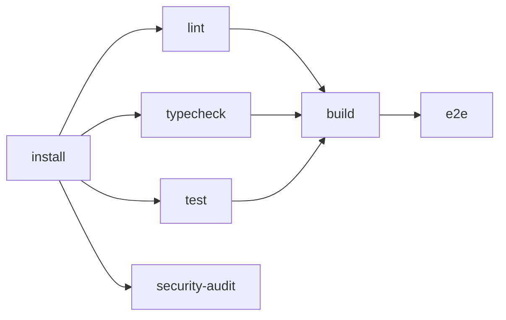

# CI/CD — GitHub Actions pipeline

> Cieľový CI provider: **GitHub Actions** (default — repo je `Spigotek/SDM-Rewrite`
> na GitHub). Konfig žije v `.github/workflows/`. GitLab CI variant je v sekcii
> *Alternatíva*; aktivuje sa, ak sa repo presunie na GitLab.

## Princíp — CI ≡ local

Každý CI job spúšťa **rovnaké `pnpm` skripty** ako lokálny vývojár. Žiadne CI-only
shell wrappery. Ak prejde lokálne, prejde aj v CI (a opačne — ak zlyhá CI a
nie lokál, vinník je niečo špecifické pre prostredie, nie skripty).

## Workflowy

| Súbor | Trigger | Účel |
|---|---|---|
| `ci.yml` | `pull_request`, `push` na `pipeline/**`, `main` | Hlavná validačná pipeline |
| `agent-pipeline.yml` | manual `workflow_dispatch`, schedule (voliteľné) | Beh PM CLI (Claude Agent SDK) v izolovanom runneri |
| `release.yml` | `push` tag `v*.*.*` | Build production artefaktov + GH Release |
| `pr-preview.yml` | `pull_request` | (voliteľné) — deploy preview portálu/workspace cez surge.sh / Vercel preview |
| `codeql.yml` | `push`, `schedule` weekly | GitHub native SAST |

## `.github/workflows/ci.yml`

Minimálny zelený pipeline: **5 jobov**.

```yaml
name: CI

on:
  pull_request:
    branches: [main, "pipeline/**"]
  push:
    branches: [main, "pipeline/**"]

concurrency:
  group: ${{ github.workflow }}-${{ github.ref }}
  cancel-in-progress: true

env:
  PNPM_VERSION: "9.12.0"
  NODE_VERSION: "22"

jobs:
  install:
    name: Install
    runs-on: ubuntu-latest
    outputs:
      pnpm-cache-key: ${{ steps.cache-key.outputs.value }}
    steps:
      - uses: actions/checkout@v4
      - uses: pnpm/action-setup@v4
        with:
          version: ${{ env.PNPM_VERSION }}
      - uses: actions/setup-node@v4
        with:
          node-version: ${{ env.NODE_VERSION }}
          cache: "pnpm"
      - name: Install deps
        run: pnpm install --frozen-lockfile
      - id: cache-key
        run: echo "value=${{ hashFiles('pnpm-lock.yaml') }}" >> "$GITHUB_OUTPUT"

  lint:
    name: Lint + Format
    needs: install
    runs-on: ubuntu-latest
    steps:
      - uses: actions/checkout@v4
      - uses: pnpm/action-setup@v4
        with: { version: "${{ env.PNPM_VERSION }}" }
      - uses: actions/setup-node@v4
        with: { node-version: "${{ env.NODE_VERSION }}", cache: "pnpm" }
      - run: pnpm install --frozen-lockfile
      - run: pnpm lint
      - run: pnpm format:check

  typecheck:
    name: Typecheck
    needs: install
    runs-on: ubuntu-latest
    steps:
      - uses: actions/checkout@v4
      - uses: pnpm/action-setup@v4
        with: { version: "${{ env.PNPM_VERSION }}" }
      - uses: actions/setup-node@v4
        with: { node-version: "${{ env.NODE_VERSION }}", cache: "pnpm" }
      - run: pnpm install --frozen-lockfile
      - run: pnpm typecheck

  test:
    name: Unit + Component tests
    needs: install
    runs-on: ubuntu-latest
    steps:
      - uses: actions/checkout@v4
      - uses: pnpm/action-setup@v4
        with: { version: "${{ env.PNPM_VERSION }}" }
      - uses: actions/setup-node@v4
        with: { node-version: "${{ env.NODE_VERSION }}", cache: "pnpm" }
      - run: pnpm install --frozen-lockfile
      - run: pnpm test -- --coverage
      - uses: actions/upload-artifact@v4
        if: always()
        with:
          name: coverage
          path: "**/coverage/**"
          retention-days: 7

  build:
    name: Build all
    needs: [lint, typecheck, test]
    runs-on: ubuntu-latest
    steps:
      - uses: actions/checkout@v4
      - uses: pnpm/action-setup@v4
        with: { version: "${{ env.PNPM_VERSION }}" }
      - uses: actions/setup-node@v4
        with: { node-version: "${{ env.NODE_VERSION }}", cache: "pnpm" }
      - run: pnpm install --frozen-lockfile
      - run: pnpm build
      - uses: actions/upload-artifact@v4
        with:
          name: dist
          path: |
            apps/portal/dist
            apps/workspace/dist
          retention-days: 14

  e2e:
    name: E2E (Playwright)
    needs: build
    runs-on: ubuntu-latest
    steps:
      - uses: actions/checkout@v4
      - uses: pnpm/action-setup@v4
        with: { version: "${{ env.PNPM_VERSION }}" }
      - uses: actions/setup-node@v4
        with: { node-version: "${{ env.NODE_VERSION }}", cache: "pnpm" }
      - run: pnpm install --frozen-lockfile
      - run: pnpm exec playwright install --with-deps chromium
      - run: pnpm test:e2e
      - uses: actions/upload-artifact@v4
        if: failure()
        with:
          name: playwright-report
          path: playwright-report/
          retention-days: 14

  security-audit:
    name: Security audit
    needs: install
    runs-on: ubuntu-latest
    steps:
      - uses: actions/checkout@v4
      - uses: pnpm/action-setup@v4
        with: { version: "${{ env.PNPM_VERSION }}" }
      - uses: actions/setup-node@v4
        with: { node-version: "${{ env.NODE_VERSION }}", cache: "pnpm" }
      - run: pnpm install --frozen-lockfile
      - name: pnpm audit (production deps only)
        run: pnpm audit --prod --audit-level=high
        continue-on-error: false
      - name: Trufflehog secret scan
        uses: trufflesecurity/trufflehog@main
        with:
          path: ./
          base: ${{ github.event.pull_request.base.sha || github.event.before }}
          head: HEAD
          extra_args: --only-verified
```

Job graf:



## `.github/workflows/codeql.yml`

```yaml
name: CodeQL

on:
  push:
    branches: [main]
  pull_request:
    branches: [main]
  schedule:
    - cron: "0 4 * * 1"

jobs:
  analyze:
    runs-on: ubuntu-latest
    permissions:
      security-events: write
    strategy:
      matrix:
        language: ["javascript-typescript"]
    steps:
      - uses: actions/checkout@v4
      - uses: github/codeql-action/init@v3
        with: { languages: "${{ matrix.language }}" }
      - uses: github/codeql-action/analyze@v3
```

## `.github/workflows/agent-pipeline.yml`

Manuálny / scheduled beh PM CLI (Claude Agent SDK) v izolovanom runneri.
Predpokladá `ANTHROPIC_API_KEY` v repo secrets.

```yaml
name: Agent Pipeline

on:
  workflow_dispatch:
    inputs:
      only:
        description: "Comma-separated agent IDs (e.g. 01,04). Empty = all."
        required: false
      max_iterations:
        description: "Refinement max iterations"
        default: "5"

jobs:
  pipeline:
    runs-on: ubuntu-latest
    timeout-minutes: 360
    permissions:
      contents: write
      pull-requests: write
    env:
      ANTHROPIC_API_KEY: ${{ secrets.ANTHROPIC_API_KEY }}
    steps:
      - uses: actions/checkout@v4
        with: { fetch-depth: 0, persist-credentials: true }
      - uses: pnpm/action-setup@v4
        with: { version: "9.12.0" }
      - uses: actions/setup-node@v4
        with: { node-version: "22", cache: "pnpm" }
      - run: pnpm install --frozen-lockfile
      - name: Run PM pipeline
        run: |
          ARGS=""
          if [ -n "${{ inputs.only }}" ]; then ARGS="$ARGS --only ${{ inputs.only }}"; fi
          if [ -n "${{ inputs.max_iterations }}" ]; then ARGS="$ARGS --max-iterations ${{ inputs.max_iterations }}"; fi
          pnpm pm pipeline $ARGS
      - name: Upload run artifacts
        if: always()
        uses: actions/upload-artifact@v4
        with:
          name: pipeline-run-${{ github.run_id }}
          path: .agents/runs/
          retention-days: 30
```

## `.github/workflows/release.yml`

Tag `vX.Y.Z` → build prod artefaktov + GH Release s zip-mi.

```yaml
name: Release

on:
  push:
    tags: ["v*.*.*"]

permissions:
  contents: write

jobs:
  release:
    runs-on: ubuntu-latest
    steps:
      - uses: actions/checkout@v4
      - uses: pnpm/action-setup@v4
        with: { version: "9.12.0" }
      - uses: actions/setup-node@v4
        with: { node-version: "22", cache: "pnpm" }
      - run: pnpm install --frozen-lockfile
      - run: pnpm build
      - name: Package artefacts
        run: |
          mkdir -p release
          (cd apps/portal/dist && zip -r ../../../release/portal-${{ github.ref_name }}.zip .)
          (cd apps/workspace/dist && zip -r ../../../release/workspace-${{ github.ref_name }}.zip .)
      - uses: softprops/action-gh-release@v2
        with:
          files: release/*.zip
          generate_release_notes: true
```

## Branch protection — server-side reinforcement

Jednorazový setup (admin rights nutné):

```bash
gh api -X PUT repos/Spigotek/SDM-Rewrite/branches/main/protection \
  -F required_pull_request_reviews.required_approving_review_count=1 \
  -F enforce_admins=false \
  -F required_status_checks.strict=true \
  -F 'required_status_checks.contexts[]=Lint + Format' \
  -F 'required_status_checks.contexts[]=Typecheck' \
  -F 'required_status_checks.contexts[]=Unit + Component tests' \
  -F 'required_status_checks.contexts[]=Build all' \
  -F 'required_status_checks.contexts[]=Security audit' \
  -F restrictions=null
```

PR môže byť merged do `main` **iba ak**:

1. Aspoň 1 approving review.
2. Všetkých 5 status checks zelených.
3. Branch up-to-date s `main` (strict).

## Secrets — GitHub Actions

| Secret | Použitie | Vlastník |
|---|---|---|
| `ANTHROPIC_API_KEY` | `agent-pipeline.yml` — PM CLI beh | DevOps |
| `SENTRY_AUTH_TOKEN` | (voliteľné) — upload source maps v `release.yml` | DevOps |
| `GITHUB_TOKEN` | Auto-poskytuje GH | Platform |

Žiadne secrets v `.env.example`, v repe ani v logoch (Trufflehog scan v `security-audit` to vynucuje).

## Caching stratégia

| Cache | Kľúč | Účinok |
|---|---|---|
| pnpm store | `pnpm-lock.yaml` hash (`actions/setup-node` cache=pnpm) | Skok 3 min → 30 s |
| Vite cache | nie je v CI — vždy fresh build | — |
| TS incremental | `.tsbuildinfo` — nie v CI cache (vždy clean typecheck) | — |
| Playwright browsers | `~/.cache/ms-playwright`, kľúč Playwright version | Skok 90 s → 5 s |

Pridať Playwright cache:

```yaml
- uses: actions/cache@v4
  with:
    path: ~/.cache/ms-playwright
    key: playwright-${{ runner.os }}-${{ hashFiles('**/pnpm-lock.yaml') }}
```

## Alternatíva — GitLab CI (`.gitlab-ci.yml`)

Ak sa repo presunie na GitLab, tu je ekvivalentný pipeline kostry:

```yaml
stages: [install, validate, build, e2e, security]

variables:
  PNPM_VERSION: "9.12.0"
  NODE_VERSION: "22"

default:
  image: node:22-alpine
  before_script:
    - corepack enable
    - corepack prepare pnpm@${PNPM_VERSION} --activate
    - pnpm install --frozen-lockfile
  cache:
    key:
      files: [pnpm-lock.yaml]
    paths: [.pnpm-store]

lint:
  stage: validate
  script: [pnpm lint, pnpm format:check]

typecheck:
  stage: validate
  script: [pnpm typecheck]

test:
  stage: validate
  script: [pnpm test -- --coverage]
  artifacts:
    paths: ["**/coverage/**"]
    expire_in: 7 days

build:
  stage: build
  needs: [lint, typecheck, test]
  script: [pnpm build]
  artifacts:
    paths: [apps/portal/dist, apps/workspace/dist]
    expire_in: 14 days

e2e:
  stage: e2e
  needs: [build]
  image: mcr.microsoft.com/playwright:v1.49.0-jammy
  script:
    - pnpm install --frozen-lockfile
    - pnpm test:e2e
  artifacts:
    when: on_failure
    paths: [playwright-report/]

security_audit:
  stage: security
  script:
    - pnpm audit --prod --audit-level=high
```

## Performance budget

| Job | Cieľ | Tvrdý limit (failure) |
|---|---|---|
| `install` | < 90 s | 300 s |
| `lint` | < 60 s | 180 s |
| `typecheck` | < 90 s | 300 s |
| `test` (unit) | < 180 s | 600 s |
| `build` | < 180 s | 600 s |
| `e2e` | < 240 s | 900 s |
| `security-audit` | < 60 s | 180 s |

Cieľ end-to-end PR pipeline: **< 8 minút** typicky.

## Otvorené závislosti

- `[06-tech-stack-selector]` Pipeline matrix predpokladá single-stack (TS + Vite). Ak 06 zvolí mixed stack (napr. Angular pre workspace, React pre portal), pridajú sa per-app build joby.
- `[09-qa-test-strategy]` E2E job spúšťa `pnpm test:e2e` na predpokladanej Playwright konfigurácii. Flag → 09 ak vyžaduje Cypress / iné. Coverage threshold v `test` jobe nie je vynútený (TBD: 80 % statements). Re-validovať po Phase B.
- `[05-security]` Security-audit job spúšťa `pnpm audit --audit-level=high` + Trufflehog. Flag → 05 ak threat model vyžaduje aj SAST (Semgrep / SonarCloud) alebo SCA (Snyk). CodeQL ako default GH SAST je už zapnutý.
- `[04-architecture]` `release.yml` predpokladá single SPA-zip per app. Ak Architecture rozhodne o Docker images / SBOM, `release.yml` sa rozšíri o `docker buildx` + `cyclonedx-bom` step.
- `[?]` Hosting CI runner — default GH-hosted. Pre on-prem (samohostiteľný GitLab runner) sa images zmenia (`image: node:22-alpine` u GH actions v default ubuntu-latest container nie je potrebný).
