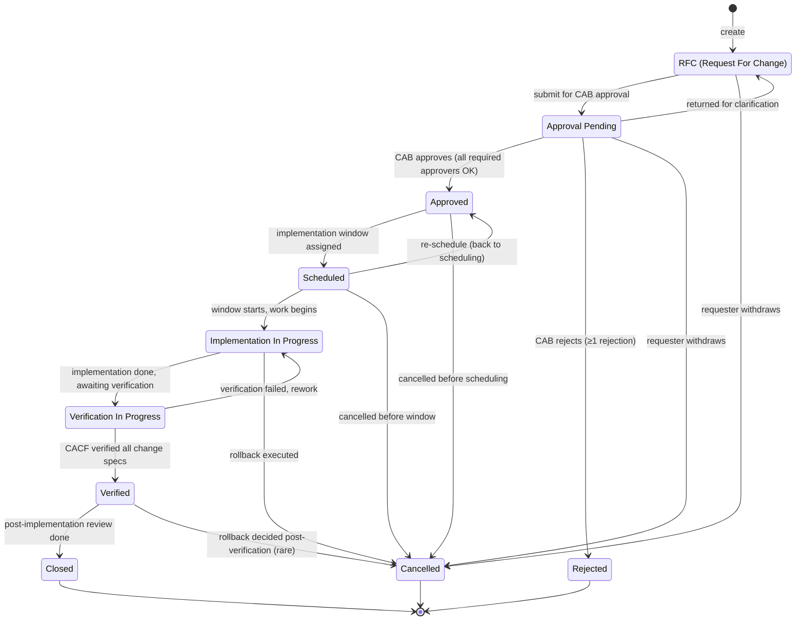
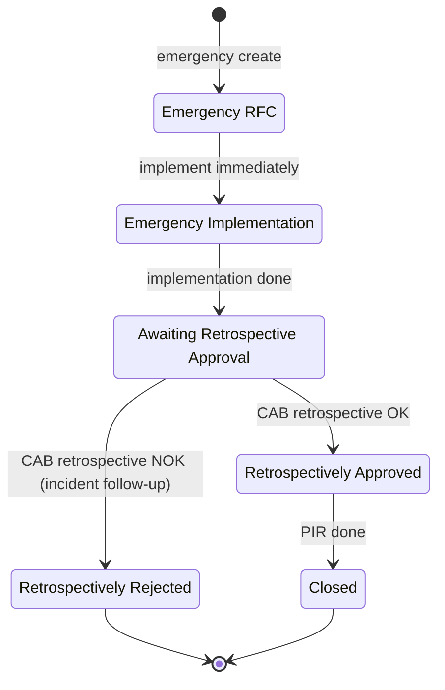

# Lifecycle — Change Order

> Zdroj: štandardný CA SDM Change Management workflow. PDF s. 2511 (Change
> Verification) potvrdzuje stavy `RFC` (Request for Change), `Verification in
> Progress`, `Closed`. Implementácia + approval sú odvodené z bežnej CA SDM
> default konfigurácie.
>
> **MVP scope** (GOAL §3): read + základný approval flow. Verification flow
> (CACF) je v scope iba na čítanie — nie editácia change specifications.

## State machine — normal change

## State machine — emergency change (overlay)

Emergency change preskočí pre-implementation CAB approval, ale **vyžaduje
retrospective approval**:

## State semantics a permissions

| Stav | Význam | Kto smie prejsť ďalej | UI hint |
|---|---|---|---|
| `RFC` | Návrh change-u, ešte neodoslaný na approval. | requester, `CHANGE_MANAGER` | Editovateľný, badge "draft". |
| `APPR_PENDING` | Čaká na rozhodnutia approverov v CabApproval[]. | designated approvers (CAB) | Badge "approval pending", per-approver progress. |
| `APPROVED` | Všetci approveri OK, čaká na scheduling. | `CHANGE_MANAGER` | Badge "approved". |
| `SCHEDULED` | Implementačný window pridelený. | assignee | Calendar badge. SLA timer beží od `scheduledStartAt`. |
| `IN_PROGRESS` | Aktuálne sa implementuje. | assignee | Live indikátor (live status). |
| `VERIFICATION_IN_PROGRESS` | CACF beží na affected CIs. CMDB porovnáva discovery vs. change specs. | assignee, `CONFIG_ANALYST` | Badge "verifying". (Read-only v MVP — len ukázať status.) |
| `VERIFIED` | Verification passed. Čaká na PIR (post-implementation review). | `CHANGE_MANAGER` | Badge "verified". |
| `REJECTED` | CAB zamietol. Terminálny. | – | Reject reasons visible. |
| `CL` | Closed po PIR. | – | Greyed. |
| `CD` | Cancelled v ktorejkoľvek fáze pred CL. | – | Greyed, cancellation reason. |

## CabApproval semantics

`Change.cabApprovers : CabApproval[]` — slabá entita pod Change.

- Pri `RFC → APPR_PENDING` sa generuje pole `cabApprovers` (z policy / org
  hierarchy), všetci s `decision = "PENDING"`.
- `Change.approvalState` (UI computed):
  - `"PENDING"` ak ≥1 `decision === "PENDING"`,
  - `"APPROVED"` ak `∀ decision === "APPROVED"`,
  - `"REJECTED"` ak `∃ decision === "REJECTED"` (jediné NOK = celkové rejection).
- **Paralelný approval** (default): všetci approveri rozhodujú nezávisle.
- **Sériový approval** (per-policy): nasledujúci approver vidí change až po
  rozhodnutí predošlého. (Post-MVP.)

## Mandatory side-effects on transitions

| Transition | Vyžadované polia / akcie |
|---|---|
| `RFC → APPR_PENDING` | `summary`, `description`, `risk`, `affectedCiIds` (aspoň 1), `cabApprovers` resolved. |
| `APPR_PENDING → APPROVED` | Všetci approveri majú `decision = "APPROVED"`. |
| `APPR_PENDING → REJECTED` | Aspoň 1 approver `decision = "REJECTED"` s `comment`. |
| `APPROVED → SCHEDULED` | `scheduledStartAt`, `scheduledEndAt` (start < end). |
| `SCHEDULED → IN_PROGRESS` | `actualStartAt = now`. UI časovač. |
| `IN_PROGRESS → VERIFICATION_IN_PROGRESS` | `actualEndAt = now`, `implementationNotes`. |
| `VERIFIED → CL` | `pirNotes` (post-implementation review). |
| Akýkoľvek prechod | `ActivityLog` entry. |

## Conflict detection (UI)

Pri `APPROVED → SCHEDULED`:
- UI volá CA SDM pre overlap check (existujúce changes na rovnakých CIs v
  rovnakom časovom okne).
- Ak overlap, UI ukáže warning, nie hard block (Change Manager rozhoduje).

## Otvorené závislosti

- `[01-api-analyst]` Potvrď stav-kódy v `chg.status` field — code list je
  customizovateľný per inštancia. API musí vrátiť status code aj localized
  name.
- `[01-api-analyst]` CAB approval workflow endpoints — REST `approve`/`reject`?
  Alebo cez `chgcab` link tabuľku?
- `[01-api-analyst]` Conflict detection endpoint — existuje natívne, alebo si
  musí FE robiť client-side filter? Vplyv na UX (loading čas).
- `[01-api-analyst]` Change Specification (`chgcs`) read endpoint — pre MVP
  read-only display.
- `[05-security]` Permission matrix — `CHANGE_MANAGER` vs. requester rozsah
  editácie počas RFC stage. CACF role table (s. 2520) hovorí len o
  Modify/View/None per modul.
- `[02-ux-persona-analyst]` Calendar view (post-MVP per GOAL §3) — návrh UX
  pre conflict warning, drag-to-reschedule.
- `[?]` Emergency change retrospective approval timing — politika (do 24h
  od `EMG_IN_PROGRESS` start)? Tenant-specific?
