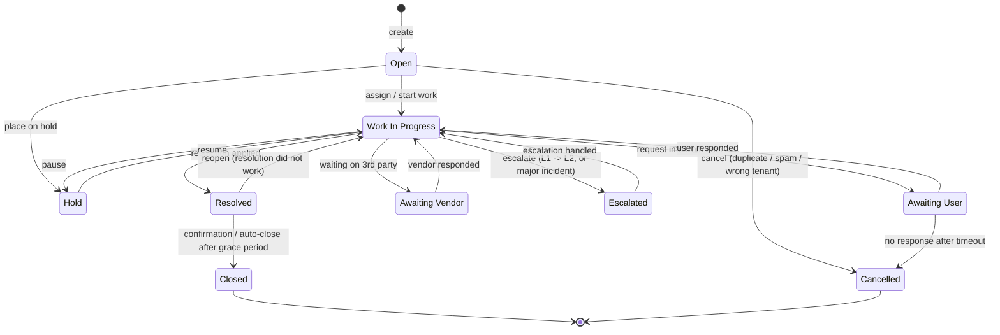

# Lifecycle — Incident

> Zdroj: CA SDM štandardné Incident statuses. PDF kapitolu Incident Status
> reference priamo necituje konkrétne kódy v jednom mieste — odvodené zo
> štandardného CA SDM Incident workflow + zmienky v `cr.status` (View_Request,
> PDF s. 2501) a CACF role matrix (s. 2520).

## State machine

## State semantics a permissions

| Stav | Význam | Kto smie prejsť ďalej | UI hint |
|---|---|---|---|
| `OP` | Práve vytvorený, neassignovaný (alebo assignovaný ale nezačatý). | `LEVEL_1_ANALYST`, `LEVEL_2_ANALYST`, `INCIDENT_MANAGER`, `SERVICE_DESK_MANAGER` | Badge "new" v queue. SLA timer beží. |
| `WIP` | Aktívna práca, assignee pracuje. | assignee + ich manažér | Default state v queue. |
| `HLD` | Pozastavený (čakanie na external blocker). SLA pause podľa policy. | assignee, manažér | Badge "on hold". |
| `AWU` | Čaká na info od affected end usera. SLA pause. | assignee. User reply ⇒ auto WIP. | Badge "awaiting user". |
| `AWV` | Čaká na vendora. SLA pause podľa policy. | assignee | Badge "awaiting vendor". |
| `ESC` | Escalated — nadriadený má rozhodnúť. | `INCIDENT_MANAGER`, `SERVICE_DESK_MANAGER` | Red badge. Notifikácia manažérovi. |
| `RES` | Resolution applied, čaká sa na potvrdenie alebo auto-close. SLA stop pre resolution time. | assignee, affected user (reopen) | Badge "resolved". |
| `CL` | Definitívne uzavretý. Read-only. | – (terminálny) | Greyed out. |
| `CD` | Cancelled (nikdy nebol legitímny). Read-only. | – (terminálny) | Greyed out, "cancelled" reason visible. |

## Mandatory side-effects on transitions

| Transition | Vyžadované polia / akcie | Vynucované kde |
|---|---|---|
| `OP → WIP` | `assigneeId` musí byť non-null. | FE form validation + BE. |
| `OP → CD` | `cancellationReason` (UI-only `string`). | FE. |
| `WIP → RES` | `resolutionDescription` (povinné, free text), `solutionUrls` voliteľné, `resolvedAt` = now. | FE form + BE timestamp. |
| `RES → CL` | `closedAt` = now. Prípadne klient potvrdí (UI confirm dialog). | BE. Auto-close cron. |
| `RES → WIP` (reopen) | `reopenReason` (UI). Counter `reopenCount++`. | FE. |
| Akýkoľvek prechod | `ActivityLog` entry s `type=status_change`, `description="<old> → <new>"`. | BE. |

## Major Incident overlays

`isMajor=true` mení správanie:
- `OP → WIP` vyžaduje **aj** `assignedGroupId`, nielen `assigneeId`.
- Notifikácia escalation chain pri každom transite.
- SLA má agresívnejší timer (FE zobrazí countdown).
- Po `RES → CL` sa automaticky vytvára `Problem` (post-incident review) — backend
  trigger; FE len zobrazí potvrdenie.

## Reopen pravidlá

- Re-open je povolený **len zo stavu `RES`**, nikdy z `CL` ani `CD`. (CA SDM
  typically zmení na `WIP`).
- Po druhom reopen UI ukáže warning a navrhne escalation.
- `CL → ?` — z business pohľadu sa robí "create related incident" namiesto
  reopen (nový ID, link cez `lrel`).

## Otvorené závislosti

- `[01-api-analyst]` Potvrď konkrétne kódy `cr.status` (3-letter codes ako `OP`,
  `WIP`, `HLD`) — sú odvodené z CA SDM defaults, ale tenant si ich môže
  customizovať (cnt.status reference table). API musí vrátiť aspoň `code` aj
  `localized name`.
- `[01-api-analyst]` Endpoint pre status transitions — REST `PATCH /in/{id}` so
  status atribútom, alebo dedicated transition endpoint? Forsuje BE povolené
  transitions, alebo to musí FE? Aktuálny diagram je heuristika.
- `[02-ux-persona-analyst]` `cancellationReason`, `resolutionDescription`,
  `reopenReason` ako UI-only povinné polia — potvrď vs. UX preferencie.
- `[05-security]` Permission matrix per stav (kto smie escalate, kto smie
  cancel) — confirma s CACF rolami.
