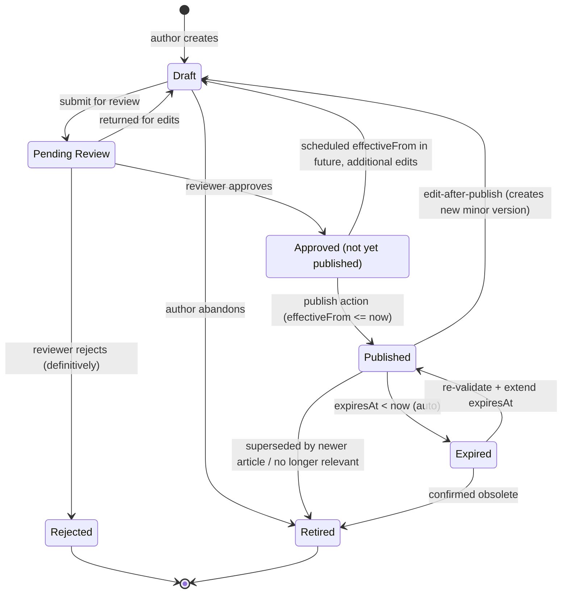

# Lifecycle — KB Article (Knowledge Document)

> Zdroj: CA SDM Knowledge Management `skeleton.STATUS_ID` field (PDF s. 3477).
> Konkrétne stavy `STATUS_ID` lookup table CA SDM nedokumentuje v PDF jednou
> kapitolou — odvodené z bežnej KM workflow konfigurácie + PDF zmienok o
> "publish", "expire", "FAQ rating".

## State machine

## State semantics a permissions

| Stav | Význam | Kto smie prejsť ďalej | UI hint |
|---|---|---|---|
| `DRAFT` | Práca v rozpracovaní. Nie je viditeľný v search pre koncových users. | author (`OWNER_ID`) | Badge "draft". Editovateľný. |
| `REVIEW` | Submitted, čaká na review. | reviewer (`ASSIGNEE_ID`) | Badge "review pending". |
| `APPROVED` | Reviewer OK, ešte nepublikované (napr. plánované na future date). | author / publisher | Badge "approved". |
| `PUBLISHED` | Aktívne, viditeľné v search. Hits sa počítajú. | author (edit), reviewer (retire) | Default state pre konzument. |
| `EXPIRED` | `expiresAt` prešiel. Skryté pred portál usermi v search; analytici môžu vidieť s explicit filter. | KB editor | Badge "expired" (oranžový). |
| `RETIRED` | Definitívne stiahnuté. URL stále existuje pre archív; search vyfiltruje. | – (terminálny v rámci aktuálnej verzie) | Greyed. |
| `REJECTED` | Reviewer zamietol bez možnosti DRAFT → cesta cez novú verziu. | – | Greyed, rejection reason. |

## Mandatory side-effects on transitions

| Transition | Vyžadované polia / akcie |
|---|---|
| `[*] → DRAFT` | `authorId`, `ownerId`, `title`, `categoryId`. |
| `DRAFT → REVIEW` | `body` (non-empty), reviewer assigned (`assigneeId`). |
| `REVIEW → APPROVED` | `reviewedAt`, optional `reviewerComment`. |
| `APPROVED → PUBLISHED` | `effectiveFrom <= now`, `expiresAt > effectiveFrom` ak nastavené. |
| `PUBLISHED → EXPIRED` | auto-trigger keď `expiresAt < now`. |
| `* → DRAFT` (z PUBLISHED) | Vytvoriť **novú verziu** — nový `KbArticle` so vzťahom `previousVersionId` na predchádzajúci. Pôvodný ostáva PUBLISHED, nový začína DRAFT. **Verzia 1 forsuje branch logic — UI nemení status pôvodného článku, robí copy-on-edit.** |
| `EXPIRED → PUBLISHED` (re-validate) | Aktualizovať `expiresAt` na future, increment `lastModifiedAt`. |
| Akýkoľvek prechod | `ActivityLog` entry pod KB. |

## FAQ rating loop (PDF s. 3477)

`skeleton.BU_RESULT` (FAQ rating), `HITS`, `ACCEPTED_HITS` sa updatujú:
- `HITS++` pri každom prečítaní (back-end automaticky).
- `ACCEPTED_HITS++` keď user klikne "this article helped me" (UI feedback widget).
- `BU_RESULT` = `ACCEPTED_HITS / HITS` (computed v BE).
- UI ukáže rating ako 5-star alebo percent.
- KB s `BU_RESULT < 0.3` po N hits flagne reviewer (UI reporting view, post-MVP).

## Search visibility pravidlá

Search results filter (per role):

| Role | Vidí v search |
|---|---|
| Portal user (žiadateľ) | iba `PUBLISHED` s `effectiveFrom <= now < expiresAt` |
| Analytik (workspace) | `PUBLISHED`, `EXPIRED`, `APPROVED`, `DRAFT` (vlastné), `REVIEW` (priradené ako reviewer) |
| KB editor / SME | všetko okrem `RETIRED` (a vidí aj `RETIRED` cez explicit filter) |

## Otvorené závislosti

- `[01-api-analyst]` Potvrď konkrétne `STATUS_ID` enum hodnoty v CA SDM pre KB.
  PDF (s. 3477) ich nemenuje — sú lookup table customizable per inštancia.
- `[01-api-analyst]` Versioning — má CA SDM `skeleton` natívny version chain
  (`previousVersionId` field), alebo si to FE rieši cez metadata?
- `[01-api-analyst]` Search endpoint pre KM — `faq()` (PDF s. 3477) a `search()`
  (s. 3478) sú legacy SOAP. Aký je REST equivalent? Index full-textu?
- `[05-security]` Per-tenant + per-role visibility v search — pri SaaS
  multi-tenant musí mať FE alebo BE mechanizmus aby žiadny user nedostal
  KB článok z iného tenantu. Aktuálny model: BE filter cez `cr.tenant`.
- `[02-ux-persona-analyst]` "this article helped me" feedback widget — UX
  layout v ticket detail view (`solutionUrls`).
- `[?]` Multi-language KB — GOAL §5 hovorí SK + EN. Má KB článok dvojicu
  obsahov (`bodySK`, `bodyEN`), alebo sa tvoria samostatné articles per
  jazyk a linkujú cez `linkedTranslationId`? Aktuálny model: jednojazyčný
  per article + translation link (post-MVP).
