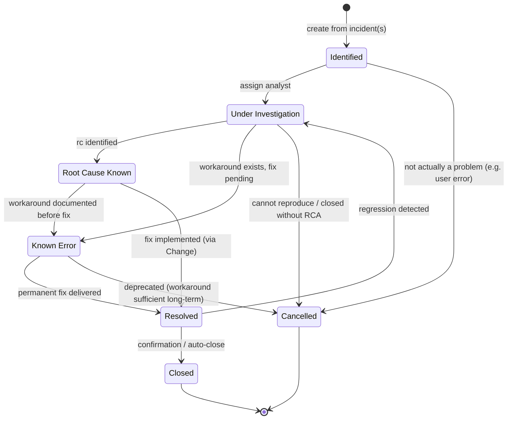

# Lifecycle — Problem

> CA SDM štandardný Problem Management workflow. Problem je root-cause
> investigation container nad jedným alebo viacerými incidentmi.

## State machine

## State semantics a permissions

| Stav | Význam | Kto smie prejsť ďalej | UI hint |
|---|---|---|---|
| `IDENTIFIED` | Problem práve vytvorený, čaká na assignment problem managerovi. | `PROBLEM_MANAGER`, `LEVEL_2_ANALYST` | Badge "identified". |
| `INVESTIGATION` | Aktívna RCA. Linkujú sa nové incidenty. | assignee | Default state v Problem queue. |
| `ROOT_CAUSE_KNOWN` | RC identifikovaný, ešte bez workaround / fix. | assignee | Badge "RC known". |
| `KNOWN_ERROR` | Workaround zdokumentovaný (`linkedKbArticleIds` ≥ 1). UI ukáže workaround prominentne. | assignee | Badge "known error" (modrá). |
| `RESOLVED` | Permanentný fix nasadený (cez linkovaný `Change`). Čaká sa na potvrdenie. | assignee, problem manager | Badge "resolved". |
| `CL` | Zatvorený, fix verified. Read-only. | – | Greyed. |
| `CD` | Cancelled (false positive, nie problem). | – | Greyed, cancellation reason visible. |

## Mandatory side-effects on transitions

| Transition | Vyžadované polia / akcie |
|---|---|
| `IDENTIFIED → INVESTIGATION` | `assigneeId` non-null. |
| `INVESTIGATION → ROOT_CAUSE_KNOWN` | `rootCause` (povinný free text). |
| `* → KNOWN_ERROR` | aspoň 1 `linkedKbArticleIds` s `docTypeId="Workaround"` alebo `"KnownError"`. **FE-vynucované** (BE to nepresadzuje). |
| `KNOWN_ERROR → RESOLVED` / `ROOT_CAUSE_KNOWN → RESOLVED` | aspoň 1 `linkedChangeIds` so stavom v `{IMPLEMENTED, VERIFIED, CLOSED}`. **FE-vynucované**. |
| `RESOLVED → CL` | `closedAt = now`. Auto-close po N dňoch alebo manual confirmation. |
| `RESOLVED → INVESTIGATION` (regression) | `regressionReason`. |
| Akýkoľvek prechod | `ActivityLog` entry. |

## Linkovanie Incident → Problem

- Z Incident detail-view smie analyst pridať link na existujúci Problem alebo
  vytvoriť nový (CTA "Open as Problem").
- Pri `INVESTIGATION` stave problému notifikácia novým incidentom v cluster
  (UI ukáže "Affected by this Problem: 12 incidents" agregát).
- Po `Problem → RESOLVED → CL` sa všetky linkované incidenty (tie, ktoré sú
  ešte v `RES`/`CL`) **neukončujú automaticky** — incidenty majú vlastný
  lifecycle. UI len ukáže "Problem closed" badge.

## Otvorené závislosti

- `[01-api-analyst]` Potvrď, ako CA SDM rozlišuje Problem vs. Incident v `cr.*`
  tabuľke — discriminator `cr.type = "P"`? Či dedicated factory `iss`?
- `[01-api-analyst]` Endpoint pre linkovanie Incident → Problem (REST?
  `lrel` link tabuľka).
- `[02-ux-persona-analyst]` Persona "Problem Manager" — workflow a UX
  očakávania pri RCA. Aktuálny stavový stroj je heuristika.
- `[?]` `KNOWN_ERROR` v ITIL terminológii má aj formálny KEDB (Known Error
  Database) — máme ho modelovať ako KbArticle s typom `KnownError`, alebo
  samostatne? Aktuálne predpokladám re-use KbArticle.
