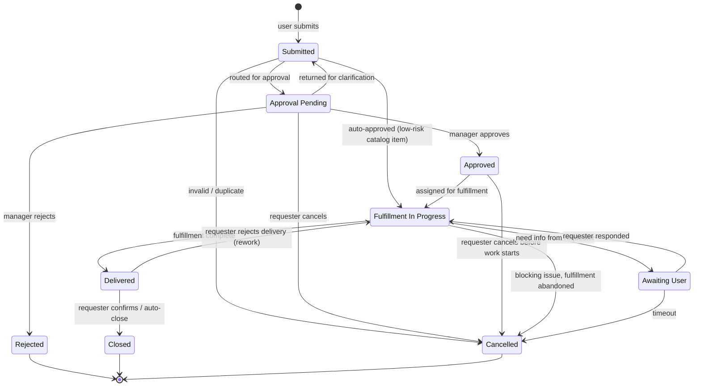

# Lifecycle — Request (Service Request)

> Service Request je objednávka služby, nie incident. CA SDM ho ukladá do
> rovnakej `cr.*` tabuľky (s. 4026 `Request (USM Type)`), ale lifecycle je
> orientovaný na **fulfillment** (schvaľovanie + realizácia), nie na
> recovery. Stavy sú odvodené z bežného CA SDM Service Catalog workflow.

## State machine

## State semantics a permissions

| Stav | Význam | Kto smie prejsť ďalej | UI hint |
|---|---|---|---|
| `SUBMITTED` | Práve odoslaný z portálu, čaká sa na routing. | systém (auto-route) alebo `LEVEL_1_ANALYST` | Badge "submitted". |
| `APPR_PENDING` | Čaká na schválenie manažéra. | designated approver (z org hierarchy) | Badge "approval pending", approver tile. |
| `APPROVED` | Schválené, čaká na fulfillment assignment. | `LEVEL_1_ANALYST`, fulfillment skupina | Badge "approved". |
| `REJECTED` | Manažér zamietol. Terminálny stav (žiada sa nový). | – | Greyed, reject reason visible. |
| `IN_PROGRESS` | Fulfillment skupina pracuje. | assignee | Default state v fulfillment queue. |
| `AWU` | Čaká na requester input. SLA pause. | assignee | Badge "awaiting requester". |
| `DELIVERED` | Hotovo, čaká sa na confirmation. | requester (cez portál) | Badge "delivered, please confirm". |
| `CL` | Closed po confirmation alebo auto-close. | – (terminálny) | Greyed, history visible. |
| `CD` | Cancelled (akékoľvek dôvody). | – (terminálny) | Greyed, cancellation reason visible. |

## Auto-approval pravidlá

Service Catalog položka môže mať `autoApprove=true` flag (napr. password reset,
nový email distribution list). Také requesty preskočia `APPR_PENDING` priamo
z `SUBMITTED → IN_PROGRESS`. UI nezobrazí approval kroky pre takéto položky.

## Mandatory side-effects on transitions

| Transition | Vyžadované polia / akcie |
|---|---|
| `SUBMITTED → APPR_PENDING` | `approverId` (resolved z org hierarchy alebo catalog item config). |
| `APPR_PENDING → APPROVED` | `approverDecisionAt = now`, optional `approvalComment`. |
| `APPR_PENDING → REJECTED` | `rejectionReason` (povinné). |
| `APPROVED → IN_PROGRESS` | `assigneeId` (alebo `assignedGroupId`). |
| `IN_PROGRESS → DELIVERED` | `deliveryNotes` (free text). |
| `DELIVERED → CL` | `closedAt = now`. Auto po N dňoch (catalog policy). |
| `DELIVERED → IN_PROGRESS` (rework) | `rejectionReason`. Counter `reworkCount++`. |
| Akýkoľvek prechod | `ActivityLog` entry. |

## Cancellation pravidlá

- Requester smie cancel zo `SUBMITTED`, `APPR_PENDING`, `APPROVED`. Po
  `IN_PROGRESS` musí kontaktovať fulfillment team — UI ukáže "contact assignee"
  CTA namiesto cancel button.
- Analytik smie cancel z ktoréhokoľvek non-terminálneho stavu, **musí** vyplniť
  `cancellationReason`.

## Otvorené závislosti

- `[01-api-analyst]` Potvrď, či CA SDM Service Catalog má dedikované REST
  endpoints alebo používa generický `cr.*` s `cr.type = "R"` + dynamické
  custom fields. Aktuálny model predpokladá samostatný typ s `formData`
  field na catalog-specific JSON.
- `[01-api-analyst]` Approval workflow — REST API v.s. SOAP. Endpoint
  `approve`/`reject`? Multi-step approval (sériový vs. paralelný)?
- `[02-ux-persona-analyst]` UX persona "žiadateľ" má cancellation v ktorých
  stavoch? Aktuálny model dovoľuje len pred IN_PROGRESS.
- `[?]` Auto-approval policy — zdroj pravdy je catalog item config alebo
  global policy? Vplyv na FE catalog management UI (post-MVP per GOAL §3).
