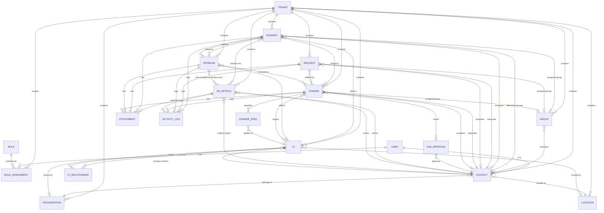

# Vzťahy medzi agregátmi

## ER prehľad — identita, tenancy, business agregáty

## Inter-aggregate vzťahy — sémantika

| Zdroj | Vzťah | Cieľ | Kardinalita | Pravidlo |
|---|---|---|---|---|
| `Tenant` | scopes | `*` (všetky business entity) | 1:n | Každá business entita **musí** niesť `tenantId`. |
| `User` | has | `Role` cez `RoleAssignment` | n:n s ternárnym tenantom | Per (user, tenant) môže byť n rolí. |
| `User` | is-a | `Contact` | 1:1 | `User.id == Contact.id` (CA SDM `cnt.userid != null` ⇒ user). |
| `Group` | members | `Contact` | n:n | `View_Group_To_Contact` (PDF s. 2501). |
| `Incident` | affected-end-user | `Contact` | n:1 | `cr.customer`. Required. |
| `Incident` | assignee | `Contact` | n:0..1 | `cr.assignee`. |
| `Incident` | assigned-group | `Group` | n:0..1 | `cr.group`. |
| `Incident` | affects | `Ci` | n:0..1 | `cr.affected_resource`. |
| `Incident` | linked-to | `Problem` | n:n | `lrel`. Problem agreguje incidenty pre root cause. |
| `Incident` | linked-to | `Change` | n:n | `lrel_supports` — change vyrieši incident. |
| `Incident` | solution-via | `KbArticle` | n:n | `soln_log`. |
| `Request` | requester | `Contact` | n:1 | `cr.customer`. |
| `Request` | fulfilled-by | `Change` | n:0..n | Request niekedy spustí change pre fulfillment. |
| `Problem` | explains | `Incident` | 1:n (povinne ≥1) | Best-practice ITIL. |
| `Problem` | resolved-by | `Change` | n:n | Implementačný change pre opravu root cause. |
| `Problem` | documented-as-known-error | `KbArticle` | 1:0..n | KB článok typu `KnownError` / `Workaround`. |
| `Change` | targets | `Ci` | n:n | `lrel_chg_ci`. |
| `Change` | needs | `CabApproval` | 1:n | Per-approver decision. Slabá entita. |
| `Change` | specifies | `ChangeSpecification` | 1:n | Slabá entita (post-MVP read-only). |
| `KbArticle` | author / owner / subject-expert | `Contact` | n:1 / n:1 / n:0..1 | `skeleton.AUTHOR_ID`, `OWNER_ID`, `SUBJECT_EXPERT_ID`. |
| `KbArticle` | attached | `Attachment` | 1:n |  |
| `Ci` | source / target | `CIRelationship` | 1:n / 1:n | `lrel_asset_chgnr`. Smer typu. |
| `*Ticket*` | logs | `ActivityLog` | 1:n | View_*_Act_Log. |
| `*Ticket*` | has | `Attachment` | 1:n | `attmnt`. |

## Hot-path traversals

UI-jourrney → potrebné join paths (driver pre UI views):

| Use case | Aggregate root | Required joins |
|---|---|---|
| Workspace queue (otvorené incidenty) | `Incident[]` | + `assignee.fullName`, `group.name`, denormalized SLA, lastActivity |
| Incident detail | `Incident` | + `affectedEndUser`, `assignee`, `group`, `linkedProblems`, `linkedChanges`, `linkedKb`, `attachments`, `activityLog[]` |
| Problem RCA view | `Problem` | + `linkedIncidents[]`, `linkedChanges[]`, `linkedKb[]` |
| Change calendar | `Change[]` | filter by `scheduledStartAt` window, + `affectedCis[]`, `requester` |
| KB search | `KbArticle[]` | full-text + category filter, snippet, hits, relevance |
| CI detail | `Ci` | + `relationships[]`, `location`, `primaryContact`, `linkedTickets[]` |
| Tenant switch | `Tenant[]` | derived z `User.roleAssignments` |

## Tenant scope ako prierezový invariant

Žiadny vzťah **nesmie** prejsť cez tenant boundary, **s výnimkou**:

1. `User → RoleAssignment → Tenant` — používateľ má viac tenantov.
2. `Tenant.superTenantId → Tenant` — hierarchia.

Všetky ostatné vzťahy musia mať `source.tenantId == target.tenantId`. UI to
**nepresadzuje aktívne** (BE je zdroj pravdy), ale **detekuje porušenie**:
ak data fetch vráti related objekt z iného tenantu, klient ho:
- zaloguje ako sentry warning (data integrity issue),
- v zozname filtruje preč,
- v detail-view ho zobrazí so značkou `cross-tenant` (ak má user rolu v cieľovom
  tenante, inak placeholder `<inaccessible>`).

## Otvorené závislosti

- `[01-api-analyst]` Potvrď, či CA SDM REST API v relationship endpointoch
  (`/caisd-rest/lrel*`, `/caisd-rest/in/{id}/related`) poskytuje **expanded**
  payload (s denormalizovanými poľami assignee.fullName, group.name) alebo
  len IDs. Hot-path traversals dimenzujú UI cache stratégiu.
- `[01-api-analyst]` Schéma `lrel*` (link tabuľky) — typ vzťahu medzi
  `Incident–Problem`, `Incident–Change`, `Problem–Change` nemusí byť
  diferencovaný. Ak áno, `linkType` v UI prezentácii je dôležitý.
- `[04-architecture]` Tenant switch — full cache flush vs. tenant-keyed cache.
  Aktuálny model predpokladá full flush.
- `[05-security]` Cross-tenant detection logika — má UI takéto prípady tichne
  filtrovať, alebo eskalovať ako security incident? GOAL §5 hovorí o GDPR-aware,
  ale nešpecifikuje response na cross-tenant data leak.
- `[02-ux-persona-analyst]` Hot-path traversals tabuľka je heuristická; potvrď
  prioritu UI views pre MVP (queue, ticket detail, KB search sú jasné; CI
  detail s relationships môže byť v1).
