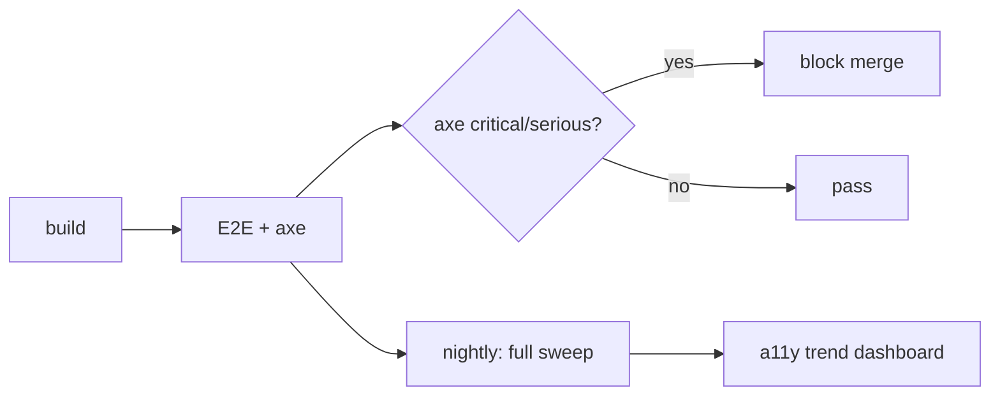

# Accessibility (a11y) Test Plan — SDM-Rewrite

## Changelog (round 2)

- Pridaná nová sekcia **§3.4 Keyboard shortcut SR manual test protocol** ktorá
  referencuje 07 r2 keyboard shortcut map z `design-system/a11y.md` G-02 +
  `components.md` (KeyboardShortcutHint, CommandPalette, DataTable hot-keys,
  TenantSwitcher `T`, ActionBar shortcuts, `?` overlay).
- Per-shortcut SR test: každá globálna alebo per-scope skratka musí mať manual
  screen reader test, ktorý overí: (a) shortcut sa neaktivuje keď je focus
  v `<input>` / `<textarea>` (per WCAG 2.1.4 Character Key Shortcuts —
  `useHotkeys` filter na `event.target.tagName`), (b) focus-trap exit fallback
  (Esc), (c) `aria-keyshortcuts` atribút sa správne anonsuje.
- Color tokens (07 r1) potvrdené WCAG AA — `a11y.md` G-05 audit per token-pair
  je zdroj pravdy; QA preberá ako vstup, nereperformuje audit.
- a11y primitive checklist §3.2 zarovnaný na 07 components.md (78 komponentov
  s a11y kontraktmi).
- Closed: 07 a11y primitive library, 07 color tokens, 07 keyboard shortcuts.
  Open: 02 SR alternative for CMDB graph view (default `<table>` fallback).

> GOAL.md §5: **WCAG 2.1 AA cieľ**. a11y testovanie je **non-negotiable**:
> serious / critical violations blokujú merge. moderate / minor sa tolerujú
> krátkodobo (max 7 dní), potom block.
>
> Stratégia kombinuje **axe-core automated audit** (rýchle, lacné, mass scale)
> + **manual checklist** (nahradí to, čo axe nedokáže) + **screen reader manual
> protocol** pre keyboard shortcuts a complex interactions.

## 1. Automated a11y testing — axe-core

### 1.1 Kde a kedy beží

| Layer | Nástroj | Frekvencia | Block merge na |
|---|---|---|---|
| **Component tests** | `vitest-axe` (per 06 r2: vitest + jest-axe wrapper) | per PR | serious + critical |
| **Integration tests** | rovnaký runner | per PR | serious + critical |
| **E2E tests** | `@axe-core/playwright@4.x` na každej `*.spec.ts` | per PR | serious + critical |
| **Nightly full sweep** | Playwright + axe na všetkých 17 routes z `performance.md` §2 | denne | serious + critical aj moderate / minor (rolling 7-day tolerance) |

### 1.2 axe konfigurácia

```ts
// tools/axe.config.ts
export const axeConfig = {
  rules: {
    // WCAG 2.1 AA defaults — všetky enabled
    "color-contrast": { enabled: true },
    "label": { enabled: true },
    "aria-roles": { enabled: true },
    "aria-required-attr": { enabled: true },
    "aria-required-children": { enabled: true },
    "aria-required-parent": { enabled: true },
    "html-has-lang": { enabled: true },
    "duplicate-id": { enabled: true },
    "image-alt": { enabled: true },
    "heading-order": { enabled: true },
    "landmark-one-main": { enabled: true },
    "page-has-heading-one": { enabled: true },
    // Disabled (manual handled):
    "frame-title": { enabled: false }, // SDM-Rewrite nepoužíva iframes (per GOAL §4)
  },
  // Standardy: WCAG 2.1 A + AA
  runOnly: ["wcag2a", "wcag2aa", "wcag21a", "wcag21aa"],
};
```

### 1.3 Severity policy

axe rule levels mapujú na blocking decisions:

| axe severity | Block merge | Action |
|---|---|---|
| `critical` | **YES (always)** | Fix v rovnakom PR |
| `serious` | **YES (always)** | Fix v rovnakom PR |
| `moderate` | warning (PR comment), block po 7 dňoch | Trackované v `a11y-debt.md`; max 7-day window |
| `minor` | warning only | Trackované v `a11y-debt.md` |

### 1.4 Per-page axe test šablóna

```ts
import { test, expect } from "@playwright/test";
import AxeBuilder from "@axe-core/playwright";

test("@a11y @scenario:portal-incident-broken-laptop a11y violations", async ({ page }) => {
  await page.goto("/new-incident");
  const results = await new AxeBuilder({ page })
    .withTags(["wcag2a", "wcag2aa", "wcag21a", "wcag21aa"])
    .analyze();
  const blocking = results.violations.filter(v => v.impact === "serious" || v.impact === "critical");
  expect(blocking).toHaveLength(0);
});
```

## 2. Manual checklist — čo axe nedokáže

axe pokrýva cca **30–40 % WCAG kritérií**. Zvyšok je manual.

### 2.1 Per-screen manual checklist

Pred **release** každého modulu (nie per PR) sa robí manual audit. Checklist
per obrazovka:

| WCAG kritérium | Kontrola | Pass / Fail |
|---|---|---|
| **1.3.1 Info & Relationships** | Skríňový nákres → hierarchia hlavičiek (h1 → h2 → h3) zodpovedá vizuálnej hierarchii. | |
| **1.4.3 Contrast (Minimum)** | Text na pozadí spĺňa 4.5:1 (16 px), 3:1 (large). axe pokrýva, manual overí dark mode + brand color combinations. Per 07 r2 `a11y.md` G-05 token-pair audit — všetky páry AA+. | |
| **1.4.10 Reflow** | Resize na 320 px width — žiadny horizontálny scroll. | |
| **1.4.11 Non-text Contrast** | Form fields, focus rings, ikon button bordery spĺňajú 3:1. | |
| **2.1.1 Keyboard** | Všetky interaktívne elementy sú dosiahnuteľné Tab/Shift+Tab. | |
| **2.1.2 No Keyboard Trap** | Modálne dialógy — Esc zatvára, focus sa vráti na trigger. | |
| **2.1.4 Character Key Shortcuts** | Single-key shortcuts (`j`, `k`, `t`, ...) sú aktívne **iba** keď focus nie je v input/textarea. Per 07 r2 implementácia `useHotkeys` filter na `event.target.tagName`. | |
| **2.4.3 Focus Order** | Tab order zodpovedá vizuálnemu poradiu. | |
| **2.4.7 Focus Visible** | Focus ring je vždy viditeľný (nie len `outline: none`). | |
| **2.5.5 Target Size** | Touch targets v portáli ≥ 44×44 px (GOAL mobile use case). | |
| **3.2.4 Consistent Identification** | "Zatvoriť" button má rovnaké label / ikon naprieč aplikáciou. | |
| **3.3.1 Error Identification** | Inline error pri form validáciou je viazaný na pole cez `aria-describedby`. | |
| **3.3.3 Error Suggestion** | Error text obsahuje **návrh opravy** (nie len "invalid"). | |
| **4.1.3 Status Messages** | Toast / status notifications majú `role="status"` alebo `aria-live="polite"`. | |

### 2.2 Screen reader testing

Per release (nie per PR):

| Tool | Kombinácia | Frekvencia |
|---|---|---|
| **NVDA + Firefox** | Windows | Per modul before release |
| **VoiceOver + Safari** | macOS | Per modul before release |
| **JAWS + Chrome** | Windows | Min 1× before MVP go-live |
| **TalkBack + Chrome** | Android (portál mobile) | Min 1× before MVP go-live |

Per persona scenario — overiť, či kompletný user journey je realizovateľný
**iba pomocou screen readera + klávesnice**. Cieľ: aspoň 3 z 18 journeys
plne otestované (portál ticketu submit, KB search, workspace queue triage).

## 3. a11y feature requirements

### 3.1 Globálne (každá stránka oboch SPA)

| Feature | Implementácia |
|---|---|
| `lang` atribút na `<html>` | Reflektuje aktívny i18n locale (sk / en). |
| `<title>` per route | Dynamic, popisuje obsah ("Incidents — Workspace"). |
| Skip-to-main-content link | Visible on focus, prvý fokusovateľný element. Per 07 r2 `a11y.md` G-03. |
| Landmark regions | `<main>`, `<nav>`, `<aside>`, `<header>`, `<footer>` semantically správne. |
| Heading hierarchy | h1 per route (jeden), h2/h3 v poriadku. |
| Color is not sole indicator | Status (red/green) + text label / ikon vždy. Per 07 r2 `a11y.md` G-04. |
| Reduced motion | `prefers-reduced-motion: reduce` rešpektovaný (žiadne autoplay animations, GSAP-style transitions s short alt). |

### 3.2 Per komponent (design-system) — zarovnané na 07 r2 components.md

Každý komponent v `packages/design-system/` musí mať implementovaný a11y
kontrakt podľa 07 r2 specifikácie. Per-component a11y testy v `vitest-axe`:

| Komponent (07) | a11y povinný feature (test target) |
|---|---|
| Button / IconButton | `<button>` element, focus ring, disabled state s `aria-disabled` |
| Link | Visible focus ring, `aria-current="page"` keď aktívny |
| TextField / TextArea | `<label for>` alebo `aria-labelledby`, `aria-invalid` + `aria-describedby` pri chybe, `aria-required` |
| Select / Combobox | Native `<select>` ak nie je custom dropdown; custom combobox = full ARIA pattern, `aria-activedescendant` |
| Checkbox / RadioGroup / Switch | Native pattern + group label |
| FileUpload | Drag-and-drop má aj browse button (keyboard alternative — per 07 a11y G-16) |
| Modal | `role="dialog"`, `aria-modal="true"`, focus trap, return focus on close, ESC support |
| Toast / Alert | `role="alert"` (assertive) alebo `role="status"` (polite) podľa severity |
| Tabs | `role="tablist"` + `role="tab"` + `aria-selected`, ←/→ arrow key navigation |
| Accordion | `aria-expanded`, `aria-controls`, native `<details>` preferred |
| Tooltip | `aria-describedby` na trigger, dismissible cez ESC |
| Breadcrumb | `<nav aria-label="Breadcrumb">`, `aria-current="page"` na last item |
| DataTable | `<table>` + `<th scope>`, sortable headers cez `aria-sort`, `aria-rowcount`, `aria-colcount`, per row `aria-rowindex`, roving tabindex |
| ListRow | `<a>` alebo `<button>` ak interactive |
| Timeline / CommentItem | `<ol role="feed">`, each item `role="article"`, `aria-posinset`, `aria-setsize`, `aria-live="polite"` pre nové items |
| Composer | `aria-label` per tab, Cmd+Enter submit dokumentovaný |
| EmptyState / ErrorState | `role="status"` alebo `role="alert"` (per severity) |
| Calendar (workspace change calendar) | Keyboard navigation (arrow keys), `aria-label` per dátum, `aria-current="date"` pre dnes |
| FilterBar | Filter chip = toggle button (`role="button"` + `aria-pressed`); filter group `role="group"` + `aria-label` |
| SearchInput | `role="searchbox"` alebo `<input type="search">`, result count cez live region |
| QueueSidebar | `<nav aria-label="Queues">`, counts v `aria-label` (`aria-label="My open queue, 6 tickets"`) |
| ContextPanel | `<aside aria-label="Kontext">`, sections `<section>` + heading |
| BulkActionBar | Live region announces "5 ticketov vybraných" |
| RelationshipGraph (CMDB graph) | **Alternatívny table view** dostupný pre screen reader users (toggle "view as table" pre interaktívny graph). Per 07 components.md + a11y.md. |
| KbEditor (WYSIWYG) | Editor má a11y label, klávesové skratky štandardné (Cmd+B bold, etc.), accessible alternative text dialog pri vkladaní obrázku. |
| TenantSwitcher | `aria-haspopup="listbox"`, `aria-expanded`, aktívny tenant `aria-current="true"`, keyboard shortcut `T` cez `aria-keyshortcuts` |
| TopBar / AppShell | `<header role="banner">`, sidebar `<nav>`, main `<main>` |
| NotificationDrawer | Trigger `aria-label="Notifications, 3 unread"` live-updated, drawer = Drawer modal |
| UserMenu | Trigger `aria-haspopup="menu"`, items `role="menuitem"`, Sign out vyžaduje confirm dialog |
| CommandPalette | Combobox pattern, `aria-activedescendant`, `Esc` close, search input auto-focus |
| Pagination | `<nav aria-label="Pagination">`, aktívna page `aria-current="page"` |
| RouteBanner | `role="status"` (info) alebo `role="alert"` (kritické) |
| KeyboardShortcutHint | Native `<kbd>` element, listed v `?` overlay cheat-sheet textovo |

### 3.3 Per modul (špecifická a11y akčná položka)

| Modul | a11y špecifikum |
|---|---|
| **Incident submit form** (portál) | Required fields jasne označené ("required" v label + `aria-required`). Error focus management — focus skočí na prvé invalid pole. |
| **Workspace queue grid** | Klávesové skratky `j/k/r/c` musia byť dostupné aj screen reader-om (cez `aria-keyshortcuts` atribút). Per 07 r2 + §3.4 nižšie. |
| **CMDB relationship graph** (SVG) | Alternatívny **table view** dostupný pre screen reader users (toggle "view as table" pre interaktívny graph). Default fallback je `<table>` pokým 02 nedoplní wireframe pre SR-only flow. |
| **Change calendar** | Mesačná tabuľka má `<th>` pre dni týždňa, dátumy navigovateľné klávesnicou. |
| **KB editor (WYSIWYG)** | Editor má a11y label, klávesové skratky štandardné (Cmd+B bold, etc.), accessible alternative text dialog pri vkladaní obrázku. |
| **Tenant switcher** | Native `<select>` alebo full combobox pattern; aktívny tenant v `aria-current`. Shortcut `T` cez `aria-keyshortcuts`. |
| **CI detail page (47 atribútov)** | Atribút sekcie sú `<details>` (native) alebo `aria-expanded` accordion. |

### 3.4 Keyboard shortcut SR manual test protocol — **nová sekcia r2**

Per 07 r2 `design-system/a11y.md` G-02 + `components.md`, workspace má
dokumentovaný keyboard shortcut map v `?` overlay:

**Globálne (app-wide):**

| Klávesa | Akcia | a11y test target |
|---|---|---|
| `Cmd+K` / `Ctrl+K` | Otvor CommandPalette | `aria-keyshortcuts="Meta+K Control+K"` na trigger |
| `T` | Otvor TenantSwitcher (toggle dropdown) | `aria-keyshortcuts="T"` na TenantSwitcher trigger |
| `?` | Otvor cheat-sheet overlay | `aria-keyshortcuts="?"` na global handler, overlay má `role="dialog"` |
| `Esc` | Zatvor modal / dropdown / overlay | Focus trap exit, return na trigger |
| `g+i` | Naviguj na Incident list | `aria-keyshortcuts="g i"` |
| `g+r` | Naviguj na Request list | `aria-keyshortcuts="g r"` |
| `g+p` | Naviguj na Problem list | `aria-keyshortcuts="g p"` |
| `g+c` | Naviguj na Change list | `aria-keyshortcuts="g c"` |
| `g+k` | Naviguj na KB list | `aria-keyshortcuts="g k"` |
| `g+m` | Naviguj na CMDB list | `aria-keyshortcuts="g m"` |

**Per-scope (queue page W-01):**

| Klávesa | Akcia | a11y test target |
|---|---|---|
| `j` / `↓` | Next row | `aria-keyshortcuts="j"` v DataTable scope |
| `k` / `↑` | Previous row | `aria-keyshortcuts="k"` v DataTable scope |
| `Enter` | Open detail | Native enter na focused row |
| `Space` | Toggle row selection | `aria-keyshortcuts="Space"` |
| `Shift+Space` | Range select | – |
| `Cmd+A` | Select all visible (confirm pri > 50) | `aria-keyshortcuts="Meta+A Control+A"` |

**Per-scope (ticket detail W-02):**

| Klávesa | Akcia | a11y test target |
|---|---|---|
| `r` | Reply (open composer) | `aria-keyshortcuts="r"` |
| `c` | Close ticket | `aria-keyshortcuts="c"`, confirm dialog |
| `e` | Escalate | `aria-keyshortcuts="e"` |
| `t` | Take | `aria-keyshortcuts="t"` |
| `[` / `]` | Prev / next ticket v queue | – |
| `Cmd+Enter` | Submit composer | `aria-keyshortcuts="Meta+Enter Control+Enter"` v composer scope |

**Per-scope (KB editor W-04):**

| Klávesa | Akcia | a11y test target |
|---|---|---|
| `Cmd+B` | Bold | Standard editor shortcut |
| `Cmd+I` | Italic | Standard editor shortcut |
| `Cmd+K` | Insert link | Standard editor shortcut (POZNÁMKA: v editor scope `Cmd+K` insert link, nie command palette — context-sensitive) |

#### 3.4.1 SR manual test protocol per shortcut

Pre **každú** skratku z mapy vyššie sa pred release vykoná manual SR test:

1. **Anonsovanie**: Otvor `?` overlay → SR (NVDA/VoiceOver/JAWS) anonsuje
   skratku + popis. Overiť, že `<kbd>` element + visible-text fallback je
   prečítaný.
2. **`aria-keyshortcuts` discovery**: Z komponentu, ktorý vlastní skratku
   (napr. TenantSwitcher), SR anonsuje "Tenant switcher, keyboard shortcut T".
3. **Filter v `<input>` / `<textarea>`**: Focus do TextField. Stlač `t`. SR
   anonsuje typed character "t" — **NE** activate-ne TenantSwitcher. Per WCAG
   2.1.4 Character Key Shortcuts + 07 r2 implementácia `useHotkeys` filter na
   `event.target.tagName`.
4. **Focus-trap exit fallback (Esc)**: Otvor modal / dropdown / overlay
   shortcut-om. Stlač Esc. Focus sa vráti na trigger. SR anonsuje return
   focus.
5. **Globálne shortcuts v scope (`g+i`, etc.)**: Stlač `g`, počkaj < 1.5 s,
   stlač `i`. Naviguj na Incident list. Ak medzi `g` a `i` uplynie > 1.5 s,
   sekvencia sa reset-ne (žiadna navigation).
6. **Modifier conflict s OS / browser**: Test, že `Cmd+K` v CommandPalette
   neprepíše OS-level shortcut (Spotlight na macOS atď.) — overené per
   07 risks R-008.

#### 3.4.2 Per-shortcut test cases v Playwright + axe

```ts
import { test, expect } from "@playwright/test";

test("@a11y @shortcut:T TenantSwitcher T shortcut", async ({ page }) => {
  await page.goto("/queue");

  // 1. Trigger má aria-keyshortcuts
  const trigger = page.locator('[data-component="tenant-switcher"]');
  await expect(trigger).toHaveAttribute("aria-keyshortcuts", "T");

  // 2. T skratka activate-ne dropdown
  await page.keyboard.press("t");
  await expect(page.locator('[role="listbox"]')).toBeVisible();

  // 3. Esc close + return focus
  await page.keyboard.press("Escape");
  await expect(page.locator('[role="listbox"]')).toBeHidden();
  await expect(trigger).toBeFocused();

  // 4. T v input focus NEaktivuje dropdown (WCAG 2.1.4)
  await page.locator('input[type="search"]').focus();
  await page.keyboard.press("t");
  await expect(page.locator('[role="listbox"]')).toBeHidden();
  // input value should contain "t"
  await expect(page.locator('input[type="search"]')).toHaveValue("t");
});
```

Pre **každú** skratku z mapy §3.4 musí existovať jeden Playwright test
(automated) + záznam v manual SR protocol (před release).

## 4. Internationalization a a11y prienik

| Aspekt | Pravidlo |
|---|---|
| `lang` atribút | Dynamic per active locale (sk / en). |
| Direction | Iba LTR (žiadne RTL languages v MVP). |
| Long-string overflow | Layouty musia tolerovať 30 % dlhšie SK strings vs. EN bez breaking — testované v component snapshot. |
| Date format | i18n locale-aware (`12.05.2026` sk vs. `5/12/2026` en). |
| Number format | Locale-aware decimal separator. |
| Form labels | Nikdy v ikone-only buttone — vždy aria-label. |
| Keyboard shortcuts | `?` overlay má i18n popisov skratiek (per 07 hot-key-i18n flag — resolved-in-round-2). |

## 5. CI integrácia

### 5.1 Pipeline stage



### 5.2 Reportovanie

| Artefakt | Lokácia |
|---|---|
| Per-test axe violations JSON | `test-results/axe/*.json` |
| Aggregated report (HTML) | `test-results/axe-report.html`, publikovaný v PR komentári |
| Trend dashboard (last 30 days, count violations per page) | DevOps-hosted (Grafana / similar) |
| `a11y-debt.md` (moderate/minor backlog) | Repo, aktualizovaný PR-om |
| Per-shortcut SR test log | `test-results/sr-shortcuts.md`, manual sign-off pred release |

## 6. Anti-patterns

- **Žiadne `aria-hidden="true"` na focusable elemente** (klasický bug zo "skry to z screen reader").
- **Žiadne hidden focus** (`outline: none` bez visible custom focus ring).
- **Žiadne `role="button"` na `<div>`** ak môže byť `<button>`.
- **Žiadne emojis ako jediný textový obsah** v interaktívnom elemente bez aria-label.
- **Žiadne `tabindex="-1"`** mimo focus trap / programatic focus use case (nie pre "hide from tab order").
- **Žiadny single-key shortcut bez `useHotkeys` filter** — WCAG 2.1.4 fail.
- **Žiadny shortcut bez `aria-keyshortcuts`** atribútu — SR users sa to nedozvedia.

## Otvorené závislosti

- `[07-design-system]` Design System a11y-tested primitív knižnica —
  `[resolved-in-round-2]` (78 komponentov s a11y kontraktmi v `components.md`).
- `[07-design-system]` Color tokens — `[resolved-in-round-2]` (token-pair
  audit AA+ per `a11y.md` G-05). Hard requirement 4.5:1 / 3:1 splnený.
- `[07-design-system]` Keyboard shortcut map — `[resolved-in-round-2]`
  (globálne + per-scope skratky v `?` overlay, `aria-keyshortcuts` per
  komponent, i18n popisov v overlay).
- `[04-architecture]` Skip-to-main-content link na úrovni layout shellu —
  `[resolved-in-round-2]` (v shared app shell `AppShell` komponente
  z 07 r2 `components.md`).
- `[02-ux-persona-analyst]` `[GAP-screen-reader-flows]` — wireframes
  neuvádzajú screen-reader-only flow alternatives (napr. CMDB graph
  table view). **Pretrváva** — QA prijíma `<table>` fallback ako default
  (per §3.3); post-conv pre 02 môže doplniť wireframe pre dedicated
  SR-only flow.
- `[09-qa]` Screen reader manual testing protocol (kto, kedy, ako reportuje
  výsledky) — protokol bude finalizovaný po prvom module before MVP.
  Self-flag pre post-conv. Default: QA owner robí pre-release SR sweep,
  reporty v `test-results/sr-shortcuts.md`.
