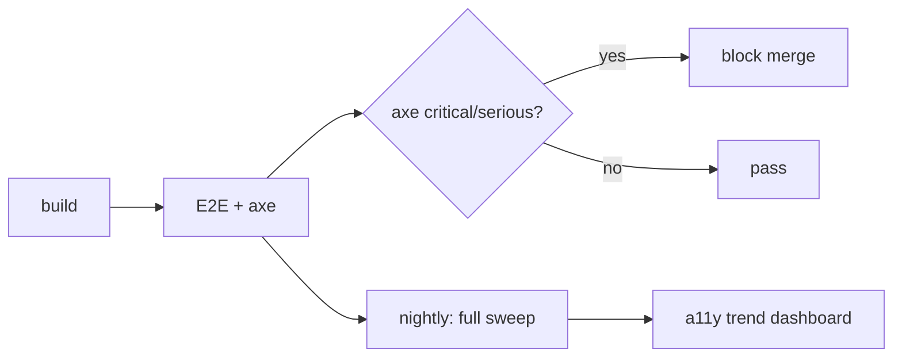

# Accessibility (a11y) Test Plan — SDM-Rewrite

> GOAL.md §5: **WCAG 2.1 AA cieľ**. a11y testovanie je **non-negotiable**:
> serious / critical violations blokujú merge. moderate / minor sa tolerujú
> krátkodobo (max 7 dní), potom block.
>
> Stratégia kombinuje **axe-core automated audit** (rýchle, lacné, mass scale)
> + **manual checklist** (nahradí to, čo axe nedokáže).

## 1. Automated a11y testing — axe-core

### 1.1 Kde a kedy beží

| Layer | Nástroj | Frekvencia | Block merge na |
|---|---|---|---|
| **Component tests** | `vitest-axe` / `jest-axe` ekv. (per voľbu 06) | per PR | serious + critical |
| **Integration tests** | rovnaký runner | per PR | serious + critical |
| **E2E tests** | `@axe-core/playwright` na každej `*.spec.ts` | per PR | serious + critical |
| **Nightly full sweep** | Playwright + axe na všetkých 17 routes z `performance.md` § 2 | denne | serious + critical aj moderate / minor (rolling 7-day tolerance) |

### 1.2 axe konfigurácia

```ts
// tools/axe.config.ts
export const axeConfig = {
  rules: {
    // WCAG 2.1 AA defaults — všetky enabled
    "color-contrast": { enabled: true },
    "label": { enabled: true },
    "aria-roles": { enabled: true },
    "aria-required-attr": { enabled: true },
    "aria-required-children": { enabled: true },
    "aria-required-parent": { enabled: true },
    "html-has-lang": { enabled: true },
    "duplicate-id": { enabled: true },
    "image-alt": { enabled: true },
    "heading-order": { enabled: true },
    "landmark-one-main": { enabled: true },
    "page-has-heading-one": { enabled: true },
    // Disabled (manual handled):
    "frame-title": { enabled: false }, // SDM-Rewrite nepoužíva iframes (per GOAL §4)
  },
  // Standardy: WCAG 2.1 A + AA
  runOnly: ["wcag2a", "wcag2aa", "wcag21a", "wcag21aa"],
};
```

### 1.3 Severity policy

axe rule levels mapujú na blocking decisions:

| axe severity | Block merge | Action |
|---|---|---|
| `critical` | **YES (always)** | Fix v rovnakom PR |
| `serious` | **YES (always)** | Fix v rovnakom PR |
| `moderate` | warning (PR comment), block po 7 dňoch | Trackované v `a11y-debt.md`; max 7-day window |
| `minor` | warning only | Trackované v `a11y-debt.md` |

### 1.4 Per-page axe test šablóna

```ts
test("@a11y @scenario:portal-incident-broken-laptop a11y violations", async ({ page }) => {
  await page.goto("/incident/new");
  await injectAxe(page);
  const violations = await checkA11y(page, null, {
    detailedReport: true,
    detailedReportOptions: { html: true },
  });
  expect(violations.filter(v => v.impact === "serious" || v.impact === "critical")).toHaveLength(0);
});
```

## 2. Manual checklist — čo axe nedokáže

axe pokrýva cca **30–40 % WCAG kritérií**. Zvyšok je manual.

### 2.1 Per-screen manual checklist

Pred **release** každého modulu (nie per PR) sa robí manual audit. Checklist
per obrazovka:

| WCAG kritérium | Kontrola | Pass / Fail |
|---|---|---|
| **1.3.1 Info & Relationships** | Skríňový nákres → hierarchia hlavičiek (h1 → h2 → h3) zodpovedá vizuálnej hierarchii. | |
| **1.4.3 Contrast (Minimum)** | Text na pozadí spĺňa 4.5:1 (16 px), 3:1 (large). axe pokrýva, manual overí dark mode + brand color combinations. | |
| **1.4.10 Reflow** | Resize na 320 px width — žiadny horizontálny scroll. | |
| **1.4.11 Non-text Contrast** | Form fields, focus rings, ikon button bordery spĺňajú 3:1. | |
| **2.1.1 Keyboard** | Všetky interaktívne elementy sú dosiahnuteľné Tab/Shift+Tab. | |
| **2.1.2 No Keyboard Trap** | Modálne dialógy — Esc zatvára, focus sa vráti na trigger. | |
| **2.4.3 Focus Order** | Tab order zodpovedá vizuálnemu poradiu. | |
| **2.4.7 Focus Visible** | Focus ring je vždy viditeľný (nie len `outline: none`). | |
| **2.5.5 Target Size** | Touch targets v portáli ≥ 44×44 px (GOAL mobile use case). | |
| **3.2.4 Consistent Identification** | "Zatvoriť" button má rovnaké label / ikon naprieč aplikáciou. | |
| **3.3.1 Error Identification** | Inline error pri form validáciou je viazaný na pole cez `aria-describedby`. | |
| **3.3.3 Error Suggestion** | Error text obsahuje **návrh opravy** (nie len "invalid"). | |
| **4.1.3 Status Messages** | Toast / status notifications majú `role="status"` alebo `aria-live="polite"`. | |

### 2.2 Screen reader testing

Per release (nie per PR):

| Tool | Kombinácia | Frekvencia |
|---|---|---|
| **NVDA + Firefox** | Windows | Per modul before release |
| **VoiceOver + Safari** | macOS | Per modul before release |
| **JAWS + Chrome** | Windows | Min 1× before MVP go-live |
| **TalkBack + Chrome** | Android (portál mobile) | Min 1× before MVP go-live |

Per persona scenario — overiť, či kompletný user journey je realizovateľný
**iba pomocou screen readera + klávesnice**. Cieľ: aspoň 3 z 18 journeys
plne otestované (portál ticketu submit, KB search, workspace queue triage).

## 3. a11y feature requirements

### 3.1 Globálne (každá stránka oboch SPA)

| Feature | Implementácia |
|---|---|
| `lang` atribút na `<html>` | Reflektuje aktívny i18n locale (sk / en). |
| `<title>` per route | Dynamic, popisuje obsah ("Incidents — Workspace"). |
| Skip-to-main-content link | Visible on focus, prvý fokusovateľný element. |
| Landmark regions | `<main>`, `<nav>`, `<aside>`, `<header>`, `<footer>` semantically správne. |
| Heading hierarchy | h1 per route (jeden), h2/h3 v poriadku. |
| Color is not sole indicator | Status (red/green) + text label / ikon vždy. |
| Reduced motion | `prefers-reduced-motion: reduce` rešpektovaný (žiadne autoplay animations, GSAP-style transitions s short alt). |

### 3.2 Per komponent (design-system)

Každý komponent v `packages/design-system/` musí mať:

| Komponent | a11y povinný feature |
|---|---|
| Button | `<button>` element, focus ring, disabled state s `aria-disabled` |
| Input | `<label for>` alebo `aria-labelledby`, `aria-invalid` + `aria-describedby` pri chybe |
| Select | Native `<select>` ak nie je custom dropdown; ak custom — full ARIA combobox pattern |
| Modal / Dialog | `role="dialog"`, `aria-modal="true"`, focus trap, return focus on close, ESC support |
| Toast / Alert | `role="alert"` (assertive) alebo `role="status"` (polite) podľa severity |
| Tab | `role="tablist"` + `role="tab"` + `aria-selected`, arrow key navigation |
| Tooltip | `aria-describedby` na trigger, dismissible cez ESC |
| DataGrid / Table | `<table>` + `<th scope>`, sortable headers cez `aria-sort` |
| Calendar (workspace change calendar) | Keyboard navigation (arrow keys), `aria-label` per dátum, `aria-current="date"` pre dnes |

### 3.3 Per modul (špecifická a11y akčná položka)

| Modul | a11y špecifikum |
|---|---|
| **Incident submit form** (portál) | Required fields jasne označené ("required" v label + `aria-required`). Error focus management — focus skočí na prvé invalid pole. |
| **Workspace queue grid** | Klávesové skratky `j/k/r/c` musia byť dostupné aj screen reader-om (cez `aria-keyshortcuts` atribút). |
| **CMDB relationship graph** (SVG) | Alternatívny **table view** dostupný pre screen reader users (toggle "view as table" pre interaktívny graph). |
| **Change calendar** | Mesačná tabuľka má `<th>` pre dni týždňa, dátumy navigovateľné klávesnicou. |
| **KB editor (WYSIWYG)** | Editor má a11y label, klávesové skratky štandardné (Cmd+B bold, etc.), accessible alternative text dialog pri vkladaní obrázku. |
| **Tenant switcher** | Native `<select>` alebo full combobox pattern; aktívny tenant v `aria-current`. |
| **CI detail page (47 atribútov)** | Atribút sekcie sú `<details>` (native) alebo `aria-expanded` accordion. |

## 4. Internationalization a a11y prienik

| Aspekt | Pravidlo |
|---|---|
| `lang` atribút | Dynamic per active locale (sk / en). |
| Direction | Iba LTR (žiadne RTL languages v MVP). |
| Long-string overflow | Layouty musia tolerovať 30 % dlhšie SK strings vs. EN bez breaking — testované v component snapshot. |
| Date format | i18n locale-aware (`12.05.2026` sk vs. `5/12/2026` en). |
| Number format | Locale-aware decimal separator. |
| Form labels | Nikdy v ikone-only buttone — vždy aria-label. |

## 5. CI integrácia

### 5.1 Pipeline stage



### 5.2 Reportovanie

| Artefakt | Lokácia |
|---|---|
| Per-test axe violations JSON | `test-results/axe/*.json` |
| Aggregated report (HTML) | `test-results/axe-report.html`, publikovaný v PR komentári |
| Trend dashboard (last 30 days, count violations per page) | DevOps-hosted (Grafana / similar) |
| `a11y-debt.md` (moderate/minor backlog) | Repo, aktualizovaný PR-om |

## 6. Anti-patterns

- **Žiadne `aria-hidden="true"` na focusable elemente** (klasický bug zo "skry to z screen reader").
- **Žiadne hidden focus** (`outline: none` bez visible custom focus ring).
- **Žiadne `role="button"` na `<div>`** ak môže byť `<button>`.
- **Žiadne emojis ako jediný textový obsah** v interaktívnom elemente bez aria-label.
- **Žiadne `tabindex="-1"`** mimo focus trap / programatic focus use case (nie pre "hide from tab order").

## Otvorené závislosti

- `[07-design-system]` Design System musí poskytnúť **a11y-tested primitív
  knižnicu**. QA tu hovorí "čo musia primitívy spĺňať", nie "ako ich
  implementovať". Round 2: spárovať checklist §3.2 s každým komponentom
  z `design-system/components.md`.
- `[07-design-system]` Color tokens — kontrastové páry v Catppuccin-inspired
  palete (ak DS zvolí — Dex projekt používa, ale tu Design System ešte
  nerozhodol). Hard requirement: 4.5:1 pre text, 3:1 pre UI element borders.
  Self-flag pre Design System.
- `[04-architecture]` Skip-to-main-content link na úrovni layout shellu —
  zabudovaný v shared app shell (`apps/portal/src/Shell.tsx` ekv.).
- `[02-ux-persona-analyst]` `[GAP-screen-reader-flows]` — wireframes
  neuvádzajú screen-reader-only flow alternatives (napr. CMDB graph
  table view). Round 2: doplniť do `wireframes/cmdb-relationships.md`.
- `[09-qa]` Screen reader manual testing protocol (kto, kedy, ako reportuje
  výsledky) — protokol bude finalizovaný po prvom module before MVP.
  Self-flag.
