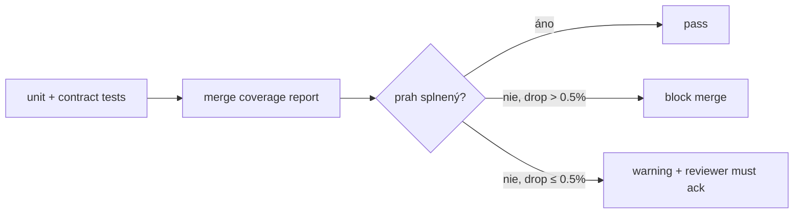

# Coverage Targets — SDM-Rewrite

> Konkrétne číselné prahy per package / per app. **Coverage je prah, nie cieľ.**
> Cieľ je pokryť rizikové miesta — state machines, validátory, multi-tenancy
> plumbing, RBAC checky. Snapshot testy bez sémantického zmyslu sa **nezapočítavajú**.
>
> Reportuje sa cez **istanbul/v8 coverage** (per voľbu 06+08 ekvivalent).
> CI publikuje HTML report + Codecov-style komentár v PR.

## 1. Coverage prahy per package

| Cesta | Line | Branch | Function | Statement | Poznámka |
|---|---:|---:|---:|---:|---|
| `packages/domain/` | **90 %** | **85 %** | 90 % | 90 % | State machines + validátory = critical core. Žiadna výnimka. |
| `packages/api-client/` | **80 %** | **70 %** | 80 % | 80 % | Pokrytie cez contract testy + happy/error path per endpoint. |
| `packages/design-system/` | **75 %** | **65 %** | 75 % | 75 % | Primitívy (Button, Input, Select, Tabs, ...) sú pokryté component testami + a11y. Komplexné komponenty (DataGrid, Calendar) majú nižšie line coverage, ale **vyššie integration** coverage v apps. |
| `packages/auth/` | **85 %** | **75 %** | 85 % | 85 % | Token handling, expiry detection, refresh flow — security-critical. |
| `apps/portal/` | **60 %** | **50 %** | 60 % | 60 % | Komponenty s logikou + features. Pure-render JSX wrappery sa **vylúčia** z metriky (`/* istanbul ignore file */`). |
| `apps/workspace/` | **60 %** | **50 %** | 60 % | 60 % | Rovnaké pravidlá ako portal. |
| `apps/pm/` (ak existuje) | **70 %** | **60 %** | 70 % | 70 % | Internal tooling, ale stále potrebné test guarded. |

## 2. Per-modul ďalšie minimum

Pre business kritické moduly **nestačí** package-level prah — musia byť
splnené aj per-modul:

| Modul | Cesta | Line min | Branch min | Dôvod |
|---|---|---:|---:|---|
| Incident lifecycle | `packages/domain/src/lifecycles/incident.ts` | **100 %** | **95 %** | Každý prechod stavu má sémantický side-effect (SLA pause, notifications, audit). |
| Request lifecycle | `packages/domain/src/lifecycles/request.ts` | **100 %** | **95 %** | Approval flow má high regulatory cost pri bugu. |
| Change lifecycle | `packages/domain/src/lifecycles/change.ts` | **100 %** | **95 %** | Emergency flow + retrospective approval — komplex. |
| Problem lifecycle | `packages/domain/src/lifecycles/problem.ts` | **100 %** | **90 %** | Linking semantics across modules. |
| KB lifecycle | `packages/domain/src/lifecycles/kb-article.ts` | **95 %** | **85 %** | Visibility scope + tenant cross-publish. |
| Multi-tenancy | `packages/api-client/src/tenant/*` + `apps/*/src/features/tenant-switcher/` | **95 %** | **90 %** | Compliance critical. |
| RBAC checky | `packages/auth/src/permissions.ts` | **100 %** | **95 %** | Privilege escalation risk. |
| Status transition validátory | `packages/domain/src/validators/transitions.ts` | **100 %** | **100 %** | Direct mapovanie na state machine, žiaden priestor pre `else`. |

## 3. Čo sa **nezapočítava** do coverage

| Súbor / vzor | Dôvod |
|---|---|
| `**/*.d.ts` | Iba typy |
| `**/*.stories.tsx` | Storybook fixture |
| `**/index.ts` (re-export only) | Žiadna logika |
| `**/icons/*` | Iba SVG |
| `**/*.config.{ts,js}` | Build config |
| `**/__mocks__/**` | MSW handlers — kód sa kryje cez integration testy, nie ich vlastná coverage |
| `**/migrations/*` (ak budú) | Run-once, separátne overené |
| Generated types (`*.generated.ts`) | Nemodifikované |

Konfigurácia (príklad pre vitest-style):

```ts
// tools/coverage.config.ts
export default {
  exclude: [
    "**/*.d.ts",
    "**/*.stories.tsx",
    "**/index.ts",         // re-export only — viď manual override per súbor
    "**/icons/**",
    "**/*.config.{ts,js}",
    "**/__mocks__/**",
    "**/migrations/**",
    "**/*.generated.ts",
  ],
};
```

## 4. Coverage gates v CI



**Pravidlá**:

- **Block merge** ak coverage **klesne o > 0.5 %** oproti `main`.
- **Warning** + reviewer ack ak klesne o 0–0.5 % (môže byť legitímne).
- **Block merge** ak akýkoľvek modul z tabuľky §2 klesne pod uvedený prah, **bez ohľadu** na celkový trend.
- **Block merge** ak nový súbor pridá > 50 LOC bez aspoň jedného testu (lint pravidlo `require-test-for-new-file`).

## 5. Reportovanie

| Artefakt | Generuje | Konzument |
|---|---|---|
| `coverage/lcov.info` | runner | Codecov / Sonar / interný badge |
| `coverage/index.html` | runner | dev locally |
| PR komentár "coverage diff" | CI bot | reviewer |
| Trend dashboard (per package, last 30 days) | aggregator (08) | tech lead |
| Per-file uncovered lines preview v PR | reviewdog ekv. | reviewer |

## 6. Outliers — kde si **dovolíme** menej

| Situácia | Cesta | Prah | Dôvod |
|---|---|---:|---|
| Catch-all error boundaries | `apps/*/src/components/ErrorBoundary.tsx` | 50 % | Pure render fallback, testovaný iba happy path + 1 crash. |
| Vendor wrapper komponenty | napr. ak Architecture zvolí `mantine` a wrappujeme — `packages/design-system/src/vendor-wrappers/` | 60 % | Tenký adapter, vendor má vlastné testy. |
| Storybook decorators | `**/decorators/*.tsx` | 0 % | iba dev-tooling. |
| Print / export views | `apps/workspace/src/features/**/print.tsx` | 50 % | Statický render — pokryté manuálne pred MVP go-live. |

## 7. Property-based testy — započítanie do branch coverage

State machines (Incident, Request, Change, Problem, KB) majú **property-based
guard**: generujeme náhodnú sekvenciu prechodov a overujeme invariant
("nikdy nemôžeš ísť do `CL` z `OP` priamo"). Tento test sa do **branch
coverage započítava cez fuzz iterations** (min 200 per state machine) —
inak by 100 % branch v lifecycles bolo nedosiahnuteľné cez ručne písané testy.

## Otvorené závislosti

- `[06-tech-stack-selector]` Coverage runner — vitest má v8/istanbul, Jest má
  istanbul, Cypress component má vlastný. Konkrétny coverage tool patrí
  k voľbe runner-a. QA prahy sú framework-agnostic.
- `[08-devex-devops]` CI gate implementation (block merge na coverage drop)
  vyžaduje GitHub Actions step alebo ekvivalent. Aktuálne číselné prahy
  (drop > 0.5 % = block) sú default, finálne hodnoty DevOps môže kalibrovať
  po prvých 4–8 týždňoch implementácie.
- `[04-architecture]` Ak Architecture pridá nový package (napr. `packages/bff`
  alebo `packages/orchestration`), QA doplní prah v round 2. Default: rovnaký
  ako `api-client` (80/70).
- `[09-qa]` Property-based testy (§7) — knižnica (`fast-check` ekv.)
  bude vybraná spolu s runner-om. Self-flag — uzatvorí sa po round 2.
