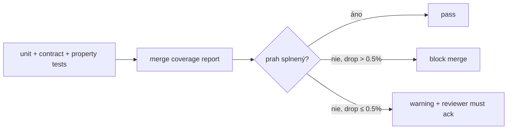

# Coverage Targets — SDM-Rewrite

## Changelog (round 2)

- Pridané nové package targets:
  - **`packages/api-mocks/`**: line 50 / branch 40 (low — sú to mock dáta, ale
    overujeme deterministické fixture generátory + audit log helpers).
  - **`apps/bff/`**: line 80 / branch 70 (vysoké — bezpečnostne kritické: proxy,
    session lifecycle, tenant injection, RBAC enforcement, error shape unification).
- Per-modul minimum pre BFF kritické moduly (auth, tenant scope, RBAC eval,
  error shaper) zvýšené na 95 / 90.
- `apps/pm` self-flag uzavretý — package zo stratégie odstránený (per 04 r2
  finalizácia container set: žiadna PM-app v MVP).
- `packages/i18n/`, `packages/utils/`, `packages/api-types/` doplnené explicitne.
- Property-based runner self-flag uzavretý: `fast-check@3.x` (06 r2 +
  `test-strategy.md` r2).
- Coverage runner self-flag uzavretý: `vitest@1.x` s v8 coverage provider
  (`@vitest/coverage-v8`).

> Konkrétne číselné prahy per package / per app. **Coverage je prah, nie cieľ.**
> Cieľ je pokryť rizikové miesta — state machines, validátory, multi-tenancy
> plumbing, RBAC checky, BFF auth a error shaping. Snapshot testy bez
> sémantického zmyslu sa **nezapočítavajú**.
>
> Reportuje sa cez **v8 coverage** (`@vitest/coverage-v8`). CI publikuje HTML
> report + Codecov-style komentár v PR.

## 1. Coverage prahy per package / app

| Cesta | Line | Branch | Function | Statement | Poznámka |
|---|---:|---:|---:|---:|---|
| `packages/domain/` | **90 %** | **85 %** | 90 % | 90 % | State machines + validátory = critical core. Žiadna výnimka. |
| `packages/api-client/` | **80 %** | **70 %** | 80 % | 80 % | Pokrytie cez contract testy + happy/error path per endpoint. |
| `packages/api-types/` | **0 %** (n/a) | n/a | n/a | n/a | Iba typy — vylúčené z coverage cez `exclude` config. |
| `packages/design-system/` | **75 %** | **65 %** | 75 % | 75 % | Primitívy (Button, Input, Select, Tabs, ...) sú pokryté component testami + a11y. Komplexné komponenty (DataTable, Calendar, RelationshipGraph) majú nižšie line coverage, ale **vyššie integration** coverage v apps. |
| `packages/auth/` | **85 %** | **75 %** | 85 % | 85 % | Token handling helpers, expiry detection, refresh flow, role guards — security-critical. |
| `packages/i18n/` | **80 %** | **70 %** | 80 % | 80 % | i18n catalog loader, ICU formatters, fallback chain. |
| `packages/utils/` | **85 %** | **75 %** | 85 % | 85 % | Pure utility funkcie — date math, formatters, type guards. |
| `packages/api-mocks/` | **50 %** | **40 %** | 50 % | 50 % | **Nový r2.** Mock dáta + handlers — kód sa kryje cez integration / contract layer. Testujeme generátory (`makeIncident`, `makeQueue`, `makeRelationshipGraph`) + audit log helpers + `parseTenantFromRequest`. Handler bodies samy o sebe nevyžadujú coverage (sú test infrastructure). |
| `apps/portal/` | **60 %** | **50 %** | 60 % | 60 % | Komponenty s logikou + features. Pure-render JSX wrappery sa **vylúčia** z metriky (`/* istanbul ignore file */`). |
| `apps/workspace/` | **60 %** | **50 %** | 60 % | 60 % | Rovnaké pravidlá ako portal. |
| `apps/bff/` | **80 %** | **70 %** | 80 % | 80 % | **Nový r2.** Bezpečnostne kritický: proxy, session lifecycle, tenant injection, RBAC enforcement, error shape, aggregator fan-out, audit emission. Test types: unit (pure helpers) + BFF integration + BFF contract. |

> Pozn.: `apps/pm` z r1 placeholdera **odstránené** — per 04 r2 finalizácia
> container set, žiadna PM-app v MVP (len CLI tooling v `tools/`).

## 2. Per-modul ďalšie minimum

Pre business kritické moduly **nestačí** package-level prah — musia byť
splnené aj per-modul:

| Modul | Cesta | Line min | Branch min | Dôvod |
|---|---|---:|---:|---|
| Incident lifecycle | `packages/domain/src/lifecycles/incident.ts` | **100 %** | **95 %** | Každý prechod stavu má sémantický side-effect (SLA pause, notifications, audit). |
| Request lifecycle | `packages/domain/src/lifecycles/request.ts` | **100 %** | **95 %** | Approval flow má high regulatory cost pri bugu. |
| Change lifecycle | `packages/domain/src/lifecycles/change.ts` | **100 %** | **95 %** | Emergency flow + retrospective approval — komplex. |
| Problem lifecycle | `packages/domain/src/lifecycles/problem.ts` | **100 %** | **90 %** | Linking semantics across modules. |
| KB lifecycle | `packages/domain/src/lifecycles/kb-article.ts` | **95 %** | **85 %** | Visibility scope + tenant cross-publish. |
| Multi-tenancy client | `packages/api-client/src/tenant/*` + `apps/*/src/features/tenant-switcher/` | **95 %** | **90 %** | Compliance critical. |
| RBAC checky | `packages/auth/src/permissions.ts` | **100 %** | **95 %** | Privilege escalation risk. |
| Status transition validátory | `packages/domain/src/validators/transitions.ts` | **100 %** | **100 %** | Direct mapovanie na state machine, žiaden priestor pre `else`. |
| **BFF auth module** | `apps/bff/src/routes/auth/**`, `apps/bff/src/middleware/session.ts` | **95 %** | **90 %** | OIDC PKCE, state/nonce, EEM artifact exchange, session lifecycle, step-up — privilege boundary. |
| **BFF tenant scope** | `apps/bff/src/middleware/tenant-scope.ts`, `apps/bff/src/proxy/tenant-filter.ts` | **100 %** | **95 %** | Compliance critical — defenzívny `WC=tenant%3DU'<id>'` injection nikdy nesmie zlyhať. |
| **BFF RBAC eval** | `apps/bff/src/middleware/rbac.ts` | **100 %** | **95 %** | Privilege escalation risk — explicit `requirePermission` check per route. |
| **BFF error shaper** | `apps/bff/src/lib/error-shape.ts` | **95 %** | **90 %** | AppError taxonomy mapping, 401/403 disambiguation, PII redaction in details. |
| **BFF audit logger** | `apps/bff/src/lib/audit.ts` | **95 %** | **85 %** | Audit emission per request — A09 OWASP compliance. |
| **BFF SSRF defense** | `apps/bff/src/lib/url-whitelist.ts` | **100 %** | **100 %** | URL whitelist, private IP block — A10 OWASP. |

## 3. Čo sa **nezapočítava** do coverage

| Súbor / vzor | Dôvod |
|---|---|
| `**/*.d.ts` | Iba typy |
| `**/*.stories.tsx` | Storybook fixture |
| `**/index.ts` (re-export only) | Žiadna logika |
| `**/icons/*` | Iba SVG |
| `**/*.config.{ts,js}` | Build config |
| `packages/api-mocks/src/handlers/**` | MSW handlers — kód sa kryje cez integration testy, nie ich vlastná coverage |
| `packages/api-mocks/src/fixtures/**` | Fixture data — kód má vlastné generátory pokrýté unit-testami; samotná dátová payload sa nezapočítava |
| `**/migrations/*` (ak budú) | Run-once, separátne overené |
| `packages/api-types/**` | Iba typy / re-export z `domain` |
| `**/*.generated.ts` | Generated, nemodifikované |
| `tools/**` (CI / build scripts) | Nie product code |

Konfigurácia (`vitest.config.ts` per package alebo root):

```ts
// tools/coverage.config.ts
export default {
  provider: "v8",
  exclude: [
    "**/*.d.ts",
    "**/*.stories.tsx",
    "**/index.ts",         // re-export only — viď manual override per súbor
    "**/icons/**",
    "**/*.config.{ts,js}",
    "packages/api-mocks/src/handlers/**",
    "packages/api-mocks/src/fixtures/**",
    "packages/api-types/**",
    "**/migrations/**",
    "**/*.generated.ts",
    "tools/**",
  ],
  reporter: ["text", "html", "lcov"],
};
```

## 4. Coverage gates v CI



**Pravidlá**:

- **Block merge** ak coverage **klesne o > 0.5 %** oproti `main`.
- **Warning** + reviewer ack ak klesne o 0–0.5 % (môže byť legitímne).
- **Block merge** ak akýkoľvek modul z tabuľky §2 klesne pod uvedený prah, **bez ohľadu** na celkový trend.
- **Block merge** ak nový súbor pridá > 50 LOC bez aspoň jedného testu (lint pravidlo `require-test-for-new-file`).
- **Block merge** ak `apps/bff/` klesne pod 80 / 70 — žiadny "warning ack" pre BFF coverage.

## 5. Reportovanie

| Artefakt | Generuje | Konzument |
|---|---|---|
| `coverage/lcov.info` | `vitest --coverage` (v8 provider) | Codecov / Sonar / interný badge |
| `coverage/index.html` | `vitest --coverage` | dev locally |
| PR komentár "coverage diff" | CI bot (08 r2) | reviewer |
| Trend dashboard (per package, last 30 days) | aggregator (08) | tech lead |
| Per-file uncovered lines preview v PR | reviewdog ekv. | reviewer |
| Per-BFF-module breakdown (auth / tenant-scope / RBAC / error / audit / proxy) | aggregator (08) | tech lead + security agent |

## 6. Outliers — kde si **dovolíme** menej

| Situácia | Cesta | Prah | Dôvod |
|---|---|---:|---|
| Catch-all error boundaries | `apps/*/src/components/ErrorBoundary.tsx` | 50 % | Pure render fallback, testovaný iba happy path + 1 crash. |
| Vendor wrapper komponenty | napr. ak Architecture zvolí `mantine` a wrappujeme — `packages/design-system/src/vendor-wrappers/` | 60 % | Tenký adapter, vendor má vlastné testy. |
| Storybook decorators | `**/decorators/*.tsx` | 0 % | iba dev-tooling. |
| Print / export views | `apps/workspace/src/features/**/print.tsx` | 50 % | Statický render — pokryté manuálne pred MVP go-live. |
| BFF health endpoints | `apps/bff/src/routes/health.ts`, `apps/bff/src/routes/ready.ts` | 70 % | Trivial response shape, smoke test sufficient. |
| BFF SOAP adapter (rare) | `apps/bff/src/proxy/soap/**` | 70 % | Whitelisted operations only, smaller surface; covered per-operation. |

## 7. Property-based testy — započítanie do branch coverage

State machines (Incident, Request, Change, Problem, KB) majú **property-based
guard** cez `fast-check@3.x` (06 r2 confirmed): generujeme náhodnú sekvenciu
prechodov a overujeme invariant ("nikdy nemôžeš ísť do `CL` z `OP` priamo").
Tento test sa do **branch coverage započítava cez fuzz iterations** (min 200
per state machine) — inak by 100 % branch v lifecycles bolo nedosiahnuteľné
cez ručne písané testy.

Príklad:

```ts
import fc from "fast-check";
import { IncidentLifecycle, transitions } from "@sdm/domain/lifecycles/incident";

test("Incident state machine — never allows OP → CL direct transition", () => {
  fc.assert(
    fc.property(
      fc.array(fc.constantFrom("WIP", "RES", "CL", "HLD"), { minLength: 1, maxLength: 10 }),
      (sequence) => {
        const lifecycle = new IncidentLifecycle("OP");
        for (const target of sequence) {
          const allowed = lifecycle.canTransition(target);
          if (target === "CL" && lifecycle.state === "OP") {
            expect(allowed).toBe(false);
          }
          if (allowed) lifecycle.transition(target);
        }
      }
    ),
    { numRuns: 200 } // min 200 fuzz iterations
  );
});
```

## Otvorené závislosti

- `[06-tech-stack-selector]` Coverage runner — `[resolved-in-round-2]`
  (`vitest@1.x` + `@vitest/coverage-v8`).
- `[06-tech-stack-selector]` Property-based runner — `[resolved-in-round-2]`
  (`fast-check@3.x`).
- `[08-devex-devops]` CI gate implementation (block merge na coverage drop) —
  `[resolved-in-round-2]` per 08 r2 `ci-cd.md` (GitHub Actions matrix s
  coverage gate step).
- `[04-architecture]` Nové packages — `[resolved-in-round-2]` (`packages/api-mocks/`
  + `apps/bff/` doplnené v §1 s konkrétnymi prahmi).
- `[09-qa]` Coverage kalibrácia po prvých 4–8 týždňoch implementácie — self-flag
  ostáva pre post-conv (potenciálne zvýšenie prahov, ak sa ukáže, že sú
  dosiahnuteľné nad bar).
