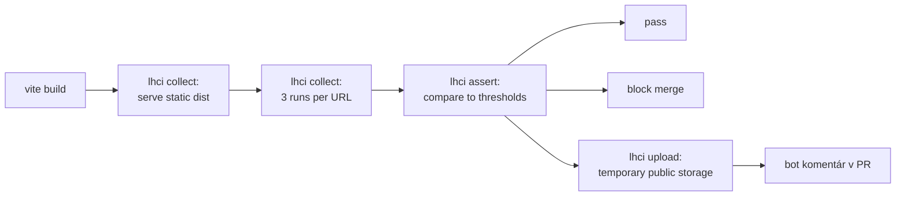

# Performance — SDM-Rewrite

## Changelog (round 2)

- Pridaná nová sekcia **§4 BFF performance** — API endpoint latency budget
  (p50 < 200 ms, p95 < 800 ms, vrátane proxy do CA SDM, ktorý je extern).
  Hierarchia: BFF route handler + session middleware + tenant scope filter +
  aggregator fan-out (paralelné CA SDM calls). Aggregator endpoints majú
  voľnejší budget (fan-out je drahší — viď tabuľka).
- Bundle budgety §3 zostávajú: portal 180 KB / workspace 350 KB initial JS.
  Per 04 r2 confirmation `apps/bff/` nie je client-side artefakt → žiadny
  bundle budget pre BFF.
- Lighthouse prahy §2 stable (po 04 r2 ADR-05 routing potvrdený route-based
  code-split — bundle budgety predpokladajú tento layout).
- Tech stack potvrdený: `@lhci/cli@0.13.x` pre Lighthouse; BFF perf
  measurement cez `k6` alebo `autocannon` (post-MVP, currently mock-time
  measurement v BFF integration testoch).

> GOAL.md §5: **TTI portál < 2 s na typickej linke. Dáta sú malé (rádovo
> desiatky položiek v queue / CI) — žiadna virtualizácia, žiadne enterprise
> tabuľkové knižnice.**
>
> Po 04 r2 BFF accepted: dva perf domains —
> (a) **FE perf** (Lighthouse, TTI / LCP / CLS / TBT / INP / bundle size),
> (b) **BFF perf** (p50 / p95 latency per endpoint kategórie, throughput
>     header pre rate limit).

## 1. Konfigurácia Lighthouse CI

Audit profil:

| Parameter | Hodnota | Dôvod |
|---|---|---|
| **Throttling** | "Simulated Slow 4G" (Lighthouse default) | "Typická linka" z GOAL §5 — kalibrácia na on-prem enterprise users (často VPN, niekedy mobile). |
| **CPU slowdown** | 4× | Lighthouse default. |
| **Form factor** | desktop + mobile (per stránka) | Portál: oba (Lucia ide aj z mobilu). Workspace: desktop only (Anna pracuje na 2 monitoroch). |
| **Runs per audit** | 3 | Median sa použije ako reportovaná hodnota (Lighthouse default). |
| **Wait until** | "load" event + 5s quiet network | Štandard pre SPA. |
| **Backend** | MSW recorded fixtures + `LATENCY = 0` override | Eliminuje variabilitu mock-ovaného network timing-u z FE perf metrík. |

## 2. Per-stránka prahy (FE)

Stránky sú odvodené z `02-ux-persona-analyst/screen-inventory.md` (high-level
zoznam wireframov) + 04 r2 routing tabuľky (`portal.md` §3, `workspace.md` §3).
Bundle budgety predpokladajú React Router v6 lazy + route-level code-split
(ADR-05).

### `portal`

| Stránka | TTI (mob) | LCP (mob) | CLS | TBT | INP | Score min | Notes |
|---|---:|---:|---:|---:|---:|---:|---|
| `/` (home — "Nahlásiť problém" CTA) | **1.8 s** | 1.5 s | 0.05 | 200 ms | 200 ms | 90 | Lucia mobile use case. Najkritickejšia. |
| `/new-incident` (formulár) | **2.0 s** | 1.7 s | 0.05 | 250 ms | 200 ms | 90 | GOAL hard target. |
| `/tickets/:id` (detail) | 1.8 s | 1.5 s | 0.05 | 200 ms | 200 ms | 88 | |
| `/tickets` (moje tickety list) | 2.2 s | 1.8 s | 0.05 | 250 ms | 200 ms | 88 | |
| `/catalog` (Service Catalog list) | 2.2 s | 1.8 s | 0.05 | 250 ms | 200 ms | 88 | |
| `/catalog/:itemId` (dynamic form) | 2.4 s | 2.0 s | 0.10 | 300 ms | 250 ms | 85 | Form rendering — viac DOM. |
| `/kb` (search + list) | 2.0 s | 1.7 s | 0.05 | 200 ms | 200 ms | 88 | |
| `/kb/article/:id` (article) | 1.6 s | 1.3 s | 0.02 | 150 ms | 150 ms | 92 | Hlavne textový obsah. |

### `workspace`

| Stránka | TTI (desk) | LCP (desk) | CLS | TBT | INP | Score min | Notes |
|---|---:|---:|---:|---:|---:|---:|---|
| `/queue` (default queue) | **2.5 s** | 2.0 s | 0.05 | 300 ms | 200 ms | 85 | Anna potrebuje dense grid + side panel. Vyšší DOM cost. |
| `/tickets/:id` (split view) | 2.0 s | 1.7 s | 0.05 | 250 ms | 200 ms | 85 | |
| `/changes` (queue) | 2.5 s | 2.0 s | 0.05 | 300 ms | 200 ms | 85 | |
| `/changes/calendar` (queue + calendar) | 3.0 s | 2.5 s | 0.10 | 400 ms | 250 ms | 80 | Calendar grid je drahší — kompromis. |
| `/changes/:id` | 2.0 s | 1.7 s | 0.05 | 250 ms | 200 ms | 85 | |
| `/cmdb` (search + list) | 2.5 s | 2.0 s | 0.05 | 300 ms | 200 ms | 85 | |
| `/cmdb/ci/:id` (CI detail + relationships) | 3.5 s | 2.8 s | 0.10 | 500 ms | 300 ms | 78 | Graph + 47 atribútov — komplikovanejšia stránka. |
| `/kb/editor/:id?` | 2.5 s | 2.0 s | 0.05 | 300 ms | 250 ms | 80 | WYSIWYG editor lazy-loaded (TipTap heavy chunk). |
| `/kb/analytics` (post-MVP) | 3.0 s | 2.5 s | 0.10 | 400 ms | 250 ms | 78 | Dashboard charts (recharts lazy chunk). |

## 3. Bundle size budgets (FE)

Per app (per 04 r2 routing + ADR-05 code-split):

| Bundle | Max size (gzipped) | Dôvod |
|---|---:|---|
| `apps/portal` — initial JS | **180 KB** | Lucia mobile, slow link. Aggressive code splitting. Per 06 r2 baseline (React 18 + TanStack Query + RHF/Zod + minimal DS): headroom ≈ 30 KB pre product code v initial chunk. |
| `apps/portal` — initial CSS | 30 KB | |
| `apps/workspace` — initial JS | **350 KB** | Desktop only, ale bohatšie UI. Per 06 r2 baseline: headroom ≈ 150 KB pre product code v initial chunk (queue + ticket detail). |
| `apps/workspace` — initial CSS | 60 KB | |
| Lazy chunk per feature (incident, request, kb, cmdb, change) | 80 KB | Per modul. |
| Lazy chunk — heavy moduly (calendar FullCalendar, graph Cytoscape, WYSIWYG TipTap) | 150 KB | Per modul. Heavy moduly idú na route enter. |
| Per route font + image | 100 KB | Total resources. |

Bundle analyzer report (cez `rollup-plugin-visualizer`) je generovaný per PR —
zmena väčšia než **+5 % gzip** v initial bundle = block merge.

## 4. BFF performance — **nová sekcia r2**

Po 04 r2 BFF accepted: BFF je samostatný server proces, ktorý mediates FE ↔ CA SDM.
BFF perf je kritický, lebo:

- Každý FE request prechádza cez BFF (synchronous bottleneck).
- BFF agreguje viacero CA SDM volaní (fan-out → latencia sa kumuluje).
- CA SDM je extern komerčný produkt s neznámymi performance characteristics
  (per architecture/risks.md A-002 + A-006).

### 4.1 BFF latency budget per endpoint kategória

| Endpoint kategória | Príklady | p50 cieľ | p95 cieľ | p99 cieľ | Notes |
|---|---|---:|---:|---:|---|
| **Auth lightweight** | `GET /me`, `POST /auth/heartbeat`, `POST /auth/logout` | **< 50 ms** | **< 150 ms** | < 300 ms | Cookie validation + session lookup; žiadny CA SDM round-trip (cached profile). |
| **Auth IdP roundtrip** | `GET /auth/callback`, `POST /auth/step-up` | < 800 ms | < 2 s | < 3 s | Závisí od IdP + CA SDM `/rest_access`. SLA dominovaná external services. |
| **Simple proxy** | `GET /api/incidents/:id`, `PUT /api/tickets/:type/:id`, `GET /api/reference/:type` | **< 200 ms** | **< 800 ms** | < 1.5 s | **Hard prah z PM revision request.** Vrátane proxy do CA SDM. |
| **Aggregator — 3-call fan-out** | `GET /me/tenants`, `GET /api/queue` | < 300 ms | < 1.0 s | < 2.0 s | 3+ paralelné CA SDM volania. |
| **Aggregator — 6-call fan-out** | `GET /api/tickets/:type/:id` (ticket detail) | < 500 ms | < 1.5 s | < 3.0 s | Parent + contacts + CI + linked + attachments + activity. |
| **Mutation s side-effects** | `POST /api/tickets/incident`, `POST /api/changes/:id/approve`, `POST /me/active-tenant` | < 400 ms | < 1.2 s | < 2.5 s | Single CA SDM write + audit log emission. |
| **Bulk operations** | `POST /api/incidents/bulk-close` | < 2 s | < 5 s | < 10 s | Per-record CA SDM write (sequential alebo batched). Audit per-record. |
| **Attachment upload** | `POST /api/attachments` (25 MB max) | < 1 s | < 3 s | < 5 s | Multipart streaming; CA SDM upload latency. |
| **Attachment download** | `GET /api/attachments/:id` | < 500 ms | < 2 s | < 5 s | Streaming; CA SDM download latency. |
| **KB search** | `GET /api/kb/search` | < 250 ms | < 800 ms | < 1.5 s | BUI suggestedSolutions + CA SDM SKELETONS. |

> **Z PM revision request**: simple proxy endpoints majú **p50 < 200 ms,
> p95 < 800 ms** (vrátane proxy do CA SDM). Toto je dominujúci budget pre
> väčšinu API volaní v UI; aggregator endpoints (queue / ticket-detail / tenants)
> majú voľnejší budget vzhľadom na fan-out.

### 4.2 Throughput a concurrency

| Aspekt | Cieľ | Notes |
|---|---|---|
| **Per-instance concurrency** | min 100 paralelných requestov | Single BFF instance handles typický workload (30 paralelných workspace users + 50 portal users). |
| **Per-user rate limit** | 60 req/min sustained, 120 burst | Session-scoped; per architecture/risks.md A-002 defenzívny limit voči CA SDM. |
| **Per-tenant rate limit** | 600 req/min sustained | Defenzívne pre CA SDM, nie pre BFF kapacitu. |
| **CA SDM concurrent connection pool** | max 20 paralelných CA SDM calls per BFF instance | Per architecture/risks.md A-002 — chráni CA SDM pred preťažením. Aggregator fan-out kontroluje queue. |
| **Login rate limit** | 10 attempts/min per IP, 5 attempts/min per username | Per OWASP A04 brute force defense. |

### 4.3 BFF perf measurement mechanizmus

Per-test merania v **BFF integration testoch** (best-effort, MVP):

```ts
import { performance } from "node:perf_hooks";

test("@perf:bff GET /api/incidents/:id within p95 budget", async () => {
  const samples = [];
  for (let i = 0; i < 50; i++) {
    const start = performance.now();
    await request(bffApp).get("/api/incidents/INC-1042").set("Cookie", session);
    samples.push(performance.now() - start);
  }
  const p50 = percentile(samples, 50);
  const p95 = percentile(samples, 95);
  expect(p50).toBeLessThan(200);
  expect(p95).toBeLessThan(800);
});
```

Toto je **smoke perf** — nie záťažový test. Pre **real load testing**
(post-MVP) DevOps doplní `k6` alebo `autocannon` v nightly CI stage proti
staging deployment.

### 4.4 BFF perf v CI

| Stage | Frekvencia | Cieľ |
|---|---|---|
| Per PR — BFF perf smoke | every PR | 4 najkritickejšie endpoint kategórie × 50 samples × p50/p95 assertion |
| Nightly — full BFF perf sweep | denne | Všetkých 10 endpoint kategórií × 200 samples × percentile assertion |
| Pre-release — load test | per release tag | k6 / autocannon proti staging, 30 min sustained 50 RPS, monitor p50/p95/p99 + error rate |

## 5. Performance test mechanizmus (FE — Lighthouse CI)



CI cron:
- **Per PR**: 4–6 najkritickejších stránok (portal `/`, portal `/new-incident`, workspace `/queue`, workspace `/cmdb/ci/:id`).
- **Nightly** + **per merge to main**: všetkých 17 stránok z §2.

## 6. Rolling baseline a thresholds

Lighthouse skóre fluktuuje. Princípy:

- **Hard threshold** (block merge): hodnoty z §2.
- **Rolling baseline**: priemerné Lighthouse skóre za posledných 7 dní per stránka. Block merge ak nové skóre klesne o **viac ako 5 bodov** voči baseline aj keď absolútny prah ešte platí (ide o **regression detection**).
- **Slack budget** pre experimentálne features: nasadí sa cez `[skip-perf]` v PR title — ale len pre PR s explicitným hand-off na perf tím / persona-performance.

Pre BFF perf platí to isté: rolling 7-day baseline per endpoint kategória,
block ak p95 vzrastie o > 20 % voči baseline.

## 7. Real User Monitoring (RUM) — voliteľne

GOAL §5: "real user monitoring nice-to-have". Pre QA stratégiu:

- **Nie blocker** pre MVP.
- Ak Architecture / DevOps zvolia integráciu (Sentry Performance / vendor-specific), QA dodá:
  - Definíciu **kritických user actions** (4 per app — viď nižšie).
  - Threshold pre p75 / p95 latency.

**Critical user actions pre RUM** (návrh):

| App | Action | Cieľ p75 | Cieľ p95 |
|---|---|---:|---:|
| portal | ticket submit (klik → ticket ID viditeľný) | 800 ms | 1500 ms |
| portal | KB search (typing → results) | 300 ms | 600 ms |
| workspace | queue refresh | 500 ms | 1000 ms |
| workspace | ticket close + queue update | 700 ms | 1400 ms |

## 8. Anti-patterns — čo NEROBIŤ

- **Žiadne snapshot perf testy** (typu "render Component → save HTML"). Bezpředpotrebné.
- **Žiadny micro-benchmark JS** v PR pipeline. Performance ide v statike (Lighthouse) a v RUM (production). Micro-benchmarks sú iba pre cielenú regresiu (after-the-fact diagnostics).
- **Žiadne `it.skip()` v perf testoch.** Buď ten budget máme dosiahnuteľný, alebo ho prerokujeme a kalibrujeme.
- **Žiaden custom `setTimeout`-based "perf check".** Lighthouse alebo nič.
- **Žiadne BFF perf test cez MSW s `LATENCY = 0`** — to by ignorovalo realistický timing. BFF perf testy bežia s realistic LATENCY simulation + seeded jitter.

## 9. Critical path resources — checklist per stránka

| Check | Pravidlo |
|---|---|
| Critical fonts | woff2, `font-display: swap`, preload top 1 weight |
| Above-the-fold images | `loading="eager"`, `fetchpriority="high"` |
| Below-the-fold images | `loading="lazy"` |
| Third-party scripts | Žiadne v initial path. Sentry, analytics — async + `defer`. |
| API calls v initial render | Max 2 (typically `/me`, `/me/tenants`). Ostatné lazy. |
| Web font count | Max 2 families × 2 weights = 4 files |
| Render-blocking CSS | < 30 KB inline; rest async |

## Otvorené závislosti

- `[04-architecture]` Lazy-loading per route — `[resolved-in-round-2]`
  (ADR-05 routing: React Router v6 lazy + route-level code-split).
- `[07-design-system]` CSS strategy — `[resolved-in-round-2]` (per 07 r2 +
  06 r2 libraries: CSS Modules s extracted CSS, nie CSS-in-JS; bundle
  budget §3 platí).
- `[08-devex-devops]` LHCI integration v CI pipeline — `[resolved-in-round-2]`
  per 08 r2 `ci-cd.md` (LHCI server alebo temporary public storage).
- `[06-tech-stack-selector]` Bundle size targets závisia od FE framework
  baseline — `[resolved-in-round-2]` (React 18 baseline ~ 40 KB gzip per
  06 libraries; headroom ≈ 140 KB pre portál initial chunk).
- `[09-qa]` Cross-browser perf parity — Lighthouse audit je Chrome-only.
  Pre Safari / Firefox parity testy v nightly + manual baseline raz mesačne.
  Self-flag, uzatvorí sa po implementačnej fáze.
- `[09-qa]` BFF load test mechanizmus (k6 vs. autocannon vs. iné) — finalizácia
  pre release tag stage. Default: k6 (TypeScript scripting, dobré reporting).
  Self-flag pre post-MVP.
