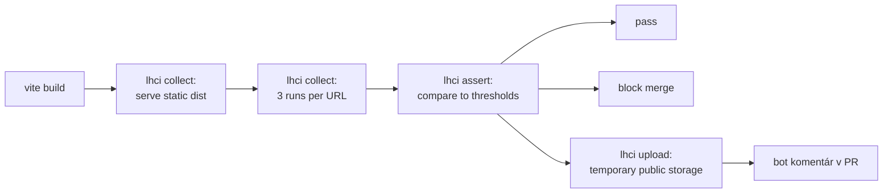

# Performance — SDM-Rewrite

> GOAL.md §5: **TTI portál < 2 s na typickej linke. Dáta sú malé (rádovo
> desiatky položiek v queue / CI) — žiadna virtualizácia, žiadne enterprise
> tabuľkové knižnice.**
>
> Tu sú konkrétne Lighthouse CI prahy a budget per stránka, plus pravidlá
> kedy CI blokuje merge.

## 1. Konfigurácia Lighthouse CI

Audit profil:

| Parameter | Hodnota | Dôvod |
|---|---|---|
| **Throttling** | "Simulated Slow 4G" (Lighthouse default) | "Typická linka" z GOAL §5 — kalibrácia na on-prem enterprise users (často VPN, niekedy mobile). |
| **CPU slowdown** | 4× | Lighthouse default. |
| **Form factor** | desktop + mobile (per stránka) | Portál: oba (Lucia ide aj z mobilu). Workspace: desktop only (Anna pracuje na 2 monitoroch). |
| **Runs per audit** | 3 | Median sa použije ako reportovaná hodnota (Lighthouse default). |
| **Wait until** | "load" event + 5s quiet network | Štandard pre SPA. |
| **Backend** | MSW recorded fixtures + `LATENCY = 0` override | Eliminuje variabilitu mock-ovaného network timing-u z FE perf metrík. |

## 2. Per-stránka prahy

Stránky sú odvodené z `02-ux-persona-analyst/screen-inventory.md` (high-level
zoznam wireframov). Konkrétne URL routes budú finalizované po Architecture
ADR `5-routing`.

### `portal`

| Stránka | TTI (mob) | LCP (mob) | CLS | TBT | INP | Score min | Notes |
|---|---:|---:|---:|---:|---:|---:|---|
| `/` (home — "Nahlásiť problém" CTA) | **1.8 s** | 1.5 s | 0.05 | 200 ms | 200 ms | 90 | Lucia mobile use case. Najkritickejšia. |
| `/incident/new` (formulár) | **2.0 s** | 1.7 s | 0.05 | 250 ms | 200 ms | 90 | GOAL hard target. |
| `/incident/:id` (detail) | 1.8 s | 1.5 s | 0.05 | 200 ms | 200 ms | 88 | |
| `/incidents` (moje tickety list) | 2.2 s | 1.8 s | 0.05 | 250 ms | 200 ms | 88 | |
| `/catalog` (Service Catalog list) | 2.2 s | 1.8 s | 0.05 | 250 ms | 200 ms | 88 | |
| `/catalog/:id` (dynamic form) | 2.4 s | 2.0 s | 0.10 | 300 ms | 250 ms | 85 | Form rendering — viac DOM. |
| `/kb` (search + list) | 2.0 s | 1.7 s | 0.05 | 200 ms | 200 ms | 88 | |
| `/kb/:id` (article) | 1.6 s | 1.3 s | 0.02 | 150 ms | 150 ms | 92 | Hlavne textový obsah. |

### `workspace`

| Stránka | TTI (desk) | LCP (desk) | CLS | TBT | INP | Score min | Notes |
|---|---:|---:|---:|---:|---:|---:|---|
| `/` (default queue) | **2.5 s** | 2.0 s | 0.05 | 300 ms | 200 ms | 85 | Anna potrebuje dense grid + side panel. Vyšší DOM cost. |
| `/incidents` (queue) | 2.5 s | 2.0 s | 0.05 | 300 ms | 200 ms | 85 | Riadky 28–32 px, 50–100 viditeľných. |
| `/incidents/:id` (split view) | 2.0 s | 1.7 s | 0.05 | 250 ms | 200 ms | 85 | |
| `/changes` (queue + calendar) | 3.0 s | 2.5 s | 0.10 | 400 ms | 250 ms | 80 | Calendar grid je drahší — kompromis. |
| `/changes/:id` | 2.0 s | 1.7 s | 0.05 | 250 ms | 200 ms | 85 | |
| `/cmdb` (search + list) | 2.5 s | 2.0 s | 0.05 | 300 ms | 200 ms | 85 | |
| `/cmdb/:id` (CI detail + relationships) | 3.5 s | 2.8 s | 0.10 | 500 ms | 300 ms | 78 | Graph + 47 atribútov — komplikovanejšia stránka. |
| `/kb/editor` | 2.5 s | 2.0 s | 0.05 | 300 ms | 250 ms | 80 | WYSIWYG editor lazy-loaded. |
| `/kb/analytics` | 3.0 s | 2.5 s | 0.10 | 400 ms | 250 ms | 78 | Dashboard charts. |

## 3. Bundle size budgets

Per app:

| Bundle | Max size (gzipped) | Dôvod |
|---|---:|---|
| `apps/portal` — initial JS | **180 KB** | Lucia mobile, slow link. Aggressive code splitting. |
| `apps/portal` — initial CSS | 30 KB | |
| `apps/workspace` — initial JS | **350 KB** | Desktop only, ale bohatšie UI. |
| `apps/workspace` — initial CSS | 60 KB | |
| Lazy chunk per feature (incident, request, kb, cmdb, change) | 80 KB | Per modul. |
| Per route font + image | 100 KB | Total resources. |

Bundle analyzer report (cez `vite-plugin-visualizer` ekv.) je generovaný
per PR — zmena väčšia než **+5 % gzip** v initial bundle = block merge.

## 4. Performance test mechanizmus

CI cron:
- **Per PR**: 4–6 najkritickejších stránok (portal `/`, portal `/incident/new`, workspace `/incidents`, workspace `/cmdb/:id`).
- **Nightly** + **per merge to main**: všetkých 17 stránok z §2.

## 5. Rolling baseline a thresholds

Lighthouse skóre fluktuuje. Princípy:

- **Hard threshold** (block merge): hodnoty z §2.
- **Rolling baseline**: priemerné Lighthouse skóre za posledných 7 dní per stránka. Block merge ak nové skóre klesne o **viac ako 5 bodov** voči baseline aj keď absolútny prah ešte platí (ide o **regression detection**).
- **Slack budget** pre experimentálne features: nasadí sa cez `[skip-perf]` v PR title — ale len pre PR s explicitným hand-off na perf tím / persona-performance.

## 6. Real User Monitoring (RUM) — voliteľne

GOAL §5: "real user monitoring nice-to-have". Pre QA stratégiu:

- **Nie blocker** pre MVP.
- Ak Architecture / DevOps zvolia integráciu (Sentry Performance / vendor-specific), QA dodá:
  - Definíciu **kritických user actions** (4 per app — viď nižšie).
  - Threshold pre p75 / p95 latency.

**Critical user actions pre RUM** (návrh):

| App | Action | Cieľ p75 | Cieľ p95 |
|---|---|---:|---:|
| portal | ticket submit (klik → ticket ID viditeľný) | 800 ms | 1500 ms |
| portal | KB search (typing → results) | 300 ms | 600 ms |
| workspace | queue refresh | 500 ms | 1000 ms |
| workspace | ticket close + queue update | 700 ms | 1400 ms |

## 7. Anti-patterns — čo NEROBIŤ

- **Žiadne snapshot perf testy** (typu "render Component → save HTML"). Bezpředpotrebné.
- **Žiadny micro-benchmark JS** v PR pipeline. Performance ide v statike (Lighthouse) a v RUM (production). Micro-benchmarks sú iba pre cielenú regresiu (after-the-fact diagnostics).
- **Žiadne `it.skip()` v perf testoch.** Buď ten budget máme dosiahnuteľný, alebo ho prerokujeme a kalibrujeme.
- **Žiaden custom `setTimeout`-based "perf check".** Lighthouse alebo nič.

## 8. Critical path resources — checklist per stránka

| Check | Pravidlo |
|---|---|
| Critical fonts | woff2, `font-display: swap`, preload top 1 weight |
| Above-the-fold images | `loading="eager"`, `fetchpriority="high"` |
| Below-the-fold images | `loading="lazy"` |
| Third-party scripts | Žiadne v initial path. Sentry, analytics — async + `defer`. |
| API calls v initial render | Max 2 (typically `/me`, `/me/tenants`). Ostatné lazy. |
| Web font count | Max 2 families × 2 weights = 4 files |
| Render-blocking CSS | < 30 KB inline; rest async |

## Otvorené závislosti

- `[04-architecture]` Lazy-loading per route — Architecture ADR `5-routing`
  finalizuje, či bude route-based code splitting alebo feature-based.
  Bundle budgety §3 sú napísané pre route-based; ak Architecture zvolí
  inú stratégiu, doplníme.
- `[07-design-system]` CSS strategy — ak Design System zvolí CSS-in-JS
  (emotion/styled-components ekv.) namiesto extracted CSS, bundle budget
  pre initial JS sa zvýši (+ 20–30 KB) a CSS budget zníži. Round 2: kalibrácia.
- `[08-devex-devops]` LHCI integration v CI pipeline (server vs. temporary
  public storage, retention) je DevOps decision. QA dodá thresholds.
- `[06-tech-stack-selector]` Bundle size targets závisia od FE framework
  baseline. Pre orientáciu:
  - React 18 baseline ~ 40 KB gzip → headroom 140 KB pre portál.
  - Angular baseline ~ 80 KB gzip → headroom 100 KB → tighter limits.
  - Vue 3 baseline ~ 35 KB gzip → headroom 145 KB.
  Round 2: tieto čísla sa zafixujú po voľbe.
- `[09-qa]` Cross-browser perf parity — Lighthouse audit je Chrome-only.
  Pre Safari / Firefox parity testy v nightly + manual baseline raz mesačne.
  Self-flag, uzatvorí sa po implementačnej fáze.
