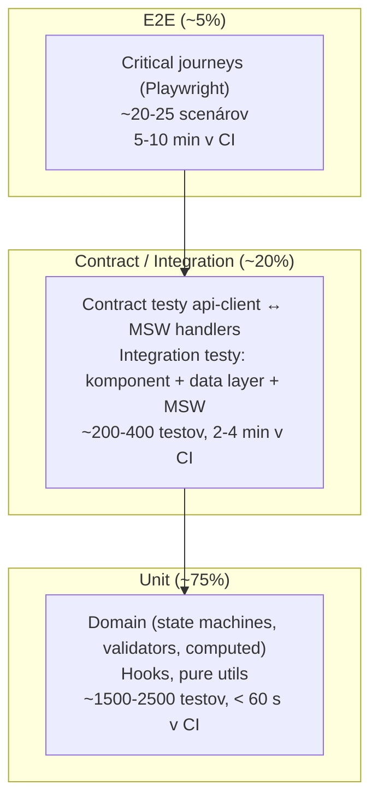
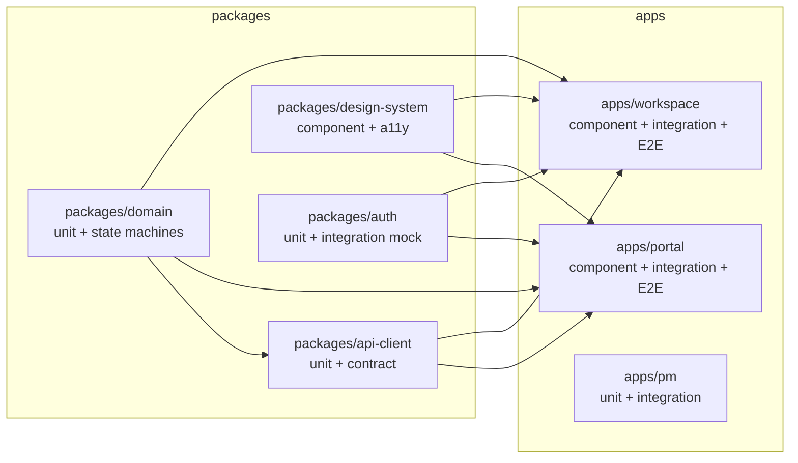
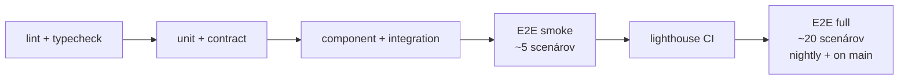

# Test Strategy — SDM-Rewrite

> Round 1, fresh. Stratégia testovania pre obe SPA (`portal`, `workspace`),
> shared packages (`api-client`, `domain`, `design-system`, `auth`) a
> mock backend. Cieľom je **vysoký pomer informačnej hodnoty / minúta CI**,
> nie maximálne pokrytie.
>
> Vstupy: `docs/agents/ux-persona-analyst/journeys.md` (18 user journeys),
> `docs/agents/domain-modeller/lifecycles/*` (5 state machines), `docs/agents/api-analyst/schemas/`
> (12 TS schém + auth + multi-tenancy), GOAL.md §5 (NFR).
>
> **Tech-stack neutralita.** Stratégia opisuje **typy** testov a **kontrakty**,
> nie konkrétne knižnice mimo úroveň "runner needs to support X". Konkrétne
> nástroje volí 06-tech-stack-selector / 08-devex-devops podľa zvoleného
> framework-u.

## 1. Test pyramída



**Rationale pomerov**: SDM-Rewrite je FE nad cudzím backendom. Najviac
chýb sa lapí v dvoch miestach — (a) state machine prechody domény
(unit-overable), (b) integrácia s CA SDM REST schémami (contract-overable
oproti MSW). E2E je drahá poistka pre kritické journeys, nie hlavná
overovacia vrstva.

## 2. Layers — typ, scope, runner, kde žijú

| Layer | Scope | Runner (typ) | Cieľ | Lokácia |
|---|---|---|---|---|
| **Unit — pure** | Funkcie, validátory, formatters, transformátory, parsers v `packages/domain/` a `packages/api-client/` | rýchly node-based runner s ES module supportom (Vitest / Jest — voľba 06+08) | < 5 ms / test | `packages/<pkg>/src/**/*.test.ts` |
| **Unit — state machine** | Lifecycles z `domain-modeller/lifecycles/*` (Incident, Request, Problem, Change, KBArticle) — guards, transitions, side-effects | rovnaký runner ako unit | Pokryté **všetky** prechody zo všetkých 5 state machines + invalid transitions blocked | `packages/domain/src/lifecycles/*.test.ts` |
| **Unit — hooks / utils** | React hooks (alebo Angular services / Vue composables — voľba 06), pure formatters | runner s component-test podporou (RTL ekv. pre zvolený framework) | Render bez DOM = preferované, ak hook DOM nepotrebuje | `apps/*/src/**/*.test.ts` |
| **Component — UI** | Komponenty design-systemu + feature komponenty s deterministickými dátami | runner s real DOM (jsdom / happy-dom) + Testing Library variant | Interakcie, a11y, render snapshots **iba pre design-system** primitív | `packages/design-system/src/**/*.test.tsx`, `apps/*/src/components/**/*.test.tsx` |
| **Integration — UI + data** | Feature komponent → hook → api-client → **MSW** → assertion. Žiadny CA SDM ani BFF v hre. | runner s real DOM + MSW serverom | Pokryté hlavné CRUD flowy per modul (incident triage, request submit, KB search, CMDB CI detail) | `apps/*/src/features/<modul>/__tests__/*.itest.tsx` |
| **Contract — api-client vs. schémy** | `api-client` volá MSW handler odvodený z `docs/agents/api-analyst/schemas/*.ts`. Test verifikuje, že typed klient produkuje payload kompatibilný so schémou a parsuje response správne. | rovnaký runner + MSW + zod (alebo equivalent runtime validator zvolený 06) | Každý endpoint z `endpoints.csv` použitý v MVP má aspoň jeden happy-path + jeden error-path contract test | `packages/api-client/src/**/__contracts__/*.ctest.ts` |
| **E2E — kritické journeys** | Playwright, real browser, real `portal` / `workspace` build, MSW (Playwright route fixture) ako backend | Playwright | Pokryje 18 journeys z `02-ux-persona-analyst` cez tag `@scenario:<journey-id>` | `e2e/<modul>/*.spec.ts` |
| **Performance — Lighthouse CI** | Statický build oboch SPA, Lighthouse audit, performance budget gate | `@lhci/cli` | Prahy v `performance.md` | `tools/lighthouse/` |
| **a11y — automated** | axe-core integrácia v component a E2E layeri | Playwright + `@axe-core/playwright`, vitest-axe v komponentoch | Žiadne `serious` ani `critical` violations | `e2e/**/*.spec.ts` + per-component |

## 3. Per-package + per-app rozdelenie



> Pozn.: `apps/pm` je placeholder pre prípadnú PM-app (zo zoznamu v
> `outputs.md` — ak Architecture potvrdí, že PM bude tooling app, nie len
> CLI). Flag → 04-architecture.

## 4. Test environment matrix

| Environment | Frontend | Backend | Použitie |
|---|---|---|---|
| **unit / contract** | priame `import` modulov | MSW v `node` adapteri | CI pipeline; `vitest` ekv. |
| **integration** | komponent s real DOM | MSW v `node` adapteri | CI pipeline |
| **E2E — local** | dev server (vite ekv.) | MSW v `playwright route` fixture; alternatívne MSW v `worker` mode pri serve-from-dist | CI + dev `npm run e2e` |
| **E2E — staging proti reálnemu CA SDM** | dist build | reálny CA SDM dev tenant (po sprístupnení) | manual + nightly, **nie blocker** pre PR merge |
| **perf** | dist build, static serve | MSW recorded fixtures (deterministic timing) | Lighthouse CI gate |

**Pozn. — staging proti reálnemu CA SDM**: GOAL.md §11 hovorí, že
produkčný backend **nie je počas vývoja dostupný**. Akonáhle bude
dostupný, doplníme **smoke E2E suite** (max 10 scenárov), ktorá overí
contract-level kompatibilitu reálneho CA SDM s našimi MSW handler-mi.
Flag → 08-devex-devops na infra.

## 5. Test naming a tagovanie

Štandard:

- Súbor: `<unit>.test.ts` / `<unit>.itest.ts` / `<unit>.ctest.ts` / `<feature>.spec.ts` (E2E).
- Test name format: `it("<aktér> <robí> <očakávanie>")` — slovenčina v `describe`,
  angličtina v `it` (aby grep cez tagy fungoval v CI logoch).
- Povinné tagy v E2E:
  - `@scenario:<journey-id>` — mapuje na `journeys.md`.
  - `@persona:<persona-id>` — `requester_lucia`, `agent_l1_anna`, atď.
  - `@module:<modul>` — `incident`, `request`, `problem`, `change`, `knowledge`, `cmdb`.
  - `@tenant:multi` / `@tenant:single` — či scenár overuje tenant izoláciu.

Príklad:

```ts
test("@scenario:workspace-incident-triage @persona:agent_l1_anna @module:incident @tenant:multi Anna triages 12 new tickets, closes 3 via KB", async ({ page }) => {
  // ...
});
```

## 6. Test data principles

1. **Deterministická faktória** namiesto ad-hoc literálov — viď `test-data.md`.
2. **Žiadne náhodné UUID** mimo seedovaného RNG (CI musí byť reprodukovateľná).
3. **Jeden faktor per test** — fixture-y pre 18 journeys sa skladajú z primitív
   (`makeIncident`, `makeUser`, `makeTenant`).
4. **Žiadne live API calls v CI** — jediný akceptovaný endpoint je MSW.

## 7. CI integration (kontrakt pre 08-devex-devops)

Pipeline stages (poradie matters — fail-fast):



- **Per PR**: lint+typecheck → unit+contract → component+integration → E2E smoke (5 high-risk scenárov: incident submit, request submit, tenant switch, change approve, KB publish) → Lighthouse CI.
- **Per merge to main + nightly**: full E2E suite (všetkých 18 journeys) + axe full sweep.
- **Per release tag**: + staging E2E (po sprístupnení reálneho CA SDM).

Cieľový čas PR pipeline: **< 8 minút end-to-end**.

## 8. Failure semantics

| Layer | Pri failure | Re-try |
|---|---|---|
| unit / contract | block merge | žiadne — flaky unit = bug |
| integration | block merge | žiadne |
| E2E | block merge | max 2 (viď `flaky-policy.md`) |
| Lighthouse | warning per default, block ak prah viacnásobne porušený (rolling 7-day) | žiadne |
| a11y serious / critical | block merge | žiadne |

## Otvorené závislosti

- `[04-architecture]` Boundary "integration test" závisí od finálnej voľby
  containers (portal/workspace/api-client/design-system/auth + prípadne BFF).
  Tu predpokladáme, že **BFF nie je samostatný test target v MVP** — ak ho
  Architecture zvolí, doplníme `integration-bff` layer s vlastnými MSW
  upstream-y voči CA SDM. Cieľová pomer 75/20/5 by sa neposunul, BFF
  prevezme časť contract-testov z `api-client`.
- `[04-architecture]` Tenant kontext mechanizmus (HTTP header `X-Tenant-ID`
  vs. cookie vs. route prefix vs. JWT claim). Contract testy zatiaľ
  testujú generický "tenant context attached per request" — finálnu
  formu doplníme v round 2 podľa ADR `11-multi-tenancy`.
- `[06-tech-stack-selector]` Voľba unit-test runneru (Vitest / Jest / Karma /
  Cypress component) je závislá na FE framework-u. Stratégia tu hovorí
  iba o **požadovaných schopnostiach** runner-a (ESM, jsdom/happy-dom,
  MSW integration, watch mode, code coverage report).
- `[08-devex-devops]` Konkrétne CI plumbing (GitHub Actions / GitLab CI /
  Jenkins), cache stratégia (pnpm/turbo cache, Playwright browser cache),
  paralelizmus (test shards) — kontrakt na to je v `flaky-policy.md` +
  perf budgety, ale realizácia patrí DevOps.
- `[09-qa]` Smoke E2E suite (~5 scenárov per PR) — zoznam scenárov je
  v `acceptance-criteria.md` (column "Smoke"), ale finálna voľba dáva
  zmysel až po doimplementovaní prvého modulu. **Self-flag** na uzatvorenie
  počas implementačnej fázy projektu.
