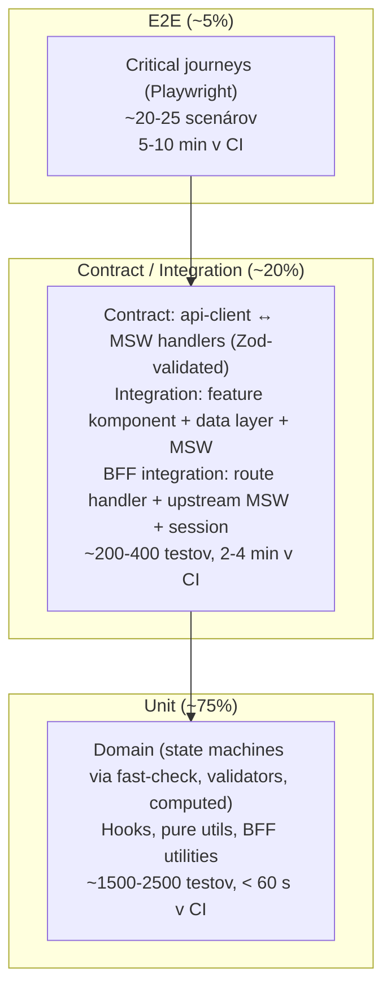
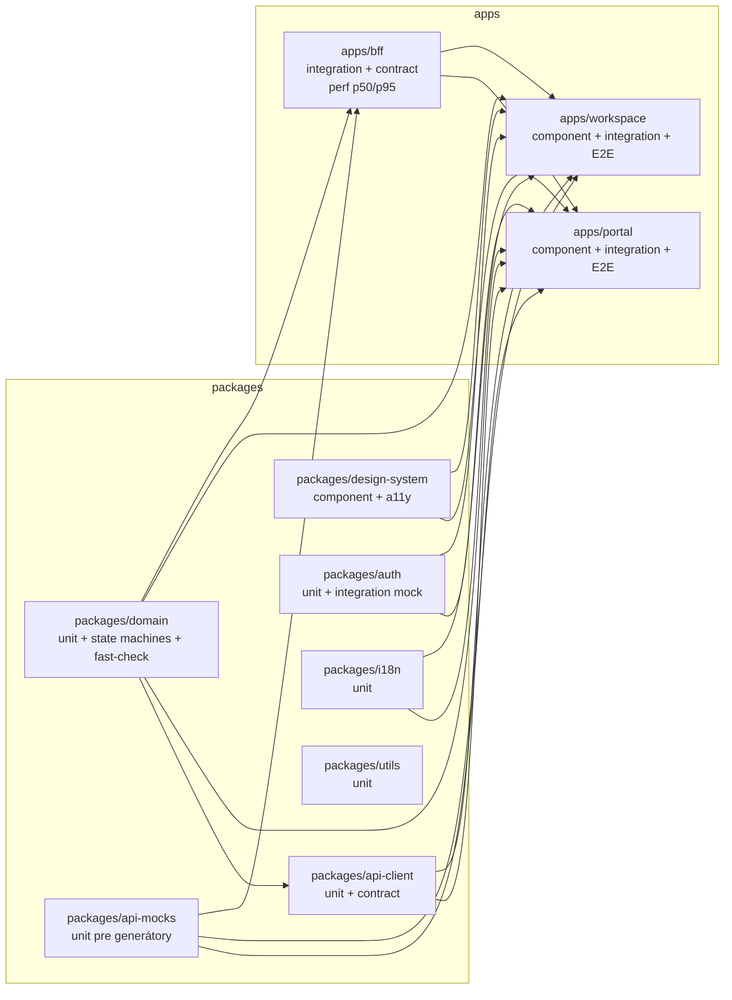
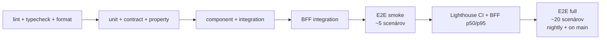

# Test Strategy — SDM-Rewrite

## Changelog (round 2)

- Integration test boundaries zarovnané na 04 container set (`apps/portal`,
  `apps/workspace`, `apps/bff`, `packages/api-client`, `packages/domain`,
  `packages/auth`, `packages/design-system`, `packages/i18n`, `packages/utils`,
  `packages/api-types`, **plus nový `packages/api-mocks`** z 08).
- Pridaný **BFF integration layer** ako vlastný test target (samostatný runtime,
  bezpečnostne kritický). Pomer pyramídy 75/20/5 zostáva — BFF preberá časť
  contract-testov z `api-client`, ale celkové pomery sa neposúvajú.
- Tech stack potvrdený (06 r2): Vitest + Playwright + MSW + Zod + fast-check
  + `@faker-js/faker` + `@mswjs/data`. Self-flag "runner" uzavretý.
- Tenant kontext mechanizmus uzavretý: `X-CA-SDM-Tenant` header (server-side authority
  v BFF session) per ADR-11. Contract testy preformulované z fallback chain na
  jeden mechanizmus.
- 18 user journeys, smoke E2E (5 scenárov), Lighthouse prahy, flaky policy,
  retry rules — všetko stable.
- Otvorené závislosti — uzavreté: 04 BFF boundary, 04 tenant context, 04 routing
  (lazy + route code-split), 06 runner / validator / factory.

> Stratégia testovania pre obe SPA (`portal`, `workspace`), **BFF** (server-side
> proxy do CA SDM 17.4), shared packages (`api-client`, `domain`, `design-system`,
> `auth`, `api-mocks`, `api-types`, `i18n`, `utils`) a mock backend. Cieľom je
> **vysoký pomer informačnej hodnoty / minúta CI**, nie maximálne pokrytie.
>
> Vstupy: `docs/agents/ux-persona-analyst/journeys.md` (18 user journeys),
> `docs/agents/domain-modeller/lifecycles/*` (5 state machines), `docs/agents/api-analyst/schemas/`
> (12 TS schém + auth + multi-tenancy), `docs/agents/architecture/` (containers,
> ADR-11 multi-tenancy, data-flows), `docs/agents/security/*` (test vectors per
> auth / multi-tenancy / OWASP / RBAC), `docs/agents/tech-stack-selector/libraries.md`
> (Vitest + Playwright + MSW), `docs/agents/devex-devops/ci-cd.md` (kde testy bežia
> v pipeline), GOAL.md §5 (NFR).
>
> **Tech-stack konkretne (06 r2 fix)**:
>
> - **Unit / component**: `vitest@1.x` + `@testing-library/react@16.x` + `@testing-library/user-event@14.x`.
> - **E2E**: `playwright@1.x` + `@axe-core/playwright`.
> - **Mock backend**: `msw@2.x` + `@mswjs/data` + `@faker-js/faker` (seeded).
> - **Schema validation**: `zod@3.x` (shared s `api-client`).
> - **Property-based**: `fast-check@3.x` (state machines).
> - **Performance**: `@lhci/cli@0.13.x`.
> - **a11y**: `axe-core@4.x` + `@axe-core/playwright` + `vitest-axe`.

## 1. Test pyramída



**Rationale pomerov**: SDM-Rewrite je FE + BFF nad cudzím komerčným backendom.
Najviac chýb sa lapí v troch miestach — (a) state machine prechody domény
(unit-overable, fast-check property-based), (b) integrácia s CA SDM REST schémami
(contract-overable oproti MSW; Zod validuje payload), (c) BFF tenant scoping
a session lifecycle (BFF integration layer). E2E je drahá poistka pre kritické
journeys, nie hlavná overovacia vrstva.

## 2. Layers — typ, scope, runner, kde žijú

Boundary mapping je teraz 1:1 s 04 container set
(`docs/agents/architecture/components/{bff,portal,workspace}.md` + ADR-11).

| Layer | Scope | Runner | Cieľ | Lokácia |
|---|---|---|---|---|
| **Unit — pure** | Funkcie, validátory, formatters, transformátory, parsers v `packages/domain/`, `packages/api-client/`, `packages/utils/`, BFF utilities v `apps/bff/src/lib/` | `vitest` (node env) | < 5 ms / test | `packages/<pkg>/src/**/*.test.ts`, `apps/bff/src/**/*.test.ts` |
| **Unit — state machine (property)** | Lifecycles z `domain-modeller/lifecycles/*` (Incident, Request, Problem, Change, KBArticle) — guards, transitions, side-effects + **fast-check property-based** invariants | `vitest` + `fast-check` | Pokryté **všetky** prechody zo všetkých 5 state machines + invalid transitions blocked + min 200 fuzz iterations per machine | `packages/domain/src/lifecycles/*.test.ts` |
| **Unit — hooks / utils** | React hooks (TanStack Query hooks, auth hooks), pure formatters, i18n helpers | `vitest` + `@testing-library/react` (jsdom) | Render bez DOM = preferované, ak hook DOM nepotrebuje | `apps/portal/src/**/*.test.ts`, `apps/workspace/src/**/*.test.ts`, `packages/auth/src/**/*.test.ts`, `packages/i18n/src/**/*.test.ts` |
| **Component — UI** | Komponenty design-systemu + feature komponenty s deterministickými dátami | `vitest` + `@testing-library/react` + `vitest-axe` | Interakcie, a11y, render snapshots **iba pre design-system** primitív | `packages/design-system/src/**/*.test.tsx`, `apps/*/src/components/**/*.test.tsx` |
| **Integration — UI + data (per app)** | Feature komponent → hook → TanStack Query → `api-client` → **MSW node server** → assertion. Pre `apps/portal` aj `apps/workspace` zvlášť. **Boundary = jedna app**. | `vitest` + `@testing-library/react` + `msw/node` | Pokryté hlavné CRUD flowy per modul × app (incident triage v workspace, request submit v portal, KB search v oboch, CMDB CI detail v workspace) | `apps/portal/src/features/<modul>/__tests__/*.itest.tsx`, `apps/workspace/src/features/<modul>/__tests__/*.itest.tsx` |
| **Integration — BFF (nový)** | BFF route handler → session middleware → tenant scoping → REST proxy → **MSW v Node mock-uje CA SDM upstream** → assertion. Bezpečnostne kritická vrstva (session, tenant injection, RBAC enforcement, `X-CA-SDM-Tenant` validation). | `vitest` (node env) + `msw/node` + in-memory session store | Pokryté: auth flow (`/auth/login`, `/auth/callback`, `/auth/logout`, `/auth/heartbeat`, `/auth/step-up`), tenant switch (`/me/active-tenant`), aggregator endpoints (`/me/tenants`, `/api/queue`, `/api/tickets/:type/:id`), REST proxy s tenant filter injection, error shape unification (AppError taxonomy), audit log emission per request. | `apps/bff/src/routes/**/*.itest.ts`, `apps/bff/src/middleware/**/*.itest.ts` |
| **Contract — api-client vs. schémy** | `api-client` volá MSW handler odvodený z `docs/agents/api-analyst/schemas/*.ts`. Test verifikuje, že typed klient produkuje payload kompatibilný so **Zod** schémou a parsuje response správne. | `vitest` + `msw/node` + `zod` runtime parse | Každý endpoint z `endpoints.csv` použitý v MVP má aspoň jeden happy-path + jeden error-path contract test | `packages/api-client/src/**/__contracts__/*.ctest.ts` |
| **Contract — BFF vs. CA SDM (nový)** | BFF posiela správny payload smerom k CA SDM upstream. MSW mockuje CA SDM, test verifikuje, že BFF produkuje očakávaný `X-AccessKey`, `X-Role`, defenzívny `WC=tenant%3DU'<id>'` filter, XML→JSON conversion a error mapping. | `vitest` + `msw/node` | Každý CA SDM endpoint, ktorý BFF volá, má kontrakt overený | `apps/bff/src/proxy/**/__contracts__/*.ctest.ts` |
| **E2E — kritické journeys** | Playwright, real browser, real `portal` / `workspace` build s **MSW worker** (Playwright route fixture importuje handler set z `@sdm/api-mocks`) ako backend. BFF beží ako reálny proces lokálne (alebo MSW-stub-nutý per scenár). | `playwright@1.x` | Pokryje 18 journeys z `02-ux-persona-analyst` cez tag `@scenario:<journey-id>` | `e2e/<modul>/*.spec.ts` |
| **Performance — Lighthouse CI** | Statický build oboch SPA + dev BFF, Lighthouse audit, performance budget gate | `@lhci/cli@0.13.x` | Prahy v `performance.md` (vrátane BFF p50/p95) | `tools/lighthouse/` |
| **a11y — automated** | axe-core integrácia v component a E2E layeri | `playwright@1.x` + `@axe-core/playwright`, `vitest-axe` v komponentoch | Žiadne `serious` ani `critical` violations | `e2e/**/*.spec.ts` + per-component |

### 2.1 Boundary mapping — kontajner ↔ test layer

| Container (04) | Owner test layer | Sekundárny test layer |
|---|---|---|
| `apps/portal` | Integration (per app) | E2E, component |
| `apps/workspace` | Integration (per app) | E2E, component |
| `apps/bff` | Integration BFF + Contract BFF | E2E (smoke, cez SPA) |
| `packages/api-client` | Contract | Unit |
| `packages/domain` | Unit (property + state machine) | Integration (cez consumer apps) |
| `packages/auth` | Unit + Integration (per app) | E2E (auth flows) |
| `packages/design-system` | Component | a11y, E2E |
| `packages/i18n` | Unit | Integration (per app) |
| `packages/utils` | Unit | – |
| `packages/api-types` | typecheck only (zdielané typy z domain) | – |
| `packages/api-mocks` | Unit (generátory + fixtures); samotné handlers sa kryjú cez integration/contract layer | Contract |

Žiadny package nie je bez majiteľa testovacej vrstvy. Nový `packages/api-mocks`
má vlastný coverage prah (viď `coverage-targets.md`).

## 3. Per-package + per-app rozdelenie



> 04 r2 finalizoval container set — `apps/pm` z r1 placeholderu **nepatrí** do
> MVP (žiadna PM-app, len CLI tooling v `tools/`). Self-flag k `apps/pm`
> uzavretý — package zo stratégie odstránený.

## 4. Test environment matrix

| Environment | Frontend | BFF | Backend (CA SDM) | Použitie |
|---|---|---|---|---|
| **unit / contract** | priame `import` modulov | nie (BFF má vlastný unit) | MSW v `node` adapteri | CI pipeline; `vitest` |
| **integration — app** | feature komponent v jsdom | volania na BFF mocknuté cez `msw/node` (handler import z `@sdm/api-mocks`) | nepoužité (MSW handler na BFF úrovni stačí) | CI pipeline |
| **integration — BFF** | nie | BFF route + session middleware (real code, in-memory session store) | MSW v `node` adapteri mockuje CA SDM REST upstream | CI pipeline |
| **E2E — local** | dev server (vite) | reálny BFF (`pnpm dev:bff`) **alebo** MSW worker (Playwright route fixture importuje handler list z `@sdm/api-mocks/browser`) | MSW (cez BFF upstream alebo priamo) | CI + dev `pnpm e2e` |
| **E2E — staging proti reálnemu CA SDM** | dist build | reálny BFF v staging | reálny CA SDM dev tenant (po sprístupnení) | manual + nightly, **nie blocker** pre PR merge |
| **perf** | dist build, static serve | dev BFF | MSW recorded fixtures (deterministic timing) | Lighthouse CI gate; BFF p50/p95 meranie cez k6 alebo similar (post-MVP) |

**Pozn. — staging proti reálnemu CA SDM**: GOAL.md §11 hovorí, že produkčný
backend **nie je počas vývoja dostupný**. Akonáhle bude dostupný, doplníme
**smoke E2E suite** (max 10 scenárov), ktorá overí contract-level kompatibilitu
reálneho CA SDM s našimi MSW handler-mi.

## 5. Test naming a tagovanie

Štandard:

- Súbor: `<unit>.test.ts` / `<unit>.itest.ts` / `<unit>.ctest.ts` / `<feature>.spec.ts` (E2E).
- Test name format: `it("<aktér> <robí> <očakávanie>")` — slovenčina v `describe`,
  angličtina v `it` (aby grep cez tagy fungoval v CI logoch).
- Povinné tagy v E2E:
  - `@scenario:<journey-id>` — mapuje na `journeys.md`.
  - `@persona:<persona-id>` — `requester_lucia`, `agent_l1_anna`, atď.
  - `@module:<modul>` — `incident`, `request`, `problem`, `change`, `knowledge`, `cmdb`.
  - `@tenant:multi` / `@tenant:single` — či scenár overuje tenant izoláciu.
  - `@security:<vector-id>` — pre security-relevant journeys (login, refresh,
    logout, tenant-switch, RBAC denial, audit log emission). Mapuje na sekciu
    "Security test vectors" v `acceptance-criteria.md`.

Príklad:

```ts
test("@scenario:workspace-incident-triage @persona:agent_l1_anna @module:incident @tenant:multi @security:tenant-switch Anna triages 12 new tickets, switches tenant mid-flow, queue refetched", async ({ page }) => {
  // ...
});
```

## 6. Test data principles

1. **Deterministická faktória** namiesto ad-hoc literálov — viď `test-data.md`.
2. **Žiadne náhodné UUID** mimo seedovaného RNG (`@faker-js/faker` so seed=42).
3. **Jeden faktor per test** — fixture-y pre 18 journeys sa skladajú z primitív
   (`makeIncident`, `makeUser`, `makeTenant`).
4. **Žiadne live API calls v CI** — jediný akceptovaný endpoint je MSW.
5. **Schema-validated fixtures** — každá factory funkcia v `@sdm/api-mocks`
   vyrobí output, ktorý prejde Zod schémou z `docs/agents/api-analyst/schemas/`
   (regression guard cez `tools/test-fixture-validator.ts`).

## 7. CI integration (kontrakt pre 08-devex-devops)

Pipeline stages (poradie matters — fail-fast). 08 r2 ho má implementovaný cez
GitHub Actions matrix:



- **Per PR**: lint+typecheck → unit+contract+property → component+integration → BFF integration → E2E smoke (5 high-risk scenárov: incident submit, request submit, tenant switch, change approve, KB publish) → Lighthouse CI + BFF perf smoke.
- **Per merge to main + nightly**: full E2E suite (všetkých 18 journeys) + axe full sweep + BFF perf full meranie.
- **Per release tag**: + staging E2E (po sprístupnení reálneho CA SDM).

Cieľový čas PR pipeline: **< 8 minút end-to-end**.

## 8. Failure semantics

| Layer | Pri failure | Re-try |
|---|---|---|
| unit / contract / property | block merge | žiadne — flaky unit = bug |
| integration (app / BFF) | block merge | max 1 (rare async timing edge cases — viď `flaky-policy.md`) |
| E2E | block merge | max 2 (viď `flaky-policy.md`) |
| Lighthouse | warning per default, block ak prah viacnásobne porušený (rolling 7-day) | žiadne |
| BFF perf (p50/p95) | warning per default (MVP), block ak prah viacnásobne porušený | žiadne |
| a11y serious / critical | block merge | žiadne |

## 9. Tech-stack alignment summary (po 06 r2)

Po 06 round 2 fixácii sú všetky stack-závislé voľby vyriešené:

| Aspekt | Voľba | Zdroj |
|---|---|---|
| Test runner (unit / integration / contract) | `vitest@1.x` | 06 libraries §11 |
| Component testing | `@testing-library/react@16.x` + `@testing-library/user-event@14.x` | 06 libraries §11 |
| E2E | `playwright@1.x` | 06 libraries §12 |
| Mock backend | `msw@2.x` + `@mswjs/data@0.16.x` | 06 libraries §13 + 08 mock-strategy |
| Fixture data | `@faker-js/faker@9.x` (seeded) | 08 mock-strategy |
| Schema validation | `zod@3.x` (shared FE + BFF) | 06 libraries §3 |
| Property-based | `fast-check@3.x` | self (potvrdené pre `packages/domain`) |
| a11y | `axe-core@4.x` + `@axe-core/playwright` + `vitest-axe` | 09 self |
| Performance | `@lhci/cli@0.13.x` | 09 self |
| KB content sanitization test target | `DOMPurify` / `rehype-sanitize` (per 06 r2 voľba) | 06 libraries §17 (markdown render — `react-markdown` + sanitization) |
| Charts visual test target | `recharts@2.x` (post-MVP KB analytics) | 06 libraries §17 |

## Otvorené závislosti

- `[01-api-analyst]` GAP-1..GAP-4 (dynamic form schema, cross-tenant linking,
  cross-tenant viewer rola, KB analytics endpoint) — pretrváva. Test stratégia
  obsahuje placeholdery (acceptance-criteria.md alternates), po post-conv pre 01
  sa doplnia konkrétne test vectors.
- `[02-ux-persona-analyst]` SR alternative pre CMDB graph view — pretrváva.
  QA prijíma `<table>` fallback ako default per `a11y-tests.md` §3.3
  (alebo post-conv pre 02 doplní wireframe).
- `[05-security]` emergency 2FA challenge type — default = TOTP
  (`[business-deferred]` — biznis rozhodnutie nie blocker pre test stratégiu;
  E2E mock-ne TOTP challenge, alternatívne flow doplní 05 keď bude rozhodnutie).
- `[09-qa]` Smoke E2E suite (5 scenárov) — uzavreté ako default (`portal-incident-broken-laptop`,
  `portal-request-software`, `workspace-incident-triage`, `workspace-change-emergency-approve`,
  `workspace-cmdb-cross-tenant-shared`). Kalibrácia po prvom module ostáva
  v post-conv self-flag.
- `[04-architecture]` BFF boundary — `[resolved-in-round-2]` (BFF samostatný
  test target, dva nové layer-y: BFF integration + BFF contract).
- `[04-architecture]` tenant context mechanizmus — `[resolved-in-round-2]`
  (`X-CA-SDM-Tenant` header per ADR-11; contract test verifikuje 1 mechanizmus, nie
  fallback chain).
- `[04-architecture]` routing strategy / lazy-load — `[resolved-in-round-2]`
  (React Router v6 lazy + route-level code-split per ADR-05; per-route bundle
  budget v `performance.md`).
- `[04-architecture]` new packages (`packages/api-mocks`) — `[resolved-in-round-2]`
  (coverage prahy doplnené v `coverage-targets.md`).
- `[06-tech-stack-selector]` runner / schema validator / factory lib —
  `[resolved-in-round-2]` (Vitest / Zod / `@mswjs/data` + `@faker-js/faker`).
- `[07-design-system]` a11y primitive / color tokens / keyboard shortcuts —
  `[resolved-in-round-2]` (78 komponentov s a11y kontraktmi v `design-system/a11y.md`
  + `components.md`; keyboard shortcuts v `?` overlay s `@aria-keyshortcuts`).
- `[08-devex-devops]` CI plumbing / LHCI / flaky bot / MSW worker / lint rules —
  `[resolved-in-round-2]` (GitHub Actions matrix v 08 `ci-cd.md`, MSW worker v
  `mock-strategy.md`, Husky + lint-staged v `repo-bootstrap.md`).
