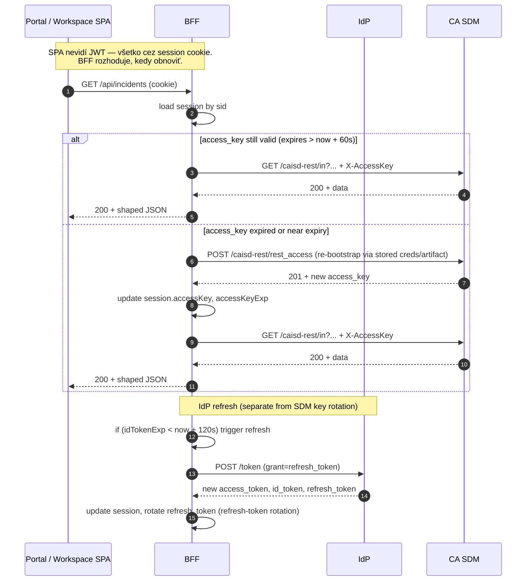
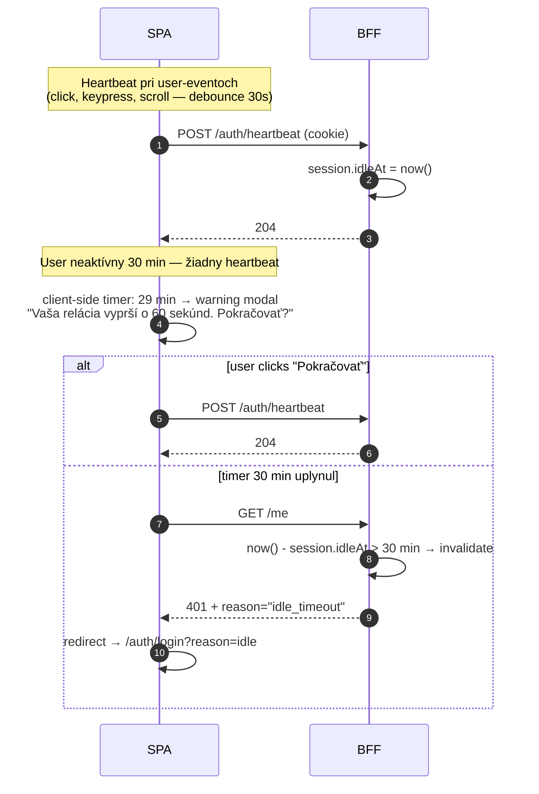
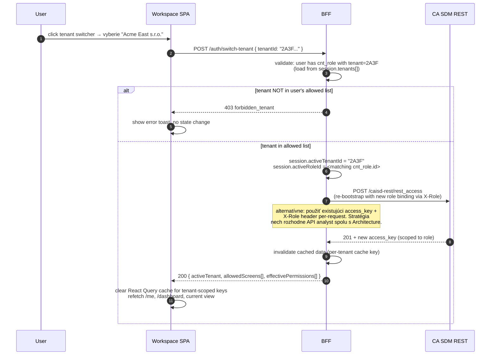
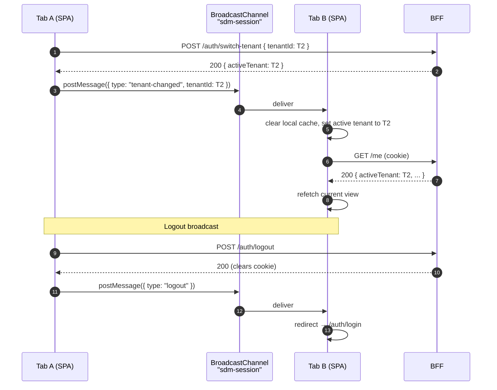
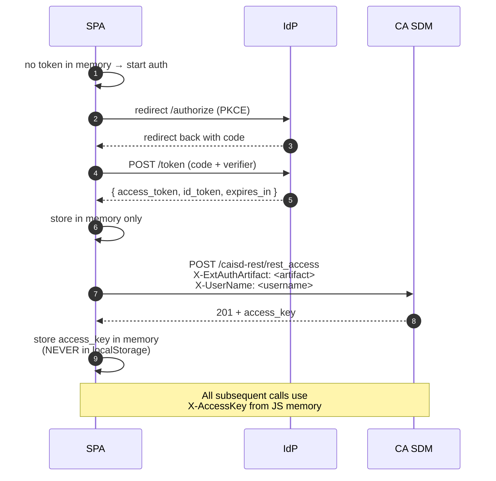

# Auth Flow — SDM-Rewrite

## Changelog (round 2)

- **Variant A povýšený na canonical** po 04 ADR 01 = BFF=YES (`docs/agents/architecture/decision-records/01-bff.md`).
- Variant B presunutý do prílohy ako **legacy no-BFF fallback** — slúži už len ako referencia, nie reálne alternatívne riešenie.
- Tenant switch + cross-tab sync používa header `X-CA-SDM-Tenant` podľa 04 ADR 11 (`docs/agents/architecture/decision-records/11-multi-tenancy.md`).
- Hodnoty `idleTimeout = 30 min` (oba aplikácie, default), `stepUpTtl = 5 min`, `reopenTimeBox = 7 dní`, `bulkStepUpThreshold = > 50` — zharmonizované s `audit-and-compliance.md` a `multi-tenancy-security.md` r2.
- OIDC client lib (BFF) a JWT validation lib uzavreté: BFF používa stack-rozhodnutie 06 (`docs/agents/tech-stack-selector/libraries.md` §16 — žiadna FE OIDC knižnica, BFF si vyberie `openid-client` + `jose` ekv. v 06 r2). Tento dokument zostáva IdP-agnostic.

> Cieľ: definovať autentifikačný a tokenový flow pre dve SPA aplikácie
> (`portal`, `workspace`) nad CA SDM 17.4. Auth model je **IdP-agnostic** —
> popisuje kontrakt OIDC / SAML s corp IdP (typicky Azure AD / Keycloak),
> nezamyká sa na konkrétny produkt.
>
> Vstupy: `docs/agents/api-analyst/auth.md`, `docs/agents/api-analyst/multi-tenancy.md`,
> `docs/agents/architecture/decision-records/01-bff.md`,
> `docs/agents/architecture/decision-records/11-multi-tenancy.md`,
> GOAL.md §4, §5, §8.

## 0. TL;DR a default-y (canonical po r2)

| Rozhodnutie | Hodnota | Justifikácia |
|---|---|---|
| Protokol IdP | **OIDC (Authorization Code + PKCE)** ako default; SAML 2.0 (SP-initiated) ak corp IdP nevie OIDC | corp IdP voľba (DevOps + Security spoločne) |
| Token handling | **BFF + httpOnly session cookie** (canonical) | 04 ADR 01 (resolved) |
| CA SDM auth | REST `POST /caisd-rest/rest_access` (Basic, alebo EEM Artifact pri OIDC↔SAML bridgi); BOPSID pre seamless transition zo starého webclienta | API Analyst §1.1–1.3 |
| Token lifetime (FE↔BFF) | Access cookie: 15 min; Refresh cookie: 8 h (sliding) | Security |
| CA SDM Access Key lifetime | server-side, default per `expiration_date`, BFF rotuje | API Analyst §6 |
| Idle timeout | **30 min** od posledného user-eventu (portal aj workspace; configurable per tenant) | Security r2 (finalized) |
| Step-up TTL | **5 min** po MFA prompt | `multi-tenancy-security.md` §6 |
| Bulk step-up threshold | **> 50** záznamov | r2 finalized |
| Reopen time-box (requester own) | **7 dní** od `resolve_date` | r2 finalized |
| Tenant switch | re-fetch session na BFF, **bez** re-loginu (re-auth len pri SP cross-tenant enable) | Security |
| Tenant context header (FE → BFF) | `X-CA-SDM-Tenant: <activeTenantId>` | 04 ADR 11 (resolved) |

> **Status variantov po r2**: Variant A (BFF + httpOnly cookie) je **canonical**.
> Variant B (no-BFF) je v prílohe (§ A) ako legacy referencia.

## 1. Slovník

| Pojem | Význam |
|---|---|
| **IdP** | Identity Provider — corp Azure AD / Keycloak / iné. Vydáva ID Token + Access Token (OIDC) alebo SAML Assertion. |
| **BFF** | Backend-for-Frontend — Node/Java/Go proces, ktorý vlastní session cookies a hovorí s CA SDM v mene SPA. |
| **Session cookie** | `__Host-sdm.sid` (httpOnly, Secure, SameSite=Lax, Path=/), len BFF k nej má prístup. |
| **Access Key (SDM)** | `X-AccessKey: <numeric>` — token vydaný CA SDM REST endpointom `POST /caisd-rest/rest_access`. Drží ho **iba BFF**. |
| **Tenant context** | `{ tenantId, roleId }` aktívneho tenanta používateľa, držaný v session. |

## 2. Canonical flow — OIDC + BFF + httpOnly session

> Toto je **jediný** happy-path auth flow po r2. BFF=YES je rozhodnutý
> (04 ADR 01). Diagramy v sekcii 2.1–2.6 sú smerodajné pre QA test
> vectors (§ 8) aj pre 09 acceptance criteria.

### 2.1 Sekvenčný diagram — login

```mermaid
sequenceDiagram
    autonumber
    participant U as User (browser)
    participant SPA as Portal / Workspace SPA
    participant BFF as BFF
    participant IdP as IdP (OIDC)
    participant SDM as CA SDM REST

    U->>SPA: open portal.<org>
    SPA->>SPA: detect "no session cookie"
    SPA->>BFF: GET /auth/login?redirect=/dashboard
    BFF->>BFF: generate state, nonce, code_verifier
    BFF->>BFF: store {state,nonce,verifier,redirect} in short-TTL cache (5 min)
    BFF-->>U: 302 → IdP /authorize?<br/>response_type=code&client_id=...&<br/>redirect_uri=https://bff.../auth/callback&<br/>scope=openid+profile+email+sdm_roles&<br/>state=<s>&nonce=<n>&code_challenge=<cc>&<br/>code_challenge_method=S256
    U->>IdP: GET /authorize (user authenticates)
    IdP-->>U: 302 → BFF /auth/callback?code=<c>&state=<s>
    U->>BFF: GET /auth/callback?code=<c>&state=<s>
    BFF->>BFF: verify state, load verifier
    BFF->>IdP: POST /token<br/>grant=authorization_code&code=<c>&<br/>code_verifier=<v>&redirect_uri=...
    IdP-->>BFF: {access_token, id_token, refresh_token, expires_in}
    BFF->>BFF: validate id_token (sig, iss, aud, nonce, exp)
    BFF->>BFF: extract claims {sub, email, sdm_user_id, sdm_roles[]}

    Note over BFF,SDM: SDM access bootstrap via EEM Artifact bridge
    BFF->>SDM: POST /caisd-rest/rest_access<br/>X-ExtAuthArtifact: <artifact-from-id-token><br/>X-UserName: <claim:preferred_username>
    SDM-->>BFF: 201 + <access_key>, <expiration_date>

    BFF->>BFF: create session record:<br/>{sid, userId, accessKey, accessKeyExp,<br/>refreshToken, tenants[], activeTenantId, idleAt}
    BFF-->>U: 302 → SPA /dashboard<br/>Set-Cookie: __Host-sdm.sid=<sid>;<br/>HttpOnly; Secure; SameSite=Lax; Path=/
    U->>SPA: GET /dashboard (cookie attached)
    SPA->>BFF: GET /me
    BFF-->>SPA: 200 { user, activeTenant, tenants[], roles[], featureFlags }
```

**Kľúčové vlastnosti loginu:**

- **PKCE** je povinné aj pre confidential client — chráni pred code interception.
- **State + nonce** validácia chráni proti CSRF a token-injection.
- **CA SDM Access Key sa nikdy nevracia do prehliadača** — žije len v BFF session store (in-memory v MVP single-instance per 04 `components/bff.md` §2.2 + 04 ADR 01; Redis post-MVP, gating na `[08-devex-devops] session-store`).
- Mapovanie IdP claims → CA SDM identita: claim `sub` alebo `preferred_username` matchuje `cnt.userid` (alternatívne `cnt.email`).

### 2.2 Sekvenčný diagram — token refresh (FE strana)



**Refresh policy:**

- BFF rotuje **dve** veci nezávisle: (a) CA SDM Access Key (cca každých 30 min); (b) IdP refresh token (per token-rotation pravidlá).
- Refresh-token rotation je povinný: pri každom použití IdP vydá nový a invaliduje starý. Re-use detection (IdP-side) ukončí sessionu.
- SPA nemá žiadny pojem o refresh-token expirácii. BFF posiela `401 + WWW-Authenticate: SDM session expired` keď ani refresh nepomáha → SPA re-loguje cez `/auth/login`.

### 2.3 Sekvenčný diagram — logout

```mermaid
sequenceDiagram
    autonumber
    participant U as User
    participant SPA as SPA
    participant BFF as BFF
    participant IdP as IdP
    participant SDM as CA SDM

    U->>SPA: click "Logout"
    SPA->>BFF: POST /auth/logout (cookie)
    BFF->>SDM: DELETE /caisd-rest/rest_access/<keyId> + X-AccessKey
    SDM-->>BFF: 204
    par revoke at IdP
        BFF->>IdP: POST /revoke (refresh_token)
        IdP-->>BFF: 200
    and clear session
        BFF->>BFF: delete session by sid
    end
    BFF-->>SPA: 200<br/>Set-Cookie: __Host-sdm.sid=; Max-Age=0; HttpOnly; Secure; SameSite=Lax
    SPA->>SPA: redirect → IdP /endsession?id_token_hint=<jwt><br/>(OIDC RP-initiated logout)
    Note over U,IdP: IdP terminuje SSO session.<br/>Po návrate user vidí login screen.
```

**Logout invariants:**

- **3 invalidácie** musia prebehnúť: CA SDM Access Key (DELETE), IdP refresh token (revoke), BFF session (delete).
- Ak ktorýkoľvek z týchto krokov zlyhá, BFF **stále** zmaže lokálnu sessionu a vráti success — UX nesmie viaznuť na flaky network. Failures sa logujú do audit logu (viď `audit-and-compliance.md`).
- RP-initiated logout (`/endsession`) je best-effort — nie každý IdP ho podporuje a nie každý ho povolí pre cross-tab.

### 2.4 Sekvenčný diagram — idle timeout



**Parametre idle timeout (r2 finalized):**

| App | Default idle | Override per tenant |
|---|---|---|
| `portal` | **30 min** | áno (admin config 5–120 min) |
| `workspace` | **30 min** | áno (5–120 min) |

> r1 návrh diferencovaného idle (15 min workspace / 30 min portal) bol r2 zjednotený
> na 30 min pre obe aplikácie — alignment s 04 `components/bff.md` §2.2 (Session
> manager: Idle timeout 30 min default). Kratší idle pre workspace bol nepraktický
> (agenti často držia ticket otvorený dlhé minúty pri research-i), výhody PII
> ochrany zabezpečuje absolútny 8 h cap a Workspace-špecifický cookie scope.

### 2.5 Sekvenčný diagram — tenant switch



**Tenant switch invariants (security):**

1. **Server-side validácia** — BFF nikdy nedôveruje `tenantId` z requestu sám; overí proti session.tenants[] (load-and-cache pri logine).
2. **Žiadne re-auth** v happy path — SSO session pretrváva, mení sa len SDM `X-Role` / Access Key binding.
3. **Cache invalidation** je obojstranná:
   - SPA — vyprázdni React Query / SWR cache pre kľúče obsahujúce starý `tenantId`.
   - BFF — drop per-tenant cache (response aggregation cache).
4. **Open tabs problem** — keď user prepne tenant v tabe A, tab B nemá broadcast event. Riešenie: BroadcastChannel API na klientskej strane + cookie verzia (`__Host-sdm.tenantVer`), ktorú každý tab pri navigácii porovná. Mismatch → reload aktuálnej stránky s novým tenantom.
5. **No cross-tenant data leak**: per-tenant cache key obsahuje `tenantId` ako súčasť kľúča (`/api/incidents?tenant=2A3F...`).
6. **Audit log** — každý switch sa loguje s `{userId, fromTenant, toTenant, ts, ip, ua}`. Viď `audit-and-compliance.md`.

### 2.6 Cross-tab synchronizácia



## 3. Príloha: variant B — legacy no-BFF fallback

> **Status po r2**: variant B je archivovaný v sekcii § A (na konci dokumentu).
> Nepoužíva sa, BFF=YES po 04 ADR 01. Príloha existuje len ako historická
> referencia pre prípad re-evaluácie architektúry v post-MVP.

## 4. Token contract (FE ↔ BFF)

### 4.1 Cookie definícia

```
Set-Cookie: __Host-sdm.sid=<opaque-32B-base64url>;
            HttpOnly;
            Secure;
            SameSite=Lax;
            Path=/;
            Max-Age=28800;
```

| Atribút | Hodnota | Prečo |
|---|---|---|
| `__Host-` prefix | required | Wymusza Path=/, Secure, no Domain attr — zabraňuje sub-domain hijacking. |
| `HttpOnly` | true | JS nemá prístup → XSS nevie ukradnúť. |
| `Secure` | true | Iba HTTPS. |
| `SameSite=Lax` | – | CSRF mitigation (Strict by blokoval IdP redirect na BFF; Lax povoľuje top-level navigation). |
| `Path=/` | – | Cookie sa posiela na všetky BFF endpointy. |
| `Max-Age=28800` | 8h | Absolute upper bound. Sliding window cez `idleAt` (30 min idle, r2). |

### 4.2 CSRF protection

Pre **mutating** requesty (POST/PUT/PATCH/DELETE) BFF vyžaduje:

```
X-CSRF-Token: <token>
```

Token sa získa pri prvom `GET /me` ako súčasť JSON odpovede a SPA si ho drží v memory. Token je per-session, rotuje sa pri tenant switch a re-loguje. Validácia: HMAC-SHA256 zo `session.sid + tenantId + nonce`, secret v BFF env.

```js
// SPA fetch wrapper
fetch("/api/incidents", {
  method: "POST",
  credentials: "include",         // posiela cookie
  headers: {
    "Content-Type": "application/json",
    "X-CSRF-Token": csrfToken,    // z memory
  },
  body: JSON.stringify(payload),
});
```

### 4.3 Tenant header — `X-CA-SDM-Tenant`

Každý mutating + read API call z SPA na BFF posiela header `X-CA-SDM-Tenant: <activeTenantId>`
(per 04 ADR 11). BFF tento header **revaliduje** proti `session.activeTenantId`:

| Match | Akcia |
|---|---|
| `X-CA-SDM-Tenant` chýba | BFF použije `session.activeTenantId` (kompatibilita), audit warning. |
| `X-CA-SDM-Tenant === session.activeTenantId` | Proceed. |
| `X-CA-SDM-Tenant !== session.activeTenantId` | 409 `TENANT_MISMATCH` (per 04 ADR 11 § two-tab pattern) + `correctTenantId` v body → SPA auto-reload. Audit event `tenant.mismatch.detected`. |

Header je **informačný / audit-friendly**, autorita je v session. Defense-in-depth — viď `multi-tenancy-security.md` §3.

### 4.4 Heartbeat endpoint

```
POST /auth/heartbeat
  cookie: __Host-sdm.sid=<sid>
→ 204 No Content      (idleAt updated)
→ 401                 (session expired or idle)
```

SPA volá heartbeat **iba** pri user-eventoch (click, keypress, focus), nie na timer. Debounce 30 s.

### 4.5 `/me` endpoint contract

```typescript
GET /me  →  200
{
  user: {
    id: string;          // contact.id
    userId: string;      // contact.userid (login name)
    email: string;
    displayName: string;
    avatarUrl?: string;
  },
  tenants: Array<{
    id: string;
    name: string;
    isServiceProvider: boolean;
    roles: Array<{ id: string; name: string; uiRole: UIRole }>;
  }>,
  activeTenant: {
    id: string;
    activeRoleId: string;
    effectivePermissions: Permission[];   // viď rbac.md
  },
  uiRole: UIRole;        // requester | agent_l1 | agent_l2 | change_manager | kb_editor | cmdb_owner | sp_admin
  app: "portal" | "workspace";
  csrfToken: string;     // per-session, validuje BFF na mutácie
  featureFlags: Record<string, boolean>;
  i18n: { locale: "sk" | "en"; tz: string };
  session: {
    idleTimeoutSec: number;
    absoluteExpiresAt: string; // ISO
  }
}
```

## 5. Bootstrap mapping IdP → CA SDM

CA SDM REST API podporuje tri spôsoby autentifikácie po OIDC/SAML SSO. Preferencia:

| Poradie | Metóda | Kedy |
|---|---|---|
| 1 | **EEM Artifact** (`X-ExtAuthArtifact` + `X-UserName`) | Ak corp IdP vie vydať EEM artifact (cez Broadcom EEM proxy). Najsilnejšia integrácia. |
| 2 | **BOPSID bridge** | Ak existuje legacy CA SDM webclient session, ktorú treba "preniesť" do nového FE. |
| 3 | **Service Account fallback** | Krajnosť — BFF má service-account Basic credentials a impersonuje používateľa cez `X-UserName`. Iba ak EEM nie je deployable. Audit log MUSÍ označiť impersonated calls. |

Detail kontraktov endpointov je v `docs/agents/api-analyst/auth.md` §1.1–1.3.

### 5.1 Claim mapping

| IdP claim | CA SDM equivalent | Použitie |
|---|---|---|
| `sub` | `cnt.id` (UUID) | Primárny identifikátor — ak IdP vie publikovať. |
| `preferred_username` | `cnt.userid` | Login name — fallback ak nemáme `sub`. |
| `email` | `cnt.email` | Sekundárny match key + zobrazenie. |
| `name` / `given_name` + `family_name` | `cnt.last_name`, `cnt.first_name` | Display only. |
| `groups[]` | mapuje sa na CA SDM rolu cez **role-mapping config** (BFF env) | Iba pre **bootstrap** prvého logina; CA SDM rola je zdroj pravdy potom. |
| custom `tenant_hint` | filtruje zoznam tenantov | Optional — pre Multi-IdP environments. |

> ⚠️ **Justifikácia**: CA SDM role-y sú zdroj pravdy pre RBAC (viď `rbac.md`).
> IdP `groups[]` claim sa používa LEN pre bootstrap mapping pri prvom prihlásení
> (vytvorenie `cnt_role` recordu). Po vytvorení sa role spravujú v CA SDM admin
> UI. Toto musí byť explicitne potvrdené Architecture/DevOps — flag nižšie.

## 6. Failure modes — error handling

| Failure | HTTP | UX |
|---|---|---|
| IdP `/token` zlyhá (network) | 502 z BFF | Retry s exp. backoff (3×), potom redirect na error page s `incident_id`. |
| IdP `/token` vráti `invalid_grant` | 400 z BFF | Refresh token expiroval → full re-auth. |
| Nonce/state mismatch | 400 z BFF | Forensic event: log + abort, redirect na login. Možný CSRF útok. |
| CA SDM `rest_access` 401 (basic disabled) | 503 z BFF | Tenant admin error — fallback na BOPSID alebo eskalácia. |
| CA SDM `rest_access` 401 (no API role on cnt) | 403 z BFF | UX: "Váš účet nemá oprávnenie pre tento systém. Kontaktujte admina." |
| Session cookie chýba na ne-auth endpointe | 401 z BFF | SPA → /auth/login. |
| Tenant switch — user nemá role v tom tenante | 403 z BFF | Toast: "Tento tenant nie je vo vašom zozname rolí." |
| Idle timeout | 401 + `reason=idle_timeout` | Modal s "Vaša relácia vypršala. Prihláste sa znova." |

## 7. Mobilná verzia (portal)

Portál sa otvára aj z mobilov (persona `requester_lucia`, GOAL §5). Mobile auth invariants:

- **Žiadny `localStorage` pre tokeny** ani na mobile. PWA / WebView používa rovnaký cookie-flow.
- Touch ID / biometrics: **mimo MVP scope**. Ak by sa otvorila požiadavka, IdP musí podporovať WebAuthn step-up.
- Mobile-first: tlačidlo "Sign in with SSO" je primárna landing akcia.

## 8. Test-vector — kontrolný zoznam pre QA

Tento zoznam je vstup pre QA agent (`09-qa-test-strategy`):

- [ ] Login happy path: SPA → BFF → IdP → BFF → SDM → SPA s validnou cookie.
- [ ] State mismatch v callback → abort + audit log.
- [ ] Nonce mismatch v id_token → abort + audit log.
- [ ] CSRF: POST bez `X-CSRF-Token` → 403.
- [ ] CSRF: POST s expired/wrong CSRF token → 403.
- [ ] Idle timeout: 30 min bez heartbeat → 401 na ďalší call.
- [ ] Tenant switch happy: user s 2 tenantmi, switch → cookie verzia rotuje, SPA cache invaliduje.
- [ ] Tenant switch attack: forge `tenantId` mimo session.tenants[] → 403, audit event "forbidden_tenant_switch".
- [ ] Logout: cookie zmazaná, BFF session deleted, CA SDM Access Key DELETE-d, IdP refresh revoked.
- [ ] Cross-tab tenant sync: prepnutie v tab A → tab B refetch.
- [ ] Re-use detection: použiť starý refresh token po rotácii → IdP terminuje celú sessionu.
- [ ] XSS: simulovaný script v UGC poli nemá prístup k cookie (HttpOnly).

## Otvorené závislosti

- `[04-architecture]` BFF rozhodnutie — `[resolved-in-round-2]` 04 ADR 01 = BFF=YES. Canonical flow (sekcia 2) je jediný happy path; variant B v § A je legacy referencia.
- `[04-architecture]` Storage pre BFF session — `[resolved-in-round-2]` 04 `components/bff.md` §2.2 + ADR 01 = in-memory MVP single-instance, Redis post-MVP. Failover behavior: re-login pri BFF restart v MVP (acceptable per audit-and-compliance §8).
- `[04-architecture]` `[01-api-analyst]` Voľba SDM bootstrap metódy (EEM artifact vs. BOPSID vs. service-account fallback) — vyžaduje overenie na cieľovej CA SDM inštancii a corp IdP. Bez overenia drží default = EEM artifact.
- `[06-tech-stack-selector]` Knižnica pre OIDC client v BFF — `[resolved-in-round-2]` BFF stack (Node.js variant z 06 `decision.md`) si vyberie konkrétnu knižnicu (predpokladaný `openid-client@5.x` alebo `passport-openid-connect`); FE OIDC knižnica **nie je** potrebná (06 `libraries.md` §16). Kontrakt v tomto dokumente zostáva IdP-agnostic.
- `[06-tech-stack-selector]` JWT validation lib — `[resolved-in-round-2]` BFF používa `jose` (kompatibilné s `openid-client`) alebo ekv. — výber je v 06 r2 BFF stack profile.
- `[06-tech-stack-selector]` Cross-tab broadcast: BroadcastChannel API je natívne, ale starší Safari (iOS < 15.4) nemá full support. Pre PWA na mobile zvážiť `localStorage` event fallback (žiadne secrets v storage, len `{ type, tenantId, ts }` notifikácia).
- `[?]` Role-mapping bootstrap z IdP `groups[]` claim — sekcia 5.1. Treba potvrdiť, či corp IdP claim `groups[]` poskytuje, a či CA SDM admin akceptuje "first-login provisioning" model. Alternatíva: roly sú pre-provisioned v CA SDM nezávisle od IdP.
- `[?]` Default idle timeout 30 min — `[resolved-in-round-2]` konkrétna hodnota nastavená; finálna autorita = compliance / biznis stakeholder, môže byť zmenená per-tenant config bez code change.
- `[09-qa-test-strategy]` Test vectors v sekcii 8 sú návrh — QA agent ich rozšíri a previaže na test pyramídu.

## A. Príloha — variant B (legacy no-BFF fallback)

> **Nepoužíva sa.** Sekcia zachovaná pre historickú stopu (round-1) a pre prípad
> hypotetickej re-evaluácie po MVP. Canonical flow je v sekcii 2.

### A.1 Token storage (legacy)

- **ID token + Access token (IdP)**: v memory (JS variable v auth module-i), nikdy nie v `localStorage` / `sessionStorage`. Pri reload-i sa vykoná silent refresh cez `prompt=none` flow.
- **CA SDM Access Key**: SPA si musí vyžiadať Access Key sama (cez CA SDM REST `POST /caisd-rest/rest_access` s `X-ExtAuthArtifact` zo IdP-validated artefaktu — t. j. SPA potrebuje **mať backend, ktorý exchanguje IdP token za EEM artifact** — čo je vlastne mini-BFF, takže "no-BFF" je v praxi ťažko dosiahnuteľné).
- **Refresh token**: nikdy v browseri. Iba ak BFF ho drží.
- **Silent refresh**: cez hidden iframe na IdP `/authorize?prompt=none&...` — vracia sa new ID token bez user interakcie, ak je IdP session ešte živá.

### A.2 Sekvenčný diagram — variant B login (legacy)



### A.3 Bezpečnostné rozdiely vs. canonical

| Vec | Canonical (BFF) | Legacy variant B (no-BFF) |
|---|---|---|
| Token exposure pri XSS | Nemožné (httpOnly cookie) | Token-theft riskové (JS variable) |
| CSRF protection | Required (`SameSite=Lax` + CSRF token na write) | Nepotrebné (no cookie-based auth) |
| Tenant switch | Server-side validovaný v BFF | Client-side, ľahšie obísť |
| Refresh strategy | Server-driven, transparent | Client-managed, silent iframe |
| Auditovateľnosť | BFF má kompletný log | SPA log je nedôveryhodný |
| Implementačná zložitosť | Higher (BFF process) | Lower (no extra service) |

> Tabuľka dokumentuje **prečo** sa 04 rozhodol pre BFF=YES — odkazovaná z 04 ADR 01 § Alternatívy A.
