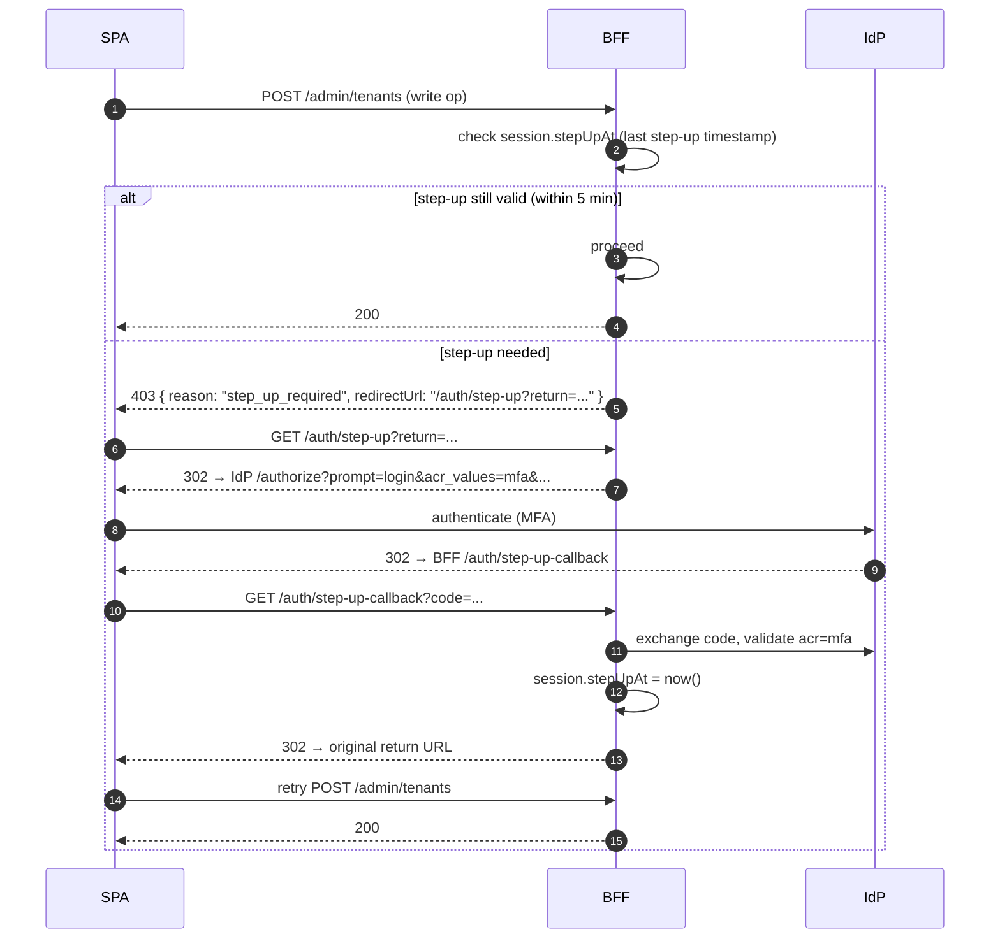

# Multi-tenancy security — kontrakt, izolácia, leakage scenáre

> Cieľ: definovať bezpečnostný kontrakt multi-tenancy v novom FE nad CA SDM 17.4.
> Pokrýva izoláciu dát medzi tenantmi, switch flow, leakage scenáre, audit
> a deferred topics (impersonation, SP elevation).
>
> Vstupy: `docs/agents/api-analyst/multi-tenancy.md`, `auth-flow.md`, `rbac.md`,
> GOAL.md §5, §11.

## 1. Threat statement

Multi-tenant SaaS / on-prem ITSM systém má fundamentálny security goal:

> **Žiadny záznam, metadata, telemetria, alebo error message z tenantu A
> nesmie unikať používateľovi pripojenému ako tenant B (s výnimkou cross-tenant
> rolí `sp_admin` / tenant_group memberov).**

CA SDM má vlastnú tenant izoláciu v query layer (PDF §`tenant` SREL on all
transactional objects). Tento dokument popisuje, ako **FE + BFF** udržia ten
istý invariant a aké dodatočné mitigácie pridajú.

## 2. Tenant identity & scope — model

### 2.1 Definície

| Pojem | Význam |
|---|---|
| `tenantId` | UUID, primárny kľúč v `ca_tenant`. |
| `activeTenantId` | Aktuálne zvolený tenant v session (BFF-side). |
| `allowedTenants` | Pole tenantov, kde user má aspoň jednu rolu cez `cnt_role`. Computed pri logine, cache TTL = 5 min. |
| `effectiveTenants` | Aktívny tenant + tenant_group členovia + (ak SP) všetky managed tenants. Pre query filtering. |
| `tenantScopeFilter` | Vždy aplikovaný WC filter na CA SDM volaniach: `WC=tenant%3DU'<activeTenantId>'`. |

### 2.2 Session štruktúra (BFF, variant A)

```typescript
interface Session {
  sid: string;
  userId: string;
  accessKey: string;             // CA SDM X-AccessKey — NEVER to browser
  accessKeyExp: number;
  refreshToken: string;          // IdP refresh — NEVER to browser
  idleAt: number;
  allowedTenants: Array<{
    id: string;
    roleId: string;              // CA SDM cnt_role.id
    uiRole: UIRole;              // viď rbac.md
    isServiceProvider: boolean;
  }>;
  activeTenantId: string;        // jeden z allowedTenants[].id
  activeRoleId: string;
  effectivePermissions: Permission[];
  csrfToken: string;
  cookieTenantVersion: number;   // incrementovaný pri tenant switch → broadcast tabom
}
```

### 2.3 Cookie tenant-version pattern (cross-tab consistency)

Druhá, **non-secret** cookie:

```
Set-Cookie: __Host-sdm.tenantVer=42;
            Secure; SameSite=Lax; Path=/;
            (NO HttpOnly — SPA potrebuje čítať)
```

Pri tenant switch BFF inkrementuje `cookieTenantVersion`. Otvorené taby v SPA detekujú zmenu cez:

```js
// SPA hook
useEffect(() => {
  const last = readCookie("__Host-sdm.tenantVer");
  const poll = setInterval(() => {
    const curr = readCookie("__Host-sdm.tenantVer");
    if (curr !== last) {
      queryClient.clear();
      refetch("/me");
      last = curr;
    }
  }, 2000);
  return () => clearInterval(poll);
}, []);
```

Combo s BroadcastChannel API (viď `auth-flow.md` §2.6) — cookie version je
**fallback** pre browsers bez BroadcastChannel a pre cross-window cases (popup).

## 3. Tenant switch — bezpečnostný kontrakt

Detail sekvenčného diagramu je v `auth-flow.md` §2.5. Tu sumarizujeme invariants:

| # | Invariant | Mitigácia |
|---|---|---|
| 1 | `tenantId` z requestu nikdy nedôveryhodný | BFF validuje proti `session.allowedTenants[].id` |
| 2 | Switch nevyžaduje re-login (happy path) | BFF rotuje len `activeTenantId` + `accessKey` rebind |
| 3 | Cross-tab broadcast | BroadcastChannel + cookie version |
| 4 | Cache flush | React Query → `queryClient.clear()`; BFF → drop tenant-scoped cache keys |
| 5 | In-flight requesty | Pri switch sa cancel-nú existujúce pending requesty (AbortController) |
| 6 | Audit event | `{userId, fromTenant, toTenant, ts, ip, ua}` do audit logu |
| 7 | Re-auth pre SP elevation | Switch z bežného tenantu do SP-scope tenantu vyžaduje step-up (re-prompt IdP, viď §6) |

### 3.1 Server-side defensive depth

Aj keď CA SDM auto-scoping ošetrí filtrovanie podľa role, BFF pridáva **explicit WC filter**:

```
GET /caisd-rest/in?WC=tenant%3DU'<activeTenantId>'%20AND%20<other-filters>
```

Justifikácia: defense-in-depth. Ak by sa stalo, že CA SDM rola omylom má širší scope (mis-config), explicit filter to chytí. Náklady: žiadne (CA SDM index je tenant-first).

## 4. Data leakage scenáre — STRIDE-style

| # | Scenár | Vektor | Pravdepodobnosť | Dopad | Mitigácia |
|---|---|---|---|---|---|
| L1 | Per-request tenant-id parameter forgery | Útočník modifikuje cookie / URL `?tenant=X` aby získal cudzie dáta | Med | High | BFF validuje `activeTenantId` len zo session, ignoruje request input. URL query `tenant=` je iba **hint** pre client-side rendering, nie auth-gate. |
| L2 | Stale cache after switch | Po prepnutí tenant zostali v React Query cache záznamy z predošlého tenantu, ktoré sa zobrazia | High | Med | `queryClient.clear()` pri switch. Per-tenant cache key (`{ tenantId, ...keys }`). Validácia v test pyramide. |
| L3 | Stale data in IndexedDB / SW | PWA cache (Service Worker) môže držať odpovede z iného tenantu | Low | Med | Žiadne tenant-scoped data v Service Worker cache. Iba statické assety. Per-tenant cache invalidation in SW on switch event. |
| L4 | Concurrent tab cross-tenant mismatch | User otvoril tab A v T1, tab B v T2; tab B vidí tab-A submit data | Med | Med | BroadcastChannel + cookie version (viď §2.3). Zvážiť per-tab session cookie variantu (mimo MVP). |
| L5 | Error message leak | API error response v T1 obsahuje tenant-B field name / id | Low | Med | BFF error normalizer: striktné enum dôvodov, žiadny direct passthrough CA SDM error textu. Žiadne IDs cudzieho tenantu v body. |
| L6 | Search autocompletion leak | Endpoint `/api/search?q=...` indexuje cross-tenant; suggesting cudzí KB | Med | High | Server-side: vždy aplikovať tenantScopeFilter. Žiadne search-index pre-loadovanie na klient. |
| L7 | Attachment cross-tenant access | Útočník zaháka URL attachmentu z cudzieho tenantu | Med | High | BFF endpoint `/api/attachments/:id` validuje `attachment.parent.tenant === activeTenantId` pred streamom. Mime-sniffing + Content-Disposition. |
| L8 | Activity log timestamp leak | Activity log obsahuje udalosti z cudzieho tenantu (timing oracle) | Low | Low | Štruktúrované audit log per-tenant filter na BFF. |
| L9 | CMDB CI relationship cross-tenant | CI graph v T1 ukáže shared CI z T2 bez explicitnej cross-tenant permission | Med | High | `cmdb_owner` má `ci.read.cross-tenant` len v "shared" relations. UI zobrazí cross-tenant CI s distinct badge. BFF filter: ak nie SP a nie shared marker, hide. |
| L10 | Cross-tenant change calendar | `change_manager` v T1 vidí change windows z T2 | Med | High | `change.read.calendar.cross-tenant` permission required. Default deny. SP role allows. |
| L11 | Telemetry / observability data | Sentry error report obsahuje request body s cudzím tenant ID | Med | Med | Sentry beforeSend hook: scrub tenant-specific values, hash IDs. Group errors per UI-rola, nie per-tenant. |
| L12 | Race condition during switch | Request sent in T1 returns after switch to T2 → response renderuje v T2 context | High | High | AbortController na switch cancels in-flight. Server tag response s `X-Response-Tenant: <id>`; client overí pred render-om. Mismatch → discard + log. |
| L13 | URL bookmark/share | User v T2 share-ne URL ticketu z T1 kolegovi v T1 — link funguje, ale kontext nie | Low | Low | Server: ticket detail endpoint vracia `tenantId` + UI navádza switch ak je iný ako active. |
| L14 | SP impersonation log absence | sp_admin pristupuje k cudzím tenant dátam bez audit-trail | Med | Critical | Každý cross-tenant request s `actor.isServiceProvider=true` MUSÍ obsahovať audit event s `cross_tenant=true, target_tenant=<id>`. |
| L15 | LDAP / IdP group claim cross-tenant | IdP claim `groups[]` obsahuje skupinu, ktorá mapuje na cudzí tenant | Low | High | Bootstrap mapping je len pri **prvom logine**. Roles sú thereafter spravované v CA SDM. IdP claims sa neaktualizujú v session zmeny. |

## 5. SP-admin cross-tenant flow

Service Provider (`tenant.service_provider=1`) má v UI dve módové:

```mermaid
sequenceDiagram
    autonumber
    participant SP as sp_admin
    participant SPA as Workspace
    participant BFF as BFF
    participant SDM as CA SDM

    SP->>SPA: Toggle "Cross-tenant view" ON
    SPA->>BFF: POST /me/cross-tenant-view { enabled: true }
    BFF->>BFF: assert session.isServiceProvider===true
    BFF->>BFF: session.crossTenantViewActive = true
    BFF->>BFF: emit audit { event: "cross_tenant_view_enabled", actor, ts }
    BFF-->>SPA: 200

    SPA->>BFF: GET /api/incidents (cross-tenant context)
    BFF->>SDM: GET /caisd-rest/in?WC=active%3D1<br/>(NO tenant scope filter — SP query)<br/>X-Role: <sp-role-with-all-tenants>
    SDM-->>BFF: 200 + incidents from all managed tenants
    BFF->>BFF: emit audit per-record { event: "cross_tenant_read", record_id, source_tenant, actor }
    BFF-->>SPA: 200 + data + tenant column

    SP->>SPA: Toggle "Cross-tenant view" OFF
    SPA->>BFF: POST /me/cross-tenant-view { enabled: false }
    BFF->>BFF: session.crossTenantViewActive = false; clear cache
    BFF-->>SPA: 200
```

**Invariants pre SP cross-tenant**:

1. Toggle je explicitný — SP rola **nemá** cross-tenant view default ON.
2. Re-auth (step-up) pri prvom zapnutí v session — IdP `prompt=login` alebo MFA. Tým sa minimalizuje stolen-session-cookie attack na SP účet.
3. Mutating operácie cez cross-tenant view sú scopované per-record (`record.tenant` určuje target). Bulk operations cross-tenant **nie sú** v MVP.
4. Visible UI banner: "Cross-tenant view ACTIVE — všetky akcie sú logované."
5. Audit log: každý read aj write má `cross_tenant=true` + `source_tenant=<id>` + `target_tenant=<id>`.

## 6. Step-up authentication

Niektoré operácie vyžadujú silnejšiu identitu validation (re-prompt IdP):

| Operácia | Step-up dôvod |
|---|---|
| SP cross-tenant view ON | High-impact privilege |
| Tenant admin akcie (`tenant.admin.*`) | Configuration change |
| Bulk delete > 50 záznamov | High-impact data operation |
| Export audit log | Compliance-sensitive |
| Impersonation start (mimo MVP) | Identity assumption |

Step-up flow:



**Step-up TTL**: 5 minút. Po expirácii ďalšia sensitive operation vyžaduje znova MFA.

## 7. Tenant deletion / suspension — UX impact

Mimo MVP scope, ale predpoklad:

- Pri tenant suspension v CA SDM `cnt_role` matching tenant by sa mal disable-ovať.
- Aktívne sessiony s `activeTenantId === suspended` musia byť terminated pri ďalšom API call (BFF re-fetch tenant status). 
- UI správanie: 403 + toast "Tento tenant bol pozastavený."

## 8. Tenant onboarding security checklist

Pre nový tenant (admin operácia, `tenant.admin.create`):

- [ ] Tenant má aspoň jeden `cnt` s rolou `Tenant Admin` (lokálny admin).
- [ ] Default `Access Type` má vyplnenú `REST Web Service API Role` (inak loginy zlyhajú).
- [ ] CSP `connect-src` allow listuje BFF + CA SDM endpointy (statický config, nezávisí od tenanta).
- [ ] Audit log destinácia per-tenant resolved (default = central, opt-in per-tenant log shipping).
- [ ] i18n default locale (per tenant config).
- [ ] Tenant-specific idle timeout (override default).

## 9. Konkrétne CSP additions pre multi-tenancy

Žiadne. Multi-tenancy nemení CSP. Per-tenant content je vždy servovaný z toho istého originu (BFF). Tenant logo cez `img-src` z trusted CDN (predpoklad: `data:` schema pre logo upload v MVP, neskôr blob storage). Detail v `headers-and-csp.md`.

## 10. Test scenáre

- [ ] **L1 forgery**: POST `/auth/switch-tenant { tenantId: "<forbidden>" }` → 403.
- [ ] **L2 cache leak**: po switch z T1 do T2, žiadny T1 id sa v DOM/network neobjavuje.
- [ ] **L4 cross-tab**: tab A switch → tab B re-fetch do 2 s.
- [ ] **L6 search**: query "secret-only-in-T1" v T2 vráti 0 results.
- [ ] **L7 attachment**: GET `/api/attachments/<T1-id>` ako T2 user → 404 (not 403, leakuje existenciu).
- [ ] **L9 CMDB**: CI relationship graph nezobrazuje cudzí-tenant CI nodes (ak nemá shared marker).
- [ ] **L12 race**: switch počas in-flight requestu → response discarded.
- [ ] **L14 SP audit**: každý cross-tenant call sa objaví v audit log do 5 s.
- [ ] **Step-up**: bulk delete 60 → IdP MFA prompt.
- [ ] **Tenant suspension**: count → next API call → 403 + redirect na tenant switcher.

## Otvorené závislosti

- `[04-architecture]` BFF cache stratégia pre per-tenant data — Redis key naming convention (`tenant:<id>:incidents:<query-hash>`). Treba potvrdiť TTL a invalidation hooks.
- `[04-architecture]` Per-tab session model (vs. single-session, multi-tab) — single-session je default. Per-tab vyžaduje refactor cookie modelu (`__Host-sdm.sid-{tabId}` is nepraktické). Treba potvrdiť pre MVP single-session.
- `[01-api-analyst]` X-Role per-request vs. nový access_key pri tenant switch — finálna stratégia. Predpoklad: nový access_key (cleaner audit trail), ale ak per-request X-Role je acceptable, môže byť výkonnejšie. Treba overiť na inštancii.
- `[02-ux-persona-analyst]` UI pre tenant switcher s 50+ tenantmi (SP scenár) — search, pinned, recent. Treba wireframe.
- `[09-qa-test-strategy]` Test scenáre v sekcii 10 sú návrh — QA agent ich rozšíri.
- `[?]` Step-up TTL 5 minút — biznis hodnota, treba potvrdiť.
- `[?]` Tenant onboarding flow (sekcia 8) — kompletný admin UX je mimo MVP scope. Treba potvrdiť, či v MVP postačí "vyžaduje CA SDM admin priamo".
