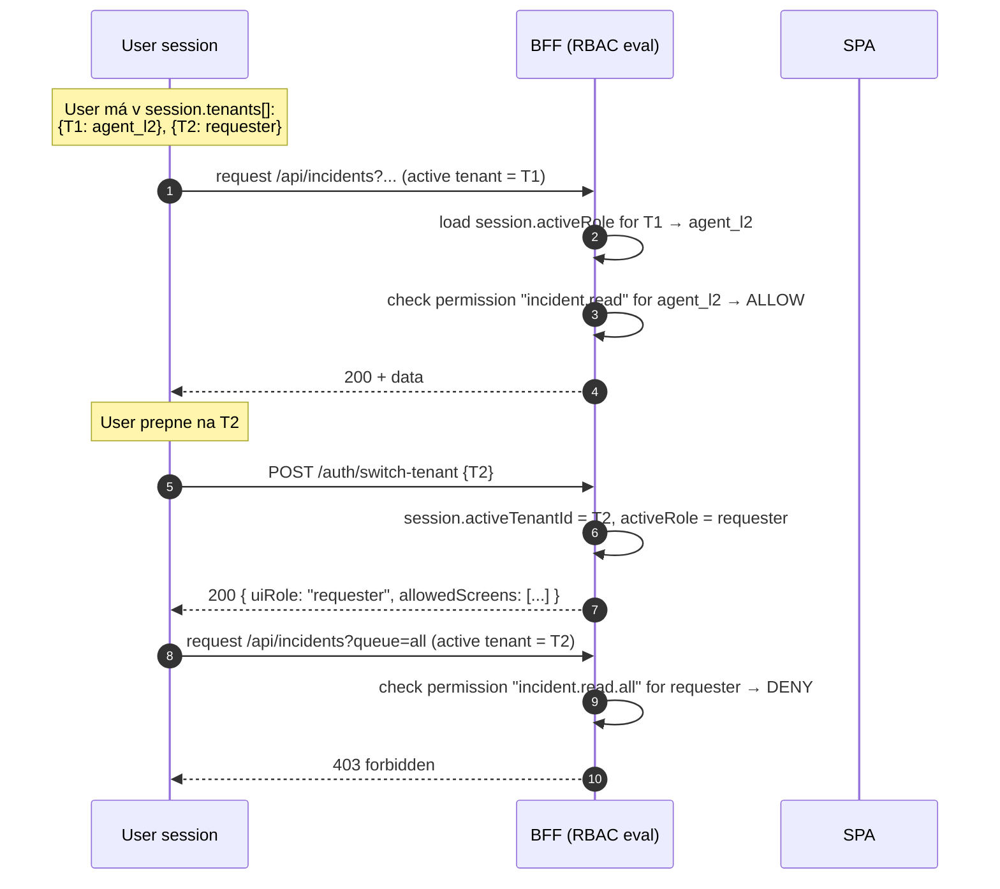

# RBAC — CA SDM ↔ UI role mapping (tenant-scoped)

## Changelog (round 2)

- **Doplnené obrazovky** podľa 04 `components/portal.md` § 3 a `components/workspace.md` § 3 — pridané: portal `/notifications` (P-07, MVP), portal `/profile` (P-08, MVP), portal `/onboarding` (P-11, post-MVP), workspace `/profile` (W-14, MVP), workspace `/settings` (W-13, post-MVP), workspace `/changes/cab/:date` (W-18, post-MVP CAB Meeting). Total: 25 → **31 obrazoviek**.
- Reopen time-box pre `incident.reopen` finalized na **7 dní** (alignment s `audit-and-compliance.md` §0).
- Bulk operation limits (50 / 200) zachované a cross-linkované so step-up flow v `multi-tenancy-security.md` §6 (bulk > 50 = step-up MFA).
- Cross-link na 04 components a tech-stack libraries pridaný.

> Cieľ: definovať **tenant-scoped** mapping CA SDM rolí na UI role, povolené
> obrazovky a akcie. Každá rola je vyhodnocovaná v kontexte konkrétneho
> tenantu — používateľ môže mať odlišné role v rôznych tenantoch.
>
> Vstupy: `docs/agents/api-analyst/auth.md` §5, `docs/agents/api-analyst/multi-tenancy.md`,
> `docs/agents/ux-persona-analyst/personas.md`, `docs/agents/domain-modeller/glossary.md`,
> `docs/agents/architecture/components/portal.md` §3,
> `docs/agents/architecture/components/workspace.md` §3.

## 1. Princípy

1. **Tenant-scoped** — role sa hodnotia v kontexte aktívneho tenantu. User s `agent_l2` v tenante A a `requester` v tenante B vidí v aplikácii diametrálne odlišné UI podľa toho, ktorý tenant je aktívny.
2. **CA SDM = zdroj pravdy** — UI role sú odvodené z CA SDM `cnt_role` + `role`. IdP `groups[]` claim sa používa iba pre bootstrap mapping pri prvom prihlásení.
3. **Least privilege** — defaultne deny. UI obrazovka sa nezobrazuje, ak rola explicitne nemá povolenú akciu.
4. **Server-side enforcement** — RBAC sa **vždy** vyhodnocuje na BFF / CA SDM strane. UI klient hideuje akcie ako UX optimalizáciu, nie ako security gate.
5. **Granularita** — *screen* (route), *section* (UI panel), *action* (button / mutation).

## 2. CA SDM role → UI role mapping

CA SDM používa pojem **Access Type** (per kontakt) + **Functional Access** (per modul × Modify/View/None). Nový FE konsoliduje na 7 UI rolí:

| CA SDM Access Type / Role | CA SDM Functional Access | UI rola | Aplikácia | Persona |
|---|---|---|---|---|
| `Employee` | Self-service only | `requester` | `portal` | `requester_lucia` |
| `Customer` (extern) | Self-service only | `requester_external` | `portal` | (subset Lucie pre externé kontakty) |
| `Analyst Level 1` | Call_Mgr=Modify, Knowledge=View, CMDB=View | `agent_l1` | `workspace` | `agent_l1_anna` |
| `Analyst Level 2` + `Problem Manager` | Call_Mgr=Modify, Problem=Modify, Knowledge=Modify, CMDB=View | `agent_l2` | `workspace` | `agent_l2_marek` |
| `Change Manager` + `CAB Member` | Change_Mgr=Modify, CAB=Modify | `change_manager` | `workspace` | `change_manager_peter` |
| `Knowledge Author` / `Knowledge Approver` | Knowledge=Modify, KCAT=Modify | `kb_editor` | `workspace` | `kb_editor_jana` |
| `Configuration Manager` / `CI Owner` | CMDB=Modify, Asset=Modify | `cmdb_owner` | `workspace` | `cmdb_owner_robert` |
| `Service Provider Admin` (tenant `service_provider=1` role) | All Tenants, Multi-tenant config | `sp_admin` | `workspace` | – (mimo MVP person, ale role existuje) |

> **Poznámka**: `requester_external` je rovnako mapovaná ako `requester`, ale BFF filter
> `restricted_share_flag` (CA SDM concept) skryje internal-only KB články a iné internal
> objekty. Pre účely tohto RBAC mappingu sa správa ako sub-typ `requester` — všade kde
> sa píše `requester`, platí to aj pre `requester_external` (s dodatočným filtrom).

## 3. Tenant context — ako sa rola vyhodnocuje



**Invariant**: keď user prepne tenant, `uiRole` v session sa **mení** (lebo je odvodená od role v `cnt_role` matching tenant). UI musí re-render odznova podľa novej role. Cache invalidation viď `auth-flow.md` §2.5.

## 4. Mapa obrazoviek (screens) — 31 obrazoviek v oboch SPA (r2)

| # | Screen | Route | App | Modul | Vyžaduje permission |
|---|---|---|---|---|---|
| 1 | Portal Home / Self-service landing | `/` | portal | Cross | `app.portal.access` |
| 2 | Portal — Submit ticket form | `/submit` | portal | Incident, Request | `ticket.create.own` |
| 3 | Portal — My tickets list | `/my-tickets` | portal | Incident, Request | `ticket.read.own` |
| 4 | Portal — Ticket detail (own) | `/my-tickets/:ref` | portal | Incident, Request | `ticket.read.own` |
| 5 | Portal — KB browse | `/kb` | portal | Knowledge | `kb.read.public` |
| 6 | Portal — KB article view | `/kb/:slug` | portal | Knowledge | `kb.read.public` |
| 7 | Portal — Service Catalog | `/catalog` | portal | Request (catalog) | `catalog.browse` |
| 8 | Portal — Catalog item detail / request | `/catalog/:id` | portal | Request | `catalog.request` |
| 9 | Workspace Home / Dashboard | `/` | workspace | Cross | `app.workspace.access` |
| 10 | Workspace — Incident queue | `/incidents` | workspace | Incident | `incident.read.queue` |
| 11 | Workspace — Incident detail | `/incidents/:ref` | workspace | Incident | `incident.read.queue` |
| 12 | Workspace — Problem list | `/problems` | workspace | Problem | `problem.read` |
| 13 | Workspace — Problem detail (incl. RCA) | `/problems/:ref` | workspace | Problem | `problem.read` |
| 14 | Workspace — Change list | `/changes` | workspace | Change | `change.read` |
| 15 | Workspace — Change detail | `/changes/:ref` | workspace | Change | `change.read` |
| 16 | Workspace — Change calendar | `/changes/calendar` | workspace | Change | `change.read.calendar` |
| 17 | Workspace — CAB approval queue | `/cab` | workspace | Change | `cab.approve` |
| 18 | Workspace — KB editor (list) | `/kb/manage` | workspace | Knowledge | `kb.manage` |
| 19 | Workspace — KB article editor | `/kb/manage/:id` | workspace | Knowledge | `kb.write` |
| 20 | Workspace — KB analytics | `/kb/analytics` | workspace | Knowledge | `kb.analytics` |
| 21 | Workspace — CMDB CI list | `/cmdb` | workspace | CMDB | `ci.read` |
| 22 | Workspace — CI detail | `/cmdb/:id` | workspace | CMDB | `ci.read` |
| 23 | Workspace — CI impact graph | `/cmdb/:id/impact` | workspace | CMDB | `ci.read.relationships` |
| 24 | Workspace — Tenant admin | `/admin/tenants` | workspace | Admin | `tenant.admin` |
| 25 | Workspace — Reports | `/reports` | workspace | Reporting | `reports.read` |
| 26 | Portal — Notifications | `/notifications` | portal | Cross | `app.portal.access` |
| 27 | Portal — Profile / Prefs | `/profile` | portal | Cross | `app.portal.access` |
| 28 | Portal — Onboarding (post-MVP) | `/onboarding` | portal | Cross | `app.portal.access` |
| 29 | Workspace — Profile / Prefs | `/profile` | workspace | Cross | `app.workspace.access` |
| 30 | Workspace — Settings (post-MVP) | `/settings` | workspace | Admin | `app.workspace.access` |
| 31 | Workspace — CAB Meeting (post-MVP) | `/changes/cab/:date` | workspace | Change | `cab.approve` |

## 5. Screen visibility matica (per UI role)

> Legenda: ✓ = visible+navigable, ▣ = visible read-only, ✗ = nie je zobrazená v navigácii a route je 403.

| # | Screen | requester | agent_l1 | agent_l2 | change_mgr | kb_editor | cmdb_owner | sp_admin |
|---|---|---|---|---|---|---|---|---|
| 1 | Portal Home | ✓ | ✗ | ✗ | ✗ | ✗ | ✗ | ✗ |
| 2 | Submit ticket | ✓ | ✗ | ✗ | ✗ | ✗ | ✗ | ✗ |
| 3 | My tickets list | ✓ | ✗ | ✗ | ✗ | ✗ | ✗ | ✗ |
| 4 | Ticket detail (own) | ✓ | ✗ | ✗ | ✗ | ✗ | ✗ | ✗ |
| 5 | Portal KB browse | ✓ | ✗ | ✗ | ✗ | ✗ | ✗ | ✗ |
| 6 | Portal KB article | ✓ | ✗ | ✗ | ✗ | ✗ | ✗ | ✗ |
| 7 | Service Catalog | ✓ | ✗ | ✗ | ✗ | ✗ | ✗ | ✗ |
| 8 | Catalog item detail | ✓ | ✗ | ✗ | ✗ | ✗ | ✗ | ✗ |
| 9 | Workspace Dashboard | ✗ | ✓ | ✓ | ✓ | ✓ | ✓ | ✓ |
| 10 | Incident queue | ✗ | ✓ | ✓ | ▣ | ▣ | ▣ | ✓ |
| 11 | Incident detail | ✗ | ✓ | ✓ | ▣ | ▣ | ▣ | ✓ |
| 12 | Problem list | ✗ | ▣ | ✓ | ▣ | ▣ | ▣ | ✓ |
| 13 | Problem detail | ✗ | ▣ | ✓ | ▣ | ▣ | ▣ | ✓ |
| 14 | Change list | ✗ | ▣ | ▣ | ✓ | ▣ | ▣ | ✓ |
| 15 | Change detail | ✗ | ▣ | ▣ | ✓ | ▣ | ▣ | ✓ |
| 16 | Change calendar | ✗ | ▣ | ▣ | ✓ | ✗ | ▣ | ✓ |
| 17 | CAB approval queue | ✗ | ✗ | ✗ | ✓ | ✗ | ✗ | ✓ |
| 18 | KB editor list | ✗ | ✗ | ▣ | ✗ | ✓ | ✗ | ✓ |
| 19 | KB article editor | ✗ | ✗ | ▣ | ✗ | ✓ | ✗ | ✓ |
| 20 | KB analytics | ✗ | ✗ | ▣ | ✗ | ✓ | ✗ | ✓ |
| 21 | CMDB CI list | ✗ | ▣ | ▣ | ▣ | ✗ | ✓ | ✓ |
| 22 | CI detail | ✗ | ▣ | ▣ | ▣ | ✗ | ✓ | ✓ |
| 23 | CI impact graph | ✗ | ▣ | ▣ | ▣ | ✗ | ✓ | ✓ |
| 24 | Tenant admin | ✗ | ✗ | ✗ | ✗ | ✗ | ✗ | ✓ |
| 25 | Reports | ✗ | ▣ | ▣ | ▣ | ▣ | ▣ | ✓ |
| 26 | Portal Notifications | ✓ | ✗ | ✗ | ✗ | ✗ | ✗ | ✗ |
| 27 | Portal Profile / Prefs | ✓ | ✗ | ✗ | ✗ | ✗ | ✗ | ✗ |
| 28 | Portal Onboarding | ✓ | ✗ | ✗ | ✗ | ✗ | ✗ | ✗ |
| 29 | Workspace Profile / Prefs | ✗ | ✓ | ✓ | ✓ | ✓ | ✓ | ✓ |
| 30 | Workspace Settings | ✗ | ✗ | ✗ | ✗ | ✗ | ✗ | ✓ |
| 31 | CAB Meeting | ✗ | ✗ | ✗ | ✓ | ✗ | ✗ | ✓ |

## 6. Action matica — kľúčové akcie per modul

> Akcia = UI button / API mutation. Sufix `.own` znamená "len vlastné záznamy",
> `.queue` znamená "queue scope podľa group membership", `.all` znamená "v rámci tenantu bez ďalšieho obmedzenia",
> `.cross-tenant` znamená "v scope service-provider tenantu".

### 6.1 Incident

| Action | Permission key | requester | agent_l1 | agent_l2 | change_mgr | sp_admin |
|---|---|---|---|---|---|---|
| Create incident | `incident.create` | ✓ (own) | ✓ | ✓ | ✗ | ✓ |
| Read own incidents | `incident.read.own` | ✓ | ✓ | ✓ | ✗ | ✓ |
| Read queue | `incident.read.queue` | ✗ | ✓ | ✓ | ▣ | ✓ |
| Read all in tenant | `incident.read.all` | ✗ | ▣ | ✓ | ▣ | ✓ |
| Update field (summary, description) | `incident.update.fields` | ✗ (own resolve note only) | ✓ | ✓ | ✗ | ✓ |
| Change status | `incident.transition.status` | ✗ | ✓ | ✓ | ✗ | ✓ |
| Re-assign | `incident.assign` | ✗ | ✓ (own group) | ✓ | ✗ | ✓ |
| Escalate to L2 | `incident.escalate` | ✗ | ✓ | ✓ | ✗ | ✓ |
| Link to Problem | `incident.link.problem` | ✗ | ▣ | ✓ | ✗ | ✓ |
| Add attachment | `incident.attach.add` | ✓ (own) | ✓ | ✓ | ✗ | ✓ |
| Add private comment | `incident.comment.private` | ✗ | ✓ | ✓ | ▣ | ✓ |
| Add public comment | `incident.comment.public` | ✓ (own) | ✓ | ✓ | ▣ | ✓ |
| Resolve / Close | `incident.close` | ✗ (request close only) | ✓ | ✓ | ✗ | ✓ |
| Reopen | `incident.reopen` | ✓ (own, within **7 dní** od `resolve_date`) | ✓ | ✓ | ✗ | ✓ |
| Bulk operations | `incident.bulk` | ✗ | ✓ (≤ 50 rows) | ✓ (≤ 200 rows) | ✗ | ✓ |

> **Bulk step-up flow**: hocijaký bulk operation > **50** záznamov (naprieč rolami)
> vyžaduje step-up MFA per `multi-tenancy-security.md` §6. Limit per rola
> (50 / 200) je hard cap; medzi limitom a step-up thresholdom je acceptable
> bulk len pre agent_l2 (51–200 → step-up MFA), sp_admin (51+ → step-up MFA).
| Delete | `incident.delete` | ✗ | ✗ | ✗ | ✗ | ✓ (audit-logged) |

### 6.2 Request

| Action | Permission key | requester | agent_l1 | agent_l2 | change_mgr | sp_admin |
|---|---|---|---|---|---|---|
| Submit catalog request | `request.create` | ✓ | ✓ | ✓ | ✗ | ✓ |
| Read own requests | `request.read.own` | ✓ | ✓ | ✓ | ✗ | ✓ |
| Read queue | `request.read.queue` | ✗ | ✓ | ✓ | ▣ | ✓ |
| Approve (manager workflow) | `request.approve` | ✓ (if assigned approver) | ✓ | ✓ | ✗ | ✓ |
| Fulfill | `request.fulfill` | ✗ | ✓ | ✓ | ✗ | ✓ |
| Reject | `request.reject` | ✓ (if approver) | ✓ | ✓ | ✗ | ✓ |
| Cancel own | `request.cancel.own` | ✓ (own, before fulfillment) | ✓ | ✓ | ✗ | ✓ |

### 6.3 Problem

| Action | Permission key | agent_l1 | agent_l2 | change_mgr | sp_admin |
|---|---|---|---|---|---|
| Create Problem | `problem.create` | ▣ (from Incident) | ✓ | ✗ | ✓ |
| Read | `problem.read` | ▣ | ✓ | ▣ | ✓ |
| Update RCA section | `problem.update.rca` | ✗ | ✓ | ✗ | ✓ |
| Link Incidents | `problem.link.incidents` | ✗ | ✓ | ✗ | ✓ |
| Mark known error | `problem.mark.known-error` | ✗ | ✓ | ✗ | ✓ |
| Close Problem | `problem.close` | ✗ | ✓ | ✗ | ✓ |
| Create KB article from Problem | `problem.spawn.kb` | ✗ | ✓ | ✗ | ✓ |

### 6.4 Change

| Action | Permission key | agent_l2 | change_mgr | cmdb_owner | sp_admin |
|---|---|---|---|---|---|
| Create RFC | `change.create` | ▣ (limited categories) | ✓ | ✓ | ✓ |
| Read | `change.read` | ▣ | ✓ | ▣ | ✓ |
| Update plan / rollback | `change.update.plan` | ▣ (own) | ✓ | ▣ (CI changes) | ✓ |
| Schedule | `change.schedule` | ✗ | ✓ | ✗ | ✓ |
| Submit to CAB | `change.submit.cab` | ▣ (request) | ✓ | ✗ | ✓ |
| Approve in CAB | `cab.approve` | ✗ | ✓ | ✗ | ✓ |
| Emergency approve (2-click) | `cab.approve.emergency` | ✗ | ✓ | ✗ | ✓ |
| Reject in CAB | `cab.reject` | ✗ | ✓ | ✗ | ✓ |
| Read calendar | `change.read.calendar` | ▣ | ✓ | ▣ | ✓ |
| Cross-tenant calendar view | `change.read.calendar.cross-tenant` | ✗ | ✓ (if SP role) | ✗ | ✓ |
| Close change | `change.close` | ▣ | ✓ | ✗ | ✓ |

### 6.5 Knowledge

| Action | Permission key | requester | agent_l1 | agent_l2 | kb_editor | sp_admin |
|---|---|---|---|---|---|---|
| Read public articles | `kb.read.public` | ✓ | ✓ | ✓ | ✓ | ✓ |
| Read internal articles | `kb.read.internal` | ✗ | ✓ | ✓ | ✓ | ✓ |
| Search | `kb.search` | ✓ | ✓ | ✓ | ✓ | ✓ |
| Rate article (helpful/not) | `kb.rate` | ✓ | ✓ | ✓ | ✓ | ✓ |
| Create draft | `kb.create.draft` | ✗ | ✗ | ✓ | ✓ | ✓ |
| Edit own draft | `kb.write` | ✗ | ✗ | ✓ (own) | ✓ | ✓ |
| Submit for review | `kb.submit.review` | ✗ | ✗ | ✓ | ✓ | ✓ |
| Approve / Publish | `kb.approve` | ✗ | ✗ | ✗ | ✓ | ✓ |
| Archive | `kb.archive` | ✗ | ✗ | ✗ | ✓ | ✓ |
| View analytics | `kb.analytics` | ✗ | ✗ | ▣ | ✓ | ✓ |
| Manage taxonomy / categories | `kb.taxonomy` | ✗ | ✗ | ✗ | ✓ | ✓ |

### 6.6 CMDB

| Action | Permission key | agent_l1 | agent_l2 | change_mgr | cmdb_owner | sp_admin |
|---|---|---|---|---|---|---|
| Read CI | `ci.read` | ▣ | ▣ | ▣ | ✓ | ✓ |
| Read relationships | `ci.read.relationships` | ▣ | ▣ | ▣ | ✓ | ✓ |
| Search | `ci.search` | ✓ | ✓ | ✓ | ✓ | ✓ |
| Impact analysis | `ci.impact` | ▣ | ✓ | ✓ | ✓ | ✓ |
| Create CI (post-MVP) | `ci.create` | ✗ | ✗ | ✗ | ✓ | ✓ |
| Edit CI attrs (post-MVP) | `ci.update` | ✗ | ✗ | ✗ | ✓ | ✓ |
| Cross-tenant CI view | `ci.read.cross-tenant` | ✗ | ✗ | ✗ | ▣ (own shared) | ✓ |

### 6.7 Admin / Tenant / Reports

| Action | Permission key | sp_admin | Other roles |
|---|---|---|---|
| List tenants | `tenant.admin.list` | ✓ | ✗ |
| Configure tenant settings | `tenant.admin.update` | ✓ | ✗ |
| Manage roles | `tenant.admin.roles` | ✓ | ✗ |
| View audit log | `audit.read` | ✓ | ✗ |
| Export audit log | `audit.export` | ✓ | ✗ |
| View reports | `reports.read` | ✓ | ▣ (role-scoped subset) |
| Export reports | `reports.export` | ✓ | ▣ |

## 7. Tenant-scoped permission model — implementačná poznámka

BFF `/me` response (viď `auth-flow.md` §4.4) obsahuje:

```typescript
type Permission =
  | "incident.read.own"
  | "incident.read.queue"
  | "incident.read.all"
  | "incident.update.fields"
  | /* ... viď sekcie 6.1–6.7 */;

interface ActiveTenantContext {
  id: string;
  activeRoleId: string;
  uiRole: UIRole;
  effectivePermissions: Permission[]; // computed at switch-tenant time
}
```

UI komponenty používajú **declarative permission checks**:

```jsx
// Pseudo-React API (knihovňu volí Stack Selector)
<Can permission="incident.transition.status">
  <Button>Change status</Button>
</Can>
```

Server (BFF) **vždy** re-validuje na mutáciách. Klient-side check je iba UX hint.

## 8. Special cases

### 8.1 Service Provider (`sp_admin`) cross-tenant operácie

- SP-admin so SDM rolu `service_provider=1` má v UI **dvojúrovňový view**:
  - **Per-tenant view** (štandard) — vyzerá ako bežný `agent_l2` v aktívnom tenante.
  - **Cross-tenant view** — toggle, ktorý zobrazí queue/calendar zo všetkých managed tenantov s tenant column.
- Mutácie cez cross-tenant view sú **vždy** scopované na konkrétny záznam (jeho tenant) — žiadne bulk operácie cross-tenant v MVP.
- Každý cross-tenant access sa loguje v audit log s flagom `cross_tenant=true`. Viď `audit-and-compliance.md`.

### 8.2 Requester s tenant-group membership

User môže byť `requester` v primárnom tenante a vidieť KB články zo zdieľanej tenant_group. UI nezobrazuje samotný tenant_group ako prepínateľný "tenant" — kombinuje obsah transparentne. BFF rozhoduje, ktoré objekty patria do scope (read groups, restricted_share_flag).

### 8.3 KB articles cross-tenant publikované

KB článok môže byť publikovaný "all tenants" (`tenant=NULL`). UI ho zobrazí všetkým `requester`-om bez ohľadu na aktívny tenant. `kb_editor` v non-service-provider tenante **nemôže** publikovať cross-tenant — iba do svojho tenant scope. Cross-tenant publish vyžaduje `sp_admin`.

### 8.4 Impersonation (mimo MVP)

Žiadny user nemôže impersonovať iného v MVP. Ak sa otvorí, vyžaduje:
- explicitné `impersonation.act` permission (default deny pre všetky role),
- audit event s `actor` + `target`,
- visible banner v UI ("You are acting as <name>"),
- time-boxed (max 60 min), expirácia ukončí impersonation session.

## 9. Failed authorization — UX

| Scenár | UI správanie |
|---|---|
| Navigácia na route bez `screen.access` | 403 page "Nemáte oprávnenie. Skontrolujte aktívny tenant." + tenant switcher prominently |
| Mutation API call 403 | Toast s presným dôvodom + suggestion na switch tenant |
| Tenant switch attack | UI nedostane access — BFF zlogoval forensic event |
| Role zmena počas active session | Pri ďalšom API call BFF detekuje stale role → 401 + `reason="role_changed"`, SPA force re-login |

## 10. Validačný kontrolný zoznam

Tento zoznam slúži ako vstup pre QA agent (`09-qa-test-strategy`):

- [ ] Každá z 31 obrazoviek má aspoň jednu rolu, ktorá je ✓ (žiadna obrazovka nie je úplne dead).
- [ ] Žiadna rola nemá ✓ na obrazovkách v inej aplikácii (requester nemá nič vo workspace).
- [ ] Pre každú akciu existuje server-side guard v BFF (nie len UI-hide).
- [ ] Tenant switch invaliduje `effectivePermissions[]` a UI re-renderuje.
- [ ] sp_admin cross-tenant access generuje audit event.
- [ ] Stale role detekcia: zmena role v CA SDM → next-call vráti 401 do 60 s.

## Otvorené závislosti

- `[04-architecture]` Permission-evaluation cache stratégia — `[resolved-in-round-2]` 04 `components/bff.md` §2.4 publikoval per-tenant cache pre `/me/tenants` (TTL 5 min) + per-aggregator cache pre queue/ticket-detail. Force refresh role re-fetch interval = 60 s (per `owasp-mitigations.md` A01).
- `[04-architecture]` `[01-api-analyst]` Mapovanie CA SDM `cnt_role` → UI rola — predpokladá, že role-name pattern matching (`Analyst Level 1` → `agent_l1`) je deterministický. Treba potvrdiť, či CA SDM admin garantuje pomenovanie, alebo treba explicit `usp_role.id`-based mapping cez config table v BFF env.
- `[02-ux-persona-analyst]` Persona `requester_external` (extern zákazníci) — chýba detailný journey. Predbežne mapujem na `requester` + filter. Treba potvrdiť alebo vytvoriť persona detail.
- `[07-design-system]` Permission-guarded UI komponent (`<Can>` wrapper) — `[resolved-in-round-2]` 07 `library-recommendation.md` zahŕňa app-level wrapper komponenty; konkrétny `<Can>` API kontrakt zostáva 07 r2/r3 detail.
- `[?]` Bulk operations limit — `[resolved-in-round-2]` 50 / 200 + step-up MFA pre > 50 (r2 finalized). Per-tenant config override možný bez code zmien.
- `[?]` Reopen incident time-box — `[resolved-in-round-2]` **7 dní** (r2 finalized).
- `[09-qa-test-strategy]` Validation checklist v sekcii 10 je vstup pre test plan.
- `[10-documentation-author]` Per-role onboarding guide — vyžaduje konsolidáciu tejto matice s UX wireframami.
