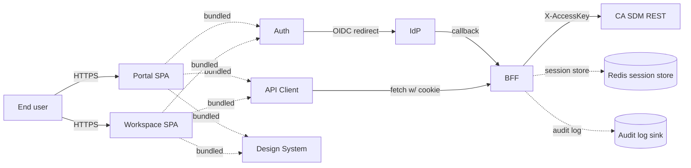

# Threat model — STRIDE per container

> Cieľ: STRIDE-based threat model pre logické kontajnery zo skeletonu GOAL §4/§8
> a balíkov §9. Architecture agent (04) beží súbežne s týmto dokumentom; zoznam
> kontajnerov môže prejsť drobnou refináciou. Flag pre Architecture viď
> `## Otvorené závislosti`.
>
> Vstupy: GOAL.md §4/§8/§9, `docs/agents/api-analyst/auth.md`,
> `docs/agents/api-analyst/multi-tenancy.md`, `auth-flow.md`, `rbac.md`,
> `multi-tenancy-security.md`.

## 0. Containers v scope

| # | Container | Kde žije | Trust boundary |
|---|---|---|---|
| C1 | **Portal SPA** | browser, `portal.<org>` | klient — non-trusted |
| C2 | **Workspace SPA** | browser, `workspace.<org>` | klient — non-trusted |
| C3 | **Auth module** (`packages/auth`) | súčasť oboch SPA | bundled with SPA, non-trusted |
| C4 | **API Client** (`packages/api-client`) | súčasť oboch SPA | bundled with SPA, non-trusted |
| C5 | **Design System** (`packages/design-system`) | súčasť oboch SPA | bundled, non-trusted (renders UGC) |
| C6 | **BFF / API Gateway** (variant A default) | server-side, `bff.<org>` | semi-trusted (zóna DMZ) |
| C7 | **IdP** (corp Azure AD / Keycloak / iné) | externý / on-prem | trusted boundary |
| C8 | **CA SDM 17.4 REST API** (`/caisd-rest`) | on-prem | trusted boundary |
| C9 | **Mock backend (MSW)** | dev-only, browser-side | dev-only, mimo prod threat model |

> **Predbežnosť**: container set je odvodený z GOAL §4 a §9. Architecture agent
> môže zaviesť ďalšie (napr. dedicated **proxy** layer, **secrets manager**,
> **observability collector**). Flag → 04-architecture v `## Otvorené závislosti`.

### Data flow diagram (high-level)

## 1. STRIDE — Portal SPA (C1)

| Kategória | Threat | Likelihood | Impact | Mitigation |
|---|---|---|---|---|
| **S**poofing | XSS-injected JS impersonuje user akcie | Med | High | CSP `script-src 'self' 'nonce-<n>'`; striktné sanitization KB markdown; HttpOnly cookies → script nemá prístup k session |
| | Clickjacking — iframe overlay | Med | Med | `X-Frame-Options: DENY` + `frame-ancestors 'none'` v CSP |
| **T**ampering | Modify form data v devtools pred submit | High | Med | Server-side validation v BFF; client-side validation len UX |
| | Modify URL param `tenant=X` | High | Med | BFF ignoruje request input pre auth — `activeTenantId` len zo session (viď `multi-tenancy-security.md` L1) |
| **R**epudiation | User popiera, že ticket otvoril on | Low | Med | Audit log na BFF s `actor.userId` + ip + ua; CA SDM `audlog` je dôveryhodný |
| **I**nformation disclosure | Console.log leakuje PII pri error | High | Low | Production build odstráni `console.*`; Sentry beforeSend scrub |
| | Source map prístupný v prod | Med | Med | Source maps len pre Sentry upload, nie deployed |
| | LocalStorage / SessionStorage obsahuje user data | High | Med | Policy: žiadne tokeny / PII v Web Storage. Lint pravidlo zakazujúce `localStorage.setItem("auth...")`/`"user..."` patterns |
| **D**oS | Bundle size DoS na mobile (3G) | Med | Low | Bundle size budget 200 KB initial pre portal; code-split per route; lazy load Service Catalog renderer |
| | Memory leak v React Query cache | Low | Low | Cache TTL 5 min; `queryClient.clear()` pri logout |
| **E**levation of privilege | Klient-side route guard sa obíde priamou URL navigáciou | High | High | UI route guards sú UX only. **Vždy** server-side BFF guard. Akýkoľvek 200 na unauthorized route je security bug. |

## 2. STRIDE — Workspace SPA (C2)

| Kategória | Threat | Likelihood | Impact | Mitigation |
|---|---|---|---|---|
| **S**poofing | Phishing site mimikuje workspace.<org> | Med | High | Vyžadovaný `__Host-` cookie prefix viaže cookie na presnú doménu; HSTS preload; user education |
| | Stolen session cookie cez network sniff | Low | High | HTTPS only; `Secure` cookie flag; HSTS `max-age=63072000; includeSubDomains; preload` |
| **T**ampering | Force-edit JSON in API client interceptor | Med | Med | BFF re-validates everything; client-side mutation hooks nie sú trust boundary |
| | Modify CMDB graph node IDs in browser | Med | High | BFF API guard pre `ci.update` (mimo MVP); CSRF token na all mutations |
| **R**epudiation | Agent zatvoril ticket, ale nehlási sa k tomu | Low | Med | Audit log per close action; CA SDM `audlog` má immutable trail |
| **I**nformation disclosure | DevTools network tab vidí cudzí-tenant data | High | High | Server-side tenant filter (viď `multi-tenancy-security.md` §3); per-request `X-Response-Tenant` header validation |
| | Search autocomplete leakuje názvy z cudzieho tenantu | Med | Med | Server-side scope filter na search endpoint |
| | Error toast obsahuje IDs z internal DB | Med | Med | BFF error normalizer (whitelist polí) |
| **D**oS | Bulk operation > limit | Med | Low | Per-role limit (50 / 200 rows); 429 response z BFF |
| | Long-running export blocks UI | Med | Low | Async export → background job + email; spinner with cancel |
| **E**levation of privilege | Agent L1 vidí Change calendar (read) ale chce schvaľovať | Med | High | Tenant-scoped RBAC enforcement na BFF (viď `rbac.md`); UI nezobrazuje action button |
| | Stale role — agent bol downgradnutý z L2 na L1 ale session ešte živá | High | Med | BFF re-fetch role každých 60 s; `roleChangedAt` v `cnt` triggeruje force re-login |

## 3. STRIDE — Auth module (C3, packages/auth)

| Kategória | Threat | Likelihood | Impact | Mitigation |
|---|---|---|---|---|
| **S**poofing | OIDC `state` replay attack | Med | High | State je opaque, single-use, 5-min TTL v BFF cache |
| | ID token theft cez XSS | Low | Critical | ID token nikdy v JS heap (variant A). Variant B: in-memory only, žiadne storage |
| **T**ampering | ID token claim modification | Low | High | JWT signature verification (RS256+); reject `none` algorithm; pinned issuer + audience |
| | Code injection v PKCE flow | Low | High | `code_verifier` cryptographically random ≥43 chars; one-time use |
| **R**epudiation | User popiera prihlásenie | Low | Med | IdP audit log + BFF login event |
| **I**nformation disclosure | Refresh token leakuje cez log/exception | Low | High | Refresh token nikdy v error message; redact pred logging; in IdP refresh-token rotation |
| | Nonce in ID token replay | Low | High | Nonce mismatch → abort + audit event |
| **D**oS | Brute-force `/auth/callback` s random code | Low | Med | Rate limit per IP (10/min); state validation invaliduje bogus calls |
| **E**levation of privilege | Token-issuer downgrade attack (algorithm confusion) | Low | High | JWKS pinning; reject `alg: none`; reject `alg: HS256` ak issuer používa RS256 |
| | Audience confusion — token vydaný pre inú app | Med | High | `aud` claim strict equality check (BFF client_id) |

## 4. STRIDE — API Client (C4, packages/api-client)

| Kategória | Threat | Likelihood | Impact | Mitigation |
|---|---|---|---|---|
| **S**poofing | DNS spoofing pre BFF endpoint | Low | High | HTTPS s certificate pinning na BFF API surface (v MVP cez HSTS + CA trust); pre on-prem zvážiť pinning |
| **T**ampering | Modified API response (MITM) | Low | High | HTTPS-only; HSTS; certificate validation strict |
| | Manipulácia request body cez interceptor | High | Med | BFF re-validates; CSRF token per mutating call |
| **R**epudiation | Cliento-only optimistic update bez server confirm | Med | Low | Optimistic updates rollback on error; UI shows "saving..." indicator |
| **I**nformation disclosure | Network error message s endpoint URL leakne v Sentry | Med | Low | Sentry beforeSend redact path query params; group by route template not by ID |
| | Response cache leakuje cudzí-tenant data | High | High | Per-tenant cache key v React Query (`{ tenantId, ...keys }`); `queryClient.clear()` pri switch |
| **D**oS | Retry storm pri 5xx | Med | Med | Exp. backoff (3 retries, jitter); circuit breaker pattern (open after 5 consecutive failures) |
| | Polling explosion (auto-refresh) | Med | Med | Polling interval ≥ 30s per query; visibility API pauznutie pri tab hidden |
| **E**levation of privilege | Forge `X-CSRF-Token` | Low | High | HMAC-validated; secret v BFF env; token rotated pri tenant switch / re-login |

## 5. STRIDE — Design System (C5, packages/design-system)

> Špecifická pozornosť: Design System renderuje **UGC** (KB články markdown, ticket descriptions, attachment names, chat-style comments).

| Kategória | Threat | Likelihood | Impact | Mitigation |
|---|---|---|---|---|
| **S**poofing | Phishing link v KB článku | Med | Med | Markdown link sanitization: `target="_blank" rel="noopener noreferrer"`; URL whitelist? — too restrictive, instead show domain hover |
| **T**ampering | KB article markdown injection | High | High | Markdown parser whitelist mode (no raw HTML, no inline `<script>`, no `javascript:` URIs); CSP backstop |
| **R**epudiation | n/a (no business logic) | – | – | – |
| **I**nformation disclosure | Attachment filename XSS | Med | High | Always render filenames cez safe text node, nikdy `dangerouslySetInnerHTML`; sanitize attribute values |
| | SVG with embedded script | Med | High | SVG attachments rendered ako `` not inline; CSP `img-src` allows blob, but blocks script execution context |
| **D**oS | Markdown s nested 1000-level deep list | Low | Low | Markdown parser depth limit |
| | Image bomb (ZIP/JPEG decompression) | Low | Med | Image size limit cez `` `loading="lazy"` + `decoding="async"`; back-end max-file-size 25 MB |
| **E**levation of privilege | `<form action="cudzia-domena">` v KB markdown vykonal POST | Med | High | Markdown forms zakázané; CSP `form-action 'self' <bff>` |

## 6. STRIDE — BFF (C6)

| Kategória | Threat | Likelihood | Impact | Mitigation |
|---|---|---|---|---|
| **S**poofing | Forged session cookie | Low | Critical | Cookie value je opaque random ≥256 bits; verifikované server-side proti session store |
| | IdP issuer spoofing | Low | Critical | JWKS endpoint pinned; cert pinning na IdP; reject unknown issuer |
| | Server-side request forgery (SSRF) z hostname param | Med | Critical | Whitelist of allowed upstream URLs (CA SDM, IdP); block private IP ranges (RFC 1918, 169.254/16, ::1) |
| **T**ampering | Session store modification by co-tenant on Redis | Low | Critical | Redis ACL per-app; network isolated (VPC); encryption at rest |
| | Replay attack on signed CSRF token | Low | Med | Token includes timestamp + nonce; expiry 15 min; rotated on tenant switch |
| **R**epudiation | Admin action bez user attribution | Low | Med | Audit log mandatory pre all admin endpoints; structured log s `actor.userId` |
| **I**nformation disclosure | Stack trace leakuje DB connection string | Med | High | Production error handler: client gets generic message + `incidentId`, full trace len v server log |
| | Log files čitateľné non-admin OS user | Med | High | Log dir permissions 0700 owner; SIEM forwarding cez TLS |
| | Tenant data leak cross-cache | Med | Critical | Per-tenant cache keys (viď `multi-tenancy-security.md` §4); BFF in-memory cache scoped na session |
| **D**oS | Rate limit overrun on /auth/login | High | Med | Per-IP rate limit (10/min); per-username rate limit (5/min); CAPTCHA after 3 failures |
| | Slowloris attack on long polling | Med | Med | Connection timeout 30 s; max concurrent connections per IP |
| | Memory exhaustion via large payload | Med | Med | `Content-Length` limit (1 MB JSON, 25 MB attachment); JSON parser depth limit |
| **E**levation of privilege | Misconfigured RBAC eval (default-allow) | Med | Critical | Default-deny pattern; explicit permission check at handler level; integration test per role × endpoint |
| | Path traversal v attachment download | Med | Critical | Whitelist of repository paths; canonicalize before access; never accept path from URL param |
| | Prototype pollution in JS BFF | Low | High | Helmet middleware; Object.freeze on shared objects; depend on safe parsers (no `eval`, no `vm.runInNewContext` with user input) |

## 7. STRIDE — IdP (C7)

> IdP je **trusted boundary** — threats mimo nášho scope (corp IdP team).
> Listujeme čo MY garantujeme voči IdP a čo požadujeme od IdP.

| Kategória | Threat | Likelihood | Impact | Mitigation (our side) |
|---|---|---|---|---|
| **S**poofing | Stolen IdP credentials | Med | Critical | MFA wymaga corp policy; step-up MFA pre sensitive ops (`multi-tenancy-security.md` §6) |
| **T**ampering | Token replay after revoke | Low | High | BFF kontroluje `iat` claim; refresh-token rotation; revocation propagation viď IdP SLA |
| **R**epudiation | n/a (IdP responsibility) | – | – | – |
| **I**nformation disclosure | Claims contain excess PII | Med | Med | OIDC scope minimal (`openid profile email`); request only required claims |
| **D**oS | IdP downtime → no logins | Low | High | Visible error page s contact info; cache `/.well-known/openid-configuration` (TTL 1h); circuit breaker |
| **E**levation of privilege | Misconfigured client `grant_types` allows implicit | Low | High | BFF client config pinned: `authorization_code` + `refresh_token` only; reject `implicit`, `password` |

## 8. STRIDE — CA SDM REST (C8)

| Kategória | Threat | Likelihood | Impact | Mitigation (our side) |
|---|---|---|---|---|
| **S**poofing | Phantom CA SDM (rogue endpoint) | Low | Critical | Endpoint URL pinned in BFF env; HTTPS cert validation |
| **T**ampering | XML/JSON injection v ticket payload (CA SDM ↔ external systems) | Med | Med | BFF normalizes/escapes ticket fields pre rendering; output encoding |
| **R**epudiation | n/a (CA SDM has audlog) | – | – | BFF correlation id passed to CA SDM `X-Correlation-Id` for traceability |
| **I**nformation disclosure | CA SDM returns 401 for both invalid auth and missing permission (flat semaphore) | High | Med | BFF maps to proper 401 vs. 403; UX message distinguishes |
| | Direct SOAP fallback leakuje shared secret | Low | High | SOAP fallback iba pre operácie, kde REST nestačí (gaps); same BFF-mediated auth |
| **D**oS | CA SDM single instance, slow query | Med | Med | BFF query timeout 30 s; circuit breaker; cache read-mostly endpoints (5 min) |
| **E**levation of privilege | CA SDM rola má širší scope ako predpokladané | Med | High | Defense in depth: BFF aplikuje explicit `WC=tenant%3DU'...'` filter (viď `multi-tenancy-security.md` §3.1) |

## 9. STRIDE — Mock backend (C9, MSW, dev-only)

> Mock backend žije len v dev / test prostredí. Hlavné riziko: produkčný release omylom zahrnie MSW handlers.

| Kategória | Threat | Likelihood | Impact | Mitigation |
|---|---|---|---|---|
| **S**poofing | MSW intercepts produkčnú reálnu requestu | Low | High | MSW init iba pri `import.meta.env.MODE === "development"`; build-time tree-shaking; explicit check `if (window?.location?.hostname === "localhost")` |
| **T**ampering | Mock data v Storybook obsahuje real PII | Med | Low | Mock dataset používa Faker-generated synthetic data; nikdy real exports |
| **D**oS | Mock latency simulation zaberá CPU | Low | Low | Limit simulated delay max 2 s |
| **E**levation of privilege | Mock auth handler dáva všetkým "admin" role | High | n/a (dev only) | Documented; Storybook role switcher pre realistic UI testing |

## 10. Cross-cutting threats — summary

| # | Threat | Containers dotknuté | Primárna mitigácia |
|---|---|---|---|
| X1 | Cross-tenant data leak | C1, C2, C4, C6, C8 | Per-tenant cache; server-side WC filter; cross-tab broadcast |
| X2 | XSS via UGC | C1, C2, C5 | CSP nonce; markdown sanitization; output encoding |
| X3 | Token theft | C1, C2, C3, C6 | HttpOnly cookies (variant A); in-memory only (variant B); CSP `script-src` strict |
| X4 | CSRF | C1, C2, C6 | `SameSite=Lax` + HMAC CSRF token; double-submit cookie pattern fallback |
| X5 | Session fixation | C3, C6 | Rotate session id pri prihlásení; pri tenant switch |
| X6 | Open redirect | C3, C6 | Whitelist of return URLs; reject external schemes |
| X7 | Insecure deserialization | C6 | JSON parser only (no eval); schema validation (Zod / equivalent) na input |
| X8 | Supply chain | All | Lockfile committed; CI dependency scan (npm audit / Snyk); SBOM generation |
| X9 | Logging sensitive data | C6 | Log redaction: passwords, tokens, full SSN/IBAN — never logged |
| X10 | Time-based attacks (login enumeration) | C6 | Constant-time compare; uniform response time pre exists/not-exists user |

## 11. Mapovanie na OWASP a NIST

Detailný OWASP top 10 mapping je v `owasp-mitigations.md`. Tu krížový odkaz:

| STRIDE kategória | OWASP top 10 (2021) najbližšia kategória |
|---|---|
| Spoofing | A07 Identification and Authentication Failures |
| Tampering | A08 Software and Data Integrity Failures, A03 Injection |
| Repudiation | A09 Security Logging and Monitoring Failures |
| Information disclosure | A01 Broken Access Control, A02 Cryptographic Failures |
| Denial of service | A04 Insecure Design (rate limit absence) |
| Elevation of privilege | A01 Broken Access Control, A04 Insecure Design |

## 12. Risk register — top 10 risks

> Likelihood × Impact = Priority. Likelihood: L/M/H. Impact: L/M/H. Priority škálovaná na 1–9.

| # | Risk | L | I | Prio | Owner | Status |
|---|---|---|---|---|---|---|
| R1 | Cross-tenant data leak cez stale cache po switch | H | H | 9 | Architecture + Security | Mitigated (per-tenant cache key + queryClient.clear) |
| R2 | XSS v KB markdown renderingu | H | H | 9 | Design System + Security | Mitigated (whitelist parser + CSP) |
| R3 | Stolen session cookie cez XSS na cudzí route | M | H | 6 | Security | Mitigated (HttpOnly + CSP nonce) |
| R4 | Privilege escalation cez stale role | H | M | 6 | BFF + Security | Mitigated (60s role re-fetch) |
| R5 | SSRF v BFF z hostname param | M | H | 6 | BFF + Security | Mitigated (URL whitelist) |
| R6 | Forge tenantId v switch request | M | H | 6 | BFF | Mitigated (server-side session.allowedTenants check) |
| R7 | CSRF na mutating endpointe | M | M | 4 | BFF | Mitigated (SameSite=Lax + HMAC token) |
| R8 | Token replay po refresh rotation | L | H | 3 | IdP + BFF | Mitigated (IdP-side re-use detection) |
| R9 | Stack trace leak via 500 response | M | M | 4 | BFF | Mitigated (error normalizer) |
| R10 | Open redirect po login | L | M | 2 | BFF | Mitigated (return URL whitelist) |

## Otvorené závislosti

- `[04-architecture]` Container set v sekcii 0 je predbežný — odvodený z GOAL §4/§9. Ak Architecture zavedie ďalšie kontajnery (dedicated reverse-proxy, secrets manager, observability collector), threat model treba doplniť.
- `[04-architecture]` BFF vs. no-BFF — celá sekcia 6 platí pre variant A. Pri variante B (no-BFF) sa threat surface presunie do C1/C2/C3 (browser-side). Vyžaduje refresh sekcií 1–4.
- `[04-architecture]` Session store technologia (Redis vs. in-memory single-node) ovplyvňuje R1/R3 mitigation detail.
- `[07-design-system]` Markdown rendering sanitization — výber parsera (rehype-sanitize, sanitize-html, micromark + schemas, ...) je stack-driven. Kontrakt: whitelist mode, žiadny raw HTML, žiadny `javascript:` URI.
- `[06-tech-stack-selector]` Knižnice pre JWT validation, OIDC client, rate limiting v BFF — kontrakt je sekciovo definovaný, výber knižnice je stack rozhodnutie.
- `[09-qa-test-strategy]` Risk register v sekcii 12 je vstup pre test priority a test focus.
- `[?]` Penetration test plan — out of scope tohto dokumentu, ale risk register je vstup pre testers.
