# User journeys — SDM-Rewrite

> 18 user journey scenárov (6 person × 3). Každý journey má **happy path**
> + **alternate / edge flow** s chybovými stavmi a UX zmierňujúcimi reakciami.
>
> Notácia: `mermaid journey` pre lineárne flowy, swimlane (mermaid `sequenceDiagram`)
> pre cross-actor scenáre. Kde CA SDM 17.4 nepodporuje predpokladanú feature,
> je to označené `[GAP]` a vrátené ako otvorená závislosť dole.

---

## requester_lucia

### `portal-incident-broken-laptop`

**Kontext:** Lucia je v stredu ráno doma na home office. Po reštarte sa MacBook
správa divno — niekedy black screen, niekedy „kernel panic". Potrebuje to nahlásiť
a do popoludnia mať náhradný stroj.

**Happy path:**

```mermaid
journey
    title Lucia — broken laptop incident
    section Otvorenie
      Otvor portal.acme    : 5: Lucia
      SSO redirect + login : 4: Lucia
      Vidí domov           : 5: Lucia
    section Submit
      Klik "Nahlásiť problém": 5: Lucia
      Vyber "Hardvér"      : 4: Lucia
      Vyplní popis + screenshot pridá: 4: Lucia
      Odošle              : 5: Lucia
    section Po odoslaní
      Vidí ticket #INC-1042: 5: Lucia
      Email potvrdenie     : 5: Lucia
      Status "New"         : 4: Lucia
    section Update
      Pop-up: "Anna pridala komentár": 5: Lucia
      Vidí "Donesieme náhradný do 14:00": 5: Lucia
```

**Alternate (edge):**

- Lucia nahrá 80 MB video — backend odmietne s `413 Payload Too Large`. UI musí
  ukázať **inline error** s návrhom: „Maximum 25 MB. Skús screenshot alebo
  krátky GIF." Žiadny stratený formulár.
- SSO session vypršala uprostred submitu — UI musí zachovať draft v
  `localStorage`, redirect na login, po návrate **obnoviť vyplnený formulár**.
- Tenant context: Lucia má rolu v dvoch tenantoch („Acme HQ" a „Acme East").
  Default je HQ. Ak by si neuvedomila, že to nahlasuje do správneho tenantu,
  formulár musí mať **viditeľný breadcrumb** „Tenant: Acme HQ".

---

### `portal-request-software`

**Kontext:** Lucia potrebuje Figma Pro licenciu na nový brand projekt.
Manažér Tomáš musí schváliť (cost > 0).

**Happy path (swimlane):**

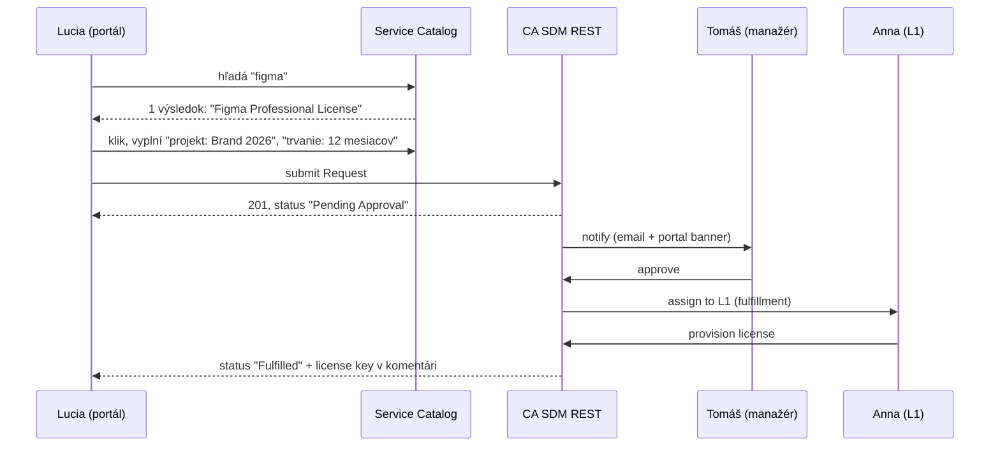

**Alternate:**

- Tomáš odmietne s dôvodom „použij Adobe XD, je v balíčku". Lucia dostane
  **rejection notification** s textom dôvodu — UI musí dôvod zobraziť **prominentne**
  v ticket detaile, nie zahrabaný v komentároch.
- Service Catalog formulár pre Figma má **dynamické polia** podľa typu licencie
  (single user vs. team). Polia sa generujú z CA SDM Request Item template
  `[GAP-1]` — UX musí byť pripravené, že počet polí je 3–15.

---

### `portal-kb-self-help`

**Kontext:** Lucia nemôže pripojiť VPN klienta z home office, predtým než otvorí
ticket chce overiť, či to nie je niečo banálne.

**Happy path:**

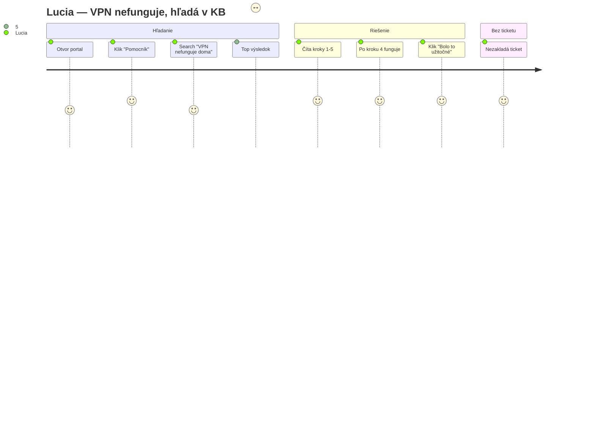

**Alternate:**

- Search „VPN home office" má 0 výsledkov. Portál musí ponúknuť **„Nenašiel
  som odpoveď — chceš otvoriť ticket?"** akciu, ktorá pred-vyplní formulár
  z hľadaného dotazu (kategória: Connectivity, popis: „VPN home office").
- Článok existuje, ale je v EN; Lucia má SK profil. Ak je dostupný len EN,
  **nezobrazujeme stub „Translation pending"** — zobrazíme EN obsah s malým
  badge „Iba v angličtine", lebo to je užitočnejšie ako prázdne.

---

## agent_l1_anna

### `workspace-incident-triage`

**Kontext:** Pondelok 8:15, Anna otvára workspace. Cez víkend prišlo 12 nových
ticketov, treba klasifikovať a prideliť (alebo vyriešiť cez KB).

**Happy path:**

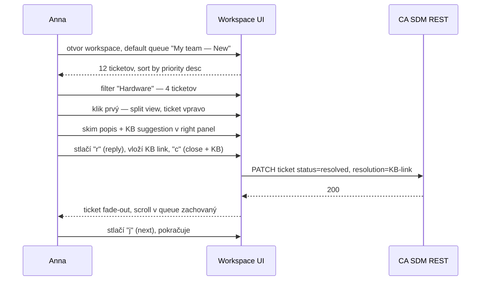

**Alternate:**

- Anna omylom prepne tenant (klikne na switcher, vyberie „Acme East"). UI
  musí **pri zmene tenantu uzavrieť otvorený ticket detail** (lebo patrí
  k inému tenantu) a ukázať toast „Prepol si do Acme East — queue prenahraná".
  Bez toho Anna napíše odpoveď do nesprávneho tenantu.
- Ticket je **assigned na iného agenta** (Anna ho otvorí omylom). UI musí
  ukázať badge „Assigned to: Marek" a **zablokovať reply button** s tooltipom
  „Najprv prevezmi ticket na seba (Take)". Anna stlačí `t` (take), reply sa
  odomkne.
- Queue sort sa stratí pri refresh — UI musí **persistovať queue preferences**
  (sort, filter, columns) do localStorage per persona.

---

### `workspace-incident-resolve-with-cmdb`

**Kontext:** Ticket „Outlook nefunguje od rána" — Anna potrebuje overiť, či to
nie je následok nedávneho Windows updatu.

**Happy path:**

```mermaid
journey
    title Anna — Outlook nefunguje, využíva CMDB
    section Otvorenie ticketu
      Klik ticket #INC-2104: 5: Anna
      Right panel: Lucia (žiadateľ): 5: Anna
      CI: laptop "L-1042" : 5: Anna
    section Diagnostika
      Klik na CI         : 5: Anna
      Vidí: posledný patch dnes 03:00: 5: Anna
      Vidí: 8 ďalších incidentov rovnaký patch: 5: Anna
    section Akcia
      Linkuje na Problem #PRB-44: 5: Anna
      Reply z KB článku "Workaround Outlook patch": 5: Anna
      Close as workaround: 4: Anna
```

**Alternate:**

- CI nie je v CMDB priradené (žiadateľ má laptop, ktorý discovery nezachytil).
  UI v right paneli ukáže „CI: Nepriradené" s odkazom „Prideliť CI" (ide
  do CMDB modulu — ale Anna nemá write právo, len read). Tlačidlo musí byť
  **disabled s tooltipom** „Nemáš oprávnenie editovať CMDB" (RBAC).
- Linkovanie na Problem je open-text dropdown — Anna napíše „Outlook patch"
  a UI musí ukázať **fuzzy search výsledky** (Problem records s podobným
  popisom), nie ju nútiť pamätať si Problem ID.

---

### `workspace-incident-escalate-to-l2`

**Kontext:** Sieťový problém v dcérke „Acme East" — Anna ho rieši 25 minút,
nevie pokračovať, eskaluje na L2 Mareka.

**Happy path:**

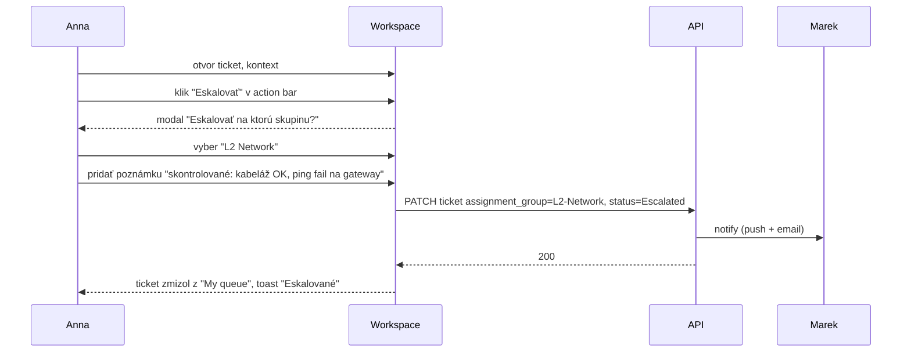

**Alternate:**

- Anna pri eskalácii zabudne pridať poznámku — UI musí mať **soft validation**:
  pri prázdnej poznámke ukázať warning „Eskalujete bez poznámky. L2 musí
  prečítať celý ticket. Pokračovať?" (nie hard-block, ale prompt).
- Cieľová skupina „L2 Network" nemá v tenantu „Acme East" žiadnych aktívnych
  členov (svojím tenant scope). UI musí **fail-fast**: skupinu vôbec
  nezobraziť, alebo zobraziť s badge „Žiadny aktívny člen — kontakt cez HQ".
  Nikdy nedovoliť eskaláciu do prázdnej skupiny.

---

## agent_l2_marek

### `workspace-problem-rca`

**Kontext:** Tri tickety za týždeň o pomalom e-mail klientovi v dcérke „Acme East".
Marek otvorí Problem record, robí RCA.

**Happy path:**

```mermaid
journey
    title Marek — Problem record + linkovanie
    section Setup
      Vytvor Problem #PRB-118: 5: Marek
      Popis: "Outlook latency Acme East": 4: Marek
    section Linkovanie
      Tab "Linked Incidents": 5: Marek
      Bulk add 12 incidentov : 4: Marek
      Vyhľadanie cez query "outlook AND Acme-East": 5: Marek
    section RCA
      Tab "Root Cause" — píše analýzu: 5: Marek
      Linkuje na CI "exch-east-01": 5: Marek
      Označuje ako Known Error: 5: Marek
    section Workaround → KB
      Tlačidlo "Create KB from this": 5: Marek
      KB Editor predvyplnený  : 5: Marek
```

**Alternate:**

- Bulk add 12 incidentov — niektoré sú v inom tenante (cross-tenant). UI musí
  **vizuálne oddeliť** v zozname (ikona / badge) a varovať „Linkuješ tickety
  z viacerých tenantov — povolené?" `[GAP-2: cross-tenant linkovanie?]`
- Pri tvorbe KB článku „Create from this" treba zachovať odkaz Problem→KB
  (aby budúci žiadateľ vedel, že to je „Known Error workaround"). UI musí
  zachovať tento link **viditeľne** v KB metadata.

---

### `workspace-cmdb-impact-analysis`

**Kontext:** Storage server `srv-stg-east-02` má naplánovaný patch budúci
týždeň. Marek potrebuje overiť, čo na ňom závisí.

**Happy path:**

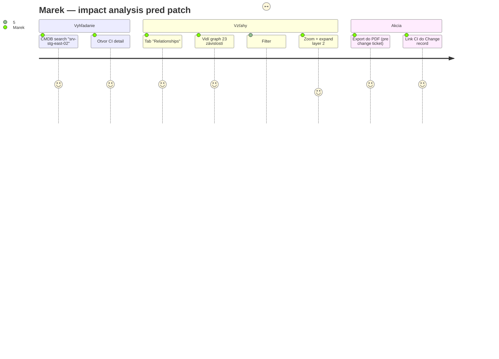

**Alternate:**

- Graph má 200+ uzlov (storage je core service). UI musí ponúknuť **automatický
  cluster** (zoskupiť podľa typu CI: aplikácie, ďalšie servery, network),
  nie ich kresliť ako spaghetti.
- Marek klikne na CI „app-customer-portal" v grafe — chce vidieť **impact
  na biznisu** (počet užívateľov, business owner). Tieto atribúty musia byť
  v CI detail right-side panel (pop-out na hover/click).

---

### `workspace-incident-deep-dive`

**Kontext:** Eskalovaný ticket od Anny — VPN klient odmieta pripojenie kvôli
expirovanému certifikátu na klientovi.

**Happy path:**

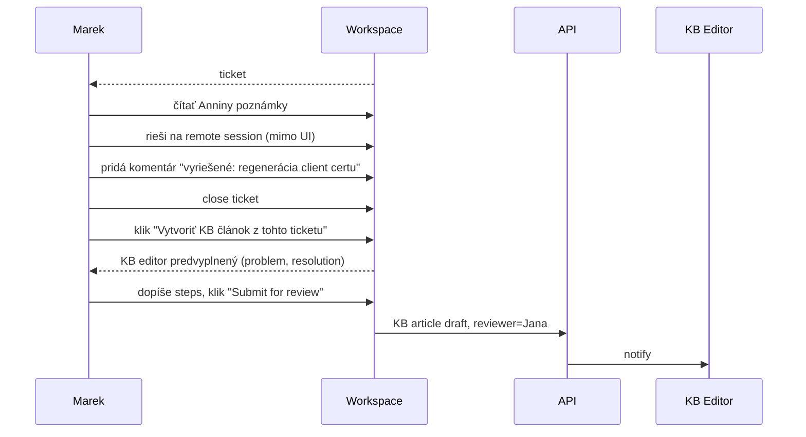

**Alternate:**

- Marek omylom pri close zabudne resolution code (Required field). UI musí
  **inline blockovať close** s focus na chýbajúcom poli, nie celú obrazovku
  modálne prerušiť.
- KB článok submituje, ale **Jana je na PN-ke**. UI by malo navrhnúť
  alternatívneho reviewera z tej istej skupiny (KB Editors).

---

## change_manager_peter

### `workspace-change-cab-prep`

**Kontext:** Pondelok 8:00, CAB meeting o 10:00. Peter musí prejsť 25 changes
naplánovaných na týždeň.

**Happy path:**

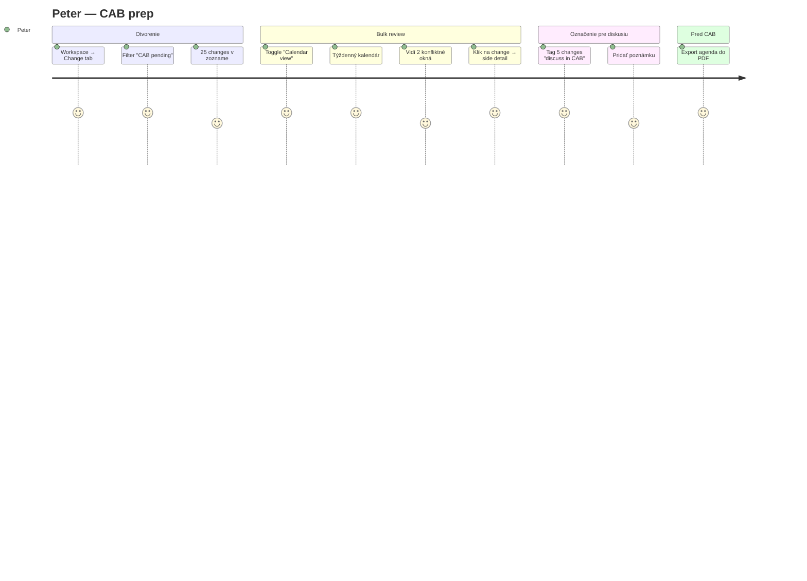

**Alternate:**

- Konflikt v okne (dva changes na ten istý CI v rovnakom čase). UI musí
  v kalendári **automaticky zvýrazniť konflikt** (red border / warning ikona)
  a v change detaile zobraziť „Conflict with #CHG-441 at 22:00–23:00".
- Bulk tagging „discuss" — UI musí byť **klávesnicovo prístupné** (Peter
  premieta na projektor v CAB-e a chce navigovať bez myši).

---

### `workspace-change-emergency-approve`

**Kontext:** 14:30, prišiel security advisory — patch na Apache Log4j cez
weekend. Peter musí schváliť emergency change do 16:00.

**Happy path:**

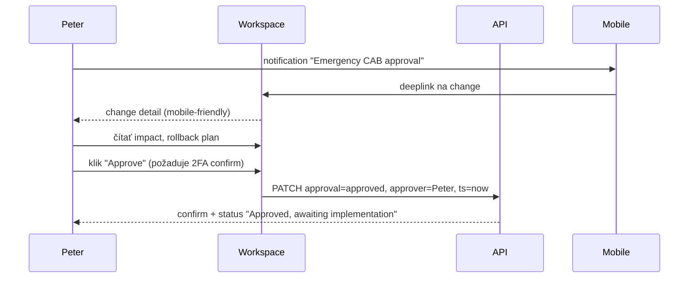

**Alternate:**

- 2FA challenge zlyhá (network issue) — UI musí ponúknuť **retry** bez straty
  context (nie redirect na home).
- Peter chce schváliť, ale rollback plán je prázdny. UI musí **zablokovať**
  approve s viditeľným warningom „Rollback plán je vyžadovaný pre emergency
  changes" — ale ponúknuť `Request changes` akciu (pošle späť implementorovi
  s poznámkou).

---

### `workspace-change-cross-tenant-conflict`

**Kontext:** Change v dcérke „Acme East" je naplánovaný na sobotu 02:00–06:00.
Peter v HQ má v ten istý čas maintenance window. Treba uvidieť konflikt.

**Happy path:**

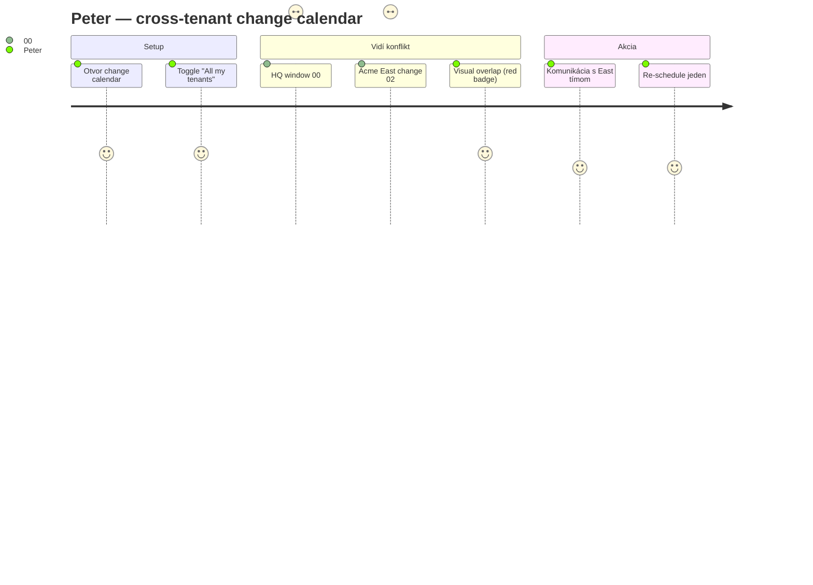

**Alternate:**

- Peter nemá rolu v „Acme East" tenantu — nemôže schvaľovať tam, ale potrebuje
  ho **vidieť** v read-only mode (cross-tenant visibility). UI musí ponúknuť
  toggle „Show external tenants (read-only)" — ale len ak má používateľ
  dostatočnú rolu v HQ (compliance officer / global change manager).
  `[GAP-3: má CA SDM cross-tenant viewer rolu?]`

---

## kb_editor_jana

### `workspace-kb-author-new`

**Kontext:** Jana píše nový článok „Reset hesla pre VPN klienta" po viacerých
ticketoch s rovnakou témou.

**Happy path:**

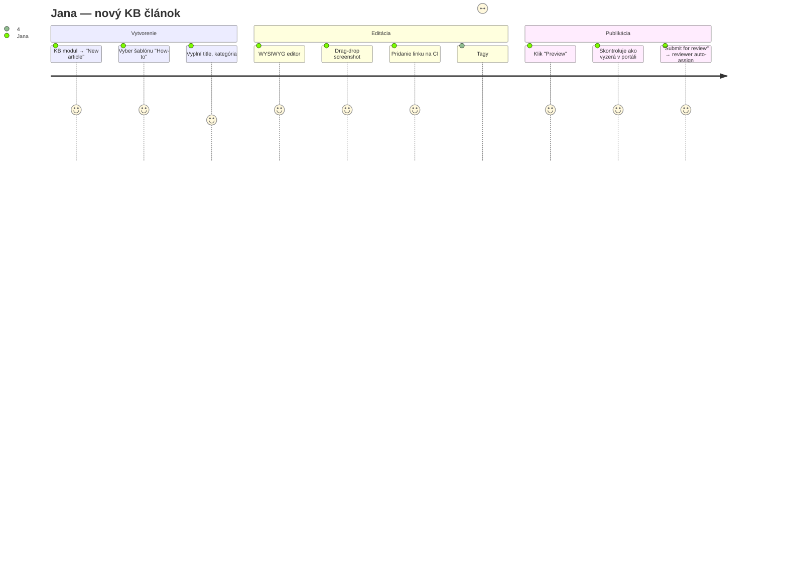

**Alternate:**

- Auto-save: ak prehliadač spadne, draft musí byť obnoviteľný. UI musí
  ukázať **„Obnoviť draft z 14:32"** banner pri otvorení editora.
- Submit s nepripojenou kategóriou — UI inline error „Kategória je
  vyžadovaná pre publish" + focus na poli.

---

### `workspace-kb-from-incident`

**Kontext:** Marek pri close ticketu klikol „Create KB article". Jana dostala
notification s draft-om.

**Happy path:**

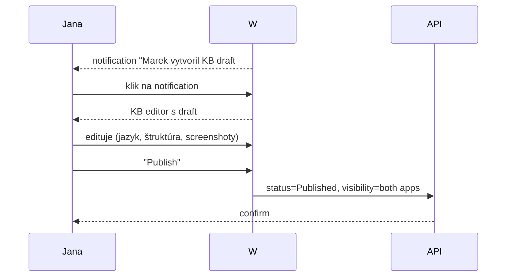

**Alternate:**

- Pôvodný ticket bol v inom tenante. KB článok musí mať **visibility scope**
  per tenant — Jana musí explicitne zvoliť, či článok vidieť všetkým tenantom
  alebo len tomu, kde vznikol problém. UI musí mať jasný `Visibility` selector.

---

### `workspace-kb-analytics-review`

**Kontext:** Piatok 15:00, Jana robí týždennú analytics retrospektívu.

**Happy path:**

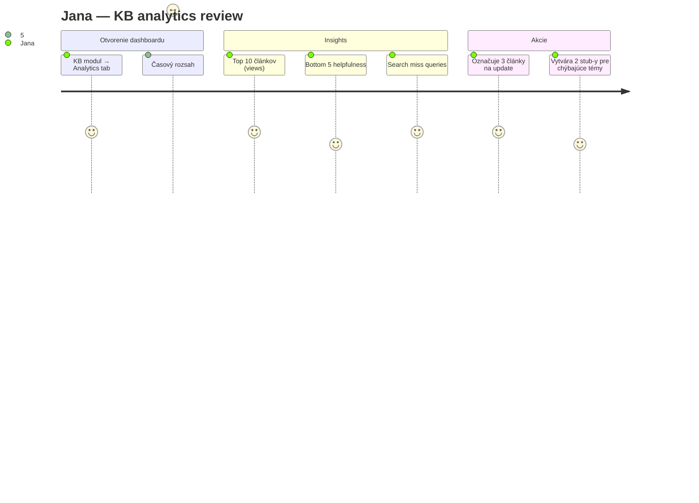

**Alternate:**

- Search miss query „password reset" má 50 výskytov — ale článok existuje.
  Jana zistí, že články sú v EN, používatelia hľadajú v SK. UI musí ukázať
  **language match analytics** (čo hľadali vs. v ktorom jazyku je článok).
  `[GAP-4: vystavuje CA SDM tieto metriky natívne?]`

---

## cmdb_owner_robert

### `workspace-cmdb-ci-detail`

**Kontext:** Robert kontroluje CI „srv-prod-db-01" pred plánovaným patch-om.

**Happy path:**

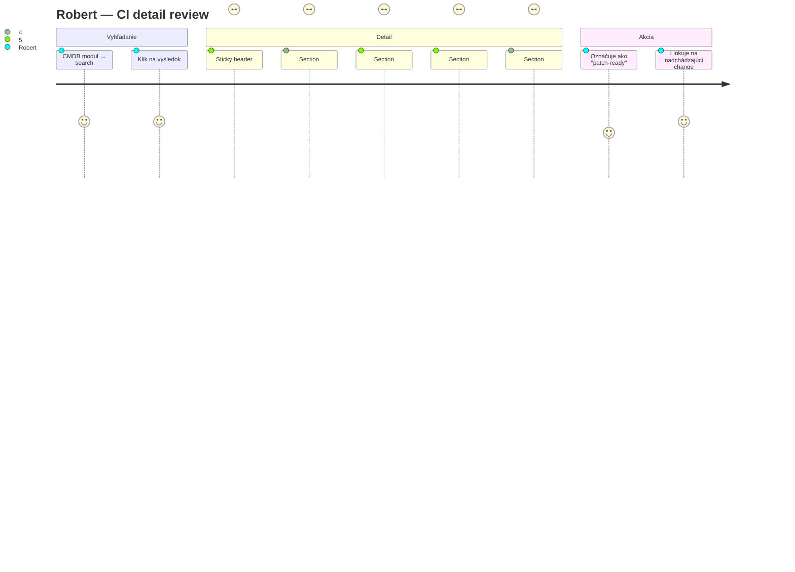

**Alternate:**

- 47 atribútov — Robert chce **collapse** sekcie, ktoré nepoužíva (custom UDF
  fields). UI musí mať per-user preferencie: ktoré sekcie collapsed by default.
- CI history má 200+ záznamov za 3 roky. UI musí ponúknuť **time filter**
  (last week / month / year) namiesto plnej tabuľky.

---

### `workspace-cmdb-relationship-impact`

**Kontext:** Biznis chce vyradiť legacy aplikáciu „crm-legacy". Robert ukáže
manažmentu, čo na nej závisí.

**Happy path:**

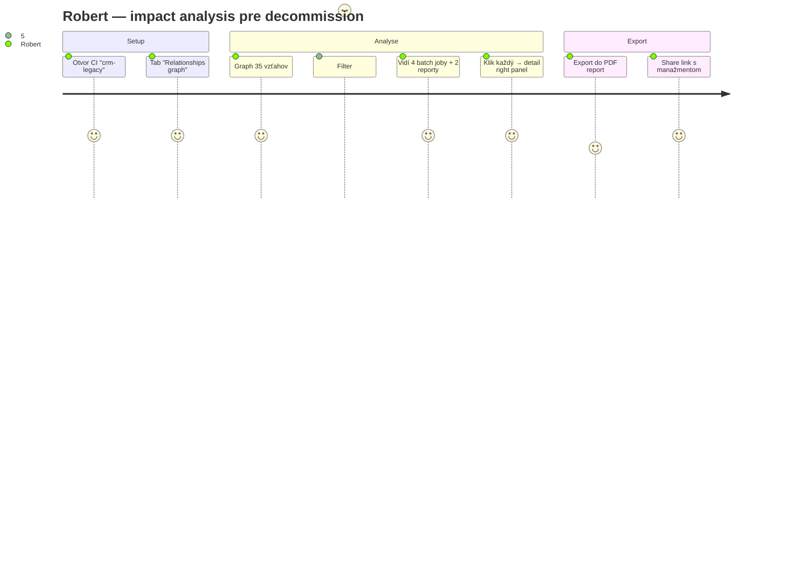

**Alternate:**

- „depends on me" filter ukazuje aj **deprecated** vzťahy (CI bol
  vyradený, ale vzťah ostal). UI musí farebne odlíšiť aktívne vs. deprecated
  CI v grafe.
- PDF export trvá > 30 sekúnd (veľký graph). UI musí ukázať **loading state**
  s % progress, nie freezed obrazovka.

---

### `workspace-cmdb-cross-tenant-shared`

**Kontext:** Dcérka „Acme East" používa storage z HQ tenantu. Robert kontroluje
cross-tenant CI vzťahy pred zmenou storage layera.

**Happy path:**

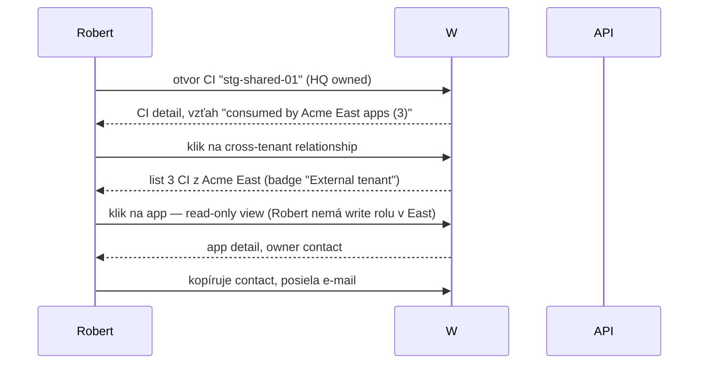

**Alternate:**

- Robert nemá vôbec rolu v „Acme East" — UI musí ukázať **CI relationship
  ako agregát** („3 CIs consumed by Acme East") **bez detailu**, ale s
  contact-om na tenant administrátora. Compliance princíp: ukázať **že to
  existuje**, ale nie **čo to je**.
- Cross-tenant CI je „shared ownership" — kto môže meniť? UI musí mať
  jasný badge „Shared ownership: HQ + Acme East" a v action bar disabled
  edit s tooltipom „Vyžaduje súhlas oboch ownerov".
  `[GAP-5: podporuje CA SDM shared CI ownership?]`

---

## Otvorené závislosti

- `[01-api-analyst]` `[GAP-1]` Service Catalog dynamic forms — formulárové
  polia sa generujú z CA SDM Request Item template. Potvrď schému, formát
  field definícií, validačné pravidlá; UX inak nedokáže navrhnúť form
  rendering komponent.
- `[01-api-analyst]` `[GAP-2]` Cross-tenant linkovanie ticketov (Incident →
  Problem v inom tenante) — povolené, blokované, alebo vyžaduje špeciálnu
  rolu? Tento GAP ovplyvňuje 3 journeys (Marek RCA, Marek deep-dive, Peter
  cross-tenant change).
- `[01-api-analyst]` `[GAP-3]` Cross-tenant viewer role — existuje v CA SDM
  „global compliance" rola, ktorá vidí read-only do všetkých tenantov?
  Ak nie, Peter cross-tenant scenár nie je realizovateľný v MVP.
- `[01-api-analyst]` `[GAP-4]` KB analytics — vystavuje CA SDM REST endpointy
  pre views, helpfulness, search miss? Alebo to musíme vybudovať v BFF?
  Ak to nie je v MVP, persona Jana má scenár 3 mimo scope.
- `[01-api-analyst]` `[GAP-5]` Shared CI ownership cross-tenant — podporuje
  CA SDM CMDB ownership pre 2+ tenantov per CI?
- `[03-domain-modeller]` Triple linkovanie Incident → Problem → Change.
  Potvrď, či CA SDM podporuje **multi-step asociácie** (priamy link Incident
  → Change cez Problem) alebo len **párové** (Incident-Problem, Problem-Change
  separátne).
- `[03-domain-modeller]` Resolution code list — používateľ ho v UI vyberá
  z dropdown. Aký je zdroj zoznamu (CA SDM `cr_resolutions` alebo per-tenant
  config)?
- `[04-architecture]` Tenant switching pri otvorenom ticket detaile — PM
  musí rozhodnúť stratégiu (uzavrieť detail, varovať pred prepnutím, ponechať
  cross-tenant view). Default UX: uzavrieť + toast „Prepol si tenant".
- `[04-architecture]` Auto-save drafts (formuláre v portáli, KB editor) —
  client-side localStorage alebo BFF endpoint pre server-side draft? Impact
  na UX spoľahlivosť.
- `[05-security]` Mobilný emergency approve flow Petra — vyžaduje step-up
  auth (2FA na mobile)? Ak áno, vyplýva to z policy a ovplyvní UX prieťah
  approve flowu.
- `[05-security]` Cross-tenant aggregate read (Robert „3 CIs consumed by
  External tenant" ukazujeme len count, nie detaily) — potrebuje audit
  log? UX kalibrácia textu „External tenant" musí súhlasiť s compliance.
- `[07-design-system]` Klávesové skratky pre Annu — `j/k/r/c/e/t` — sú
  kolízne so štandardmi (napr. `Cmd+R` refresh)? Design System musí
  poskytnúť globálnu mapu skratiek pre `workspace`.
