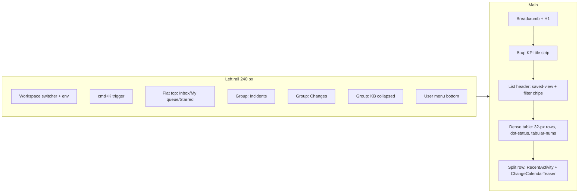

# K.1 — SDM-Rewrite Design Brief (v1.1.4 + v1.2)

**Status**: canonical brief. Phase K executes from this document.
**Inputs**: scout-servicenow.md, scout-jsm.md, scout-freshservice.md, scout-linear-notion.md, scout-illustrations.md.
**Owner verdict to fix**: portal feels "lacný, strohý, ako keby do školy" → bar is "2026 SaaS, not CA SDM 17.4 wearing a CSS hat".

---

## 1. Executive summary

Five borrowings, priority order:

1. **JSM status-as-button lozenge** — every status surface becomes a coloured, sentence-case lozenge that _is_ the transition control. Status colour is the most-repeated visual in an ITSM tool, so this carries the "2026 SaaS" feeling further than any single swap.
2. **Linear list-item stagger on route mount** — 30-line GSAP hook on `[data-row]`, 20 ms per row, 480 ms cap, `prefers-reduced-motion` respected. Transforms the _felt_ quality of every list view in one PR.
3. **Linear cmd+K command palette** — grouped (Recent/Navigate/Actions/Tickets), keyboard-first, mode prefixes (`>`, `#`, `?`). Replaces "where do I click" with "type what I want".
4. **Freshservice portal hero pattern** — hero search + service-catalog tile grid + slide-in request drawer. Replaces tickets-list-as-landing-page with a discovery surface that fits how Lucia thinks.
5. **Polaris density vocabulary in workspace** — borders not shadows, dots not pills in queue body, 4-px radius on inputs/buttons, 6–8-px on cards, 32-px row height, tabular numerals everywhere.

**Stylistic positioning**: **Linear's calm density + JSM's status clarity + Freshservice's portal warmth**, on top of the existing indigo brand.

---

## 2. Brand colour scale

Existing brand-500 `#6366f1` kept (Tailwind indigo, already wired through 60+ files). Linear's `#5E6AD2` rejected — 4-RGB-unit improvement does not justify churn. The ramp below is the **canonical replacement** for the ad-hoc `#5d4dff` references the owner flagged.

```css
:root,
[data-theme="light"] {
  /* Primary — Indigo (Tailwind, locked; 500 = brand spine, 600 = CTA bg, 700 = hover) */
  --sdm-color-primary-50: #eef2ff;
  --sdm-color-primary-100: #e0e7ff;
  --sdm-color-primary-200: #c7d2fe;
  --sdm-color-primary-300: #a5b4fc;
  --sdm-color-primary-400: #818cf8;
  --sdm-color-primary-500: #6366f1;
  --sdm-color-primary-600: #4f46e5;
  --sdm-color-primary-700: #4338ca;
  --sdm-color-primary-800: #3730a3;
  --sdm-color-primary-900: #312e81;

  /* Neutral — light (Slate; 50=app bg, 100=row hover, 200=border, 700=body, 800=headings) */
  --sdm-color-neutral-0: #ffffff;
  --sdm-color-neutral-50: #f8fafc;
  --sdm-color-neutral-100: #f1f5f9;
  --sdm-color-neutral-200: #e2e8f0;
  --sdm-color-neutral-300: #cbd5e1;
  --sdm-color-neutral-400: #94a3b8;
  --sdm-color-neutral-500: #64748b;
  --sdm-color-neutral-600: #475569;
  --sdm-color-neutral-700: #334155;
  --sdm-color-neutral-800: #1e293b;
  --sdm-color-neutral-900: #0f172a;

  /* Neutral — dark (Linear-bg + ADS-DN hybrid; -bg=deepest app bg, 50=card, 800=body) */
  --sdm-color-dark-bg: #0f0f11;
  --sdm-color-dark-50: #18181b;
  --sdm-color-dark-100: #1c1d1f;
  --sdm-color-dark-200: #222326;
  --sdm-color-dark-300: #27282b;
  --sdm-color-dark-400: #3f3f46;
  --sdm-color-dark-500: #71717a;
  --sdm-color-dark-600: #a1a1aa;
  --sdm-color-dark-700: #d4d4d8;
  --sdm-color-dark-800: #e4e4e7;
  --sdm-color-dark-900: #f4f4f5;

  /* Semantic — 50/100 subtle bg, 500 solid, 700 fg on light, 900 dark-bg */
  --sdm-color-success-50: #f0fdf4;
  --sdm-color-success-100: #dcfce7;
  --sdm-color-success-500: #22c55e;
  --sdm-color-success-700: #15803d;
  --sdm-color-success-900: #14532d;
  --sdm-color-warning-50: #fffbeb;
  --sdm-color-warning-100: #fef3c7;
  --sdm-color-warning-500: #f59e0b;
  --sdm-color-warning-700: #b45309;
  --sdm-color-warning-900: #78350f;
  --sdm-color-danger-50: #fef2f2;
  --sdm-color-danger-100: #fee2e2;
  --sdm-color-danger-500: #ef4444;
  --sdm-color-danger-700: #b91c1c;
  --sdm-color-danger-900: #7f1d1d;
  --sdm-color-info-50: #eff6ff;
  --sdm-color-info-100: #dbeafe;
  --sdm-color-info-500: #3b82f6;
  --sdm-color-info-700: #1d4ed8;
  --sdm-color-info-900: #1e3a8a;
}
```

**Back-compat shims** (kept in `tokens.css`): `--color-brand-*` → `--sdm-color-primary-*`; `--color-neutral-*` (light) → `--sdm-color-neutral-*`; `--color-{success,warning,danger,info}-fg` → `-700`; `-bg` → `-50`; `-solid` → `-700`.

---

## 3. Typography

**Pick**: **Inter Variable** (sans) + **JetBrains Mono Variable** (mono). Both already declared in `tokens.css`/`fonts.css`. Justification: 3 of 4 UI scouts (Freshservice, Linear, Notion) use Inter; ServiceNow Lato is the outlier and is closed-source for self-hosting. Inter Variable exposes intermediate weights `450/510/560` (Linear's calmer hierarchy) which we expose but only use sparingly. JetBrains Mono for ticket IDs, CMDB CI keys, KB code blocks — humanist match to Inter, better legibility than SF Mono.

```css
:root {
  --sdm-font-sans: "Inter Variable", "Inter", system-ui, -apple-system, "Segoe UI", Roboto,
    sans-serif;
  --sdm-font-mono: "JetBrains Mono Variable", "JetBrains Mono", ui-monospace, "SF Mono", Menlo,
    Consolas, monospace;
  --sdm-font-display: var(--sdm-font-sans);

  /* Sizes — 12/14/16/18/20/24/30/36/48 (rem @ 16-px root) */
  --sdm-font-size-xs: 0.75rem; /* 12 chip/meta */
  --sdm-font-size-sm: 0.875rem; /* 14 workspace body */
  --sdm-font-size-base: 1rem; /* 16 portal body */
  --sdm-font-size-md: 1.125rem; /* 18 section title */
  --sdm-font-size-lg: 1.25rem; /* 20 subtitle */
  --sdm-font-size-xl: 1.5rem; /* 24 workspace H1 */
  --sdm-font-size-2xl: 1.875rem; /* 30 portal H1 */
  --sdm-font-size-3xl: 2.25rem; /* 36 portal hero */
  --sdm-font-size-4xl: 3rem; /* 48 marketing/empty hero */

  /* Weights (variable-axis intermediates 450/510/560 exposed for tuning) */
  --sdm-font-weight-regular: 400;
  --sdm-font-weight-medium: 500;
  --sdm-font-weight-semibold: 600;
  --sdm-font-weight-bold: 700;
  --sdm-font-weight-book: 450;
  --sdm-font-weight-medium-x: 510;
  --sdm-font-weight-strong: 560;

  /* Tracking */
  --sdm-letter-spacing-tight: -0.02em;
  --sdm-letter-spacing-snug: -0.01em;
  --sdm-letter-spacing-normal: 0;
  --sdm-letter-spacing-wide: 0.02em;
  --sdm-letter-spacing-caps: 0.06em;
}
```

**Weight conventions** — headings 600, body 400, UI labels (nav, button, table header) 500, KPI numbers and chip labels 600. Never 800/900.

**Tabular numerals** — `font-variant-numeric: tabular-nums` is **mandatory** on ticket IDs, dates, SLA timers, counts, KPI values, queue numeric columns. Utility class `.sdm-tabular`; baked into `PriorityBadge`, `StatusBadge`, and workspace table cells.

**Loading** — `font-display: swap`, woff2 only, latin + latin-ext (Slovak needs latin-ext). Inter Variable preloaded in `index.html` (`<link rel="preload" as="font" crossorigin>`); JetBrains Mono not preloaded.

---

## 4. Spacing & radius scales

**Spacing** — 4-px base, scale **4/8/12/16/24/32/48/64** (Linear+JSM consensus; no 6/10/14). Existing 2/6/10/20/40/80 stay as `--spacing-0_5/1_5/2_5/5/10/20` back-compat shims; new code uses only the canonical eight.

```css
:root {
  --sdm-space-1: 0.25rem; /* 4  icon-text gap, chip padding */
  --sdm-space-2: 0.5rem; /* 8  most-common gap, button padding-y */
  --sdm-space-3: 0.75rem; /* 12 input padding-y, workspace cell */
  --sdm-space-4: 1rem; /* 16 card padding, section internal */
  --sdm-space-6: 1.5rem; /* 24 section gap (portal), card-grid gap */
  --sdm-space-8: 2rem; /* 32 portal hero padding */
  --sdm-space-12: 3rem; /* 48 page top breathing (portal) */
  --sdm-space-16: 4rem; /* 64 major layout gap */
}
```

**Radius** — **4/8/12/16/full**. "School project" feel comes from over-rounding: 4 on inputs/buttons/chips, 8 on cards (Polaris/ADS consensus), 12 on modals + cmd+K (Linear), 16 reserved for hero/marketing only.

```css
:root {
  --sdm-radius-sm: 4px; /* inputs, buttons, chips, lozenges, table outer */
  --sdm-radius-md: 8px; /* cards, popovers, tiles */
  --sdm-radius-lg: 12px; /* modals, cmd+K, drawers */
  --sdm-radius-xl: 16px; /* hero panels, empty-state hero */
  --sdm-radius-full: 9999px; /* avatars, status dots, count badges */
}
```

Workspace queue rows: **radius 0** on rows, `--sdm-radius-md` on outer container only (Polaris rule).

---

## 5. Shadow / elevation scale

Three levels (Polaris+ADS consensus — flatter than Material, borders do the work for static surfaces).

```css
:root,
[data-theme="light"] {
  --sdm-shadow-sm: 0 1px 2px rgba(15, 23, 42, 0.06), 0 1px 1px rgba(15, 23, 42, 0.04);
  --sdm-shadow-md: 0 4px 12px rgba(15, 23, 42, 0.1), 0 2px 4px rgba(15, 23, 42, 0.06);
  --sdm-shadow-lg: 0 12px 32px rgba(15, 23, 42, 0.18), 0 4px 8px rgba(15, 23, 42, 0.08);
}

[data-theme="dark"] {
  --sdm-shadow-sm: 0 1px 2px rgba(0, 0, 0, 0.35), 0 1px 1px rgba(0, 0, 0, 0.25);
  --sdm-shadow-md: 0 4px 12px rgba(0, 0, 0, 0.5), 0 2px 4px rgba(0, 0, 0, 0.3);
  --sdm-shadow-lg: 0 12px 32px rgba(0, 0, 0, 0.7), 0 4px 8px rgba(0, 0, 0, 0.4);
}
```

**Application** — static cards/queue rows/sidebar: `1px solid var(--sdm-color-neutral-200)` (dark: `--sdm-color-dark-400`). `sm` on hovered tiles + dropdown triggers. `md` on popovers, menus, toasts. `lg` on modals, cmd+K, drawers, drag previews.

---

## 6. Component patterns

### 6.1 NavLink

Single nav item; used in portal top-bar (horizontal) and workspace left-rail (vertical, with collapsible groups).

- **Anatomy**: `[icon?] [label] [count-badge?]` — icon left, label centre, count right-aligned.
- **Variants**: `horizontal` (portal, active = 2-px primary bottom bar), `vertical` (workspace, active = 2-px primary left bar).
- **States**: default text-secondary; hover bg `neutral-100`; active text-primary + bar; focus ring 2-px primary; disabled opacity 0.5.
- **A11y**: `<NavLink>` (router); `aria-current="page"` on active; count badge inside the label so SR reads "My queue, 12 items".

```
Vertical (workspace):                Horizontal (portal):
┌──────────────────────┐             ┌──────────────────────────────┐
│ ⏱  My queue       12 │  ← active   │  Home  Catalog  My tickets   │
│ │ ●  Triage        7 │             │ ════                         │
└──────────────────────┘             └──────────────────────────────┘
```

### 6.2 Card (extend existing)

- **Anatomy**: optional header (title + actions), body, optional footer.
- **Variants**: `default` (border only), `elevated` (border + shadow-sm on hover), `interactive` (entire card clickable — used by Tile).
- **States**: default; hover (interactive only) → border `neutral-300` + shadow-sm + `translateY(-1px)`; focus ring 2-px primary.
- **Padding**: `--sdm-space-4` default; `--sdm-space-6` on portal home cards.

### 6.3 Tile

Large clickable surface — quick-actions, catalog item, KB preview.

- **Anatomy**: 40-px icon-badge (brand tint), title, one-line description, optional meta (SLA chip), chevron right.
- **Variants**: `quick-action` (~200×140, 3-up), `catalog` (~280×160, 3-up), `kb` (~240×120).
- **States**: default border `neutral-200`, no shadow; hover border `primary-400` + shadow-sm + `translateY(-2px)`; active `translateY(0)`; focus ring 2-px primary.

```
┌──────────────────────────────┐
│  ┌──┐                        │
│  │📧│  Email issue           │
│  └──┘                        │
│  Mailbox, calendar, spam.    │
│  ~ 2-day SLA            ›    │
└──────────────────────────────┘
```

### 6.4 StatusBadge (extend existing)

CA SDM ticket lifecycle status as a sentence-case lozenge. In v1.2 the badge becomes a button (JSM pattern) — clicking opens an inline transition menu.

- **Anatomy**: optional leading 6-px dot or lucide icon, label, optional `▾` chevron in interactive mode.
- **Variants**: `lozenge` (filled bg + fg, default), `dot` (6-px coloured dot + plain text — workspace queue body only), `button` (lozenge + chevron, transitions).

**CA SDM status → colour + lucide icon**:

| Code  | Label               | Family    | Icon             |
| ----- | ------------------- | --------- | ---------------- |
| `OP`  | Open                | `info`    | `CircleDot`      |
| `WIP` | In progress         | `primary` | `LoaderCircle`   |
| `HD`  | On hold             | `warning` | `PauseCircle`    |
| `WC`  | Waiting on customer | `warning` | `Clock`          |
| `WV`  | Waiting on vendor   | `warning` | `Clock`          |
| `RE`  | Resolved            | `success` | `CheckCircle2`   |
| `CL`  | Closed              | `neutral` | `Circle`         |
| `CN`  | Cancelled           | `neutral` | `XCircle`        |
| `RJ`  | Rejected            | `danger`  | `XOctagon`       |
| `AP`  | Approval pending    | `primary` | `ShieldQuestion` |
| `AR`  | Approval rejected   | `danger`  | `ShieldX`        |
| `SC`  | Scheduled           | `info`    | `CalendarClock`  |

Lozenge bg = `--sdm-color-<family>-100`, fg = `--sdm-color-<family>-700`, border transparent. Dot variant: 6-px circle in `--sdm-color-<family>-500` + label in `--sdm-color-neutral-700`.

- **A11y**: button variant gets `aria-haspopup="menu"` + `aria-expanded`; dot variant pairs the visual dot with text (never colour-only).

### 6.5 PriorityBadge (extend existing)

| Priority      | Style                                                                         |
| ------------- | ----------------------------------------------------------------------------- |
| P1 / Critical | `danger-500` solid bg + white text — **always solid** (Polaris severity rule) |
| P2 / High     | `warning-100` bg + `warning-900` text                                         |
| P3 / Medium   | `info-100` bg + `info-900` text                                               |
| P4 / Low      | `neutral-200` bg + `neutral-700` text                                         |
| None          | `neutral-100` bg + `neutral-500` text                                         |

### 6.6 Avatar

- **Anatomy**: circular container + image OR initials fallback OR lucide `User` icon fallback.
- **Sizes**: `xs` 16, `sm` 24, `md` 32, `lg` 40, `xl` 64 (profile only).
- **States**: default; with status dot (online/away/offline, 8-px bottom-right); stacked (3-overlap row used in "watching" lists).
- **Initials**: first-of-first + first-of-last; bg deterministic from username hash → pick from `primary-100`, `success-100`, `info-100`, `warning-100`, `danger-100`; fg = corresponding `-700`.

### 6.7 IconButton (already exists — confirm sizes)

- **Sizes**: `sm` 28×28 (icon 14), `md` 36×36 (icon 16), `lg` 44×44 (icon 20).
- **Variants**: `ghost` (no bg, hover `neutral-100`), `outlined` (border + transparent), `solid` (primary bg, primary-700 hover).
- **States**: default; hover; active `scale(0.97)`; focus ring; disabled.
- **A11y**: `aria-label` mandatory (lint rule); native `<button>`.

### 6.8 EmptyState

- **Anatomy**: illustration slot (160–240 px wide for hero, 48–96 px lucide circle for compact) + heading + body (1 sentence) + CTA.
- **Variants**: `hero` (full unDraw, dedicated empty-state page), `compact` (lucide in tinted circle, inline empties), `minimal` (text + link only).
- **A11y**: `role="status"` on compact (announces when list becomes empty); illustration `aria-hidden="true"` when heading conveys the meaning.

```
┌────────────────────────────────────────────┐
│         [unDraw illustration 200 px]       │
│         Žiadne otvorené tickety            │  ← h2, 1.25rem, 600
│   Všetky vaše požiadavky sú vybavené.      │  ← body, --neutral-600
│         [  + Nová požiadavka  ]            │  ← primary button
└────────────────────────────────────────────┘
```

### 6.9 ToastFlyout

Transient feedback. Top-right, stacks vertically, max 3 visible.

- **Anatomy**: semantic icon + title + optional body + dismiss `×`.
- **Variants**: `success`, `info`, `warning`, `danger`. Bg `--sdm-color-<intent>-50`, border-left 3-px `--sdm-color-<intent>-500`, text `--sdm-color-<intent>-900`, shadow `md`, radius `md`.
- **Auto-dismiss**: success/info 5 s; warning 8 s; danger sticky.
- **Motion**: slide-in from right (16 px X + opacity, 200 ms `ease-out`); slide-out 160 ms `ease-in`.
- **A11y**: `role="status"` (success/info) or `role="alert"` (warning/danger); container `aria-live="polite"` or `assertive`.

### 6.10 CommandPalette (cmd+K, new for v1.2)

Linear-style global launcher.

- **Anatomy**: 640-px modal, 70vh max, internal scroll, 20 % from top. Input row 44 px (14-px input, `⌘K` chip leading, `Esc` chip trailing). Grouped result list (small-caps headers): **Recent**, **Navigate**, **Actions**, **Tickets**, **KB**, **Users**. Rows: leading icon, label, optional shortcut chip right.
- **Variants**: portal (Recent / Navigate / Tickets / KB) vs workspace (all groups).
- **States**: closed; open empty (recents + groups); typing (120 ms network debounce, local filter instant); no results.
- **Behaviour**: `cmd+K`/`ctrl+K` open; `Esc`/outside-click close; `↑/↓` cycles, `Enter` activates, `Tab` stays in input, `cmd+1..9` jumps. Mode prefixes: `>` actions, `#` navigation, `?` help. Recents: 5, `localStorage` key `sdm.cmdk.recent`.
- **Motion**: open `opacity 0→1` + `scale 0.96→1` + `translateY(-4px)→0`, 220 ms `ease-out-expo`; close 150 ms `ease-in`; backdrop 180 ms fade.
- **A11y**: combobox — `role="combobox"` + `aria-expanded` + `aria-controls` on input; result list `role="listbox"`; rows `role="option"` + `aria-selected`.

```
┌──────────────────────────────────────────────────────┐
│  ⌘K   Search or type a command…                 Esc │
├──────────────────────────────────────────────────────┤
│  RECENT     ⏱ Reopen INC-1042              ⌘⇧O      │
│  NAVIGATE   # My queue                     G then Q │
│  ACTIONS    + New ticket                   ⌘N       │
│  TICKETS    ◉ INC-1042  Billing login      Anna L.  │
└──────────────────────────────────────────────────────┘
```

### 6.11 Skeleton (extend existing)

- **Variants**: `text` (1-line bar, height `1em`), `block`, `circle` (avatar), `row` (table row).
- **Shimmer**: 1.6-s linear loop, 200 % background, low-amplitude lightness band (Linear pattern).

```css
@keyframes sdm-shimmer {
  0% {
    background-position: -200% 0;
  }
  100% {
    background-position: 200% 0;
  }
}
.sdm-skeleton {
  background: linear-gradient(
    90deg,
    var(--sdm-color-neutral-100) 0%,
    var(--sdm-color-neutral-200) 50%,
    var(--sdm-color-neutral-100) 100%
  );
  background-size: 200% 100%;
  animation: sdm-shimmer 1.6s linear infinite;
  border-radius: var(--sdm-radius-sm);
}
@media (prefers-reduced-motion: reduce) {
  .sdm-skeleton {
    animation: none;
    opacity: 0.7;
  }
}
```

### 6.12 Breadcrumbs

- **Anatomy**: single-line, `/` separators; last crumb is `<span>` (not link) and matches the page H1.
- **Visual**: 12-px, `--sdm-color-neutral-500`; last crumb `--sdm-color-neutral-800`.
- **Behaviour**: never wraps; truncates the _middle_ with `…` when over width; first + last always visible.
- **Position**: above the H1, never beside.

```
Tenants  /  SOIMCO  /  Incidents  /  INC-1042
INC-1042  Email not syncing
```

---

## 7. Motion rules

```css
:root {
  --sdm-duration-instant: 80ms;
  --sdm-duration-fast: 120ms; /* hover, button press */
  --sdm-duration-base: 180ms; /* dropdown reveal, list item enter */
  --sdm-duration-slow: 240ms; /* drawer slide, cmd+K open */
  --sdm-duration-page: 320ms; /* modal enter, page crossfade */
  --sdm-ease-linear: linear;
  --sdm-ease-out: cubic-bezier(0.25, 1, 0.5, 1); /* default UI in */
  --sdm-ease-in-out: cubic-bezier(0.65, 0, 0.35, 1); /* page transitions */
  --sdm-ease-out-expo: cubic-bezier(0.16, 1, 0.3, 1); /* modal, cmd+K */
  --sdm-ease-spring: cubic-bezier(0.34, 1.2, 0.64, 1); /* drag snap-back */
}
```

**Rule**: user-initiated finishes ≤ 240 ms. > 320 ms is laggy unless it's a page-level orchestrated transition.

### List-item stagger (signature)

Drop-in GSAP, runs once per route mount. Applied to every list view (portal `/tickets`, workspace queue, KB index, CMDB browse). Total stagger capped at 480 ms regardless of row count.

```ts
// packages/design-system/src/motion/list-stagger.ts
import gsap from "gsap";

export function staggerListRows(container: HTMLElement): void {
  if (window.matchMedia("(prefers-reduced-motion: reduce)").matches) {
    gsap.set(container.querySelectorAll("[data-row]"), { clearProps: "all" });
    return;
  }
  const rows = container.querySelectorAll("[data-row]");
  const totalCap = 0.48; // seconds
  const each = Math.min(0.02, totalCap / Math.max(rows.length, 1));
  gsap.from(rows, {
    opacity: 0,
    y: 6,
    duration: 0.22,
    ease: "power3.out",
    stagger: { each, amount: Math.min(totalCap, rows.length * each) },
  });
}
```

### Hover lift (cards / tiles)

```css
.sdm-tile {
  transition:
    transform var(--sdm-duration-fast) var(--sdm-ease-out),
    box-shadow var(--sdm-duration-fast) var(--sdm-ease-out),
    border-color var(--sdm-duration-fast) var(--sdm-ease-out);
}
.sdm-tile:hover {
  transform: translateY(-2px);
  box-shadow: var(--sdm-shadow-sm);
  border-color: var(--sdm-color-primary-400);
}
.sdm-tile:active {
  transform: translateY(0);
}
```

Table-row hover: **background only**, no transform (Polaris density rule).

### Skeleton shimmer

See 6.11 (1.6-s linear loop, opacity fallback under reduced-motion).

### Page transition

Crossfade only — never slide. `opacity 0→1`, 120 ms linear in; 80 ms linear out (parallel).

### `prefers-reduced-motion` fallback (explicit, no negotiation)

- All `transition-duration` / `animation-duration` clamped to `0ms` via the existing token override (`tokens.css` already does this).
- GSAP `stagger`/`from`/`to` early-return; `gsap.set(..., { clearProps: 'all' })` lands at the final state instantly.
- No `transform` — opacity only (and even those zeroed) for ambient animations.
- Skeleton fallback: shimmer off, hold `opacity: 0.7`.

---

## 8. Light + dark mode token specifications

```css
:root,
[data-theme="light"] {
  --sdm-surface: var(--sdm-color-neutral-0); /* card, panel */
  --sdm-surface-app: var(--sdm-color-neutral-50); /* page bg */
  --sdm-surface-subtle: var(--sdm-color-neutral-100); /* row hover */
  --sdm-surface-elevated: var(--sdm-color-neutral-0); /* dropdown */
  --sdm-surface-overlay: rgba(15, 23, 42, 0.55); /* modal backdrop */
  --sdm-text-primary: var(--sdm-color-neutral-900);
  --sdm-text-body: var(--sdm-color-neutral-700);
  --sdm-text-secondary: var(--sdm-color-neutral-600);
  --sdm-text-tertiary: var(--sdm-color-neutral-500);
  --sdm-text-disabled: var(--sdm-color-neutral-400);
  --sdm-text-inverse: var(--sdm-color-neutral-0);
  --sdm-text-link: var(--sdm-color-primary-700);
  --sdm-border: var(--sdm-color-neutral-200);
  --sdm-border-strong: var(--sdm-color-neutral-300);
  --sdm-border-focus: var(--sdm-color-primary-500);
  --sdm-brand: var(--sdm-color-primary-600);
  --sdm-brand-hover: var(--sdm-color-primary-700);
  --sdm-brand-fg: var(--sdm-color-neutral-0);
  --sdm-brand-subtle: var(--sdm-color-primary-50);
  --sdm-success: var(--sdm-color-success-700);
  --sdm-success-bg: var(--sdm-color-success-50);
  --sdm-warning: var(--sdm-color-warning-700);
  --sdm-warning-bg: var(--sdm-color-warning-50);
  --sdm-danger: var(--sdm-color-danger-700);
  --sdm-danger-bg: var(--sdm-color-danger-50);
  --sdm-info: var(--sdm-color-info-700);
  --sdm-info-bg: var(--sdm-color-info-50);
  color-scheme: light;
}

[data-theme="dark"] {
  --sdm-surface: var(--sdm-color-dark-50);
  --sdm-surface-app: var(--sdm-color-dark-bg);
  --sdm-surface-subtle: var(--sdm-color-dark-100);
  --sdm-surface-elevated: var(--sdm-color-dark-100);
  --sdm-surface-overlay: rgba(0, 0, 0, 0.65);
  --sdm-text-primary: var(--sdm-color-dark-900);
  --sdm-text-body: var(--sdm-color-dark-800);
  --sdm-text-secondary: var(--sdm-color-dark-600);
  --sdm-text-tertiary: var(--sdm-color-dark-500);
  --sdm-text-disabled: var(--sdm-color-dark-400);
  --sdm-text-inverse: var(--sdm-color-neutral-900);
  --sdm-text-link: var(--sdm-color-primary-400);
  --sdm-border: var(--sdm-color-dark-400);
  --sdm-border-strong: var(--sdm-color-dark-500);
  --sdm-border-focus: var(--sdm-color-primary-400);
  --sdm-brand: var(--sdm-color-primary-500);
  --sdm-brand-hover: var(--sdm-color-primary-400);
  --sdm-brand-fg: var(--sdm-color-neutral-0);
  --sdm-brand-subtle: var(--sdm-color-primary-900);
  --sdm-success: var(--sdm-color-success-500);
  --sdm-success-bg: var(--sdm-color-success-900);
  --sdm-warning: var(--sdm-color-warning-500);
  --sdm-warning-bg: var(--sdm-color-warning-900);
  --sdm-danger: var(--sdm-color-danger-500);
  --sdm-danger-bg: var(--sdm-color-danger-900);
  --sdm-info: var(--sdm-color-info-500);
  --sdm-info-bg: var(--sdm-color-info-900);
  color-scheme: dark;
}
```

### Dark-mode toggle recipe

`useTheme` hook in `DS/theme/use-theme.ts`: read `localStorage.getItem("sdm.theme")` first, fall back to `matchMedia("(prefers-color-scheme: dark)")`, set `document.documentElement.setAttribute("data-theme", theme)`. Called once in each app's `main.tsx` **before React mounts** (no FOUC). Toggle exposed in top-bar user menu and via `cmd+K → "Toggle theme"`. Persist on change.

---

## 9. Illustration strategy

**unDraw** (primary, MIT-equivalent, no attribution) + **lucide-react** (fallback, already a dep). Storyset/Saly/Humaaans rejected on weight, licence, or theme-ability. Open Peeps too playful for Anna.

**Pipeline** (per asset): download SVG → SVGO with `convertColors: { currentColor: true }` for accent fill → add `role="img"` + `<title>` → commit to `packages/design-system/illustrations/`. Import via `vite-plugin-svgr` as React components.

**v1.1.4 catalog** (10 assets, ~28 KB raw / ~9 KB gzipped post-SVGO):

| #   | Use case                              | Persona | unDraw search/slug                               | Lucide fallback |
| --- | ------------------------------------- | ------- | ------------------------------------------------ | --------------- |
| 1   | No open tickets (portal home)         | Lucia   | `undraw_relaxation` / `undraw_done_a-34`         | `Inbox`         |
| 2   | No tickets assigned (workspace queue) | Anna    | `undraw_empty_inbox` (search: `inbox`)           | `ClipboardList` |
| 3   | No KB articles found                  | both    | `undraw_no_data` / `undraw_empty`                | `BookOpen`      |
| 4   | No catalog items in category          | Lucia   | `undraw_empty_cart` / `undraw_shopping`          | `PackageOpen`   |
| 5   | No notifications                      | both    | `undraw_notify` (search: `bell`)                 | `BellOff`       |
| 6   | No search results                     | both    | `undraw_not_found` / `undraw_searching`          | `SearchX`       |
| 7   | No recent activity                    | both    | `undraw_calm_woman` / `undraw_empty_street`      | `Activity`      |
| 8   | Permission denied                     | both    | `undraw_security` / `undraw_access_denied`       | `ShieldAlert`   |
| 9   | Generic error                         | both    | `undraw_warning` / `undraw_bug_fixing`           | `AlertTriangle` |
| 10  | Offline / connection lost             | both    | `undraw_server_down` / `undraw_signal_searching` | `WifiOff`       |

**Pairing rule**: full unDraw on dedicated empty-state pages; lucide-icon-in-tinted-circle for embedded empties (modals, sidebars, inline, dashboard widgets). Accent: SVG fill → `currentColor`; host sets `color: var(--sdm-color-primary-500)` (light) / `--sdm-color-primary-400` (dark).

---

## 10. Mockups

### 10.1 Portal home (Lucia)

```
┌──────────────────────────────────────────────────────────────────────┐
│ ◆ SOIMCO  Service portal                 ⌘K  🔔  👤 Lucia N. ⌄      │  top-bar 56 px
├──────────────────────────────────────────────────────────────────────┤
│  Domov  /                                                            │  breadcrumb
│   Dobrý deň, Lucia.                                                  │  H1 30 px, 600
│   Akú pomoc dnes potrebujete?                                        │  subtitle 18 px, --neutral-600
│   ┌────────────────────────────────────────────────────────────┐     │
│   │ 🔍  Hľadať v báze znalostí alebo katalógu služieb…         │     │  KbSearchBar 48 px
│   └────────────────────────────────────────────────────────────┘     │
│   Populárne:  [Wi-Fi] [VPN] [Heslo] [Notebook]                       │  chip row
├──────────────────────────────────────────────────────────────────────┤
│   ┌─Otvorené─3─┐ ┌─Čakajúce─1─┐ ┌─Vybavené─12─┐                      │  HeroStats KPI tiles (3-up)
│   Rýchle akcie                                                       │  H2 20 px
│   ┌─📧 Nahlásiť─┐ ┌─💻 Hardvér─┐ ┌─🔑 Reset hesla─┐                  │  QuickActions Tiles (3-up)
│   ┌─Moje otvorené tickety ›────┐ ┌─Oznámenia──────┐                  │  OpenTicketsCard + AnnouncementsCard
│   │ INC-1042  [●Open][P2]      │ │ ● Wi-Fi servis │
│   │ INC-1031  [●WIP][P3]       │ │ ● Nový katalóg │                  │
│   └────────────────────────────┘ └────────────────┘                  │
│   Katalóg služieb                              Všetko ›              │  CatalogTeaser
│   [Hardvér] [Softvér] [Prístup] [Ostatné]                            │
│   Posledná aktivita                                                  │  RecentActivity
│   ◉ Anna L. priradila INC-1042 sebe · pred 12 min                    │
└──────────────────────────────────────────────────────────────────────┘
```

```mermaid
flowchart TD
  TB[Top-bar: brand + cmd+K + notif + user] --> BC[Breadcrumb]
  BC --> H[Hero: greeting + KbSearchBar + chip row]
  H --> KPI[HeroStats 3-up KPI tiles]
  KPI --> QA[QuickActions 3-up Tile grid]
  QA --> R1[Row: OpenTicketsCard | AnnouncementsCard]
  R1 --> CT[CatalogTeaser: 4 category tiles + 'Všetko' link]
  CT --> RA[RecentActivity inline rows]
```

### 10.2 Workspace queue/home (Anna)

```
┌──────────────────┬─────────────────────────────────────────────────────────┐
│ ◆ SOIMCO dev ⌄  │ Domov / Incidenty / Moja fronta                         │  breadcrumb
│ ⌘K Hľadať…      │ Moja fronta                            [+ Nový]  ⋮      │  H1 24 px
│ 📥 Inbox     3  ├─────────────────────────────────────────────────────────┤
│ ⏱ Moja front 12●│ ┌Otvor─147┐ ┌Moje─12┐ ┌Po SLA─3▲┐ ┌<1h─5▲┐ ┌Dnes─28┐   │  KPI strip 5-up
│ ⭐ Sledované     │ │▁▂▃▅▇▆  │ │  ─    │ │  ●●●    │ │●●●●● │ │ ▂▄▆▇  │   │  tiles 140×88
│                  │ └────────┘ └───────┘ └─────────┘ └──────┘ └───────┘   │
│ ⌄ INCIDENTY     │ ┌─Všetky otvorené incidenty ▾              ⤓  ⚙ ──────┐│  saved-view header
│   ● Triáž    7  │ │ Priorita: P2 ×  Stav: aktívne ×  + Pridať filter   ││  filter chips
│   ● V riešení 5●│ ├─────────────────────────────────────────────────────┤│
│   ● Čaká     2  │ │ ☐ # ▾    Krátky popis           Stav  Prio   ⏱     ││  sticky header
│   ● Vyriešené124│ │ ☐ INC-101 Wi-Fi výpadok 3. p.  ●Open ●P1   2m      ││  row 32 px
│ ⌄ ZMENY         │ │ ☐ INC-102 VPN reauth loop     ●WIP  ●P2   5m      ││  dot-status
│   ● Na schvál 3 │ │ ☐ INC-103 Outlook sync fail   ●Hold ●P2   12m     ││  tabular-nums
│   ● Naplán    8 │ │ ☐ INC-104 Tlačiareň offline   ●Open ●P3   1h      ││  stripe n-50/n-0
│   ● Kalendár    │ │ ☐ INC-105 Reset hesla         ●WIP  ●P4   2h      ││
│ › ZNALOSTI      │ └─────────────────────────────────────────────────────┘│
│ › CMDB          │ Najnovšia aktivita        Kalendár zmien               │  split row
│ ⚙ Nastavenia    │ ◉ Pavel S. prebral INC-098 · 2m   ▦ CHG-211 pi 14:00  │
│ ◉ Anna Lago  ⌄  │                                                        │
└──────────────────┴─────────────────────────────────────────────────────────┘
```



---

## 11. Implementation order map

Abbreviations: `DS = packages/design-system/src`, `P = apps/portal/src`, `W = apps/workspace/src`.

| Block                                                                  | File(s)                                                                                                                        |
| ---------------------------------------------------------------------- | ------------------------------------------------------------------------------------------------------------------------------ |
| Colour / spacing / radius / shadow / motion tokens                     | `DS/tokens/tokens.css` (extend `:root` + `[data-theme="dark"]`)                                                                |
| Typography + font loading                                              | `DS/tokens/fonts.css`; `P/../index.html`, `W/../index.html` (preload)                                                          |
| `useTheme` hook + initial set                                          | `DS/theme/use-theme.ts`; `P/main.tsx`, `W/main.tsx`                                                                            |
| List-stagger primitive                                                 | `DS/motion/list-stagger.ts`                                                                                                    |
| StatusBadge / PriorityBadge / Card / Skeleton (extend)                 | `DS/primitives/{StatusBadge,PriorityBadge,Card,Skeleton}/`                                                                     |
| Tile / NavLink / Avatar / EmptyState / ToastFlyout / Breadcrumbs (new) | `DS/primitives/{Tile,NavLink,Avatar,EmptyState,ToastFlyout,Breadcrumbs}/`                                                      |
| CommandPalette (new, v1.2)                                             | `DS/primitives/CommandPalette/`                                                                                                |
| Illustrations                                                          | `packages/design-system/illustrations/*.svg` + `index.ts`; `vite-plugin-svgr` in both `vite.config.ts`                         |
| Portal home redesign                                                   | `P/features/home/HomeRoute.tsx` + `home.css` + `P/features/home/components/*`                                                  |
| Portal shell (top-bar, breadcrumb, cmd+K mount)                        | `P/shell/top-bar.tsx`, `P/shell/breadcrumb.tsx` (new), `P/shell/command-palette-mount.tsx` (new), `P/shell/styles.css`         |
| Workspace shell (left-rail, breadcrumb, cmd+K)                         | `W/shell/left-rail.tsx` (new), `W/shell/breadcrumb.tsx` (new), `W/shell/command-palette-mount.tsx` (new), `W/shell/styles.css` |
| Workspace home redesign                                                | `W/features/home/HomeRoute.tsx` (new) + `home.css` + `W/features/home/components/*`                                            |

---

## 12. Open questions for the owner

1. **Brand spine** — keep `#6366f1` (current Tailwind indigo) or shift to Linear `#5E6AD2`? Default: **keep** (low churn, owner flagged only the ad-hoc `#5d4dff`).
2. **Status code mapping** — §6.4 covers 12 CA SDM codes; confirm `SC`/`AP`/`AR`/`RJ` are real codes in 17.4.
3. **`vite-plugin-svgr`** — adds 1 dev-dep per app vs. hand-rolled `?raw` + `dangerouslySetInnerHTML`. Preferred: plugin.
4. **Inter Variable + JetBrains Mono Variable** — already wired; both SIL OFL, confirm licence-clean for on-prem self-host.
5. **CommandPalette scope** — ship v1.2 (default) or pull forward to v1.1.4? Default: v1.2 (needs action-registry work).
