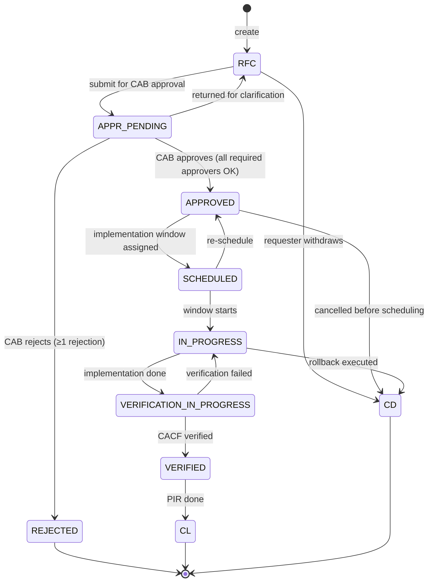
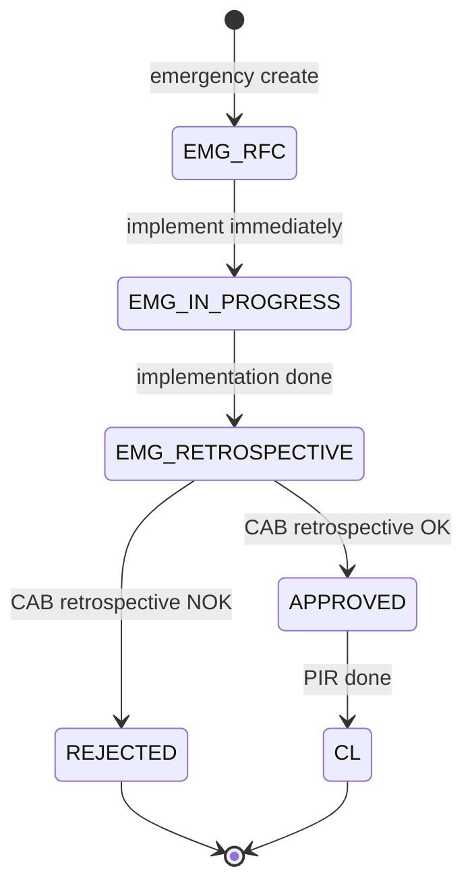

# Change Management & CAB — špecifikácia

> Konsolidovaný spec pre Change Management. MVP scope: **read + základný
> approval flow** (CAB). Plný Change Calendar a verification flow je
> post-MVP. Emergency change s 2FA approve flow je v MVP.

## TOC

1. Cieľ a scope
2. Persony
3. Kľúčové user journeys
4. Doménový model (entita, lifecycle)
5. REST API
6. UI — obrazovky a komponenty
7. Bezpečnosť a RBAC
8. Testy a akceptačné kritériá
9. Otvorené body
10. Zdroje
11. Otvorené závislosti

## 1. Cieľ a scope

**Cieľ MVP**:

- Change list + detail (read).
- CAB approval flow — pre-implementation approval, emergency retrospective
  approval.
- Approval / reject akcia per CAB member.
- Mobile emergency approve flow s **step-up MFA**.
- Calendar view — Day / Week / Month, conflict highlighting.

**V scope MVP** (per GOAL.md §3): "Change Management — read + základný approval
flow". Calendar view je hraničný (zaradený, lebo bez neho Peter nemá CAB
preview).

**Mimo MVP**:

- Drag-to-reschedule v Calendar.
- Change verification flow (CACF — porovnávanie discovery vs. specs).
- Bulk approval.
- Pokročilý cross-tenant Calendar overlay (sp_admin scope).

## 2. Persony

| Persona | App | Rola | Vzťah k modulu |
|---|---|---|---|
| `change_manager_peter` | `workspace` | `change_manager` | Vedie CAB, schvaľuje 30–50 changes/týždeň, emergency approve z mobilu. |
| `agent_l2_marek` | `workspace` | `agent_l2` | Create RFC (limited categories), update plan/rollback (vlastné). |
| `cmdb_owner_robert` | `workspace` | `cmdb_owner` | Read-only Change → CI impact analysis. |

## 3. Kľúčové user journeys

| ID | Persona | Krátky popis |
|---|---|---|
| `workspace-change-cab-prep` | `change_manager_peter` | Pondelok 8:00 CAB prep — 25 changes, calendar view, tag 5 "discuss", export PDF. |
| `workspace-change-emergency-approve` | `change_manager_peter` | 14:30 security advisory → mobile notification → 2FA confirm → approve do 16:00. |
| `workspace-change-cross-tenant-conflict` | `change_manager_peter` | HQ maintenance window vs. Acme East change → cross-tenant calendar overlay. |

Detail: [`docs/agents/ux-persona-analyst/journeys.md`](../agents/ux-persona-analyst/journeys.md#change_manager_peter).

## 4. Doménový model (entita, lifecycle)

### 4.1 Entita `Change` (Change Order)

CA SDM tabuľka `chg`. Atribúty
([detail](../agents/domain-modeller/entities.md#change-change-order)):

| Atribút | Typ | Zdroj | Required |
|---|---|---|---|
| `id` / `ref` | `ChangeId` / `string` (`C12345`) | `chg.persid` / `chg.chg_ref_num` | yes |
| `status` | `ChangeStatus` enum | `chg.status` | yes |
| `category` | `ChangeCategory` | `chg.category` | no |
| `risk` | `RiskLevel` (low / medium / high) | `chg.risk` | yes |
| `affectedCiIds` | `CiId[]` | derived (`lrel_chg_ci`) | no |
| `scheduledStartAt`, `scheduledEndAt` | ISO | `chg.schedule_*_date` | no |
| `actualStartAt`, `actualEndAt` | ISO | `chg.actual_*_date` | no |
| `approvalState` | `ApprovalState` enum (`PENDING/APPROVED/REJECTED`) | computed | yes |
| `cabApprovers` | `CabApproval[]` | derived | no |
| `tenantId` | `TenantId` | `chg.tenant` | yes |

**`CabApproval`** (slabá entita):

| Atribút | Typ | Required |
|---|---|---|
| `approverId` | `UserId` | yes |
| `decision` | `"PENDING" \| "APPROVED" \| "REJECTED"` | yes |
| `decidedAt` | ISO | no |
| `comment` | `string` | no |

**Invarianty**:

- `scheduledStartAt < scheduledEndAt`.
- `actualStartAt` musí existovať pred prechodom do `IN_PROGRESS`.
- Emergency change (`category=emergency`) **smie obísť** plný pre-implementation
  CAB approval, ale **vyžaduje retrospective approval**.

### 4.2 Lifecycle — normal change

### 4.3 Lifecycle — emergency change

**`approvalState`** (UI computed):

- `"PENDING"` ak ≥ 1 `decision === "PENDING"`.
- `"APPROVED"` ak `∀ decision === "APPROVED"`.
- `"REJECTED"` ak `∃ decision === "REJECTED"` (jediný NOK = total rejection).

Paralelný approval (default v MVP). Sériový approval post-MVP.

Detail: [`docs/agents/domain-modeller/lifecycles/change.md`](../agents/domain-modeller/lifecycles/change.md).

## 5. REST API

### 5.1 Change CRUD

| Metóda | Cesta | Účel |
|---|---|---|
| `GET` | `/caisd-rest/chg` | List changes (WC filter, sort). |
| `GET` | `/caisd-rest/chg/{id}` | Detail. |
| `POST` | `/caisd-rest/chg` | Create RFC. Required: `affected_contact`, `requestor`, `log_agent`, `priority`. |
| `PUT` | `/caisd-rest/chg/{id}` | Partial update. |
| `GET` | `/caisd-rest/chg/{id}/workflow` | Workflow tasks (QREL). |
| `GET` | `/caisd-rest/chg/{id}/act_log` | Activity log. |
| `GET` | `/caisd-rest/chg/{id}/attachments` | Attachments. |
| `GET` | `/caisd-rest/chgcat` | Categories. |
| `GET` | `/caisd-rest/chgstat` | Statuses. |
| `GET` | `/caisd-rest/chg_trans` | Allowed transitions. |

### 5.2 CAB approval (workflow tasks)

| Metóda | Cesta | Účel |
|---|---|---|
| `POST` | `/caisd-rest/wf` | Vytvor workflow task (CAB approver task). |
| `PUT` | `/caisd-rest/wf/{id}` | Update task — zmena `status` na `Approved` / `Rejected`. |

**Gap #6 — Approval flow**: PUT na `wf.status` spustí internú workflow
logiku v CA SDM (notifikácie, sequence). Validácia approve/reject rules
nie je v REST doc explicitne dokumentovaná — **treba overiť na inštancii**.

Detail: [`docs/agents/api-analyst/endpoints.md#change-management-chg`](../agents/api-analyst/endpoints.md)
+ [`docs/agents/api-analyst/gaps.md`](../agents/api-analyst/gaps.md) §6.

## 6. UI — obrazovky a komponenty

### 6.1 Obrazovky

| # | Screen | Route | App |
|---|---|---|---|
| 14 | Change list | `/changes` | workspace |
| 15 | Change detail | `/changes/:ref` | workspace |
| 16 | Change calendar | `/changes/calendar` | workspace |
| 17 | CAB approval queue | `/cab` | workspace |
| 31 | CAB Meeting (post-MVP) | `/changes/cab/:date` | workspace |

### 6.2 Komponenty

| Komponent | Použitie |
|---|---|
| `DataTable` | Change list. |
| `Tabs` | Change detail: Detail / Impact / Rollback / Approvals / Activity. |
| `ApprovalChecklist` | Approvers list + status (✅/⏳/❌) + send-reminder per row. |
| `ImpactList` | Affected CIs + business services + conflicts. |
| `Calendar` (FullCalendar 6, lazy-loaded ~95 kB) | Day / Week / Month. Color-coded by risk. |
| `CalendarBlock` | Single event s ARIA label "CHG-503 Apache patch, emergency, Saturday 17 May 02:00 to 06:00". |
| `MobileApproveSheet` | Full-screen sheet z mobil notifikácie. Buttons ≥ 44 × 44 px. Step-up 2FA modal. |
| `ConfirmDialog variant=destructive` | Reject change. |

`Calendar` **povinný alternatívny list view** pre screen readers (calendar grid
visualization je natívne SR-unfriendly). Klávesnica: arrow keys navigate cells,
`Enter` open event.

Detail: [`docs/agents/design-system/components.md`](../agents/design-system/components.md) — `Calendar`, `ApprovalChecklist`, `MobileApproveSheet`.

### 6.3 Conflict detection v UI

Pri `APPROVED → SCHEDULED`:

- UI volá CA SDM pre overlap check (existujúce changes na rovnakých CIs v
  rovnakom časovom okne).
- Ak overlap, UI ukáže warning (`Card variant=warning`), **nie hard block**
  — Change Manager rozhoduje.
- V Calendar view: overlap = červený border + ikona, hover tooltip
  "Conflict with #CHG-441 at 22:00–23:00".

## 7. Bezpečnosť a RBAC

| Akcia | Permission key | agent_l2 | change_mgr | cmdb_owner | sp_admin |
|---|---|---|---|---|---|
| Create RFC | `change.create` | limited categories | yes | yes | yes |
| Read | `change.read` | read-only | yes | read-only | yes |
| Update plan / rollback | `change.update.plan` | own | yes | CI changes | yes |
| Schedule | `change.schedule` | – | yes | – | yes |
| Submit to CAB | `change.submit.cab` | request | yes | – | yes |
| Approve in CAB | `cab.approve` | – | yes | – | yes |
| Emergency approve (2-click) | `cab.approve.emergency` | – | yes | – | yes |
| Reject in CAB | `cab.reject` | – | yes | – | yes |
| Read calendar | `change.read.calendar` | read-only | yes | read-only | yes |
| Cross-tenant calendar | `change.read.calendar.cross-tenant` | – | if SP role | – | yes |
| Close change | `change.close` | read-only | yes | – | yes |

Detail: [`docs/agents/security/rbac.md`](../agents/security/rbac.md) §6.4.

### 7.1 Step-up MFA pre emergency approve

Emergency approve (`cab.approve.emergency`) v MVP **vyžaduje step-up MFA**:

- IdP `prompt=login&acr_values=mfa`.
- TTL po step-upe: **5 min**.
- Audit event `change.emergency.approved` s `actor`, `target`, `acr` claim.
- Default 2FA challenge type: **TOTP** (per `[business-deferred]` flag v 09 r2).

Detail: [`docs/agents/security/multi-tenancy-security.md`](../agents/security/multi-tenancy-security.md) §6.

### 7.2 Rollback plán required

Pri `EMG_RFC` create musí byť `rollbackPlan` (text) non-empty. UI **blokuje
approve** s tooltipom "Rollback plán je vyžadovaný pre emergency changes" —
ponúkne `Request changes` akciu (pošle späť implementorovi).

## 8. Testy a akceptačné kritériá

### 8.1 Pyramída

- **Unit** — `lifecycles/change.ts` (normal + emergency overlay), property tests
  pre `approvalState` computation z `cabApprovers[]`.
- **Contract** — `change.ctest.ts` (CRUD), `wf.ctest.ts` (approval).
- **BFF integration** — step-up flow, audit event emission, conflict detection
  query.
- **App integration** — `apps/workspace/src/features/changes/__tests__/cab.itest.tsx`.
- **E2E** — `workspace-change-cab-prep` (#10), `workspace-change-emergency-approve` (#11, **smoke**), `workspace-change-cross-tenant-conflict` (#12).

### 8.2 Acceptance criteria — `workspace-change-emergency-approve` (#11)

Happy path:

- Peter dostane notifikáciu na mobile.
- Klik na deeplink otvorí `MobileApproveSheet` s change detail.
- Klik "Approve" → 2FA challenge (TOTP).
- Po overení: `change.emergency.approved` audit event, status `APPROVED`,
  confirm screen.

Alternate:

- 2FA challenge zlyhá (network issue) → retry bez straty kontextu (nie
  redirect na home).
- Rollback plán prázdny → UI **blokuje** approve s `Card variant=warning`.

Tags: `@security:step-up-totp @security:audit-log-step-up @security:csrf-mutation`.

Detail: [`docs/agents/qa-test-strategy/acceptance-criteria.md`](../agents/qa-test-strategy/acceptance-criteria.md).

## 9. Otvorené body

- `[01-api-analyst]` Approval workflow endpointy — REST `approve` / `reject`
  je realizovaný cez PUT na `/caisd-rest/wf/{id}.status`. Validáciu rules
  (`required all approvers`, `single reject = total reject`) treba overiť na
  inštancii (gap #6).
- `[01-api-analyst]` Conflict detection endpoint — existuje natívne CA SDM
  overlap check, alebo si musí FE robiť client-side filter? Vplyv na UX
  loading čas v Calendar.
- Sériový vs. paralelný approval — MVP default paralelný. Sériový (per-policy)
  je post-MVP.

## 10. Zdroje

- [`docs/agents/api-analyst/endpoints.md#change-management-chg`](../agents/api-analyst/endpoints.md).
- [`docs/agents/api-analyst/gaps.md`](../agents/api-analyst/gaps.md) §6 — approval flow.
- [`docs/agents/ux-persona-analyst/personas.md#change_manager_peter`](../agents/ux-persona-analyst/personas.md).
- [`docs/agents/ux-persona-analyst/journeys.md`](../agents/ux-persona-analyst/journeys.md) — 3 change journeys.
- [`docs/agents/domain-modeller/entities.md#change-change-order`](../agents/domain-modeller/entities.md).
- [`docs/agents/domain-modeller/lifecycles/change.md`](../agents/domain-modeller/lifecycles/change.md).
- [`docs/agents/security/rbac.md`](../agents/security/rbac.md) §6.4.
- [`docs/agents/security/multi-tenancy-security.md`](../agents/security/multi-tenancy-security.md) §6.
- [`docs/agents/design-system/components.md`](../agents/design-system/components.md) — Calendar, ApprovalChecklist, MobileApproveSheet.
- [`docs/agents/qa-test-strategy/acceptance-criteria.md`](../agents/qa-test-strategy/acceptance-criteria.md) #10, #11, #12.

## Otvorené závislosti

Žiadne. Artefakt je samonosný.
