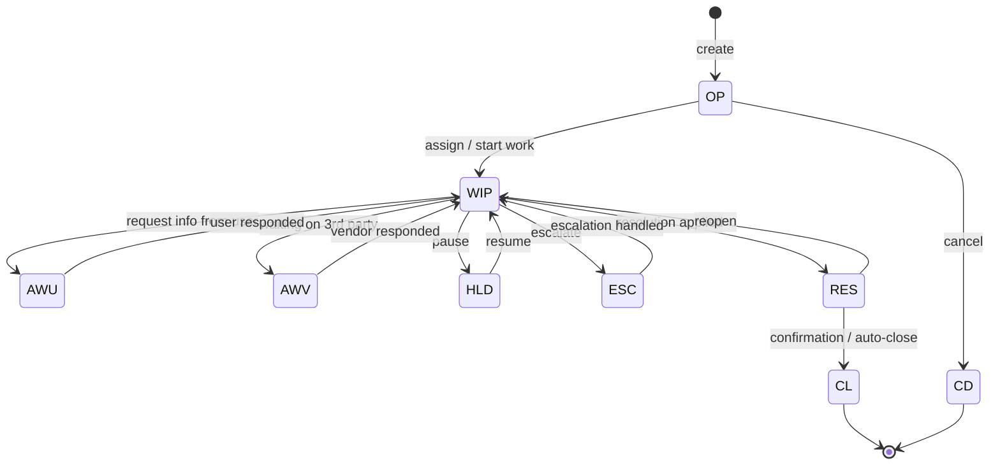

# Incident Management — špecifikácia

> Konsolidovaný spec pre vývoj modulu Incident. Zdrojom pravdy sú výstupy
> agentov 01–09 v `docs/agents/`. Tento dokument ich krížovo prepája a slúži
> ako vstup pre implementáciu.
> Status: round 2 (post-konvergencia). Stack a ADRs sú finalizované.

## TOC

1. Cieľ a scope
2. Persony
3. Kľúčové user journeys
4. Doménový model (entity, lifecycle)
5. REST API
6. UI — obrazovky a komponenty
7. Bezpečnosť a RBAC
8. Testy a akceptačné kritériá
9. Otvorené body
10. Zdroje
11. Otvorené závislosti

## 1. Cieľ a scope

**Cieľ MVP**: Self-service nahlasovanie incidentov (`portal`) a profesionálny
triage / resolve flow pre L1/L2 analytikov (`workspace`).

**V scope MVP**:

- Otvorenie incidentu z portálu (žiadateľ).
- Queue/triage vo workspace (filter, sort, split-view detail).
- Status transitions per state machine (`OP → WIP → RES → CL` + vetvy).
- Linkovanie na Problem, Change a KB článok.
- Eskalácia L1 → L2 (skupina).
- Major Incident flag s prísnejšou validáciou.
- Reopen do **7 dní** od `resolve_date` (vlastný incident, žiadateľ).
- Bulk operations vo workspace queue (≤ 50 rows pre `agent_l1`, ≤ 200 pre
  `agent_l2`; bulk > 50 vyžaduje step-up MFA).

**Mimo MVP**: priame DELETE (read-only soft-delete cez `delete_flag`),
historický archív, granular field-level audit replay v UI.

## 2. Persony

| Persona | App | Rola | Vzťah k modulu |
|---|---|---|---|
| `requester_lucia` | `portal` | `requester` | Otvára vlastné incidenty cez `Nahlásiť problém`, sleduje status, dopisuje komentáre, reopen do 7 dní. |
| `agent_l1_anna` | `workspace` | `agent_l1` | Triage 25–60 ticketov / zmenu, klávesovo, prevažne uzatvára cez KB. KPI: First Contact Resolution > 60 %. |
| `agent_l2_marek` | `workspace` | `agent_l2` | Deep-dive eskalovaných incidentov, linkovanie na Problem, vytváranie KB článkov "create from this ticket". |

Detail: [`docs/agents/ux-persona-analyst/personas.md`](../agents/ux-persona-analyst/personas.md).

## 3. Kľúčové user journeys

| ID | Persona | Krátky popis |
|---|---|---|
| `portal-incident-broken-laptop` | `requester_lucia` | Hardvér incident s screenshot attachment, draft persistence pri SSO expirácii, tenant breadcrumb. |
| `workspace-incident-triage` | `agent_l1_anna` | Triage 12 nových ticketov, klávesnica `j/k/r/c`, KB reply + close, tenant switch mid-flow. |
| `workspace-incident-resolve-with-cmdb` | `agent_l1_anna` | Outlook nefunguje → CI laptop → posledný patch → linkovanie na Problem + workaround KB → close. |
| `workspace-incident-escalate-to-l2` | `agent_l1_anna` | Sieťový problém → eskalácia na `L2 Network` skupinu s povinnou (soft) poznámkou. |
| `workspace-incident-deep-dive` | `agent_l2_marek` | Eskalovaný ticket, remote rieš, "create KB article from ticket" akcia. |

Detail: [`docs/agents/ux-persona-analyst/journeys.md`](../agents/ux-persona-analyst/journeys.md).

## 4. Doménový model (entity, lifecycle)

### 4.1 Entita `Incident`

CA SDM tabuľka `cr` (factory `in`), discriminator `cr.type` označuje incident
vs. request vs. problem. UI modeluje samostatný agregát s tenant-required
poľom.

Kľúčové atribúty (úplná tabuľka v
[`docs/agents/domain-modeller/entities.md`](../agents/domain-modeller/entities.md#incident)):

| Atribút | Typ | Zdroj | Required |
|---|---|---|---|
| `id` / `ref` | `IncidentId` / `string` (`IN12345`) | `cr.persid` / `cr.ref_num` | yes |
| `summary`, `description` | `string` | `cr.summary` / `cr.description` | yes / no |
| `status` | `IncidentStatus` enum | `cr.status` | yes |
| `priority`, `urgency`, `impact` | enum 1–5 | `cr.priority` / `urg` / `imp` | yes |
| `isMajor` | `boolean` | `cr.major_incident` | yes |
| `affectedEndUserId`, `requesterId`, `assigneeId`, `assignedGroupId` | refs | `cr.customer` / `requestor` / `assignee` / `group` | mixed |
| `affectedCiId` | `CiId \| null` | `cr.affected_resource` | no |
| `linkedProblemIds`, `linkedChangeIds`, `solutionUrls` | refs | derivované (`lrel`, `soln_log`) | no |
| `tenantId` | `TenantId` | `cr.tenant` | yes (**hard required**) |
| `openedAt`, `resolvedAt`, `closedAt` | ISO | `cr.open_date` / `resolve_date` / `close_date` | yes / no / no |

**Invariant** (per all-tenant rule): `entity.tenantId == ui.activeTenant`.
FE **nikdy** nezobrazí incident s iným `tenantId` ako aktívnym.

### 4.2 Lifecycle (zjednodušený state diagram)

Stavy: `OP` Open, `WIP` Work In Progress, `HLD` Hold, `AWU` Awaiting User,
`AWV` Awaiting Vendor, `ESC` Escalated, `RES` Resolved, `CL` Closed, `CD`
Cancelled.

**Side-effect contracts** (FE / BE):

- `OP → WIP` vyžaduje `assigneeId`. Major Incident vyžaduje aj `assignedGroupId`.
- `WIP → RES` vyžaduje `resolutionDescription` (free text), `resolvedAt = now()`.
- `RES → CL` `closedAt = now()`; auto-close cron alebo manual confirmation.
- `RES → WIP` (reopen) vyžaduje `reopenReason`, `reopenCount++`.
- Každý prechod produkuje `ActivityLog` entry `type=status_change`.

Detail: [`docs/agents/domain-modeller/lifecycles/incident.md`](../agents/domain-modeller/lifecycles/incident.md).

## 5. REST API

Cesta primárneho REST: `/caisd-rest/in`. Pre Portal používame doplnkové BUI
endpointy pre rich detail (`/bui/getMyTicketDetails`) — finálna voľba per
endpoint je v BFF aggregator vrstve.

| Metóda | Cesta | Účel |
|---|---|---|
| `GET` | `/caisd-rest/in` | Queue (WC filter, sort, pagination). |
| `GET` | `/caisd-rest/in/{id}` | Detail. |
| `POST` | `/caisd-rest/in` | Create — required `customer`, `log_agent`, `priority`. |
| `PUT` | `/caisd-rest/in/{id}` | Partial update (status, assignee, fields). |
| `GET` | `/caisd-rest/in/{id}/act_log` | Activity log (komenty + system events). |
| `POST` | `/caisd-rest/in/{id}/act_log` | Pridať komentár. |
| `GET` | `/caisd-rest/in/{id}/attachments` | Attachments collection. |
| `POST` | `/caisd-rest/attmnt` | Upload attachment (multipart). |
| `GET` | `/caisd-rest/in_trans` | Povolené status transitions (WC filter per status). |

**Auth header**: `X-AccessKey` (drží BFF). Tenant context: BFF posiela
defenzívny WC filter `WC=tenant%3DU'<activeTenantId>'` v každom volaní +
voliteľne `X-Role`. FE → BFF posiela `X-CA-SDM-Tenant: <activeTenantId>`.

**Bulk update** (workspace queue): REST nemá batch endpoint. BFF orchestruje
controlled-concurrency parallel `PUT` (max 5–10 paralelných, exp. backoff).
Detail v [`docs/agents/api-analyst/gaps.md`](../agents/api-analyst/gaps.md) §1.

Plný katalóg endpointov:
[`docs/agents/api-analyst/endpoints.md#incident-management-in`](../agents/api-analyst/endpoints.md).

## 6. UI — obrazovky a komponenty

### 6.1 Obrazovky (per `security/rbac.md` §4)

| # | Screen | Route | App |
|---|---|---|---|
| 2 | Portal — Submit ticket form | `/submit` | portal |
| 3 | Portal — My tickets list | `/my-tickets` | portal |
| 4 | Portal — Ticket detail (own) | `/my-tickets/:ref` | portal |
| 10 | Workspace — Incident queue | `/incidents` | workspace |
| 11 | Workspace — Incident detail | `/incidents/:ref` | workspace |

### 6.2 Komponenty z `@sdm/design-system`

| Komponent | Použitie |
|---|---|
| `QueueTable` (alias `DataTable density=compact`) | Workspace queue: 28–32 px rows, multi-select, split-view, polling 30 s. |
| `StatusBadge` | Mapuje `IncidentStatus` na label + farbu (`success/warning/danger/info`). |
| `PriorityBadge` | 1–5 s ikonou + textom (nikdy len farba). |
| `Timeline` + `CommentItem` | Activity log (public / internal / system). |
| `Composer` | Reply (tabs Public reply / Internal note / Resolution), `Cmd+Enter` submit. |
| `ContextPanel` | Right panel: requester card, CI, history, KB suggestions, related records. |
| `ActionBar` | Reply, Close, Escalate, Take, Watch, More. |
| `BulkActionBar` | Sticky bottom pri ≥ 1 selected row. |
| `Modal` + `ConfirmDialog` | Escalate, reopen, cancel modaly. |
| `Can` | Permission-guarded UI gating (`<Can permission="incident.transition.status">…`). |

Klávesnica vo `QueueTable`: `j`/`k` next/prev, `Enter` open, `Space` toggle
select, `Shift+Space` range, `Cmd+A` select all (+ confirm pri > 50), `Esc`
clear.

Detail komponentov: [`docs/agents/design-system/components.md`](../agents/design-system/components.md).

## 7. Bezpečnosť a RBAC

### 7.1 Akcie a oprávnenia

| Akcia | Permission key | requester | agent_l1 | agent_l2 | change_mgr | sp_admin |
|---|---|---|---|---|---|---|
| Create incident | `incident.create` | own | yes | yes | – | yes |
| Read own | `incident.read.own` | yes | yes | yes | – | yes |
| Read queue | `incident.read.queue` | – | yes | yes | read-only | yes |
| Read all in tenant | `incident.read.all` | – | read-only | yes | read-only | yes |
| Update fields | `incident.update.fields` | resolve note only | yes | yes | – | yes |
| Change status | `incident.transition.status` | – | yes | yes | – | yes |
| Re-assign | `incident.assign` | – | own group | yes | – | yes |
| Escalate to L2 | `incident.escalate` | – | yes | yes | – | yes |
| Link to Problem | `incident.link.problem` | – | read-only | yes | – | yes |
| Add attachment | `incident.attach.add` | own | yes | yes | – | yes |
| Comment private | `incident.comment.private` | – | yes | yes | read-only | yes |
| Comment public | `incident.comment.public` | own | yes | yes | read-only | yes |
| Close | `incident.close` | request only | yes | yes | – | yes |
| Reopen | `incident.reopen` | own, ≤ 7 dní | yes | yes | – | yes |
| Bulk | `incident.bulk` | – | ≤ 50 | ≤ 200 | – | yes |

Detail: [`docs/agents/security/rbac.md`](../agents/security/rbac.md) §6.1.

### 7.2 Multi-tenancy

- BFF reválidácia `X-CA-SDM-Tenant` v každom mutating + read call.
  Mismatch → `409 TENANT_MISMATCH` + `correctTenantId` v body + audit event
  `tenant.mismatch.detected`.
- Tenant switch invaliduje TanStack Query cache cez `queryClient.clear()`.
- Defensive WC filter `tenant=U'<activeTenantId>'` v BFF → CA SDM.

### 7.3 Step-up MFA

Bulk operácia > **50** záznamov vyžaduje step-up (IdP `prompt=login&acr_values=mfa`).
TTL step-upu: **5 min**. Detail: [`docs/agents/security/multi-tenancy-security.md`](../agents/security/multi-tenancy-security.md) §6.

### 7.4 Audit

Každá mutácia (`incident.transition.status`, `incident.escalate`,
`incident.bulk`, attachment add) produkuje audit event do BFF JSON
log (pino → stdout → ELK/Loki). Detail: [`docs/agents/security/audit-and-compliance.md`](../agents/security/audit-and-compliance.md).

## 8. Testy a akceptačné kritériá

### 8.1 Pyramída (per modul)

- **Unit** (Vitest, fast-check property-based) — `packages/domain/src/lifecycles/incident.ts`:
  všetkých 9 stavov, valid + invalid transitions, ≥ 200 fuzz iterations.
- **Contract** (`packages/api-client/src/__contracts__/incident.ctest.ts`) —
  happy + error path per endpoint vs. Zod schema.
- **BFF integration** — `apps/bff/src/routes/incidents/*.itest.ts`: tenant
  filter injection, X-Role rebind po switch, audit emission.
- **App integration** — `apps/workspace/src/features/queue/__tests__/triage.itest.tsx`
  + `apps/portal/src/features/new-incident/__tests__/submit.itest.tsx` (MSW).
- **E2E** (Playwright) — 5 journeys (#1, #4, #5, #6, #9 z master mapping).
- **a11y** — `axe-core` per obrazovka, `serious + critical` blokujú merge.

### 8.2 Acceptance criteria (extrakt)

`portal-incident-broken-laptop` (#1):

- Lucia otvorí portál, SSO redirect prebehne (mocked).
- Submit za < 60 s simulovaného UI času, screenshot 5 MB OK.
- Po submit: ticket ID, status "New", potvrdenie e-mailu (mocked).
- Tenant breadcrumb `Tenant: Acme HQ` viditeľný počas celého formulára.
- Edge: 80 MB upload → `413` → inline error "Maximum 25 MB"; SSO expirácia
  mid-submit → draft v localStorage → po re-login obnovený.

`workspace-incident-triage` (#4):

- 12 nových ticketov sortnutých priority desc, klik prvý → split view.
- Klávesy `r` reply (KB link), `c` close → status `RES`/`CL`, scroll
  v queue zachovaný.
- Tenant switch mid-flow → `queryClient.clear()`, otvorený detail zatvorený,
  toast "Prepol si tenant — queue prenahraná".

Detail per journey: [`docs/agents/qa-test-strategy/acceptance-criteria.md`](../agents/qa-test-strategy/acceptance-criteria.md).

## 9. Otvorené body

- `chg_trans` / `in_trans` filtering — či REST vracia transitions filtrované
  rolou aktuálneho používateľa, alebo musíme filtrovať v BFF. Treba overiť
  na inštancii (`[api-analyst gap #4]`).
- Bulk rate-limit na CA SDM — či má backend hard cap na PUT volania nie je
  v PDF dokumentované. Konzervatívny limit 5–10 paralelných v BFF (`[api-analyst gap #2]`).
- "Reopen create-related" (po `CL`) — aktuálne UI ponúkne **nový incident
  s linkom**, nie reopen po 7 dňoch. Validovať s biznisom.

## 10. Zdroje

- [`docs/agents/api-analyst/endpoints.md`](../agents/api-analyst/endpoints.md) — REST katalóg.
- [`docs/agents/api-analyst/auth.md`](../agents/api-analyst/auth.md) — auth flow.
- [`docs/agents/api-analyst/gaps.md`](../agents/api-analyst/gaps.md) — bulk update gap, generic search.
- [`docs/agents/ux-persona-analyst/personas.md`](../agents/ux-persona-analyst/personas.md) — Lucia, Anna, Marek profily.
- [`docs/agents/ux-persona-analyst/journeys.md`](../agents/ux-persona-analyst/journeys.md) — 5 incident journeys.
- [`docs/agents/domain-modeller/entities.md`](../agents/domain-modeller/entities.md) — entita Incident.
- [`docs/agents/domain-modeller/lifecycles/incident.md`](../agents/domain-modeller/lifecycles/incident.md) — state machine.
- [`docs/agents/security/rbac.md`](../agents/security/rbac.md) — RBAC matica.
- [`docs/agents/security/multi-tenancy-security.md`](../agents/security/multi-tenancy-security.md) — tenant izolácia.
- [`docs/agents/design-system/components.md`](../agents/design-system/components.md) — QueueTable, Composer, Timeline.
- [`docs/agents/qa-test-strategy/acceptance-criteria.md`](../agents/qa-test-strategy/acceptance-criteria.md) — journeys → testy.

## Otvorené závislosti

Žiadne. Artefakt je samonosný.
