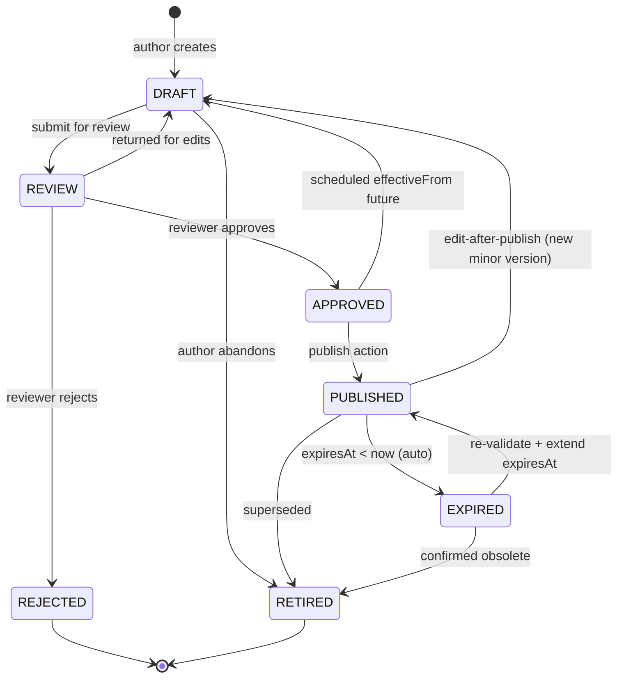

# Knowledge Management — špecifikácia

> Konsolidovaný spec pre KB modul. V MVP: read + search v `portal`, write +
> publish flow v `workspace`. KB analytics dashboard je v1+ (mimo MVP).

## TOC

1. Cieľ a scope
2. Persony
3. Kľúčové user journeys
4. Doménový model (entita, lifecycle)
5. REST API
6. UI — obrazovky a komponenty
7. Bezpečnosť a RBAC
8. Testy a akceptačné kritériá
9. Otvorené body
10. Zdroje
11. Otvorené závislosti

## 1. Cieľ a scope

**Cieľ MVP**:

- Vyhľadávanie KB článkov v `portal` (Lucia) cez full-text search + browse.
- Read KB článok s rendered markdown / sanitized HTML.
- "Bolo to užitočné?" feedback widget (rating).
- KB editor vo `workspace` (Jana) — WYSIWYG, drag-drop images, draft → review → publish.
- "Create KB article from ticket / problem" akcia (predvyplní problem
  statement + resolution).
- Per-tenant visibility scope (KB článok môže byť tenant-scoped alebo
  cross-tenant "all").

**Mimo MVP**:

- KB analytics dashboard (views, helpfulness, search-miss queries) —
  v1+.
- Multi-language single article (`bodySK + bodyEN`); v MVP: jedno-jazyčný
  článok per kus, `linkedTranslationId` ako väzba.
- Versioning history s diff viewer.

## 2. Persony

| Persona | App | Rola | Vzťah k modulu |
|---|---|---|---|
| `requester_lucia` | `portal` | `requester` | Search KB pred otvorením ticketu, rate "Bolo to užitočné". |
| `agent_l1_anna` | `workspace` | `agent_l1` | Read KB, link na KB v reply (`incident.comment.public`). |
| `agent_l2_marek` | `workspace` | `agent_l2` | Read + draft create (z incident / problem). |
| `kb_editor_jana` | `workspace` | `kb_editor` | Vlastní review + publish + retire flow. Týždenná analytics retrospektíva (v1+). |

## 3. Kľúčové user journeys

| ID | Persona | Krátky popis |
|---|---|---|
| `portal-kb-self-help` | `requester_lucia` | VPN nefunguje — search "VPN nefunguje doma" → article → 👍 → bez otvorenia ticketu. |
| `workspace-kb-author-new` | `kb_editor_jana` | Nový článok "Reset hesla VPN", WYSIWYG, screenshot drag-drop, submit for review. |
| `workspace-kb-from-incident` | `kb_editor_jana` | Marek poslal draft z incident → Jana edituje → publish s tenant visibility scope. |
| `workspace-kb-analytics-review` | `kb_editor_jana` | (v1+) Piatok 15:00 týždenná retrospektíva. |

Detail: [`docs/agents/ux-persona-analyst/journeys.md`](../agents/ux-persona-analyst/journeys.md#kb_editor_jana).

## 4. Doménový model (entita, lifecycle)

### 4.1 Entita `KbArticle`

CA SDM tabuľka `skeleton` (interný názov factory pre KB články; externe
*Knowledge Document*).

Kľúčové atribúty
([detail](../agents/domain-modeller/entities.md#kbarticle-knowledge-document)):

| Atribút | Typ | Zdroj | Required |
|---|---|---|---|
| `id` | `KbArticleId` | `skeleton.id` | yes |
| `docTypeId` | `KbDocType` (FAQ \| HowTo \| KnownError \| Workaround \| Reference) | `skeleton.DOC_TYPE_ID` | yes |
| `title`, `summary` | `string` | `skeleton.title` / `summary` | yes / no |
| `body` | `KbArticleBody` (structured markdown) | derived | yes |
| `status` | `KbStatus` enum | `skeleton.STATUS_ID` | yes |
| `authorId`, `ownerId`, `assigneeId` (reviewer) | refs | `skeleton.*_ID` | yes / yes / no |
| `categoryId` | `KbCategoryId` | `o_indexes.id` | yes |
| `hits`, `acceptedHits`, `buResult` | counters | `skeleton.HITS` etc. | no |
| `effectiveFrom`, `expiresAt` | ISO | `skeleton.START_DATE` / `EXPIRATION_DATE` | no / no |
| `tenantId` | `TenantId \| null` | `skeleton.tenant` | optional (null = "all tenants") |

**Invarianty**:

- `PUBLISHED` musí mať `effectiveFrom <= now`.
- `expiresAt` (ak existuje) musí byť `> effectiveFrom`.
- `expiresAt < now` ⇒ status sa nezmení automaticky, ale UI ukáže `expired`
  badge a vylúči článok zo search results pre koncových users.

### 4.2 Lifecycle

**Side-effect contracts**:

- `[*] → DRAFT`: `authorId`, `ownerId`, `title`, `categoryId` required.
- `DRAFT → REVIEW`: `body` non-empty, reviewer assigned (`assigneeId`).
- `REVIEW → APPROVED`: `reviewedAt`, optional `reviewerComment`.
- `APPROVED → PUBLISHED`: `effectiveFrom <= now`.
- `PUBLISHED → DRAFT` (edit-after-publish) **vytvorí novú verziu** so vzťahom
  `previousVersionId`. Pôvodný článok ostáva `PUBLISHED`, nový začína `DRAFT`.
- `PUBLISHED → EXPIRED`: auto-trigger po `expiresAt < now`.

### 4.3 FAQ rating loop

- `HITS++` pri každom prečítaní (BE auto).
- `ACCEPTED_HITS++` keď user klikne "Bolo to užitočné" (UI feedback).
- `BU_RESULT = ACCEPTED_HITS / HITS` (BE computed).
- UI ukáže rating ako 5-star alebo percent.

### 4.4 Search visibility per rola

| Role | Vidí v search |
|---|---|
| Portal user (`requester`) | iba `PUBLISHED` s `effectiveFrom <= now < expiresAt` |
| Analyst (`agent_l1` / `agent_l2`) | `PUBLISHED`, `EXPIRED`, `APPROVED`, `DRAFT` (vlastné), `REVIEW` (priradené ako reviewer) |
| `kb_editor` / SME | všetko okrem `RETIRED` (s explicit filter aj `RETIRED`) |

Detail: [`docs/agents/domain-modeller/lifecycles/kb-article.md`](../agents/domain-modeller/lifecycles/kb-article.md).

## 5. REST API

### 5.1 Primárny REST (`/caisd-rest`)

| Metóda | Cesta | Účel |
|---|---|---|
| `GET` | `/caisd-rest/KCAT` | List categories. |
| `GET` | `/caisd-rest/SKELETONS` | List KB documents (WC filter). |
| `GET` | `/caisd-rest/SKELETONS/{id}` | Single document. |
| `GET` | `/caisd-rest/O_COMMENTS?WC=DOC_ID%3D{id}` | Komentáre dokumentu. |
| `GET` | `/caisd-rest/kdlinks?WC=kd%3D{id}` | Linky dokumentu na tickety. |

### 5.2 BUI vrstva (rich render, suggestions)

| Metóda | Cesta | Účel |
|---|---|---|
| `GET` | `/bui/getDocument({id})` | KD content rendered pre Service Point UI. |
| `POST` | `/bui/addKDComment({id})` | Pridaj komentár. |
| `POST` | `/bui/rateDocument({id})` | "Bolo to užitočné" rating. |
| `GET` | `/suggestedSolutions?text=&tenant=` | KB suggested solutions na základe textu. |

**Full-text search**: REST `WC=KEYWORDS LIKE` je SQL LIKE — žiadne ranking,
žiadny index. Pre real-time UX použijeme:

- Portal: `GET /suggestedSolutions?text=<query>&tenant=<id>` (BUI vrstva,
  indexovaná Service Pointom).
- Workspace pokročilý search: SOAP `searchKnowledgeBase` fallback (PDF s. 6515)
  pre boolean + similarity. **Mimo MVP** — v MVP postačí `/suggestedSolutions`.

Detail: [`docs/agents/api-analyst/endpoints.md#knowledge-management`](../agents/api-analyst/endpoints.md)
+ [`docs/agents/api-analyst/gaps.md`](../agents/api-analyst/gaps.md) §2.

## 6. UI — obrazovky a komponenty

### 6.1 Obrazovky

| # | Screen | Route | App |
|---|---|---|---|
| 5 | Portal KB browse | `/kb` | portal |
| 6 | Portal KB article view | `/kb/:slug` | portal |
| 18 | Workspace KB editor list | `/kb/manage` | workspace |
| 19 | Workspace KB article editor | `/kb/manage/:id` | workspace |
| 20 | Workspace KB analytics (v1+) | `/kb/analytics` | workspace |

### 6.2 Komponenty

| Komponent | Použitie |
|---|---|
| `SearchInput` (debounce 300 ms) | KB search v portali. |
| `ListRow` (`detailed`) | KB search result item (title + snippet + meta). |
| `KbArticleHeader` | Article detail header — title, category, last updated, read time, language. |
| `Markdown` (alias `MarkdownRenderer`) | Read-side render: react-markdown 9 + remark-gfm + rehype-sanitize (allowlist). |
| `HelpfulnessVote` | "Pomohol ti tento článok? 👍 / 👎" + optional textarea. |
| `KbEditor` (TipTap 2, lazy ~70 kB) | Write-side WYSIWYG. Extensions: StarterKit, Link, Image, CodeBlockLowlight, Mention, TaskList. |
| `FileUpload dropzone` | Drag-drop images do KB editor. |
| `Tabs` | KB editor: Edit / Preview / Settings / Versions. |
| `Modal` | "Create from ticket / problem" — pre-fill confirm. |

`Markdown` sanitization allowlist (per
[`docs/agents/design-system/components.md#markdownrenderer`](../agents/design-system/components.md)):

- **Allowed**: `p strong em ul ol li code pre a h1-h6 blockquote img table thead tbody tr td th hr br`. Attrs: `href src alt title colspan rowspan`. URL schemes: `http https mailto`.
- **Blocked**: `script style iframe form object embed link meta`. `on*` event handlers. `style` attr. `javascript:` / `data:` URIs (okrem whitelisted `data:image/png|jpg|svg+xml`).

ESLint rule blokuje `dangerouslySetInnerHTML` v KB komponentoch.

## 7. Bezpečnosť a RBAC

| Akcia | Permission key | requester | agent_l1 | agent_l2 | kb_editor | sp_admin |
|---|---|---|---|---|---|---|
| Read public articles | `kb.read.public` | yes | yes | yes | yes | yes |
| Read internal articles | `kb.read.internal` | – | yes | yes | yes | yes |
| Search | `kb.search` | yes | yes | yes | yes | yes |
| Rate article | `kb.rate` | yes | yes | yes | yes | yes |
| Create draft | `kb.create.draft` | – | – | yes | yes | yes |
| Edit own draft | `kb.write` | – | – | own | yes | yes |
| Submit for review | `kb.submit.review` | – | – | yes | yes | yes |
| Approve / Publish | `kb.approve` | – | – | – | yes | yes |
| Archive | `kb.archive` | – | – | – | yes | yes |
| View analytics | `kb.analytics` | – | – | read-only | yes | yes |
| Manage taxonomy | `kb.taxonomy` | – | – | – | yes | yes |

Detail: [`docs/agents/security/rbac.md`](../agents/security/rbac.md) §6.5.

### 7.1 Per-tenant visibility scope

- KB článok môže byť tenant-scoped (`skeleton.tenant=<UUID>`) alebo "all tenants"
  (`skeleton.tenant=NULL`).
- `kb_editor` v non-service-provider tenante **nemôže** publikovať cross-tenant
  — iba do svojho tenant scope. Cross-tenant publish vyžaduje `sp_admin`.
- Pri "Create KB from ticket" v inom tenante → `Visibility` selector v KB
  editor explicitne nastaviť (default = ticket's tenant).

### 7.2 XSS / sanitization

`Markdown` allowlist je **povinná**. ESLint rule blokuje `unsafe=true` flag,
`dangerouslySetInnerHTML`. KB body je sanitized pri render-i, NIE pri ukladaní
(žiadne escape pri write — preserve markdown source).

Detail: [`docs/agents/security/owasp-mitigations.md`](../agents/security/owasp-mitigations.md) A03 (Injection).

## 8. Testy a akceptačné kritériá

### 8.1 Pyramída

- **Unit** — `lifecycles/kb-article.ts` (7 stavov, FAQ rating computation,
  search visibility per rola).
- **Contract** — `knowledge.ctest.ts` (REST + BUI `/suggestedSolutions`).
- **App integration** — `apps/portal/src/features/kb-search/__tests__/search.itest.tsx`,
  `apps/workspace/src/features/kb-editor/__tests__/draft.itest.tsx`.
- **E2E** — `portal-kb-self-help` (#3), `workspace-kb-author-new` (#13),
  `workspace-kb-from-incident` (#14).
- **Security** — sanitization test vector: `` v body
  → strippnuté. `<a href="javascript:...">` → strippnuté.

### 8.2 Acceptance criteria — `portal-kb-self-help` (#3)

Happy path:

- Otvor portál, klik "Pomocník".
- Search "VPN nefunguje doma" → top výsledok "Reset VPN klienta".
- Číta kroky 1–5, po kroku 4 funguje.
- Klik "Bolo to užitočné" 👍 → live region "Vďaka, pomôže to ostatným."
- Nezakladá ticket.

Alternate:

- Search "VPN home office" → 0 výsledkov → portál ponúkne "Nenašiel som odpoveď
  — chceš otvoriť ticket?" akciu (pre-fill kategória + popis).
- Článok existuje len v EN, Lucia má SK profil → zobrazíme EN obsah s badge
  "Iba v angličtine" (nie stub "translation pending").

Tags: `@security:kb-xss-sanitization`.

Detail: [`docs/agents/qa-test-strategy/acceptance-criteria.md`](../agents/qa-test-strategy/acceptance-criteria.md).

## 9. Otvorené body

- `[01-api-analyst]` Endpoint pre KB analytics (helpfulness, search-miss
  queries) v MVP **nedostupný** v REST docu. Aktuálne: BFF agreguje
  `BU_RESULT` z REST + vlastný search log (post-MVP). Persona Jana scenár 3
  je **v1+** scope, nie MVP.
- `[01-api-analyst]` `STATUS_ID` enum v `skeleton` — lookup table v CA SDM,
  customizable per inštancia. Treba potvrdiť konkrétne kódy a localized name.
- Multi-language KB articles — MVP: jedno-jazyčný + `linkedTranslationId` link.
  V1+: dvojica `bodySK + bodyEN`. Treba potvrdiť s biznisom.
- Versioning — MVP: `previousVersionId` link, žiadny diff viewer. V1+:
  `DiffViewer` komponent v editor.

## 10. Zdroje

- [`docs/agents/api-analyst/endpoints.md#knowledge-management`](../agents/api-analyst/endpoints.md).
- [`docs/agents/api-analyst/gaps.md`](../agents/api-analyst/gaps.md) §2, §4.
- [`docs/agents/ux-persona-analyst/personas.md#kb_editor_jana`](../agents/ux-persona-analyst/personas.md).
- [`docs/agents/ux-persona-analyst/journeys.md`](../agents/ux-persona-analyst/journeys.md) — KB journeys.
- [`docs/agents/domain-modeller/entities.md#kbarticle-knowledge-document`](../agents/domain-modeller/entities.md).
- [`docs/agents/domain-modeller/lifecycles/kb-article.md`](../agents/domain-modeller/lifecycles/kb-article.md).
- [`docs/agents/security/rbac.md`](../agents/security/rbac.md) §6.5.
- [`docs/agents/security/owasp-mitigations.md`](../agents/security/owasp-mitigations.md).
- [`docs/agents/design-system/components.md`](../agents/design-system/components.md) — `KbEditor`, `Markdown`, `HelpfulnessVote`.
- [`docs/agents/qa-test-strategy/acceptance-criteria.md`](../agents/qa-test-strategy/acceptance-criteria.md) #3, #13, #14, #15.

## Otvorené závislosti

Žiadne. Artefakt je samonosný. KB analytics scope (v1+) je vedome odložený
do post-MVP, evidovaný v 04 architekt flags ako `kb-analytics-scope`.
