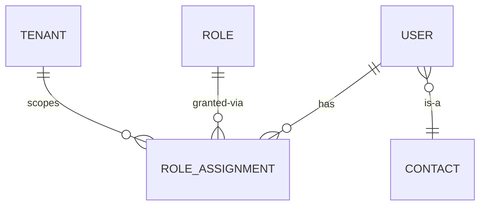

# Multi-tenancy — cross-cutting špecifikácia

> Multi-tenancy je prierezová téma cez všetky moduly. Tento dokument
> konsoliduje rozhodnutia 01 (API), 03 (doména), 04 (architektúra), 05
> (security), 07 (UX) a 08 (DevOps) pre tenant izoláciu, switching, audit
> a leakage scenáre.
> Status: round 2 (post-konvergencia). Header name a session model finalizované.

## TOC

1. Cieľ a scope
2. Persony a roly
3. Kľúčové user journeys
4. Doménový model — tenant identity
5. REST API — tenant endpointy a header
6. UI — tenant switcher a kontextové elementy
7. Bezpečnosť — kontrakt, threat model
8. Testy a akceptačné kritériá
9. Otvorené body
10. Zdroje
11. Otvorené závislosti

## 1. Cieľ a scope

**Cieľ MVP** (per GOAL.md §11):

- Riešiteľ vidí len tenantov, kde má rolu cez `cnt_role`.
- Tenant switcher ako prvotriedny element navigácie.
- Default tenant z `cnt.tenant`.
- Všetky volania a dáta izolované per aktívny tenant.
- Tenant kontext sa pri každom volaní validuje na **strane BFF** (session
  je server-side authority).

**Architektonické rozhodnutia** (ADR-11):

- **Server-side aktívny tenant v BFF session**.
- **HTTP header `X-CA-SDM-Tenant`** v API volaniach (FE → BFF, informačný +
  audit).
- **Cross-tab synchronizácia** cez `__Host-sdm.tenantVer` cookie + BroadcastChannel.
- **Defenzívny WC filter** v BFF → CA SDM (`WC=tenant%3DU'<id>'`).

**Mimo MVP**:

- `sp_admin` impersonation (mimo MVP per 05).
- Bulk operations cross-tenant (mimo MVP).
- Tenant admin UI (`/admin/tenants` route existuje, ale tenant create / suspend
  flow je v1+).

## 2. Persony a roly

Per [`docs/agents/ux-persona-analyst/personas.md`](../agents/ux-persona-analyst/personas.md):

- **Lucia (requester)** — primárny tenant `Acme HQ`, občas prepne do `Acme East`.
- **Anna (agent_l1)** — všetky 3 aktívne tenanty firmy, rotácia podľa zmeny.
- **Marek (agent_l2)** — všetky 3 tenanty, eskalácia z dcérky.
- **Peter (change_manager)** — HQ + cross-tenant calendar overlay (ak má SP rolu).
- **Robert (cmdb_owner)** — HQ + jedna dcérka (zdieľaná infraštruktúra).
- **sp_admin** (rola, žiadna konkrétna persona v MVP) — Service Provider
  cross-tenant view toggle.

UI role per tenant: tenant-scoped — user s `agent_l2` v T1 a `requester` v T2
vidí v aplikácii diametrálne odlišné UI podľa aktívneho tenantu.

## 3. Kľúčové user journeys

Multi-tenant scenáre sú embeddované v journeys ostatných modulov:

| Journey | Multi-tenant aspekt |
|---|---|
| `portal-incident-broken-laptop` | Tenant breadcrumb počas submitu (`Tenant: Acme HQ`). |
| `workspace-incident-triage` | Tenant switch mid-flow — open ticket detail zatvorí sa, queue refetch, toast. |
| `workspace-incident-escalate-to-l2` | Cross-tenant group escalation — UI fail-fast ak skupina nemá aktívnych členov v cieľovom tenante. |
| `workspace-problem-rca` | Cross-tenant linkovanie Incident → Problem (MVP: deny pre non-SP). |
| `workspace-change-cross-tenant-conflict` | Cross-tenant calendar overlay (vyžaduje `change.read.calendar.cross-tenant`). |
| `workspace-cmdb-cross-tenant-shared` | Shared CI ownership, read-only cross-tenant detail. |

## 4. Doménový model — tenant identity

### 4.1 Entita `Tenant`

Per [`docs/agents/domain-modeller/entities.md#tenant`](../agents/domain-modeller/entities.md):

| Atribút | Typ | Zdroj | Required |
|---|---|---|---|
| `id` | `TenantId` (UUID) | `ca_tenant.id` | yes |
| `name` | `string` | `ca_tenant.name` | yes |
| `code` | `string` | `ca_tenant.code` | no |
| `superTenantId` | `TenantId \| null` | `ca_tenant.super_tenant` | no |
| `isActive` | `boolean` | `ca_tenant.delete_flag` (inverted) | yes |
| `isServiceProvider` | `boolean` | `tenant.service_provider=1` | yes |

### 4.2 Vzťah `User ↔ Role ↔ Tenant` (ternárny)



- `availableTenants = distinct(roleAssignments.map(r => r.tenantId))`.
- `activeTenant` — runtime state, zvolený jeden zo `availableTenants[]`.
- `effectivePermissions[]` — computed pri tenant switch z aktívnej role.

### 4.3 Špeciálne tenant typy

| Typ | Vlastnosť | Popis |
|---|---|---|
| `PUBLIC` | `tenant=NULL` | Záznamy bez tenant atribútu sú viditeľné všetkým (typicky KB články). |
| `Service Provider` | `tenant.service_provider=1` | SP tenant môže vidieť/editovať dáta všetkých managed tenantov. |
| `Standard` | `tenant.service_provider=0` | Vidí len svoje dáta. |
| `Tenant group` | cez `tenant_group_member` | Logické zoskupenie (holding company so subsidiárami). User v group vidí dáta celej skupiny. |

Detail: [`docs/agents/api-analyst/multi-tenancy.md`](../agents/api-analyst/multi-tenancy.md) §1.

### 4.4 Tenant scope invariant

```
∀ entity. entity.tenantId ∈ user.availableTenants
       ∧ entity.tenantId == ui.activeTenant
```

FE **nikdy** nezobrazí entitu s iným `tenantId` ako práve aktívnym.

## 5. REST API — tenant endpointy a header

### 5.1 CA SDM endpointy pre tenant resolve

CA SDM **nemá** dedikovaný `/me/tenants` endpoint. BFF agreguje:

| Krok | Endpoint | Účel |
|---|---|---|
| 1 | `GET /caisd-rest/cnt/{currentUserUuid}` | Profile + default tenant + roles. |
| 2 | `GET /caisd-rest/cnt_role?WC=contact%3DU'...'` | Role assignments per user. |
| 3 | `GET /caisd-rest/role/{roleId}?X-Obj-Attrs=tenant,name` | Tenant per role (parallel). |
| 4 | `GET /caisd-rest/tenant_group_member?WC=tenant_id%3DU'...'` | Tenant group memberships. |
| 5 (SP only) | `GET /caisd-rest/tenant?WC=delete_flag%3D0` | All tenants (SP scope). |

BFF endpoint `/me/tenants` cache: TTL 5 min, invalidate na role change.

Response shape:

```ts
interface MyTenantsResponse {
  tenants: TenantInfo[];
  defaultTenantId: string;
  activeTenantId: string;
}

interface TenantInfo {
  id: string;
  name: string;
  tenantNumber?: string;
  source: "direct-role" | "tenant-group" | "service-provider";
  isServiceProvider: boolean;
  roles: { id: string; name: string }[];
}
```

Detail: [`docs/agents/api-analyst/multi-tenancy.md`](../agents/api-analyst/multi-tenancy.md) §3.

### 5.2 BFF endpointy

| Metóda | Cesta | Účel |
|---|---|---|
| `GET` | `/me` | User profile + `tenants[]` + `activeTenant` + `effectivePermissions[]`. |
| `GET` | `/me/tenants` | Tenant list (refetch pri TTL miss). |
| `POST` | `/auth/switch-tenant` | `{ tenantId }` → validate → update session → rotate access_key. |

### 5.3 Tenant context header

| Header | Smer | Hodnota | Validácia |
|---|---|---|---|
| `X-CA-SDM-Tenant` | FE → BFF | `<activeTenantId>` | BFF revaliduje proti `session.activeTenantId`. Mismatch = `409 TENANT_MISMATCH` + `correctTenantId` v body. |
| `X-CA-SDM-Tenant` (interný BFF → CA SDM) | BFF → SDM | identický | Per ADR-11 r2 alignment. |
| `WC=tenant%3DU'<id>'` filter | BFF → CA SDM | defensive | Vždy aplikovaný v query string. Defense-in-depth nad `X-Role`. |

Header je **informačný / audit-friendly**, autorita je v BFF session.

### 5.4 Tenant switch sequence

```mermaid
sequenceDiagram
    autonumber
    participant U as User
    participant SPA
    participant QC as TanStack QueryClient
    participant BFF
    participant SDM
    U->>SPA: klik tenant switcher → vyber T2
    alt aktuálny formulár dirty
        SPA->>U: confirm "Máš nezapísané zmeny. Prepnúť?"
    end
    SPA->>QC: cancelQueries() — zruš in-flight
    SPA->>BFF: POST /auth/switch-tenant { tenantId: T2 }
    BFF->>BFF: validate: T2 in session.allowedTenants[]
    alt T2 NOT in allowed
        BFF-->>SPA: 403 forbidden_tenant
    else T2 valid
        BFF->>BFF: session.activeTenantId = T2; rotate X-Role
        BFF->>SDM: POST /caisd-rest/rest_access (rebind via X-Role) — alt. per-request X-Role
        SDM-->>BFF: 201 + new access_key
        BFF->>BFF: invalidate per-tenant cache
        BFF-->>SPA: 200 { activeTenant, effectivePermissions[] }
        SPA->>QC: clear() — flush whole cache
        SPA->>SPA: refetch /me, dashboard, current view
    end
```

Detail: [`docs/agents/security/auth-flow.md`](../agents/security/auth-flow.md) §2.5
+ [`docs/agents/architecture/data-flows.md`](../agents/architecture/data-flows.md) §2.

## 6. UI — tenant switcher a kontextové elementy

### 6.1 Komponent `TenantSwitcher`

Per [`docs/agents/design-system/components.md#tenantswitcher`](../agents/design-system/components.md):

| Variant | Použitie |
|---|---|
| `compact` (top bar) | Current tenant + caret. Default v `AppShell`. |
| `expanded` (dropdown) | Search + list of allowed tenants. |
| `single` (read-only) | User má len 1 tenant → display only, no caret. |

Props: `currentTenant`, `availableTenants[]`, `hasPendingChanges` (confirm
modal pri dirty form), `onSwitch(tenantId)`.

A11y:

- `aria-haspopup="listbox"`, `aria-expanded`.
- Aktívny tenant `aria-current="true"`.
- Keyboard shortcut `T` documented v `?` overlay.
- `TenantEnvBadge` next to high-risk tenants (production / staging / dev).

### 6.2 Tenant breadcrumb / kontext

- **Portal** (Lucia): `Card variant=subtle` "Tenant: Acme HQ" na top of
  submit forms. Visible breadcrumb počas celého formulára.
- **Workspace** (agenti): `TopBar` tenant indicator **veľký a farebný**
  (visual fail-safe proti cross-tenant odpovedi). Klik → switcher dropdown.

### 6.3 Tenant switch UX dôsledky

- Pri zmene tenanta **uzavrieť otvorený ticket detail** (entita patrí inému
  tenantu) + toast "Prepol si do Acme East — queue prenahraná".
- Dirty form pri switch → confirm dialog "Máš nezapísané zmeny. Prepnúť aj
  tak?".
- TanStack Query: `queryClient.clear()` invaliduje **celý** cache (per-tenant
  keys obsahujú `tenantId`).
- AbortController na switch ruší **in-flight requesty**.

### 6.4 Cross-tab synchronizácia

Dva paralelné mechanizmy (defense-in-depth):

1. **BroadcastChannel API** (`"sdm-session"`) — okamžitý broadcast `postMessage({ type: "tenant-changed", tenantId: T2 })`. Iné taby → `queryClient.clear()` + `refetch /me`.
2. **`__Host-sdm.tenantVer` cookie** (non-HttpOnly, SPA polluje každé 2 s) — fallback pre browsery bez BroadcastChannel a cross-window cases (popup). Pri zmene cookie → refetch.

Detail: [`docs/agents/security/auth-flow.md`](../agents/security/auth-flow.md) §2.6 + [`docs/agents/security/multi-tenancy-security.md`](../agents/security/multi-tenancy-security.md) §2.3.

### 6.5 Tenant indicator po cross-tenant operáciách

- Cross-tenant entita (napr. CMDB shared CI) má `Badge variant=warning`
  "External tenant" + distinct border.
- Cross-tenant view aktívna (sp_admin) → top banner: "Cross-tenant view ACTIVE
  — všetky akcie sú logované."

## 7. Bezpečnosť — kontrakt, threat model

### 7.1 Tenant identity model

Per [`docs/agents/security/multi-tenancy-security.md`](../agents/security/multi-tenancy-security.md) §2:

| Pojem | Význam |
|---|---|
| `tenantId` | UUID, primárny kľúč v `ca_tenant`. |
| `activeTenantId` | Aktuálne zvolený tenant v session (BFF-side). **Server-side authority** per ADR-11. |
| `allowedTenants` | Pole tenantov, kde user má aspoň jednu rolu. Cache TTL 5 min. |
| `effectiveTenants` | Active + tenant_group members + (ak SP) všetky managed. |
| `tenantScopeFilter` | Defenzívny WC filter `WC=tenant%3DU'<activeTenantId>'`. |

### 7.2 Session shape (BFF)

```ts
interface Session {
  sid: string;
  userId: string;
  accessKey: string;             // CA SDM — NEVER to browser
  accessKeyExp: number;
  refreshToken: string;          // IdP — NEVER to browser
  idleAt: number;
  allowedTenants: Array<{
    id: string;
    roleId: string;
    uiRole: UIRole;
    isServiceProvider: boolean;
  }>;
  activeTenantId: string;
  activeRoleId: string;
  effectivePermissions: Permission[];
  csrfToken: string;
  cookieTenantVersion: number;
}
```

### 7.3 Tenant switch invariants

1. `tenantId` z requestu nikdy nedôveryhodný — BFF validuje proti `session.allowedTenants[].id`.
2. Switch nevyžaduje re-login (happy path) — len rotácia `activeTenantId` + access_key rebind.
3. Re-auth (step-up) pre **SP cross-tenant view ON** (high-impact privilege).
4. Audit event `{userId, fromTenant, toTenant, ts, ip, ua}` per `tenant.switch.success`.

### 7.4 Step-up MFA pre sensitive operácie

| Operácia | Dôvod |
|---|---|
| SP cross-tenant view ON | High-impact privilege |
| Tenant admin akcie (`tenant.admin.*`) | Configuration change |
| Bulk delete / update > **50** záznamov | High-impact data operation |
| Export audit log | Compliance-sensitive |

Step-up TTL: **5 min**. Detail: [`docs/agents/security/multi-tenancy-security.md`](../agents/security/multi-tenancy-security.md) §6.

### 7.5 Threat model — data leakage scenáre (STRIDE)

Vybraná podmnožina z 05 §4 (plný zoznam tam):

| # | Scenár | Mitigácia |
|---|---|---|
| L1 | Per-request tenant-id forgery | BFF ignoruje request input, používa session `activeTenantId`. |
| L2 | Stale cache po switch | `queryClient.clear()` + per-tenant cache key obsahuje `tenantId`. |
| L4 | Cross-tab cross-tenant mismatch | BroadcastChannel + cookie version polling. |
| L6 | Search autocompletion leak | Server-side: vždy `tenantScopeFilter`. |
| L7 | Attachment cross-tenant access | BFF validuje `attachment.parent.tenant === activeTenantId` pred streamom. `404` (nie `403`) pri mismatch (neleak existenciu). |
| L9 | CMDB CI cross-tenant graph | `cmdb_owner` má `ci.read.cross-tenant` len pre shared CI. Distinct badge. |
| L12 | Race condition počas switch | AbortController cancels in-flight. Server `X-Response-Tenant: <id>` header → klient overí pred render-om. Mismatch → discard + log. |
| L14 | SP impersonation log absence | Každý cross-tenant call s `actor.isServiceProvider=true` MUSÍ obsahovať audit `cross_tenant=true, target_tenant=<id>`. |

### 7.6 SP-admin cross-tenant flow

```mermaid
sequenceDiagram
    autonumber
    participant SP as sp_admin
    participant SPA
    participant BFF
    participant SDM
    SP->>SPA: Toggle "Cross-tenant view" ON
    SPA->>BFF: POST /me/cross-tenant-view { enabled: true }
    BFF->>BFF: assert session.isServiceProvider===true
    Note over BFF: Step-up MFA prompted, TTL 5 min
    BFF->>BFF: session.crossTenantViewActive = true
    BFF->>BFF: audit { event: "cross_tenant_view_enabled", actor, ts }
    BFF-->>SPA: 200
    SPA->>BFF: GET /api/incidents (cross-tenant)
    BFF->>SDM: GET /caisd-rest/in (NO tenant filter; X-Role sp-with-all-tenants)
    SDM-->>BFF: 200 + records z všetkých managed tenantov
    BFF->>BFF: audit per-record { event: "cross_tenant_read", record_id, source_tenant, actor }
    BFF-->>SPA: 200 + data + tenant column
```

Invarianty:

- Toggle je explicitný — SP rola nemá cross-tenant view default ON.
- Re-auth (step-up MFA) pri prvom zapnutí v session.
- Mutating operácie cez cross-tenant view sú scopované per-record (`record.tenant` = target).
- Visible UI banner "Cross-tenant view ACTIVE".
- Audit: každý read + write má `cross_tenant=true`.

## 8. Testy a akceptačné kritériá

### 8.1 QA test vectors (z 05 + 09)

- `@security:tenant-switch` — happy path: 2 tenanty, switch → cookie verzia rotuje, SPA cache invaliduje.
- `@security:tenant-cache-flush` — po switch z T1 do T2, žiadne T1 id v DOM/network.
- `@security:cross-tab-tenant-sync` — tab A switch → tab B re-fetch do 2 s.
- `L1 forgery` — POST `/me/active-tenant { tenantId: forbidden }` → `403`.
- `L1b header forgery` — `X-CA-SDM-Tenant: <forbidden>` na mutating endpointe → `409 TENANT_MISMATCH` + audit `tenant.mismatch.detected`.
- `L6 search` — query "secret-only-in-T1" v T2 vráti 0 results.
- `L7 attachment` — GET `/api/attachments/<T1-id>` ako T2 user → `404`.
- `L12 race` — switch počas in-flight requestu → response discarded.
- `L14 SP audit` — každý cross-tenant call sa objaví v audit log do 5 s.
- `Step-up MFA bulk > 50` — bulk delete 51 záznamov → IdP MFA prompt.

Detail: [`docs/agents/security/multi-tenancy-security.md`](../agents/security/multi-tenancy-security.md) §10 + [`docs/agents/security/auth-flow.md`](../agents/security/auth-flow.md) §8.

### 8.2 Acceptance criteria — `workspace-incident-triage` (#4) — tenant switch mid-flow

Happy path s tenant switch:

- Anna otvor workspace v T1 (`Acme HQ`), open ticket detail v split view.
- Klik tenant switcher → `Acme East` (T2).
- UI uzavrie open detail (toast "Prepol si do Acme East — queue prenahraná").
- TanStack Query cache cleared, queue refetch.
- Network log: žiadne T1 `tenantId` v subsequent volaniach.

Tags: `@security:tenant-switch @security:tenant-cache-flush @security:cross-tab-tenant-sync`.

## 9. Otvorené body

- `[01-api-analyst]` X-Role per-request vs. nový access_key pri tenant switch
  — finálna stratégia. Predpoklad: nový access_key (cleaner audit trail), ale
  per-request X-Role môže byť výkonnejšie. **Treba overiť na inštancii.**
- `[02-ux-persona-analyst]` UI pre tenant switcher so 50+ tenantmi (SP scenár)
  — search, pinned, recent. Wireframe je post-MVP (per ADR-11 flag #1).
- `[01-api-analyst]` `cnt_role` → tenant resolve — `role.tenant` SREL v REST
  expozícia nie je explicitne v PDF. Predpoklad: cez `X-Obj-Attrs=tenant`.
  Overiť.
- `[?]` Tenant onboarding flow — kompletný admin UX je mimo MVP scope.
  V MVP postačí "vyžaduje CA SDM admin priamo".

## 10. Zdroje

- [`docs/agents/api-analyst/multi-tenancy.md`](../agents/api-analyst/multi-tenancy.md) — tenant API model, agregácia.
- [`docs/agents/architecture/decision-records/11-multi-tenancy.md`](../agents/architecture/decision-records/11-multi-tenancy.md) — ADR-11.
- [`docs/agents/architecture/data-flows.md`](../agents/architecture/data-flows.md) §2 — tenant switch flow.
- [`docs/agents/security/multi-tenancy-security.md`](../agents/security/multi-tenancy-security.md) — kontrakt, threat model.
- [`docs/agents/security/auth-flow.md`](../agents/security/auth-flow.md) §2.5, §2.6, §4.3 — tenant header, step-up.
- [`docs/agents/security/rbac.md`](../agents/security/rbac.md) §3 — tenant-scoped permission eval.
- [`docs/agents/domain-modeller/entities.md#tenant`](../agents/domain-modeller/entities.md).
- [`docs/agents/design-system/components.md#tenantswitcher`](../agents/design-system/components.md).
- [`docs/agents/devex-devops/runtime-config.md`](../agents/devex-devops/runtime-config.md) — `tenantContextHeader` config.
- [`docs/agents/qa-test-strategy/acceptance-criteria.md`](../agents/qa-test-strategy/acceptance-criteria.md) — tenant test vectors.

## Otvorené závislosti

Žiadne. Artefakt je samonosný. Implementačné detaily SP impersonation a tenant
admin UX sú vedome odložené do post-MVP.
