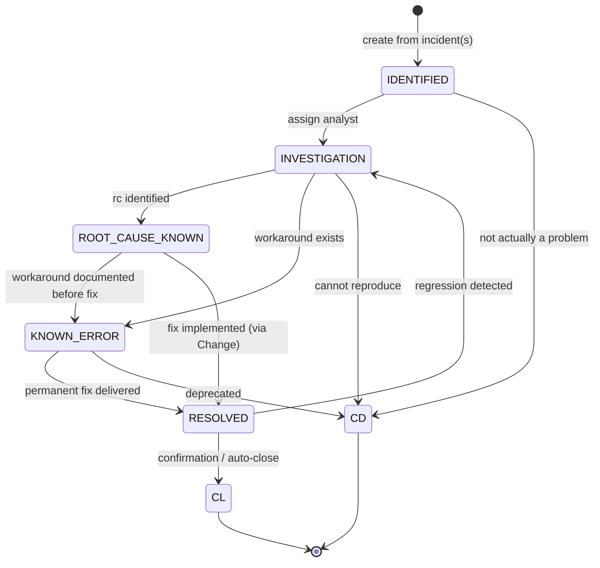

# Problem Management — špecifikácia

> Konsolidovaný spec pre Problem Management. Problem je root-cause investigation
> container nad jedným alebo viacerými incidentmi. V MVP **read + linkovanie**
> z Incident detail; write/RCA flow pre L2 v MVP.

## TOC

1. Cieľ a scope
2. Persony
3. Kľúčové user journeys
4. Doménový model (entita, lifecycle)
5. REST API
6. UI — obrazovky a komponenty
7. Bezpečnosť a RBAC
8. Testy a akceptačné kritériá
9. Otvorené body
10. Zdroje
11. Otvorené závislosti

## 1. Cieľ a scope

**Cieľ MVP**: L2 analytik vytvorí Problem record, linkuje naň viacero
incidentov, urobí RCA, označí Known Error a "spawne" KB článok.

**V scope MVP**:

- Read Problem list + detail.
- Create Problem (z Incident detail-u "Open as Problem" + samostatne).
- Bulk linkovanie Incident → Problem.
- RCA write (status `INVESTIGATION → ROOT_CAUSE_KNOWN`).
- Known Error flag (`KNOWN_ERROR` status) — vyžaduje aspoň 1 linkovaný KB
  článok typu `Workaround` alebo `KnownError`.
- "Create KB article from this Problem" akcia.

**Mimo MVP**: Problem-to-Problem hierarchy (parent/child Problem), advanced
RCA workflow (fishbone diagram, multi-step structured templates).

## 2. Persony

| Persona | App | Rola | Vzťah k modulu |
|---|---|---|---|
| `agent_l2_marek` | `workspace` | `agent_l2` + `problem_manager` | Vlastní RCA, linkuje incidenty, vytvára KB články. |
| `agent_l1_anna` | `workspace` | `agent_l1` | Read-only Problem list. Vidí `linkedProblemIds` v Incident detail. |
| `kb_editor_jana` | `workspace` | `kb_editor` | Reviewer pre KB drafty vytvorené Marekovým "create from problem". |

## 3. Kľúčové user journeys

| ID | Persona | Krátky popis |
|---|---|---|
| `workspace-problem-rca` | `agent_l2_marek` | 3 tickety za týždeň "pomalý Outlook" → Marek vytvorí Problem, bulk add 12 incidentov, RCA, link na CI, mark Known Error, spawn KB. |

Alternate: bulk add 12 incidentov — niektoré sú v inom tenante (cross-tenant).
UI musí **vizuálne oddeliť** a varovať "Linkuješ tickety z viacerých tenantov".
Cross-tenant linkovanie je v MVP **deny** (vyžaduje SP role) — viď otvorený
gap `[01-api-analyst GAP-2]`.

Detail: [`docs/agents/ux-persona-analyst/journeys.md#workspace-problem-rca`](../agents/ux-persona-analyst/journeys.md).

## 4. Doménový model (entita, lifecycle)

### 4.1 Entita `Problem`

CA SDM tabuľka `cr` s discriminatorom (`cr.type = "P"`). Atribúty
([detail](../agents/domain-modeller/entities.md#problem)):

| Atribút | Typ | Zdroj | Required |
|---|---|---|---|
| `id` / `ref` | `ProblemId` / `string` (`P00045`) | `cr.persid` / `cr.ref_num` | yes |
| `status` | `ProblemStatus` enum | `cr.status` | yes |
| `rootCause` | `string` | `cr.rc` | no |
| `linkedIncidentIds` | `IncidentId[]` | derived (`lrel`) | yes (≥ 1 best-practice) |
| `linkedChangeIds` | `ChangeId[]` | derived | no |
| `linkedKbArticleIds` | `KbArticleId[]` | derived (`soln_log`) | no |
| `tenantId` | `TenantId` | `cr.tenant` | yes |

**Invariant** (FE-vynucované): Problem musí mať aspoň 1 linkovaný `Incident`
aby mohol opustiť stav `IDENTIFIED`. BE to nevynucuje.

### 4.2 Lifecycle

**Side-effect contracts**:

- `IDENTIFIED → INVESTIGATION`: `assigneeId` non-null.
- `INVESTIGATION → ROOT_CAUSE_KNOWN`: `rootCause` (povinný free text).
- `* → KNOWN_ERROR`: aspoň 1 `linkedKbArticleIds` s `docTypeId="Workaround"`
  alebo `"KnownError"`. **FE-vynucované**.
- `KNOWN_ERROR → RESOLVED` / `ROOT_CAUSE_KNOWN → RESOLVED`: aspoň 1
  `linkedChangeIds` so stavom `{IMPLEMENTED, VERIFIED, CLOSED}`.
  **FE-vynucované**.
- `RESOLVED → CL`: `closedAt = now()`. Auto-close po N dňoch.
- `RESOLVED → INVESTIGATION` (regression): `regressionReason`.
- Každý prechod → `ActivityLog` entry.

Detail: [`docs/agents/domain-modeller/lifecycles/problem.md`](../agents/domain-modeller/lifecycles/problem.md).

### 4.3 Po `Problem → RESOLVED → CL` linkované incidenty

Linkované incidenty **nezatvárajú sa automaticky** — incidenty majú vlastný
lifecycle. UI len zobrazí "Problem closed" badge v Incident detaile.

## 5. REST API

| Metóda | Cesta | Účel |
|---|---|---|
| `GET` | `/caisd-rest/pr` | List problems. |
| `GET` | `/caisd-rest/pr/{id}` | Detail. |
| `POST` | `/caisd-rest/pr` | Create. |
| `PUT` | `/caisd-rest/pr/{id}` | Partial update (status, RCA). |
| `GET` | `/caisd-rest/pr/{id}/children` | Linkované incidenty (cez `parent` SREL). |
| `GET` | `/caisd-rest/pr_trans` | Povolené status transitions. |

**Linkovanie Incident → Problem**: žiadny dedikovaný `/link` endpoint v REST.
Realizuje sa cez `PUT /caisd-rest/in/{id}` s `parent` = `<persid problému>`.
Detail: [`docs/agents/api-analyst/endpoints.md#problem-management-pr`](../agents/api-analyst/endpoints.md).

**Bulk link** (12 incidentov naraz): BFF orchestruje parallel `PUT` (max 5–10
súčasne) — rovnaký pattern ako bulk incident update.

## 6. UI — obrazovky a komponenty

### 6.1 Obrazovky

| # | Screen | Route | App |
|---|---|---|---|
| 12 | Problem list | `/problems` | workspace |
| 13 | Problem detail (incl. RCA) | `/problems/:ref` | workspace |

Plus inline akcia v Incident detail: `Open as Problem` CTA (Marek workflow).

### 6.2 Komponenty

| Komponent | Použitie |
|---|---|
| `DataTable` (default density) | Problem list. |
| `Tabs` (`default`) | Problem detail tabs: Detail / Linked Incidents / Root Cause / Linked Changes / KB / Activity. |
| `Combobox` (async) | Bulk linkovanie — query "outlook AND Acme-East" pre fuzzy search incidentov. |
| `Composer` (`mode=resolution` tab pre RCA write) | RCA text input s Cmd+S autosave. |
| `Badge variant=info` | `KNOWN_ERROR` indicator. |
| `Card variant=subtle` | Inline workaround display v Incident detail-e ("Known Error workaround"). |
| `Modal` | `Create KB article from Problem` (otvorí KB editor s pred-vyplneným problem statement + resolution). |

## 7. Bezpečnosť a RBAC

| Akcia | Permission key | agent_l1 | agent_l2 | change_mgr | sp_admin |
|---|---|---|---|---|---|
| Create Problem | `problem.create` | read-only (from Incident) | yes | – | yes |
| Read | `problem.read` | read-only | yes | read-only | yes |
| Update RCA section | `problem.update.rca` | – | yes | – | yes |
| Link Incidents | `problem.link.incidents` | – | yes | – | yes |
| Mark known error | `problem.mark.known-error` | – | yes | – | yes |
| Close Problem | `problem.close` | – | yes | – | yes |
| Create KB from Problem | `problem.spawn.kb` | – | yes | – | yes |

Detail: [`docs/agents/security/rbac.md`](../agents/security/rbac.md) §6.3.

**Cross-tenant linkovanie**: V MVP zakázané pre non-SP role. Cross-tenant
Incident-Problem linkovanie vyžaduje `sp_admin` rolu so `ci.read.cross-tenant`
ekvivalentom pre Problem (treba doriešiť s `[01-api-analyst GAP-2]`).

## 8. Testy a akceptačné kritériá

### 8.1 Pyramída

- **Unit** — `lifecycles/problem.ts` (8 stavov, valid transitions, FE-enforced
  invariants pre KNOWN_ERROR a RESOLVED).
- **Contract** — `problem.ctest.ts`.
- **BFF integration** — bulk-link controlled concurrency, audit emission per
  linkovanie.
- **E2E** — `workspace-problem-rca` (#7) vrátane cross-tenant deny alt.

### 8.2 Acceptance criteria — `workspace-problem-rca` (#7)

Happy path:

- Vytvor Problem `PRB-118` "Outlook latency Acme East", popis vyplnený.
- Tab `Linked Incidents` → bulk add 12 incidentov cez query "outlook AND Acme-East".
- Tab `Root Cause` — Marek píše analýzu, linkuje na CI `exch-east-01`.
- Klik "Mark as Known Error" → vyžaduje vybrať linkovaný KB článok (alebo
  vytvoriť cez "Create KB").
- "Create KB from this" otvorí KB editor s pred-vyplneným obsahom.

Alternate:

- Niektoré z 12 incidentov sú v inom tenante → UI farebne oddelí v zozname,
  varovanie "Linkuješ tickety z viacerých tenantov — povolené?" → DENY pre
  non-SP (`@security:cross-tenant-deny`).
- Pri "Create KB" zachovať odkaz Problem → KB v KB metadata.

Detail: [`docs/agents/qa-test-strategy/acceptance-criteria.md`](../agents/qa-test-strategy/acceptance-criteria.md).

## 9. Otvorené body

- `[01-api-analyst GAP-2]` Cross-tenant linkovanie Incident → Problem —
  povolené, blokované, alebo vyžaduje špeciálnu rolu? Aktuálne MVP: deny pre
  non-SP. **Treba potvrdiť s CA SDM administrátorom.**
- `[03-domain-modeller]` Či CA SDM rozlišuje Problem vs. Incident cez
  `cr.type = "P"` alebo cez dedicated `iss` factory. Predpoklad: `pr`
  factory, ako popisuje 01.
- Triple linkovanie Incident → Problem → Change — či CA SDM podporuje
  multi-step asociácie alebo iba párové. Aktuálny model: UI ukáže linky cez
  Problem detail.

## 10. Zdroje

- [`docs/agents/api-analyst/endpoints.md#problem-management-pr`](../agents/api-analyst/endpoints.md).
- [`docs/agents/ux-persona-analyst/personas.md#agent_l2_marek`](../agents/ux-persona-analyst/personas.md).
- [`docs/agents/ux-persona-analyst/journeys.md#workspace-problem-rca`](../agents/ux-persona-analyst/journeys.md).
- [`docs/agents/domain-modeller/entities.md#problem`](../agents/domain-modeller/entities.md).
- [`docs/agents/domain-modeller/lifecycles/problem.md`](../agents/domain-modeller/lifecycles/problem.md).
- [`docs/agents/security/rbac.md`](../agents/security/rbac.md) §6.3.
- [`docs/agents/design-system/components.md`](../agents/design-system/components.md) — Tabs, Combobox, Composer.
- [`docs/agents/qa-test-strategy/acceptance-criteria.md`](../agents/qa-test-strategy/acceptance-criteria.md) #7.

## Otvorené závislosti

Žiadne. Artefakt je samonosný.
