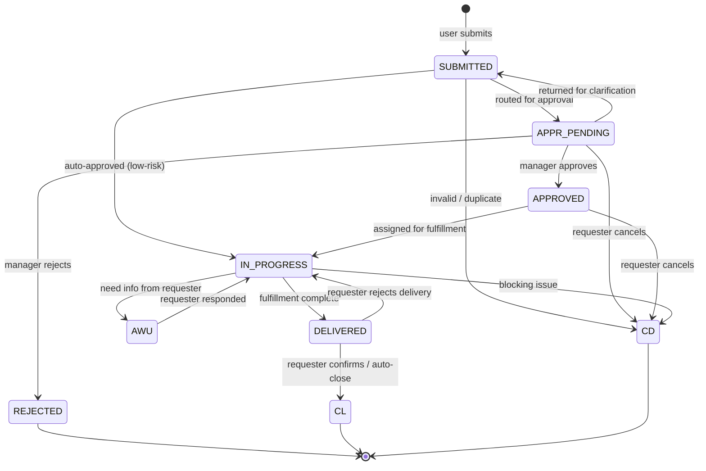

# Request Management & Service Catalog — špecifikácia

> Konsolidovaný spec pre Service Requesty a Service Catalog. Service Request je
> objednávka služby z katalógu — odlišuje sa od Incidentu fulfillment-orientovaným
> lifecycle (schválenie + realizácia). Zdroj pravdy: výstupy 01–09.

## TOC

1. Cieľ a scope
2. Persony
3. Kľúčové user journeys
4. Doménový model (entita, lifecycle)
5. REST API
6. UI — obrazovky a komponenty
7. Bezpečnosť a RBAC
8. Testy a akceptačné kritériá
9. Otvorené body
10. Zdroje
11. Otvorené závislosti

## 1. Cieľ a scope

**Cieľ MVP**: Self-service Service Catalog v `portal` (browse, search,
submit) + fulfillment queue vo `workspace`.

**V scope MVP**:

- Browse + full-text search Service Catalog položiek.
- Submit catalog request s **dynamicky generovaným formulárom** (per template).
- Approval flow (manager schvaľuje, optional auto-approve pre low-risk items).
- Fulfillment queue (analyst pickne → in-progress → delivered → closed).
- Cancellation by requester (do `IN_PROGRESS`); analyst cancel kedykoľvek.
- Notifikácie statusov pre žiadateľa (email mock + portal banner).

**Mimo MVP**: KB editor pre Service Catalog admin, drag-to-reorder catalog
položiek, multi-step approval (sériový), pokročilý analytics pre Catalog
usage.

## 2. Persony

| Persona | App | Rola | Vzťah k modulu |
|---|---|---|---|
| `requester_lucia` | `portal` | `requester` | Submituje 2–4 requesty/mesiac, sleduje status, kontroluje výsledok delivery. |
| `agent_l1_anna` | `workspace` | `agent_l1` | Fulfillment queue — provisioning, account creates, license assignment. |
| `change_manager_peter` | `workspace` | `change_manager` | Read-only pre Request → Change linkovanie pri large-scale fulfillment. |

Manager (Tomáš) approver flow je realizovaný cez `request.approve` permission;
managerska persona nie je samostatne modelovaná (zvládne ho ktokoľvek s
`approve` permission).

Detail: [`docs/agents/ux-persona-analyst/personas.md`](../agents/ux-persona-analyst/personas.md#requester_lucia).

## 3. Kľúčové user journeys

| ID | Persona | Krátky popis |
|---|---|---|
| `portal-request-software` | `requester_lucia` | Hľadá Figma licenciu, vyplní dynamický 3-pole formulár, manažér schváli, L1 provisionuje, license key v komentári. |

Alternate flow: manager rejecte s dôvodom → portál zobrazí rejection reason
**prominentne**, nie zahrabaný v komentároch.

Detail: [`docs/agents/ux-persona-analyst/journeys.md`](../agents/ux-persona-analyst/journeys.md#portal-request-software).

## 4. Doménový model (entita, lifecycle)

### 4.1 Entita `Request`

CA SDM ukladá Service Request do tabuľky `cr` s `cr.type = "R"`. UI doména
ho modeluje ako samostatný agregát s tenant-required scope-om.

Kľúčové atribúty (úplná tabuľka v
[`docs/agents/domain-modeller/entities.md#request-service-request`](../agents/domain-modeller/entities.md)):

| Atribút | Typ | Zdroj | Required |
|---|---|---|---|
| `id` / `ref` | `RequestId` / `string` (`R12345`) | `cr.persid` / `cr.ref_num` | yes |
| `status` | `RequestStatus` enum | `cr.status` | yes |
| `category` | `RequestCategory` | `cr.category` | yes |
| `requesterId` | `UserId` | `cr.customer` | yes |
| `assigneeId`, `assignedGroupId` | refs | `cr.assignee` / `cr.group` | no |
| `serviceCatalogItemId` | `CatalogItemId \| null` | derived | no |
| `formData` | `RequestFormData` (JSON) | derived (validated proti Zod schema) | no |
| `tenantId` | `TenantId` | `cr.tenant` | yes |
| `openedAt`, `resolvedAt`, `closedAt` | ISO timestamps | `cr.*_date` | mixed |

`formData` je JSON payload validovaný proti **JSON-schema-driven Zod** schéme
(per ADR-06). Backend (BFF) normalizuje CA SDM Service Catalog template →
`CatalogField[]`; frontend renderuje cez `ServiceCatalogRenderer`.

### 4.2 Lifecycle

**Side-effect contracts**:

- `SUBMITTED → APPR_PENDING`: `approverId` resolved (z org hierarchy alebo
  catalog item config). Auto-approve flag preskočí na `IN_PROGRESS`.
- `APPR_PENDING → APPROVED`: `approverDecisionAt = now()`, optional
  `approvalComment`.
- `APPR_PENDING → REJECTED`: `rejectionReason` (povinné).
- `APPROVED → IN_PROGRESS`: `assigneeId` alebo `assignedGroupId`.
- `IN_PROGRESS → DELIVERED`: `deliveryNotes`.
- `DELIVERED → CL`: `closedAt = now()`. Auto-close po N dňoch (catalog policy).
- `DELIVERED → IN_PROGRESS` (rework): `rejectionReason`, `reworkCount++`.

Detail: [`docs/agents/domain-modeller/lifecycles/request.md`](../agents/domain-modeller/lifecycles/request.md).

## 5. REST API

### 5.1 Primárny REST (`/caisd-rest`)

| Metóda | Cesta | Účel |
|---|---|---|
| `GET` | `/caisd-rest/cr?WC=type%3D'R'` | List requests. |
| `GET` | `/caisd-rest/cr/{id}` | Detail. |
| `POST` | `/caisd-rest/cr` | Create (required `customer`, `log_agent`, `priority`). |
| `PUT` | `/caisd-rest/cr/{id}` | Partial update. |
| `GET` | `/caisd-rest/cr/{id}/act_log` | Activity log. |
| `GET` | `/caisd-rest/cr/{id}/children` | Child requests. |
| `GET` | `/caisd-rest/crs` | Status reference enum. |

### 5.2 Service Catalog (BUI vrstva, `X-AccessToken`)

| Metóda | Cesta | Účel |
|---|---|---|
| `GET` | `/getOfferings?$skip=&$top=` | Featured offerings. |
| `GET` | `/getBrowseOfferings` | Browse cez kategórie. |
| `GET` | `/pcatSearch?query=` | Full-text search. |
| `GET` | `/suggestedSolutions?text=&tenant=` | KB suggestions na základe textu. |
| `GET` | `/bui/getDefaultCategories` | Category tree. |
| `GET` | `/bui/attrCtrl?factory=&attrname=&attrvalue=` | Dependent attribute controls (dynamic form deps). |
| `GET` | `/getServiceRequest` | List catalog requests pre logged-in usera. |

**BFF aggregator**: `/me/catalog` zlúči `/getOfferings` + `/pcatSearch` +
`/bui/getDefaultCategories` do jediného response pre Portal.

**Gap #3 — Dynamic form schema**: CA SDM `/getOfferings` vracia len summary,
nie option detail (input type, validation). BFF normalizuje CA SDM template
do `CatalogField[]` JSON-schema kontraktu. **Otvorené** — vyžaduje overenie
na inštancii (PDF nemá explicit endpoint).

Detail: [`docs/agents/api-analyst/endpoints.md#service-catalog--service-point-bui-vrstva`](../agents/api-analyst/endpoints.md)
a [`docs/agents/api-analyst/gaps.md`](../agents/api-analyst/gaps.md) §3.

## 6. UI — obrazovky a komponenty

### 6.1 Obrazovky

| # | Screen | Route | App |
|---|---|---|---|
| 2 | Submit ticket form | `/submit` | portal |
| 3 | My tickets list | `/my-tickets` (filter `type=R`) | portal |
| 4 | Ticket detail (own) | `/my-tickets/:ref` | portal |
| 7 | Service Catalog | `/catalog` | portal |
| 8 | Catalog item detail / request | `/catalog/:id` | portal |
| 10 | Workspace — Incident queue (vlastná view filter `type=R`) | `/incidents?type=R` | workspace |

### 6.2 Komponenty

| Komponent | Použitie |
|---|---|
| `ServiceCatalogTile` | Category tile (Hardvér / Softvér / Prístupy / Iné). |
| `ServiceCatalogItem` | Featured item card (icon, title, description, SLA, "Požiadať" CTA). |
| `ServiceCatalogRenderer` | JSON-schema dynamic form renderer (text / textarea / select / radio / file / user-picker / ci-picker). RHF + Zod. |
| `SearchInput` (debounce 250 ms) | Catalog search. |
| `Card` `interactive` | Catalog item card. |
| `Timeline` | Request activity feed (approval, comments, status changes). |
| `Modal` + `ConfirmDialog` | Cancel request, approve / reject. |

`ServiceCatalogRenderer` field type registry (per
[`docs/agents/design-system/components.md#servicecatalogrenderer`](../agents/design-system/components.md)):

- `text` → `TextField` + `z.string().min(1)`
- `textarea` → `TextArea` + `z.string()`
- `select` → `Select` + `z.enum([...])`
- `file` → `FileUpload` + `z.array(z.instanceof(File))`
- `user-picker` / `ci-picker` → `Combobox` (async loadOptions)
- `markdown-help` → read-only `Markdown` block

### 6.3 UX pre Lucu (rejection prominently)

Pri `REJECTED` stave portál ticket detail-u zobrazí `Card variant=danger` na
top of body s `rejectionReason`, nie zahrabaný v komentároch. Detail v
[`journeys.md` § portal-request-software alternate`](../agents/ux-persona-analyst/journeys.md#portal-request-software).

## 7. Bezpečnosť a RBAC

| Akcia | Permission key | requester | agent_l1 | agent_l2 | sp_admin |
|---|---|---|---|---|---|
| Submit catalog request | `request.create` | yes | yes | yes | yes |
| Read own | `request.read.own` | yes | yes | yes | yes |
| Read queue | `request.read.queue` | – | yes | yes | yes |
| Approve | `request.approve` | if assigned approver | yes | yes | yes |
| Fulfill | `request.fulfill` | – | yes | yes | yes |
| Reject | `request.reject` | if approver | yes | yes | yes |
| Cancel own | `request.cancel.own` | own, pred IN_PROGRESS | yes | yes | yes |

**Multi-tenancy**: Request je tenant-required (`cr.tenant`). Žiadny
cross-tenant Request flow v MVP.

**CSRF**: Submit ↔ approve ↔ reject sú mutating ⇒ vyžadujú `X-CSRF-Token`
(per `docs/agents/security/auth-flow.md` §4.2).

**XSS**: `formData` text fields sú sanitized cez Zod + on-render escape
(React default). `Markdown` block v help texte rendrovaný cez
`react-markdown + rehype-sanitize` (allowlist, nie raw HTML).

Detail: [`docs/agents/security/rbac.md`](../agents/security/rbac.md) §6.2.

## 8. Testy a akceptačné kritériá

### 8.1 Pyramída

- **Unit** — `packages/domain/src/lifecycles/request.ts` state machine +
  property tests; `ServiceCatalogRenderer` field registry coverage.
- **Contract** — `request.ctest.ts`, `service-catalog.ctest.ts`
  (auth `X-AccessKey` vs. BUI `X-AccessToken` flow).
- **BFF integration** — `/me/catalog` aggregator, `formData` normalization
  CA SDM → JSON schema → Zod validation.
- **App integration** — `apps/portal/src/features/catalog/__tests__/submit.itest.tsx`.
- **E2E** — journey #2 (smoke).
- **a11y** — `ServiceCatalogRenderer` dynamic form má všetky `FormField`
  wrappery (label + helper + error spojené cez `aria-describedby`).

### 8.2 Acceptance criteria — `portal-request-software` (#2)

Happy path:

- Search "figma" → 1 výsledok.
- Klik → dynamický formulár (3 polia generované z BFF).
- Submit → `201` → status `Pending Approval` + email manažérovi (mocked).
- Po `approve` (mocked second user session): status `Fulfilled` + license
  key v komentári.

Alternate (rejection):

- Manager zamietne s dôvodom → notifikácia → ticket detail ukáže rejection
  reason prominentne (`Card variant=danger` na top of body).

Detail: [`docs/agents/qa-test-strategy/acceptance-criteria.md#portal-request-software`](../agents/qa-test-strategy/acceptance-criteria.md).

## 9. Otvorené body

- **Gap #3 — Service Catalog dynamic form schema**: Najkritickejší gap modulu.
  Bez schémy formulára BFF nedokáže normalizovať CA SDM template. Treba
  overiť endpoint pre form definíciu (option types, validation) na inštancii.
- **Auto-approval policy zdroj**: catalog item config vs. global policy —
  treba potvrdiť s biznisom pre kalibráciu UX (či sa približuje step
  `APPR_PENDING` alebo nie).
- **Cancellation politika** (after `IN_PROGRESS`): aktuálne UI ponúkne CTA
  "contact assignee" namiesto cancel button. Treba potvrdiť s biznisom, či
  to akceptujú alebo žiadajú "soft cancel pending L1 confirm".

## 10. Zdroje

- [`docs/agents/api-analyst/endpoints.md`](../agents/api-analyst/endpoints.md) — Request + Service Catalog endpointy.
- [`docs/agents/api-analyst/gaps.md`](../agents/api-analyst/gaps.md) §3 — dynamic form gap.
- [`docs/agents/ux-persona-analyst/personas.md#requester_lucia`](../agents/ux-persona-analyst/personas.md) — Lucia.
- [`docs/agents/ux-persona-analyst/journeys.md#portal-request-software`](../agents/ux-persona-analyst/journeys.md) — journey.
- [`docs/agents/domain-modeller/entities.md#request-service-request`](../agents/domain-modeller/entities.md).
- [`docs/agents/domain-modeller/lifecycles/request.md`](../agents/domain-modeller/lifecycles/request.md).
- [`docs/agents/security/rbac.md`](../agents/security/rbac.md) §6.2.
- [`docs/agents/design-system/components.md#servicecatalogrenderer`](../agents/design-system/components.md).
- [`docs/agents/architecture/decision-records/06-dynamic-forms.md`](../agents/architecture/decision-records/06-dynamic-forms.md) — JSON-schema-driven forms.
- [`docs/agents/qa-test-strategy/acceptance-criteria.md`](../agents/qa-test-strategy/acceptance-criteria.md) — journey testy.

## Otvorené závislosti

Žiadne. Artefakt je samonosný. Gap #3 (Service Catalog dynamic form schema)
je inherent API gap evidovaný v 01 a 04, nie chyba konsolidácie.
