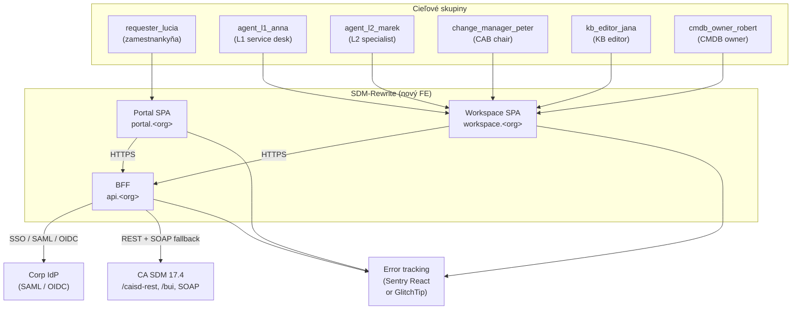
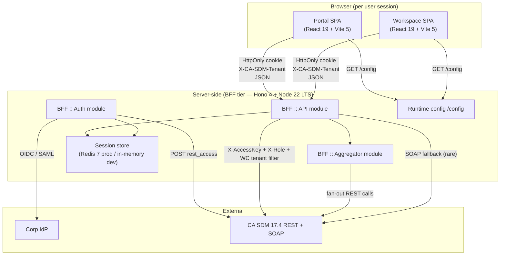
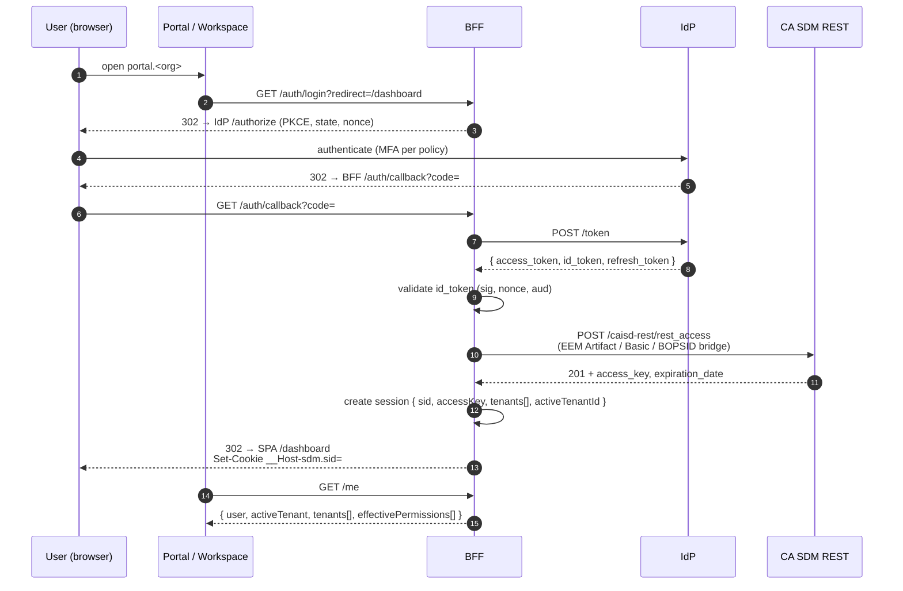
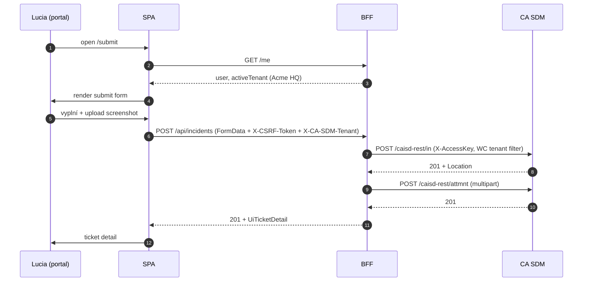
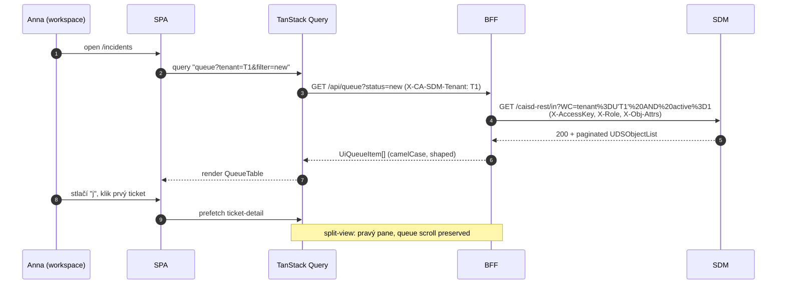

# SDM-Rewrite — System Overview

> High-level tour systému pre stakeholderov, technických reviewerov a nových
> členov tímu. Detail per oblasť žije v `docs/agents/<name>/` a v
> `docs/spec/<modul>.md`.
> Status: round 2 (post-konvergencia). Stack a ADRs sú finalizované.

## TOC

1. Čo to je a prečo
2. C4 Level 1 — Systémový kontext
3. C4 Level 2 — Containers
4. Tech stack
5. Auth + multi-tenancy
6. Dátové toky pre kľúčové journeys
7. Mock backend a dev environment
8. Branching a release model
9. Linky na ďalšie dokumenty
10. Otvorené závislosti

## 1. Čo to je a prečo

SDM-Rewrite je **nový frontend** nad existujúce REST API **Broadcom CA Service
Desk Manager 17.4** (CA SDM 17.4). Backend nemodifikujeme — všetky integrácie
idú cez `/caisd-rest/`, `/bui/` (BUI vrstva) a v krajnostiach SOAP fallback
(`/axis/services/USD_R11`).

Cieľové persony:

- **Self-service žiadatelia** (zamestnanci, externí zákazníci) — nahlasovanie
  incidentov, service requesty z katalógu, KB search.
- **Service desk analytici L1/L2** — queue triage, resolution, eskalácia,
  problem RCA.
- **Change manager / CAB chair** — schvaľovanie zmien, change calendar.
- **KB editor** — write/publish flow pre KB články.
- **CMDB owner** — CI detail review, impact analysis pred zmenami.

Návrh stojí na **dvoch samostatných SPA** v jednom monorepe:

- `portal` (`portal.<org>`) — self-service, low information density, mobile-first.
- `workspace` (`workspace.<org>`) — agent workspace, high density, hot-keys,
  multi-pane.

Dôvod separácie: rôzne UX patterny a security profily; spoločný kód žije
v `packages/`.

Detail: `GOAL.md` §1–§4.

## 2. C4 Level 1 — Systémový kontext



Externé systémy:

- **CA SDM 17.4** — existujúci produkt. Read-only z nášho pohľadu, schémy
  nemeníme.
- **Corp IdP** — SAML alebo OIDC. Produkt (Keycloak / Azure AD / iné) je
  deployment-time decision. BFF integruje cez OIDC discovery / SAML metadata.
- **Sentry** alebo GlitchTip (self-hosted) — error tracking, DSN-compatible.

## 3. C4 Level 2 — Containers



Container inventory (detail v
[`docs/agents/architecture/architecture.md`](agents/architecture/architecture.md) §3):

| Container | Typ | Účel | Kľúčové rozhodnutia |
|---|---|---|---|
| **Portal SPA** | Browser SPA | Self-service flows pre Luciu. Low density, mobile-friendly, TTI < 2 s. | React 19 + Vite 5 + React Router v6 data router. |
| **Workspace SPA** | Browser SPA | Agent flows pre 5 person. High density, hot-keys, multi-pane. | Rovnaký stack, samostatný bundle. |
| **BFF :: Auth** | Server module (Hono 4 / Node 22 LTS) | SSO redirect, session lifecycle, broker pre CA SDM Access Key, logout. | ADR-01, ADR-11. |
| **BFF :: API** | Server module | Proxy CA SDM REST volaní s tenant scopingom a payload shapingom (XML → JSON, camelCase). | ADR-01. |
| **BFF :: Aggregator** | Server module | Multi-call agregáty (`/me/tenants`, ticket-detail, queue). | ADR-01 + UI views z 03. |
| **Session store** | Redis 7 prod / in-memory dev | Per-session: Access Key, expirácia, activeTenantId, user profile cache. | ADR-01 §3. |
| **Runtime config endpoint** | Server module | `GET /config` → `apiBaseUrl`, `features`, `i18nDefaults`. | ADR-12. |

### 3.1 Packages (zhrnutie)

| Package | Účel | Konzumenti |
|---|---|---|
| `@sdm/api-client` | Typovaný klient nad CA SDM REST + BFF endpointy. | BFF, oba SPA. |
| `@sdm/api-types` | TypeScript typy odvodené z `domain/model.ts`. | Všetci. |
| `@sdm/domain` | Pravidlá doménového modelu — state machines, validátory, permission mapping. Pure functions. | Oba SPA (a prípadne BFF). |
| `@sdm/design-system` | Tokens, primitives, composites. | Oba SPA. |
| `@sdm/auth` | Auth helpery pre SPA (session refresh hook, login redirect, role-based guards). | Oba SPA. |
| `@sdm/i18n` | i18n catalog (SK + EN), formatters. | Oba SPA, BFF. |
| `@sdm/utils` | Pure utility (date math, formatting, type guards). | Všetci. |

Žiadne ďalšie packages "pre prípad" (YAGNI).

Detail: [`docs/agents/architecture/monorepo-layout.md`](agents/architecture/monorepo-layout.md).

## 4. Tech stack

Finalizované v round 2 (per
[`docs/agents/tech-stack-selector/decision.md`](agents/tech-stack-selector/decision.md)):

| Oblasť | Voľba | Dôvod |
|---|---|---|
| **Framework** | React 19 | K3+K4 priority winners (RHF+Zod, TanStack Query tenant scoping), najväčší ekosystém. |
| **Jazyk** | TypeScript 5.7 strict | `noUncheckedIndexedAccess`, `exactOptionalPropertyTypes`. |
| **Bundler** | Vite 5 / 6 | Dev rýchlosť (HMR < 1 s), produkčný Rollup build. |
| **Data fetching** | TanStack Query v5 | Per-tenant `queryKey` cache scoping, suspense, optimistic updates. |
| **Forms** | React Hook Form 7 + Zod 3 + `@hookform/resolvers` | Performance (uncontrolled), schema-driven dynamic forms. |
| **Tables** | TanStack Table v8 (basic mode, no virtualization) | Desiatky riadkov per view (GOAL §11). |
| **Routing** | React Router v6 data router (`createBrowserRouter`) | Loader / action API, deep-linkovateľné URL, route-level code-split. |
| **i18n** | react-i18next 15 + ICU MessageFormat | SK + EN canonical. |
| **Styling** | CSS Custom Properties + CSS Modules | Tokens-driven theming, žiadne CSS-in-JS runtime overhead. |
| **A11y primitives** | Radix UI + selektívne React Aria | Headless, WCAG 2.1 AA out-of-box. |
| **WYSIWYG** | TipTap 2 (StarterKit + Link + Image + CodeBlockLowlight + Mention + TaskList) | Modular. |
| **Markdown render** | react-markdown 9 + remark-gfm + rehype-sanitize | Sanitization allowlist required. |
| **Calendar** | FullCalendar 6 (lazy-loaded ~95 kB) | Change calendar Day/Week/Month. |
| **Graph viz** | Cytoscape 3 canvas mode + `react-cytoscapejs` (lazy ~110 kB) | CMDB relationships. |
| **Icons** | Lucide React | Moderne tvarované, čitateľné. |
| **Fonts** | Inter Variable + JetBrains Mono Variable (self-hosted) | Žiaden CDN. |
| **HTTP** | Native `fetch` cez TanStack Query | Žiaden axios. |
| **Error tracking** | Sentry React 8 (DSN-compatible s GlitchTip) | Per-tenant tags. |
| **BFF runtime** | Hono 4 + Node 22 LTS + ioredis 5 + zod 3 + pino 9 | Light, edge-compatible, JSON logs. |
| **OIDC client (BFF)** | openid-client + jose | IdP-agnostic. |
| **Tests — unit** | Vitest 1 + Testing Library 16 + user-event 14 | Native Vite integrácia. |
| **Tests — e2e** | Playwright 1 + `@axe-core/playwright` | Cross-browser. |
| **Mock backend** | MSW 2 + `@mswjs/data` + `@faker-js/faker` (seeded) | DevEx + Vitest integration. |
| **Property tests** | fast-check 3 | State machines. |
| **Monorepo** | pnpm 9 workspaces + Turborepo | Build cache + topological order. |
| **CI** | GitHub Actions (alt. GitLab CI) | Native pre `Spigotek/SDM-Rewrite`. |

Detail per oblasť: [`docs/agents/tech-stack-selector/libraries.md`](agents/tech-stack-selector/libraries.md).

## 5. Auth + multi-tenancy

### 5.1 Auth flow (OIDC + BFF + httpOnly session)



Detail: [`docs/agents/security/auth-flow.md`](agents/security/auth-flow.md) §2.

Kľúčové vlastnosti:

- **CA SDM Access Key sa nikdy nedostane do prehliadača** — žije len v BFF
  session store.
- **PKCE** povinné (chráni pred code interception).
- **CSRF protection** pre mutating endpointy (`X-CSRF-Token` header).
- **Idle timeout** 30 min default (configurable per tenant).
- **Step-up MFA** pre sensitive operácie (TTL 5 min, bulk > 50, SP cross-tenant,
  emergency change approve).

### 5.2 Multi-tenancy (per ADR-11)

- **Server-side aktívny tenant v BFF session** (single source of truth).
- **HTTP header `X-CA-SDM-Tenant`** v API volaniach (informačný / audit;
  BFF revaliduje proti session, mismatch = `409 TENANT_MISMATCH`).
- **Defensive WC filter** v BFF → CA SDM: `WC=tenant%3DU'<activeTenantId>'`.
- **Cross-tab sync** cez `__Host-sdm.tenantVer` cookie + BroadcastChannel API.

Detail: [`docs/spec/multi-tenancy.md`](spec/multi-tenancy.md).

## 6. Dátové toky pre kľúčové journeys

### 6.1 Submit ticket (Lucia v `portal`)



### 6.2 Workspace queue triage (Anna)



### 6.3 Tenant switch (cross-cutting)

Detail: [`docs/agents/architecture/data-flows.md`](agents/architecture/data-flows.md) §2 a [`docs/spec/multi-tenancy.md`](spec/multi-tenancy.md) §5.4.

## 7. Mock backend a dev environment

### 7.1 Princíp

GOAL.md §11 hovorí, že produkčný backend nie je počas vývoja dostupný. Riešenie:

- **MSW (Mock Service Worker)** simuluje CA SDM REST + BUI endpointy.
- MSW handlers žijú v `packages/api-mocks/` (zdieľané medzi BFF dev a FE-only
  mock mode).
- Schémy v `docs/agents/api-analyst/schemas/*.ts` validujú každý mock response
  (Zod runtime guard).
- Faktória (`@faker-js/faker`, seed=42) generuje deterministické fixtures pre
  18 user journeys.

### 7.2 Dev environment (1-command setup)

```bash
git clone git@github.com:Spigotek/SDM-Rewrite.git sdm-rewrite
cd sdm-rewrite
corepack enable && corepack prepare pnpm@9.12.0 --activate
cp .env.example .env
pnpm install --frozen-lockfile
pnpm dev    # paralelne spustí portal :5173, BFF :5174, workspace :5175
```

Port mapa:

| Port | Služba |
|---|---|
| 5173 | `apps/portal` (Vite) |
| 5174 | `apps/bff` (Hono + Node) |
| 5175 | `apps/workspace` (Vite) |
| 5176 | Vitest UI (opt-in) |
| 9323 | Playwright UI mode |
| 9333 | Chrome remote debug (CDP) |

MSW Node server beží v BFF dev procese — serve-uje `/caisd-rest/*` upstream
mocky. Žiadna sieť von z dev laptopu.

Detail: [`docs/agents/devex-devops/dev-environment.md`](agents/devex-devops/dev-environment.md) a [`docs/agents/devex-devops/mock-strategy.md`](agents/devex-devops/mock-strategy.md).

## 8. Branching a release model

### 8.1 Branch protection

`main` je chránená. Žiadny direct push.

```bash
gh api -X PUT repos/Spigotek/SDM-Rewrite/branches/main/protection \
  -F required_pull_request_reviews.required_approving_review_count=1 \
  -F required_status_checks.strict=true \
  -F 'required_status_checks.contexts[]=Lint + Format' \
  -F 'required_status_checks.contexts[]=Typecheck' \
  -F 'required_status_checks.contexts[]=Unit + Component tests' \
  -F 'required_status_checks.contexts[]=Coverage thresholds' \
  -F 'required_status_checks.contexts[]=Build all' \
  -F 'required_status_checks.contexts[]=Accessibility (axe-core)' \
  -F 'required_status_checks.contexts[]=Security audit'
```

### 8.2 Agent pipeline branching

Per `GOAL.md` §7.6 — `pipeline/<runId>` → `pipeline/<runId>/round-<N>` →
`agent/<runId>/<NN>-<name>`. PM riadi merge stratégiu cez git worktrees;
detail v [`.agents/README.md`](../.agents/README.md).

### 8.3 Release model

Tag `vX.Y.Z` → `release.yml` build production artefaktov:

```bash
mkdir -p release
(cd apps/portal/dist && zip -r ../../../release/portal-v1.0.0.zip .)
(cd apps/workspace/dist && zip -r ../../../release/workspace-v1.0.0.zip .)
```

BFF deployable shape: zip artefakt v MVP, Docker image v post-MVP (per ADR-01
`bff-deployment` flag).

Detail: [`docs/agents/devex-devops/ci-cd.md`](agents/devex-devops/ci-cd.md) `release.yml`.

## 9. Linky na ďalšie dokumenty

### 9.1 Per-modul specifikácie (`docs/spec/`)

- [Incident Management](spec/incident-management.md)
- [Request Management & Service Catalog](spec/request-management.md)
- [Problem Management](spec/problem-management.md)
- [Change Management & CAB](spec/change-management.md)
- [Knowledge Management](spec/knowledge-management.md)
- [CMDB](spec/cmdb.md)
- [Multi-tenancy (cross-cutting)](spec/multi-tenancy.md)

### 9.2 Vývojárska dokumentácia (top-level)

- [Dev Handbook](dev-handbook.md) — repo layout, conventions, ako pridať feature.
- [Onboarding](onboarding.md) — Day-1 quick start.

### 9.3 Autoritatívne výstupy agentov (`docs/agents/`)

- [`api-analyst/`](agents/api-analyst/) — REST katalóg, auth, multi-tenancy, gaps.
- [`ux-persona-analyst/`](agents/ux-persona-analyst/) — persony, journeys, wireframy.
- [`domain-modeller/`](agents/domain-modeller/) — entity, lifecycles.
- [`architecture/`](agents/architecture/) — C4, ADRs, monorepo layout, data flows.
- [`security/`](agents/security/) — auth, RBAC, OWASP, multi-tenancy security.
- [`tech-stack-selector/`](agents/tech-stack-selector/) — porovnávacia matica, libraries.
- [`design-system/`](agents/design-system/) — tokens, komponenty, theming.
- [`devex-devops/`](agents/devex-devops/) — bootstrap, CI/CD, mock, runtime config.
- [`qa-test-strategy/`](agents/qa-test-strategy/) — test pyramída, acceptance criteria.

## Otvorené závislosti

Žiadne. Artefakt je samonosný. Inherent gaps (Service Catalog dynamic form
schema, cross-tenant viewer rola) sú evidované v `docs/spec/*.md` `## Otvorené
body` a v autoritatívnych výstupoch 01–05.
